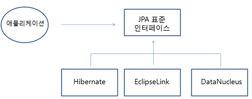

# JPA와 Hiberate

## JPA (Java Persistent API)와 ORM (Object Relational Mapping)

JPA란 자바 ORM 기술에 대한 API 표준 명세를 의미한다.

JPA는 자바 애플리케이션에서 관계형 데이터베이스를 사용하는 방식을 정의한 인터페이스를 모아둔 것이며, JPA를 사용하기 위해서는 JPA를 구현한 Hibernate, EclipseLink, DataNucleus 같은 ORM 프레임워크를 사용해야 한다.



그렇다면 ORM은 무엇일까?

ORM이란 객체와 DB의 테이블이 매핑을 이루는 것을 말한다. (Java 진영에 국한된 기술은 아님)

즉, 객체가 테이블이 되도록 매핑 시켜주는 것을 말한다.  
ORM을 이용하면 SQL Query가 아닌 직관적인 코드(메서드)로서 데이터를 조작할 수 있다.

예를들어, User 테이블의 데이터를 출력하기 위해서 MySQL에서는 SELECT \* FROM user; 라는 query를 실행해야 하지만,  
ORM을 사용하면 User 테이블과 매핑된 객체를 user라 할 때, user.findAll() 라는 메서드 호출로 데이터 조회가 가능하다.

**ORM 장점:** query를 직접 작성하지 않고 메서드 호출만으로 query가 수행되다 보니, ORM을 사용하면 생산성이 매우 높아진다.

**ORM 단점:** query가 복잡해지면 ORM으로 표현하는데 한계가 있고, 성능이 raw query에 비해 느리다는 단점이 있다. 그래서 JPQL, QueryDSL 등을 사용하거나 한 프로젝트 내에서 Mybatis와 JPA를 같이 사용하기도 한다.

## Hiberate

JPA를 구현한 여러 프레임워크가 있지만 최근에는 Hibernate가 JPA를 주도하고 있다.  
세계적으로 JDBC를 직접 사용하는 Mybatis보다 JDBC를 노출하지 않고 ORM 기술을 사용하는 JPA를 선호하는 편이다.

### 장점

#### 1. 생산성

Hibernate는 SQL를 직접 사용하지 않고, 메서드 호출만으로 쿼리가 수행된다. 즉, SQL 반복 작업을 하지 않으므로 생산성이 매우 높아진다.

(그러나 SQL을 몰라도 되는 것은 아니다.
Hibernate가 수행한 쿼리를 콘솔로 출력하도록 설정을 할 수 있는데, 쿼리를 보면서 의도한 대로 쿼리가 짜여졌는지, 성능은 어떠한지에 대한 모니터링이 필요하기 때문에 SQL을 잘 알아야 한다.)

#### 2. 유지보수

테이블 컬럼이 하나 변경되었을 경우, Mybatis에서는 관련 DAO(Data Access Object)의 파라미터, 결과, SQL 등을 모두 확인하여 수정해야 한다.

JPA를 사용하면 JPA가 이런 일들을 대신해주기 때문에 유지보수 측면에서 좋다.

#### 3. 특정 벤더에 종속적이지 않음

여러 DB 벤더( MySQL, Oracle 등.. )마다 SQL 사용이 조금씩 다르기 때문에 애플리케이션 개발 시 처음 선택한 DB를 나중에 바꾸는 것은 매우 어렵다.

그런데 JPA는 추상화된 데이터 접근 계층을 제공하기 때문에 특정 벤더에 종속적이지 않다.  
즉, 설정 파일에서 JPA에게 어떤 DB를 사용하고 있는지 알려주기만 하면 얼마든지 DB를 바꿀 수가 있다.

### 단점

#### 1. 성능

메서드 호출로 쿼리를 실행한다는 것은 내부적으로 많은 동작이 있다는 것을 의미하므로, 직접 SQL을 호출하는 것보다 성능이 떨어질 수 있다.

#### 2. 세밀함

메서드 호출로 SQL을 실행하기 때문에 세밀함이 떨어진다. 또한 객체간의 매핑( Entity Mapping )이 잘못되거나 JPA를 잘못 사용하여 의도하지 않은 동작을 할 수도 있다.

이러한 단점을 보완하기 위해 JPA에서는 SQL과 유사한 기술인 JPQL을 지원하기도 한다.

#### 3. 러닝커브

JPA를 잘 사용하기 위해서는 알아야 할 것이 많다.
그래서 이러한 복잡성을 해결하고자 최근에는 Spring Data JDBC가 주목을 받고 있다. ( 2018-09-21 첫 1.0.0 RELEASE )

## Spring Data JPA

Spring Data JPA는 Spring에서 제공하는 모듈 중 하나로, JPA 위에 추가적인 기능을 제공하여 JPA 기반 애플리케이션 개발을 보다 간편하게 만드는 라이브러리/프레임워크이다.

이는 Spring Data JPA의 핵심인 Repository라는 인터페이스를 제공함으로써 이루어진다.  
사용자가 Repository 인터페이스에 정해진 규칙대로 메서드를 입력하면, Spring이 알아서 해당 메서드 이름에 적합한 쿼리를 날리는 구현체를 만들어서 Bean으로 등록해 준다.

CRUD 연산, 페이징, 정렬과 같은 JPA 리포지토리를 구현하는 데 필요한 반복적인 코드 양을 줄이는 인터페이스와 클래스를 제공한다.

아래는 Spring Data JPA의 예시인 findAll() 함수를 보여준다.

```java
@Repository
public interface UserRepository extends JpaRepository<User, Long> {}

@Service
public class UserService {

    @Autowired
    private UserRepository userRepository;

    public List<User> findAll() {
        return userRepository.findAll();
    }
}
```

## 예상 질문

- JPA와 Hibernate의 차이점은 무엇인가요?
- JPA와Spring Data JPA의 차이점이 무엇인가요?

## 참고 링크

https://lealea.tistory.com/228  
https://victorydntmd.tistory.com/195
