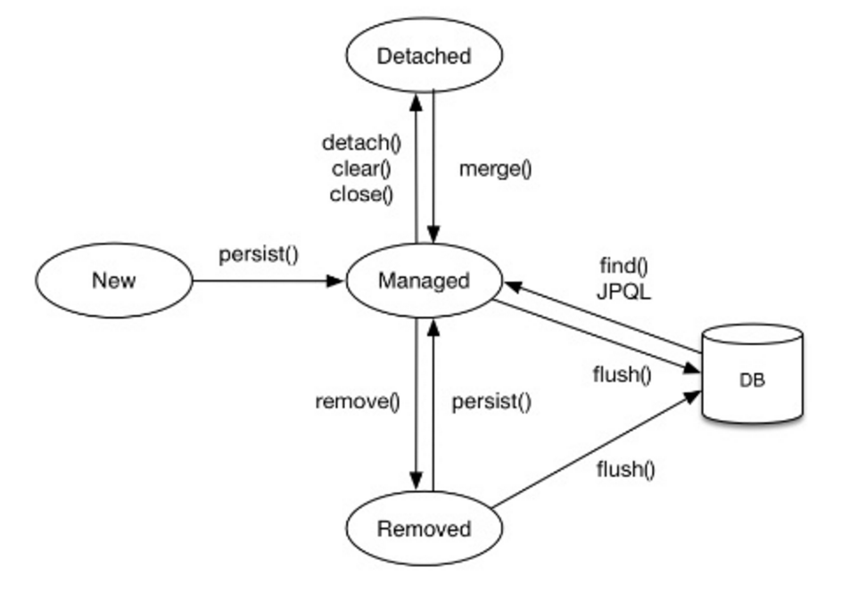
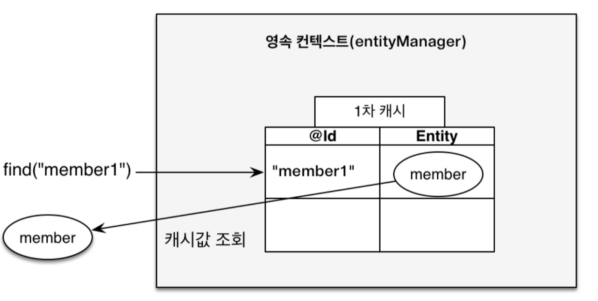
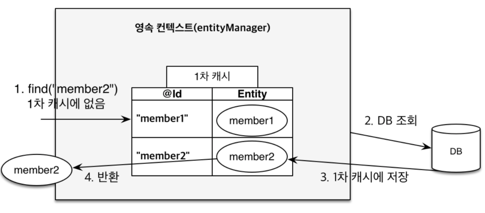
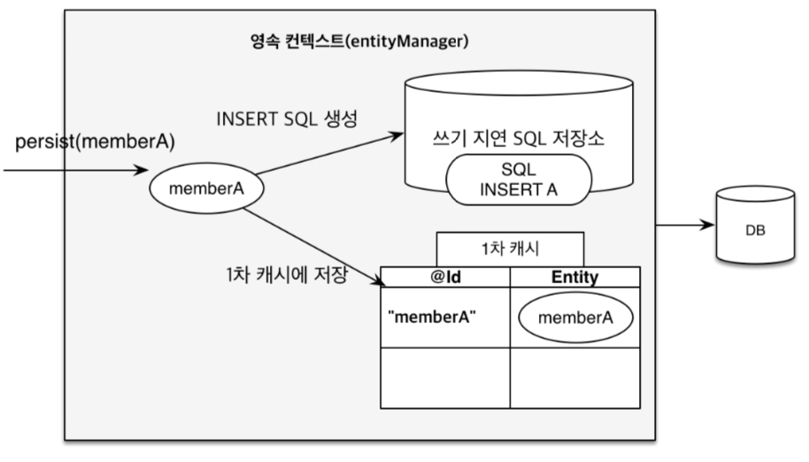
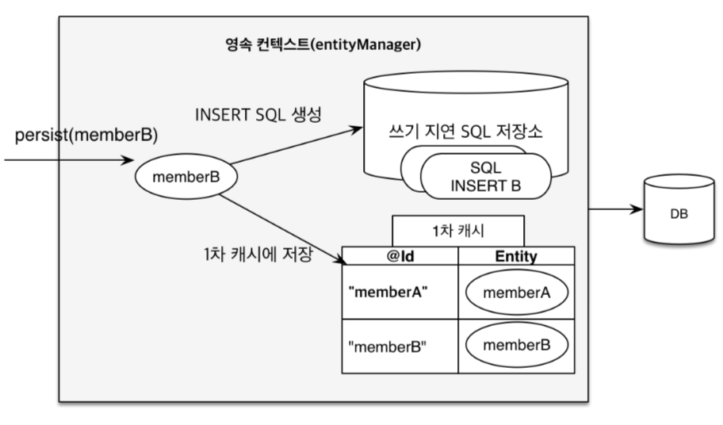

- 영속성 컨텍스트 - 서재화
    - OSIV
- 즉시/지연 로딩 - 서재화
    - 프록시
    - N + 1 문제
    

### 영속성 컨텍스트란?

엔티티를 영구 저장하는 환경이라는 뜻이다. 애플리케이션과 DB 사이에서 객체를 보관하는 가상의 데이터베이스 같은 역할을 한다. 엔티티 매니저를 통해 엔티티를 저장하거나 조회하면 엔티티 매니저는 영속성 컨텍스트에 엔티티를 보관하고 관리한다.

### 생명주기



영속성 컨텍스트의 생명주기는 아래 이미지와 같이 4가지 상태가 있다.

- 비영속(new) : 영속성 컨텍스트와는 무관한 상태
    
    ```java
    Member member = new Member();
    ```
    
    Entity 객체를 생성했지만, 아직 영속성 컨텍스트에는 저장되지 않은 상태.(순수 객체)
    
- 영속(managed) : 영속성 컨텍스트에 저장된 상태
    
    ```java
    //	순수 객체
    Member member = new Member();
    
    //	영속성 컨텍스트에 저장 -> 영속성 컨텍스트가 관리
    EntityManager em;
    em.persist(member);
    ```
    
    Entity Manager를 통해서 Entity를 영속성 컨텍스트에 저장한 상태이고 해당 객체는 영속성 컨텍스트에 의해 관리된다는 의미.
    
- 준영속(detached) : 영속성 컨텍스트에 저장되었다가 분리된 상태
    
    ```java
    //	엔티티를 영속성 컨텍스트에서 분리.
    em.detach(member);
    //	영속성 콘텍스트를 비움(초기화).
    em.claer();
    //	영속성 콘텍스트를 종료.
    em.close();
    ```
    
    - 영속성 컨텍스트가 관리하던 상태에서 엔티티를 더이상 관리하지 않는 상태이고 준영속 상태의 특징이다.
    - 1차 캐시, 쓰기 지연, 변경 감지, 지연 로딩을 포함한 영속성 컨텍스트가 제공하는 어떠한 기능도 동작하지 않고 식별자 값을 가지고 있다.
    - **엔티티를 준영속 상태로 전환하는 방법**
        - detach(entity)특정 엔티티만 준영속 상태로 전환(영속성 컨텍스트로부터 분리)1차 캐시, 쓰기 지연, SQL 저장소 정보 제거영속성 컨텍스트 안에서의 Insert, Update 쿼리도 제거되어 DB에 저장되지 않음
        - clear()영속성 컨텍스트를 완전히 초기화영속성 컨텍스트의 모든 엔티티를 준영속 상태로 만듦영속성 컨텍스트 틀은 유지하지만 내용은 비워 새로 만든 것과 같은 상태
        - close()영속성 컨텍스트를 종료해당 영속성 컨텍스트가 관리하던 영속성 상태의 엔티티들은 모두 준영속 상태로 변경
    - **엔티티를 영속 상태로 전환하는 방법**
        - merge(entity)준영속 상태의 엔티티를 다시 영속 상태로 변경(병합)파라미터로 전달된 엔티티의 식별자 값으로 영속성 컨텍스트를 조회하고 엔티티가 없다면, DB에서 조회만약 DB에서도 없다면 새로운 엔티티를 생성하여 병합병합은 save(저장) 또는 update(수정) 기능 수행
- 삭제(removed) : 영속성 컨텍스트에서 삭제된 상태
    
    ```java
    em.remove(member);
    ```
    
    엔티티를 영속성 컨텍스트와 데이터베이스에서 삭제.
    

### 영속성 특징

- 엔티티 매니저(Entity Manager)를 생성할 때 영속성 컨텍스트(Persistence Context)도 생성(1:1)
- 엔티티 매니저를 통해 해당 영속성 컨텍스트에 접근, 관리 할 수 있음
    - 엔티티를 식별자 값(@id로 매핑한 값)으로 구분
    - 영속성 상태에는 식별자 값이 반드시 있어야 한다.(없으면 예외 발생)
- 트랜잭션을 커밋하는 순간 영속성 컨텍스트에 새로 저장된 엔티티(Entity)를 DB에 반영
    - 영속성 상태에서 값을 여러 번 바꾸어도 마지막 트랜잭션을 커밋하는 순간 값으로 반영
- 영속성 상태의 엔티티는 모두 영속성 컨텍스트에서 관리
    - 내부 캐시(1차 캐시)에 저장
        - 영속성 컨텍스트는 내부에 캐시(Cache)가 존재(1차 캐시)
        - 영속 상태의 엔티티는 해당 캐시에 저장
        - 캐시는 Map 형태로 구성되어 있으며, 키(Key)는 @Id로 매핑한 식별자이며 값(Value)은 엔티티 인스턴스
            - 1차 캐시의 키는 식별자 값
            - 식별자 값은 DB(데이터베이스) 기본키와 매핑
            - 영속성 컨텍스트에서 데이터를 저장하고 조회하는 모든 기준은 DB 기본 키 값
        
        
        
        - 1차 캐시에서 해당 Key에 대한 엔티티가 있는지 조회
            - 엔티티 조회 시 우선 1차 캐시에서 식별자 값으로 엔티티를 찾음.
            - 엔티티가 존재하면 DB 조회를 하지 않고, 메모리에 있는 1차 캐시에서 해당 엔티티를 조회.
    
    
    
    - 엔티티가 1차 캐시에 없다면, DB에서 조회
        - 엔티티가 1차 캐시에 없으면 엔티티 매니저는 DB 를 조회해서 해당 엔티티를 1차 캐시에 저장.
        - 1차 캐시에 저장된 후 영속성 상태의 엔티티를 반환.
    - 동일성 보장
        
        ```java
        Member m1 = em.find(Member.class, "member1");
        Member m2 = em.find(Member.class, "member1");
        
        System.out.println(a == b)	//	true (동일성 보장)
        ```
        
    - 트랜잭션을 지원하는 쓰기 지연
        
        
        
        
        
        
        - 엔티티 매니저는 Transaction(트랜잭션)을 커밋하기 전까지 DB에 엔티티를 저장하지 않음.
        - 엔티티 매니저 안에 존재하는 SQL 저장소에 INSERT SQL 을 별도로 저장.
        - 트랜잭션이 커밋이 될 때 SQL 저장소에 있는 모든 INSERT SQL 을 DB에 요청.
    - 변경 감지
        
        ```java
        EntityManager em = emf.createEntityManager();
        EntityTransaction transaction = em.getTransaction();
        
        // 데이터 변경 시 트랜잭션을 시작.
        transaction.begin();
          
        // 엔티티 조회(영속성)
        Member member1 = em.find(Member.class, "member1");
        
        // 엔티티 데이터 수정
        memberA.setName("Developer");
        memberA.setPhoneNumber("01052528282");
        
        // 커밋하는 순간 DB에 UPDATE 쿼리를 보냄.
        transaction.commit();
        ```
        
        - JPA 에서는 엔티티를 수정할 때는 엔티티를 조회하여 데이터를 변경하여 저장.(update() 메소드가 없음)
        - 변경 감지 기능을 통해 DB에 자동 반영.(DB Update)
    - 지연 로딩

### **즉시 로딩과 지연 로딩**

### 1. **지연 로딩(Lazy Loading)**

- **`@ManyToOne(fetch = FetchType.LAZY)`**를 사용하여 연관 관계를 설정하면, 프록시 객체로 조회한다.
- Member 클래스만 DB에서 조회하고, Team은 필요한 시점에 조회한다.
- **`m.getTeam().getName()`**을 호출할 때 실제로 조회되며, 프록시 객체에서 Entity로 초기화된다.

### 2. **즉시 로딩(Eager Loading)**

- **`@ManyToOne(fetch = FetchType.EAGER)`**를 사용하여 연관 관계를 설정하면, Member를 조회할 때 함께 Team을 즉시 조회한다.
- 한 번의 쿼리로 Member와 Team에 대한 정보를 모두 가져온다.

### 3. **즉시 로딩 주의 사항**

- 실무에서는 가급적 지연 로딩을 사용해야 한다.
- 예상치 못한 SQL이 발생할 수 있고, N+1 문제를 일으킬 수 있다.
- JPQL fetch join이나 Entity 그래프를 활용하여 즉시 로딩을 사용할 때도 있음.

### 4. **N+1 문제 해결 방법**

- 지연 로딩을 기본으로 사용하고, 필요한 경우 fetch join을 활용하여 한 번에 필요한 데이터를 가져온다.

### 5. **지연 로딩 활용**

- 실무에서는 모든 연관 관계에 대해 지연 로딩을 사용하고, 필요한 경우 JPQL fetch join이나 Entity 그래프를 활용한다.
- 즉시 로딩은 상상하지 못한 쿼리가 나갈 수 있으므로 신중하게 사용해야 한다.


### 예상 질문
- 영속성 컨텍스트의 개념은 무엇인가요?
- N+1의 간단한 예시와 예방할 수 있는 방법이 무엇인가요?
- 즉시 로딩과 지연 로딩에 대해서 간단하게 말해주세요.
- 영속성의 특징들을 말해주세요.
- 영속성 생명주기의 4가지 상태에 대해 말해주세요.