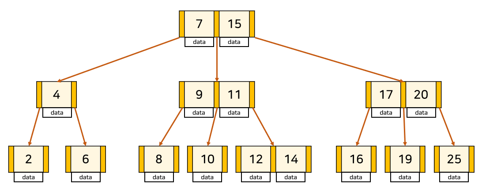
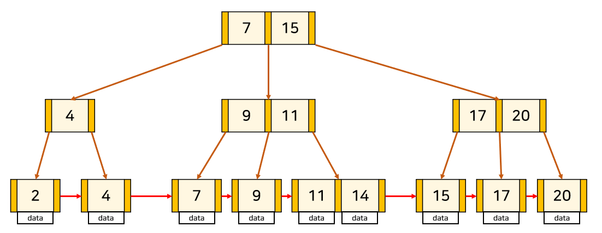

### 발표 내용

- `hash table`, `b-tree`, `b+tree`
- 인덱스가 `hash table` 이 아닌 `b+tree`로 구현된 이유

## 인덱스

<aside>
💡데이터베이스의 테이블에 대한 검색 속도를 향상 시켜주는 자료구조

</aside>

### Hash Table 자료구조

- 해시테이블 = key와 value를 한 쌍으로 데이터를 저장하는 자료구조
- 해시 테이블을 이용한다면 인덱스는 (key, value) = (컬럼의 값, 데이터의 위치)로 구현
- 시간복잡도
    - 일반적인 경우 - 탐색, 삽입, 삭제 연산에 대해 O(1)의 시간복잡도를 갖는다.
    - 최악의 경우
        - 해시 충돌이 발생하는 경우
        - 탐색,삽입,삭제 연산에 대해 O(N)의 시간복잡도를 갖는다.
- 해시 테이블의 한계점
    - 해시 테이블은 등호(=) 연산에 최적화 되어있다.
    - 데이터베이스, 즉 인덱스 =에서는 부등호 연산(<, >)이 자주 일어나는데 해시 테이블 내의 데이터들은 정렬되어 있지 않으므로 특정 기준보다 크거나 작은 값을 빠른 시간내에 찾을 수가 없다.

### B-Tree 자료 구조

> 탐색 성능을 높이기 위해 균형있게 높이를 유지하는 BalancedTree의 일종
> 

- 이진 탐색 트리와 유사한 자료구조
    - 다만, 자식 노드를 둘 이상 가질 수 있고 Balanced(균형) 트리라는 특징이 있다.
- node의 자식 수 중 최댓값을 K라고 한다면, 해당 B-Tree를 K차 B-Tree라고 한다.
- B-Tree의 조건
    - node의 key의 수가 k개라면, 자식 node의 수는 k+1개이다.
    - node의 key는 반드시 정렬된 상태여야 한다.
    - 자식 node들의 key는 현재 node의 키를 기준으로 크기 순으로 나뉘게 된다.
    - root노드는 항상 2개 이상의 자식을 갖는다. (루트노드가 리프노드인 경우 제외)
    - M차 Tree일 때 , root와 leaf 노드를 제외한 나머지 모든 노드들은 최소⌈M/2⌉, 최대 M개의 서브 트리를 갖는다.
    - 모든 leaf 노드들은 같은 level에 있어야 한다.
- 시간복잡도
    - O(logN)

### B+Tree

> B-Tree의 탐색 시 문제점을 개선한  자료구조
> 
- 특징
    - 오직 leaf 노드에만 데이터를 저장하고 leaf 노드가 아닌 node에서는 자식 포인터만 저장한다.
    - leaf 노드끼리는 LinkedList로 연결되어 있다.
        - B+Tree의 경우 반드시 leafNode에만 데이터가 저장되기 때문에 key가 중복될 수 있다.
    
   
    
- B+Tree의 장점
    - leaf Node를 제외하고 데이터를 저장하지 않기 때문에 메모리를 더 확보할 수 있다.
        - 하나의 node에 더 많은 포인터를 가질 수 있기 때문에 트리의 높이가 더 낮아지므로 검색속도 향상
    - full scan을 하는 경우, B+Tree의 경우 leafNode에만 데이터가 저장되어 있고, leafNode 끼리 linkedList로 연결 되어 있기 때문에 선형 시간이 소모된다.
        - 반면 B-Tree는 모든 node를 확인해야 한다.
- B+Tree의 단점
    - B-Tree의 경우 최상의 경우, 특정 key를 rootNode에서 찾을 수 있지만, B+Tree의 경우 반드시 특정 키에 접근하기 위해서는 leafNode까지 가야한다.
- 시간복잡도
    - O(logN)

### 인덱스가 hashTable이 아닌 B+Tree로 구현된 이유

- B+Tree는 정렬된 데이터를 저장하는데 효과적.  = 범위 쿼리나 범위 스캔을 수행할 때 효율적
    - 반면 HashTable은 등호 연산에만 최적화 되어있고, 해시 테이블 내의 데이터들은 정렬되어 있지 않으므로 특정 기준보다 크거나 작은 값을 빠른 시간내에 찾을 수가 없다.
    - 범위로 접근하거나 OrderBy를 사용할 경우, 해시테이블은 O(N) 이상이라는 시간복잡도를 가져 인덱스로의 가치가 없어진다.

## 참고 사이트

[[DB] 10. B-Tree (B-트리)](https://rebro.kr/169)

## 예상 질문

<aside>
❓ HashTable이 인덱스로 사용하기 적합하지 않은 이유는 무엇인가요?

</aside>

<aside>
❓ 인덱스에서 B-Tree가 아닌 B+Tree를 사용하는 이유는 무엇인가요?

</aside>

<aside>
❓ 그렇다면 데이터베이스에서 아예 HashTable을 사용하지 않나요?
HashTable 자료구조를 사용하는 예시에 대해서 알고있는 내용을 이야기 해주세요

</aside>