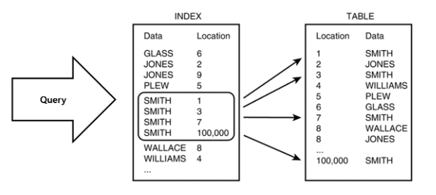

**인덱스**

DB Index는 흔히 책의 목차에 비유가 되며 이것이 없다면 독자가 책에서 특정 내용을 찾으려고 할 때, 첫 페이지부터 원하는 내용을 얻을 때까지 일일이 찾아야 된다. 책의 전반부에 위치하거나, 책의 분량이 적다면 검색에 소요되는 시간이 비교적 적을수 있지만 분량이 많거나, 후반에 위치한다면 오랜 시간이 걸리게 된다.

    
    

추가적인 공간을 활용하여 DB Table 검색 속도를 향상시키기 위한 자료구조이다. 특정 컬럼에 인덱스를 생성하면 인덱스를 위한 별도의 메모리 공간에 Key, Value와 함께 저장된다. 인덱스를 활용해 데이터를 조회하면 Index 테이블에 저장된 데이터의 물리적 주소를 참조하여 데이터를 조회하기 때문에 검색속도가 향상된다.

**인덱스 장점**

Index의 가장 큰 특징은 데이터들이 정렬이 돼 있다는 점이다.

1. 조건 검색 where 절의 효율성

   Table을 생성하고 안에 데이터가 쌓이면서 행은 내부적으로 순서가 없이 뒤죽박죽으로 저장이 된다. 그렇게 되면 where 절 특정 조건에 맞는 데이터를 찾아낼 때 처음부터 끝까지 조건과 맞는지 비교를 하는 Full table Scan이 일어나게 된다. Index Table Scan 시 해당 Index Table은 정렬이 돼 있기 때문에 where 조건에 맞는 데이터들을 빠르게 찾아낼 수 있다.

2. 정렬 order by 절의 효율성

   Index 사용 시 부하 과정이 많이 걸리는 ORDER BY 정렬 과정을 피할 수가 있다. 이미 정렬되어 있기 때문에 값을 가져오기만 하면 된다.

3. MIN, MAX 효율적인 처리가 가능

   데이터가 정렬되어 있기 때문에 min, max value 값들을 시작 값과 끝 값을 가져오면 되기 때문에 Full Table Scan 작업으로 테이블을 모두 탐색을 하지 않아도 된다.

**인덱스 단점**

Index를 사용한다고 해서 무조건 좋은 것만은 아니다. 정렬된 상태를 계속 유지한다는게 문제가 된다. record 내 값이 바뀌는 부분에서 악영향이 발생하게 된다.

1. DML에 취약하다.

   Insert, Update, Delete 통해 데이터가 추가되거나 값이 변경된다면 Index table 내에 있는 값들을 다시 정렬을 해야 한다. Index Table과 원본 Table 두 군데의 데이터 수정 작업을 해줘야 한다는 단점도 발생한다. 검색을 위주로 하는 Table에 Index를 생성하는 것이 알맞다.

   - Index 관리
     - Insert
       새로운 데이터 대한 index 추가한다.
     - Delete
       삭제하는 데이터의 index 사용하지 않는다는 작업을 진행한다.
     - Update
       기존의 Index 사용하지 않음 처리하고 갱신된 데이터에 인덱스를 추가한다.

2. 무조건 Index Scan이 좋은 것은 아니다.

   위에서 검색 위주 Table에 사용하는 것이 좋다곤 했지만 무조건은 아니다. Index는 Table의 전체 데이터 중 10~15% 이하의 데이터를 처리하는 경우에만 효율적이며 그 이상의 데이터를 처리할 땐 Index를 사용하지 않는 것이 낫다.

3. 속도 향상을 위해 Index를 많이 만드는 것은 좋지 않다.

   Index 관리를 위해 DB의 약 10% 해당하는 저장 공간이 추가로 필요하다. 무턱대고 만들지 말고 속도 향상에 비해 단점들을 비교해서 정해야한다.

**생성된 Index 어떻게 효율적으로 사용하나?**

가장 효율적으로 사용하기 위해서는 호출 빈도가 높은 컬럼을 인덱스로 사용하는 것이 알맞다. 또한 기준 컬럼은 중복이 되지 않는 값이 좋다. 그렇기 때문에 가장 최선은 PK 값으로 인덱스를 생성하는 것이라 볼 수 있다. 인덱스는 어느 컬럼에 사용하는 것이 좋은가?

1. WHERE 절 자주 조회
2. 수정 빈도 낮음
3. 데이터 중복 적음
4. JOIN 조건
5. 데이터 양 많을수록

**예상 질문**

1. 인덱스는 보통 왜 사용하나요?
2. 인덱스 장/단점을 아는 만큼 말해주세요.
3. 보통 인덱스는 어떤 컬럼에 걸어주나요?
4.

---

**참고링크**
https://velog.io/@guswns3371/%EB%8D%B0%EC%9D%B4%ED%84%B0%EB%B2%A0%EC%9D%B4%EC%8A%A4-%EB%8D%B0%EC%9D%B4%ED%84%B0%EB%B2%A0%EC%9D%B4%EC%8A%A4%EC%97%90%EC%84%9C-%EC%9D%B8%EB%8D%B1%EC%8A%A4%EB%A5%BC-%EC%82%AC%EC%9A%A9%ED%95%98%EB%8A%94-%EC%9D%B4%EC%9C%A0

https://daco2020.tistory.com/258
