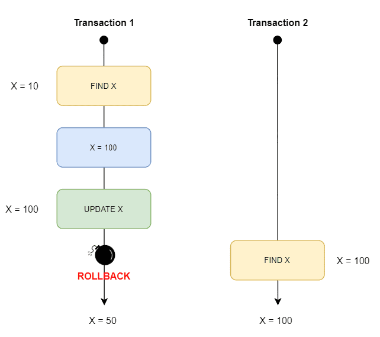
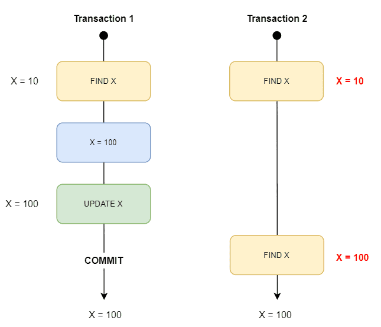
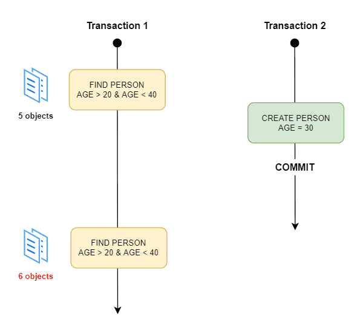
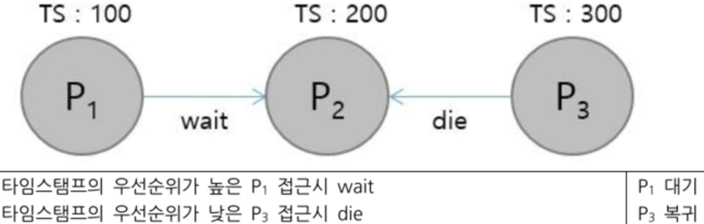
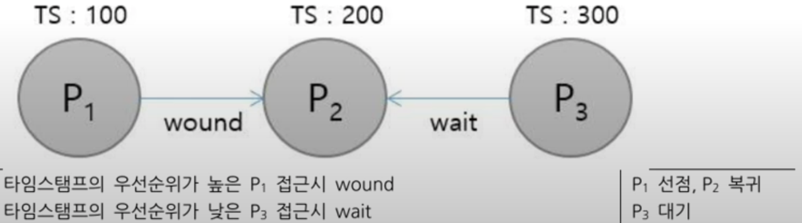

# 트랜잭션 격리 수준과 데드락

### 격리 수준 별 발생 가능한 현상

- **Dirty Read**
    - 트랜잭션의 작업이 완료되지 않았는데, 다른 트랜잭션에서 볼 수 있는 현상
    - 아직 커밋되지 않은 다른 트랜잭션의 데이터를 읽는 것을 의미한다
    - 발생 Level: Read Uncommitted
- **Non-Repeatable Read**
    - 하나의 트랜잭션에서 같은 쿼리를 두 번 실행할 때, 두 결과가 다른 현상
    - 즉, 한 트랜잭션에서 같은 쿼리로 2번이상 조회했을 때 **그 결과가 상이한 상황**을 말한다.보통 `데이터의 수정/삭제`가 발생했을 경우 발생
    - 발생 Level: Read Committed, Read Uncommitted
- **Phantom Read**
    - 하나의 트랜잭션에서 같은 쿼리를 두 번 실행할 때, 첫번째 결과에서 보지 못한 결과가 두 번째 결과에서 보이는 형상
    - 발생 Level: Repeatable Read, Read Committed, Read Uncommitted

## 트랜잭션 격리 수준

### 1. READ UNCOMMITED (Level 0)

- 각 트랜잭션의 변경 내용이 COMMIT, ROLL BACK과 관계없이 다른 트랜잭션의 값을 읽어올 수 있다.
- 데이터의 정합성에 대해 문제가 많은 격리 수준이다.

### 2. READ COMMITED (Level1)

- 대부분의 DB에서 사용하는 방식
- DirtyRead가 발생하지 않는다. (Select 문이 실행되는 동안 Shared Lock이 걸리기 때문)
- 실제 테이블의 값을 가져오는 것이 아니라 Undo 영역의 백업된 record 값을 가져온다.
- 하나의 트랜잭션에 대해 SELECT문을 실행할 때 항상, 같은 결과를 가져와야 하는 REPEATABLE READ의 정합성에 어긋난다. → Non-Repeatable Read가 발생한다.

### 3. REPEATABLE READ (Level2)

- mySQL의 경우, 트랜잭션마다 각각의 트랜잭션 ID를 부여하여, 해당 ID보다 작은 트랜잭션 ID의 변경 내용만 가져온다.
    - MySQL의 default 격리 수준이 REPETABLE_READ다
- Undo 영역에 백업을 하고, 실제 record 값을 변경한다.
    - 백업된 데이터는 필요없다고 판단될 시 주기적으로 삭제된다.
    - Undo 영역에 백업된 데이터가 많아진다면, 성능 저하가 발생될 수 있다.
- 이러한 변경 방식을 MVCC(Multi Version Concurrency Control)이라고 부른다.
    - 트랜잭션이 시작 시점 데이터의 일관성을 보장해야 하기 때문에 트랜잭션의 실행 시간이 길어질수록 계속 멀티 버전을 관리해야 한다.
- 트랜잭션이 완료될 때 까지 Select문이 사용하는 모든 데이터에 Shared Lock이 걸린다. Non-Repeatable Read는 발생하지 않지만, PhantomRead는 발생할 수 있다.
    - cf. PhantomRead : 다른 트랜잭션에서 수행한 변경 작업에 의해 레코드가 보였다가 안 보였다가 하는 현상

### 4. SELIALIZABLE

- 가장 엄격하고 단순한 격리 수준
- 동시 처리 성능 측면에서 비효율적이다.
- Phantom Read가 발생하지 않지만, DB에서 거의 사용되지 않는 수준이다.

### Isolation선택 시 고려사항
Isolation Level에 대한 조정은, 동시성과 데이터 무결성에 연관되어 있음
동시성을 증가시키면 데이터 무결성에 문제가 발생하고, 데이터 무결성을 유지하면 동시성이 떨어지게 됨
레벨을 높게 조정할 수록 발생하는 비용이 증가함

## 데드락(Dead Lock)

- 교착 상태(데드락)이란, 여러개의 트랜잭션이 실행을 하지 못하고 서로 무한정 기다리는 상태를 의미한다.
- 잠금(Locking)은 트랜잭션들의 동시성을 제어해주는 역할을 하지만, 그 부작용으로 교착 상태를 유발할 수 있다.

## 데드락 해결 방법

### 예방 기법

- 각 트랜잭션이 실행되기 전에 필요한 모든 자원을 Lock(잠금)한다.
    - 필요한 모든 데이터를 Lock(잠금)해야 하므로 병행성이 떨어진다.
- SET LOCK_TIMEOUT문을 통해 일정 시간이 지나면 쿼리를 취소한다.
    - 기존의 교착상태인 데이터가 있다면, 그 데이터에 접근하는 쿼리만 취소한다.
    - 즉, 근본적인 해결책이 될 수 없다.

### 회피 기법

**회피 기법은 자원을 할당할 때 시간 스탬프(Time Stamp)를 활용해서 교착상태가 일어나지 않도록 회피하는 방법**이다. 예방 기법의 단점 때문에 실제로는 회피 기법이 많이 사용된다.

회피 기법의 종류는 크게 2가지가 있다.

- **Wait-Die 방식**
    - 기다리거나(Wait) 포기하거나(Die)‼️
    - 트랜잭션 A가 트랜잭션 B에 의해 잠금된 데이터를 요청할 때 트랜잭션 A이 먼저 들어온 트랜잭션이라면 대기(Wait)한다.
    - 트랜잭션 A가 나중에 들어온 트랜잭션이라면, 포기(Die)하고 나중에 다시 요청한다.
- **Wound-Wait 방식**
    - 빼앗기거나(Wound) 기다리거나(Wait)‼️
    - **트랜잭션 A가 트랜잭션 B**보다 먼저 들어온 트랜잭션이라면, 데이터를 선점(Wound)한다.
    - 반면, 트랜잭션A가 트랜잭션 B보다 나중에 들어온 트랜잭션이라면 대기(Wait)한다.

- **Wait-Die 방식**

다른 트랜잭션이 데이터를 점유하고 있을 때 기다리거나(Wait) 포기(Die)하는 방식으로 선행 트랜잭션이 접근하면 대기(wait), 후행 트랜잭션이 접근하면 포기(die)한다. 즉, 오래된 프로세스에게 대기의 기회를 제공하고, 최신 프로세스는 자주 복귀함으로써 오버헤드의 가능성이 있다.

- **Wound-Wait 방식**

다른 트랜잭션이 데이터를 점유하고 있을 때 빼앗거나(Wound) 기다리는(Wait) 방식으로 선행 트랜잭션이 접근하면 선점(wound), 후행 트랜잭션이 접근하면 대기(wait)한다. 즉, 오래된 프로세스에게 선점의 기회를 제공하고 최신 프로세스는 대기함에 따라 복귀를 최소화한다.

### 낙관적 병행 기법

낙관적 병행 제어 기법은 트랜잭션이 실행되는 동안에는 검사를 수행하지 않고, 트랜잭션이 커밋된 후에 데이터에 문제가 있다면 롤백(Rollback)하는 방법이다.

즉, 낙관적 병행 제어 기법은 **판독->확인->기록** 단계를 따른다. **확인 단계**를 성공적으로 거친 트랜잭션만  **기록 단계**를 수행할 수 있다.

## 출처

[Isolation Level이란? | devlog.akasai](https://akasai.space/db/about_isolation/)

[트랜잭션 격리 수준](https://tecoble.techcourse.co.kr/post/2022-11-07-mysql-isolation/)

[https://github.com/gyoogle/tech-interview-for-developer/blob/master/Computer Science/Database/Transaction Isolation Level.md](https://github.com/gyoogle/tech-interview-for-developer/blob/master/Computer%20Science/Database/Transaction%20Isolation%20Level.md)

## 예상문제

- READ COMMITED가 무엇인지 설명해주시고, 해당 격리 수준을 사용할 경우 발생할 수 있는 현상에 대해 설명해주세요.
- REPEATABLE READ가 무엇인지 설명해주시고, 해당 격리 수준을 사용할 경우 발생할 수 있는 현상에 대해 설명해주세요.
- 데드락이 발생하는 이유와 해결 방법에 대해 설명해주세요
- 격리수준을 선택할 때 고려해야 할 사항에 대해 이야기 해주세요. 실시간 요청이 많은 서비스에 어떤 격리수준을 적용하면 좋을지 생각을 이야기해주세요.