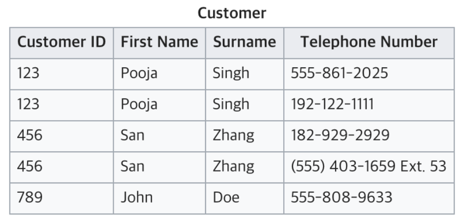

# 정규화

## 정규화란?

데이터베이스 정규화(Database Normalization)는 데이터의 중복을 제거하고, 데이터의 일관성과 무결성을 유지하기 위한 과정이다. 주로 관계형 데이터베이스에서 사용되며, 다양한 정규화 단계를 거쳐 데이터를 최적화한다.

- 데이터의 중복을 없애면서 불필요한 데이터를 최소화시킨다.
- 무결성을 지키고, 이상 현상을 방지한다.
- 테이블 구성을 논리적이고 직관적으로 할 수 있다.
- 데이터베이스 구조를 확장에 용이해진다.

정규화에는 여러가지 단계가 있지만, 대체적으로 1~3단계 정규화까지의 과정을 거친다.

## 정규화의 종류

### 1. 제 1정규화(1NF)

테이블 컬럼이 원자값(하나의 값)을 갖도록 테이블을 분리시키는 것을 말한다.  
만족해야 할 조건은 아래와 같다.

- 어떤 릴레이션에 속한 모든 도메인이 원자값만으로 되어 있어야한다.
- 모든 속성에 반복되는 그룹이 나타나지 않는다.
- 기본키를 사용하여 관련 데이터의 각 집합을 고유하게 식별할 수 있어야 한다.

현재 테이블은 전화번호를 여러개 가지고 있어 원자값이 아니다. 따라서 1NF에 맞추기 위해서는 아래와 같이 분리할 수 있다.

### 제 2정규화(2NF)

테이블의 모든 컬럼이 완전 함수적 종속을 만족해야 한다.  
예를 들어 테이블에서 기본키가 복합키(키1, 키2)로 묶여있을 때, 두 키 중 하나의 키만으로 다른 컬럼을 결정지을 수 있으면 안된다.  
기본키의 부분집합 키가 결정자가 되어선 안된다는 것.

Manufacture과 Model이 키가 되어 Model Full Name을 알 수 있다.  
Manufacturer Country는 Manufacturer로 인해 결정된다. (부분 함수 종속)  
따라서, Model과 Manufacturer Country는 아무런 연관관계가 없는 상황이다.  
결국 완전 함수적 종속을 충족시키지 못하고 있는 테이블이다. 부분 함수 종속을 해결하기 위해 테이블을 아래와 같이 나눠서 2NF를 만족할 수 있다.

### 제 3정규화(3NF)

2NF가 진행된 테이블에서 이행적 종속을 없애기 위해 테이블을 분리하는 것이다.  
이행적 종속 : A → B, B → C면 A → C가 성립된다  
아래 두가지 조건을 만족시켜야 한다.

- 릴레이션이 2NF에 만족한다.
- 기본키가 아닌 속성들은 기본키에 의존한다.

현재 테이블에서는 Tournament와 Year이 기본키다. Winner는 이 두 복합키를 통해 결정된다. 하지만 Winner Date of Birth는 기본키가 아닌 Winner에 의해 결정되고 있다.  
따라서 이는 3NF를 위반하고 있으므로 아래와 같이 분리해야 한다.

### BCNF 정규형

제3 정규형을 만족하고, 함수 종속성 X → Y가 성립할 때 모든 결정자 X가 후보키가 되도록 분해한다. 쉽게 말해 모든 결정자가 key인 경우 BCNF이다.  
예)
https://1000hg.tistory.com/36

## 정규화의 단점과 장점

- 장점

1. 데이터베이스 변경 시 이상현상이 발생하는 문제점을 해결할 수 있다.
2. 데이터베이스 구조 확장 시 정규화된 데이터베이스는 그 구조를 변경하지 않아도 되거나 일부만 변경해도 된다.

- 단점

1. 릴레이션의 분해로 인해 릴레이션 간의 연산(JOIN 연산)이 많아진다. 이로인해 질의에 대한 응답 시간이 느려질 수 있다.

## 이상현상

이상 현상은 테이블을 설계할 때 잘못 설계하여 데이터를 삽입,삭제,수정할 때 생기는 논리적 오류를 말한다.

- 삽입 이상 : 자료를 삽입할 때 특정 속성에 해당하는 값이 없어 NULL을 입력해야 하는 현상
- 갱신 이상 : 중복된 데이터 중 일부만 수정되어 데이터 모순이 일어나는 현상
- 삭제 이상 : 어떤 정보를 삭제하면, 의도하지 않은 다른 정보까지 삭제되어버리는 현상

## 역정규화

역정규화란 논리적 정규화를 통해 만든 표를, 개발적 측면에서 성능이나 편의성을 위해서 되돌아가는 작업을 일컫는다.  
정규화를 거치면 릴레이션 간의 연산(JOIN 연산)이 많아지는데, 이로인해 성능이 저하될 우려가 있다.
역정규화를 하는 가장 큰 이유는 성능 문제가 있는(읽기작업이 많이 필요한) DB의 전반적인 성능을 향상시키기 위함이다.

## 예상 질문

- 정규화에 대해 설명해주세요.
- 정규화에는 어떤 장점이 있고 어떤 단점이 있는지 아는대로 설명해주세요.
- 이상 현상의 종류에 대해 설명해주세요.
- 역정규화를 하는 이유에 대해 아는대로 설명해주세요.

## 참고 링크

https://gyoogle.dev/blog/computer-science/data-base/Normalization.html  
https://wooaoe.tistory.com/48  
https://inpa.tistory.com/entry/DB-%F0%9F%93%9A-%EC%A0%9C-1-2-3-%EC%A0%95%EA%B7%9C%ED%99%94-%EC%97%AD%EC%A0%95%EA%B7%9C%ED%99%94
