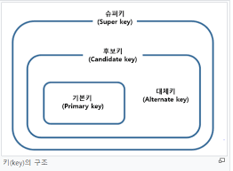

관계형 데이터베이스

## 데이터베이스를 사용하는 이유

데이터베이스란 데이터를 여러 사람이 공유하고 사용할 목적으로 통합관리되는 데이터들의 모임이다. 데이터베이스를 사용하지 않으면, 프로그램의 종료 시점에 그 전까지 생성한 많은 데이터들이 모두 날아가게 된다. 이런 현상을 방지하기 위해서 데이터들을 데이터베이스에 넣고 보관하는 방법을 사용한다.  
널리 사용되는 DBMS로는 MySql, Oracle 등이 있다.

### 데이터베이스의 특징

1. 실시간 접근성(Real-Time Accessibility) : 비정형적인 질의(조회)에 대하여 실시간 처리에 의한 응답이 가능해야 한다.
2. 지속적인 변화(Continuous Evloution) : 데이터베이스의 상태는 동적이다. 즉 새로운 데이터의 삽입(Insert), 삭제(Delete), 갱신(Update)으로 항상 최신의 데이터를 유지해야 한다.
3. 동시 공용(Concurrent Sharing) : 데이터베이스는 서로 다른 목적을 가진 여러 응용자들을 위한 것이므로 다수의 사용자가 동시에 같은 내용의 데이터를 이용할 수 있어야 한다.
4. 내용에 의한 참조(Content Reference) : 데이터베이스에 있는 데이터를 참조할 때 데이터 레코드의 주소나 위치에 의해서가 아니라 사용자가 요구하는 데이터 내용으로 찾는다.

## RDB의 개념과 장단점

### DBMS란?

데이터베이스 관리 시스템(Database Management System)이란 다수의 사용자들이 데이터베이스 내의 데이터를 접근할 수 있도록 해주는 소프트웨어들을 의미한다.  
 DBMS는 기존의 파일 시스템이 갖는 데이터의 종속성과 중복성의 문제를 해결하기 위해 제안된 시스템으로 모든 응용 프로그램들이 데이터베이스를 공유할 수 있도록 관리한다.  
 DBMS는 데이터베이스의 구성, 접근방법 , 유지관리에 대한 모든 책임을 지게 된다.

### RDBMS란?

RDBMS는 관계형 데이터베이스 관리 시스템이다.  
관계형 데이터 모델을 기초로 두고 모든 데이터를 2차원 테이블 형태로 표현하는 데이터베이스이다.  
RDMBS는 관계를 맺고 모여있는 테이블들의 집합체로 이해할 수 있다. 이러한 테이블 간의 관계에서 서로의 칼럼을 기준으로 Join이 가능하다는 게 RDBMS의 가장 큰 특징이다.

- **NoSQL vs RDBMS**  
   **RDBMS:**  
   모든 데이터를 2차원 테이블 형태로 표현.  
   장점 - 스키마에 맞춰 데이터를 관리하기 때문에 데이터의 정합성을 보장할 수 있음 (\*정합성:데이터가 서로 모순 없이 일관되게 일치해야 함)  
   단점 - 시스템이 커질 수록 쿼리가 복잡해지고 성능이 저하되며 Scale-out이 어렵다(Scale-up만 가능)

  **NoSQL(Not Only SQL):**  
   RDBMS와 반대로 데이터간의 관계를 정의하지 않고, 스키마가 없어 좀 더 자유롭게 데이터를 관리할 수 있으며, 컬렉션이라는 형태로 데이터를 관리함.  
   장점 -

  1. 스키마 없이 Key-Value 형태로 데이터를 관리해 자유롭게 데이터를 관리할 수 있다.
  2. 데이터 분산이 용이하여 성능 향상을 위한 scale-up 뿐만아닌 scale-out 또한 가능하다.

  단점 -

  3. 데이터 중복이 발생할 수 있고, 중복된 데이터가 변경될 경우 수정을 모든 컬렉션에서 수행해야 한다.
  4. 스키마가 존재하지 않기에 명확한 데이터 구조를 보장하지 않아 데이터 구조 결정이 어려울 수 있다.

  결론 - RDBMS는 데이터 구조가 명확하고, 변경 될 여지가 없으며 스키마가 중요한 경우 사용하는 것이 좋다. 반면 NoSQL은 정확한 데이터 구조를 알 수 없고 데이터가 변경/확장 될 수 있는 경우 사용하는 것이 좋다.

## 키의 종류

  
키의 종류에는 슈퍼키, 후보키, 기본키, 대체키, 외래키가 있다.

### 최소성과 유일성

유일성 : 하나의 키값으로 튜플을 유일하게 식별할 수 있는 성질  
 최소성 : 키를 구성하는 속성들 중 꼭 필요한 최소한의 속성들로만 키를 구성하는 성질

### 키

- 슈퍼키  
  각 행을 유일하게 식별할 수 있는 속성들의 집합이다. 이때 속성은 몇개를 묶더라도 상관없다. 유일성은 만족하지만 최소성은 만족하지 않는 키.  
  예) 학번+이름, 주민등록번호+학번

- 후보키  
  각 행을 유일하게 식별할 수 있는 "최소한의" 속성들의 집합이다. 서로 구분할 수 있으면서 불필요한 속성들이 없어야 한다. 즉 유일성과 최소성을 둘 다 만족한다.  
  유일성, 최소성 특징은 새로운 투플이 삽입되거나 변경되어도 유지되어야 하며 기존 릴레이션의 인스턴스만 보고 유일성과 최소성을 판단하면 안 된다.

- 기본키  
  기본키는 후보키 중 기본적으로 사용할 키로 선택된 키를 말하며, 널 값을 가질 수 없고 중복이 허용되지 않는다. (예: MySQL의 'PRIMARY KEY')

- 대체키  
  기본키를 제외한 나머지 후보키들을 의미한다.

- 외래키  
  한 테이블이 다른 테이블의 기본키를 참조해서 테이블 간의 관계를 만드는 것을 의미한다. 어떤 테이블의 식별자를 끌어와서 그것에 대한 정보를 또 추가한다고 이해하면 된다.

## 예상 질문

- 데이터베이스를 사용하는 이유에 대해 설명해주세요.
- 데이터베이스의 특징에 대해 설명해주세요.
- RDBMS에 대해 설명해주세요.
- RDBMS와 NoSQL의 차이에 대해 설명해주세요. 또한 어떤 경우에 RDBMS와 NoSQL을 사용하는 것이 적합한지 설명해주세요.
- 키의 종류와 각각에 대해 설명해주세요.

## 참고 링크

https://dev-coco.tistory.com/158  
https://velog.io/@00yubin00/DB-%ED%82%A4%EC%9D%98-%EC%A2%85%EB%A5%98-%EC%8A%88%ED%8D%BC%ED%82%A4-%ED%9B%84%EB%B3%B4%ED%82%A4-%EA%B8%B0%EB%B3%B8%ED%82%A4-%EB%8C%80%EC%B2%B4%ED%82%A4-%EC%99%B8%EB%9E%98%ED%82%A4
