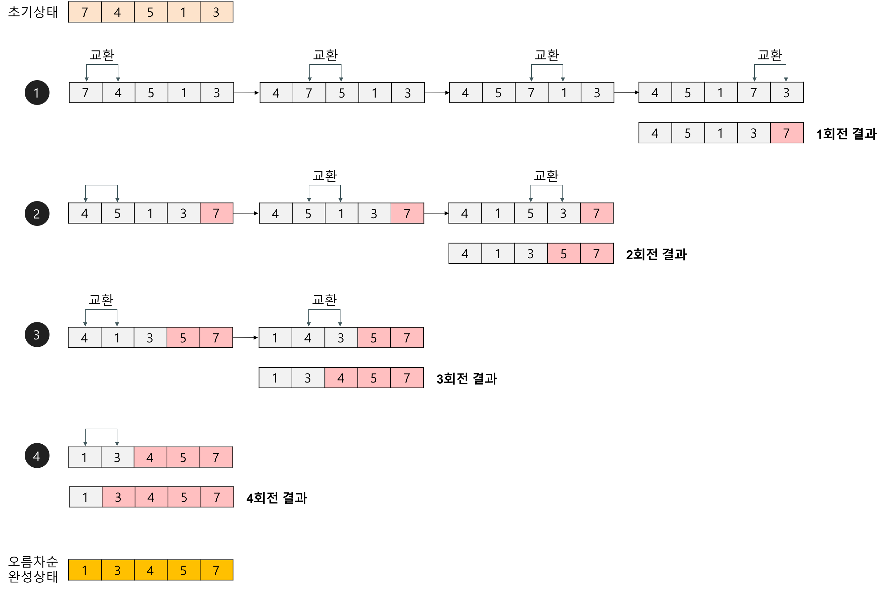

## 거품 정렬(BubbleSort)

 > 서로 인접한 두 원소의 크기를 비교하고, 조건에 맞지 않다면 자리를 교환하며 정렬하는 알고리즘

### 버블 정렬 알고리즘
- 버블 정렬은 첫 번째 자료와 두 번째 자료를, 두 번째 자료와 세 번째 자료를, 세 번째와 네 번째,..를 비교하는 바식으로 (마지막 -1)과 마지막 자료까지 비교하며 자료를 정렬하는 방식이다.
- 1회전을 수행하고 나면 가장 큰 자료가 맨 뒤로 이동하므로 2회전에는 맨 끝 자료는 정렬에서 제외하고, 모든 요소들이 정렬될 때 까지 이 과정을 반복하는 알고리즘이다.



### 버블 정렬 알고리즘의 특징
- 장점
    - 구현이 간단하다.
- 단점
    - 하나의 요소가 가장 왼쪽에서 오른쪽으로 이동하기 위해서는 배열의 모든 요소와 교환되는 일이 생길 수 있다. 
    - 일반적으로, 자료(데이터)의 교환(swap)작업이 자료의 이동(move)작업보다 더 복잡하기 때문에 버블 정렬은 거의 쓰이지 않는다.
    - 시간복잡도가 좋지 않다.

### 버블 정렬의 시간복잡도
- O(N^2)
    - 시간 복잡도가 최악,최선,평균 모두 O(N^2)이다. -> 비효율적
    - 정렬 되어 있지 않은 원소가 정렬되었을 때 자리로 가기 위해 교환 연산이 많이 일어난다. 

## Java 코드
```java
void bubbleSort(int[] arr) {
    int temp = 0;
	for(int i = 0; i < arr.length; i++) {       // 1.
		for(int j= 1 ; j < arr.length-i; j++) { // 2.
			if(arr[j-1] > arr[j]) {             // 3.
                // swap(arr[j-1], arr[j])
				temp = arr[j-1];
				arr[j-1] = arr[j];
				arr[j] = temp;
			}
		}
	}
	System.out.println(Arrays.toString(arr));
}```

## 출처
- https://gmlwjd9405.github.io/2018/05/06/algorithm-bubble-sort.html

## 예상 질문
- 거품 정렬이 무엇인지 개념과 알고리즘 정렬 과정을 설명해주세요.
- 거품 정렬의 시간복잡도와 한계점에 대해 설명해주세요.