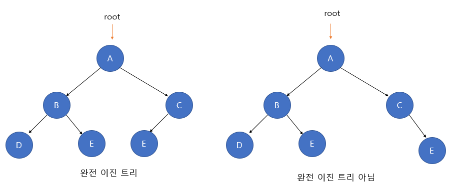

# Complete Binary Tree

## 완전 이진 트리
- 각 노드가 최대 2개의 자식 노드를 가지는 트리 형태의 자료 구조
- 마지막 레벨을 제외한 모든 노드는 완전히 채워져 있어야 한다.
- 최하단 레벨의 노드는 좌측만 노드가 채워져 있거나 좌측,우측 모두 채워져 있어야 하며 노드를 삽입할 때 최하단 좌측 노드 부터 순차적으로 삽입해야 한다. 
- 즉 왼쪽부터 노드가 순서대로 채워진 트리이다.

## 출처
- https://enlqn1010.tistory.com/18

## 예상 질문
- 완전 이진 트리의 특징을 아는대로 설명해주세요