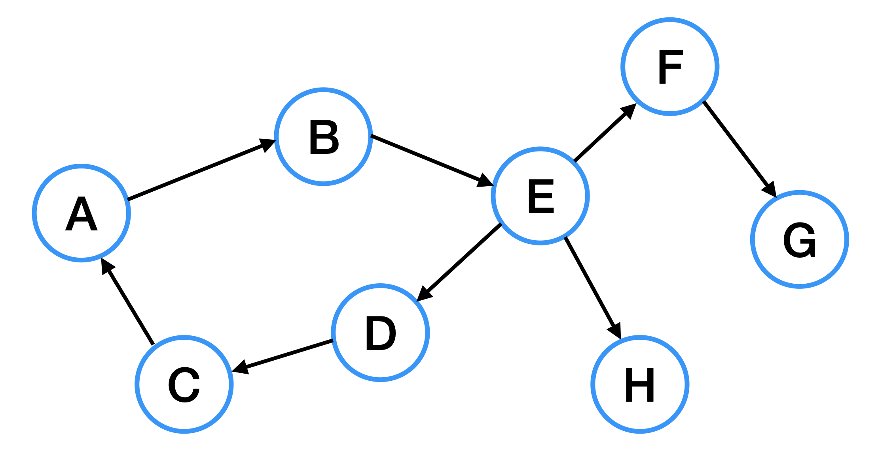
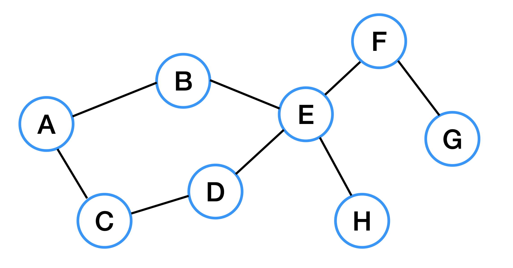
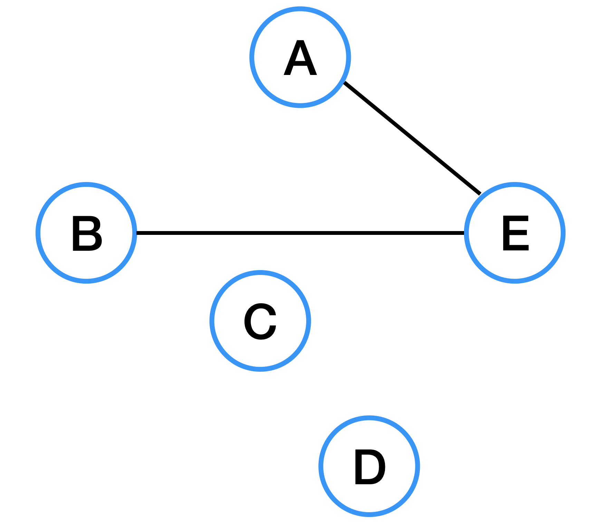
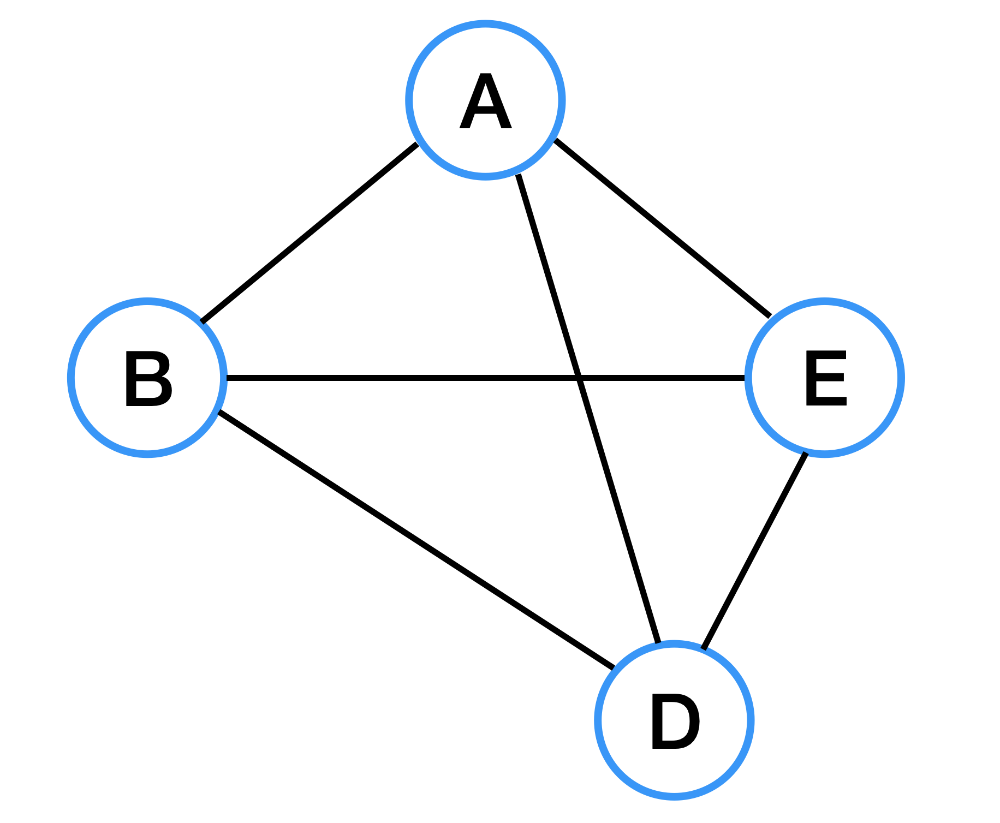
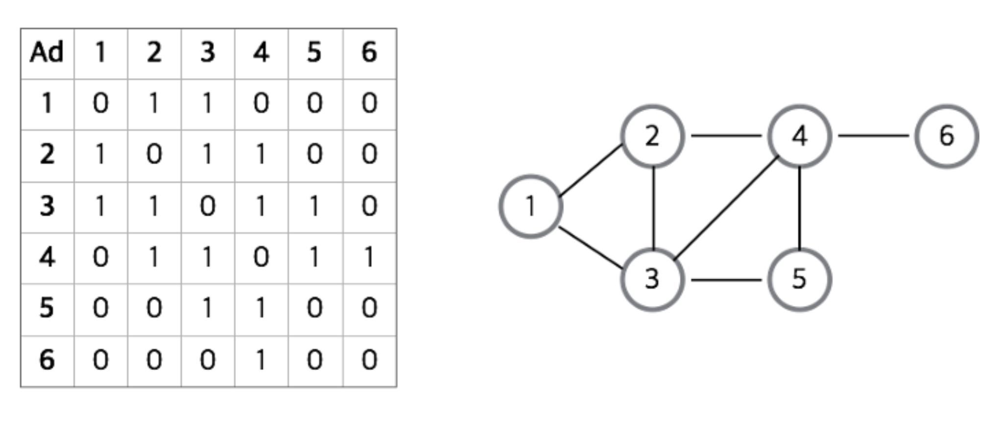

# Graph
> 그래프란 vertex(=node=정점)과 edge(간선)으로 이루어진 자료구조를 뜻한다. 

## 방향 그래프와 무방향 그래프
### Directed Graph  = 방향 그래프

- 간선에 화살표가 있다면 방향그래프, 화살표 방향대로만 이동 가능하다.
### Undirected Graph = 무방향 그래프

- 간선에 화살표가 없는 경우 무방향 그래프이다.
- 무방향 그래프는 `양방향`으로 이동 가능하다. 

---
## 가중치 그래프
- 간선에 가중리 정보를 두어서 구성한 그래프를 의미

## 희소 그래프(Sparse Graph)

- 정점의 개수보다 간선의 개수가 적은 그래프

## 밀집 그래프(Dense Graph)

- 정점의 개수보다 간선 개수가 많은 그래프

## 그래프를 표현하는 2가지 방법
### 인접 행렬(Adjacent Matrix)

- 밀집 그래프를 표현하는데에 적당하다
- 해당하는 위치의 값을 통해 vertex 간의 연결관계를 o(1)로 파악할 수 있다.
- 그래프에 V개의 정점이 있을 때, V 크기의 정방행렬을 이용하여 구현하는 방법이다.
    Matrix[i][j] == 1이면 정점 i에서 j로 가는 간선이 존재하고
    Matrix[i][j] == 0이면 정점 i에서 j로 가는 간선이 존재하지 않는다는 뜻이다.

### 인접 리스트

- 희소 그래프를 표현하는데에 적당하다.
- 어떠한 한 정점의 인접 정점들을 쉽게 찾을 수 있다. 
- 모든 정점들의 인접 리스트를 확인해야하므로, 정점 간의 연결 여부를 확인하는 것은 오래걸린다.

## 용어 정리
- degree: 정점의 차수로, 무방향 그래프에서 각 정점에 연결된 edge의 개수를 degree라고 한다. 
    - in-degree: 진입 차수, 방향 그래프에서 외부에서 들어오는 간선의 수를 의미
    - out-degree: 방향 그래프에서 외부로 나가는 간선의 수를 의미한다.

## 출처
- https://velog.io/@deannn/CS-%EA%B8%B0%EC%B4%88-%EC%9E%90%EB%A3%8C%EA%B5%AC%EC%A1%B0-Graph
- https://github.com/JaeYeopHan/Interview_Question_for_Beginner/tree/main/DataStructure

## 예상 문제
- 그래프를 구현하는 2가지 방법에 대해 아는대로 설명해주세요