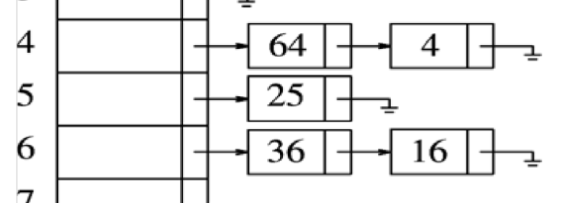
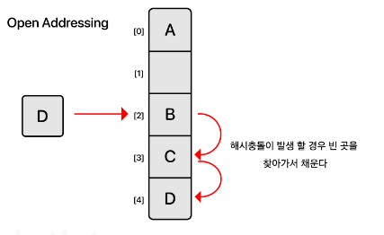
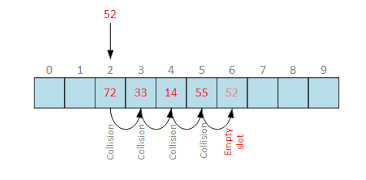
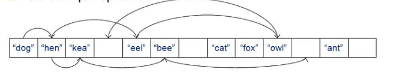
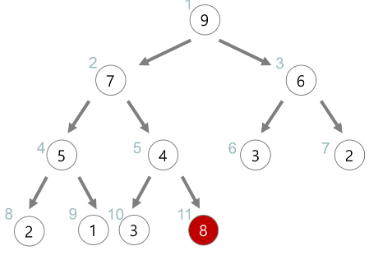
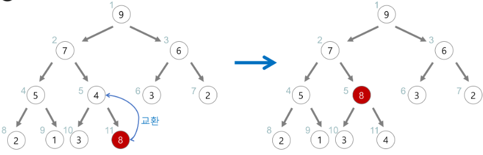
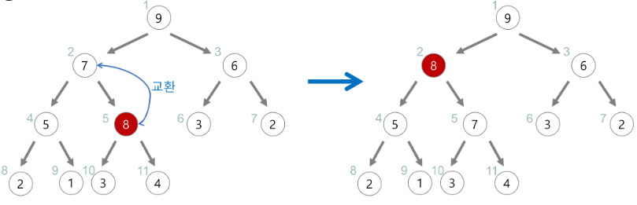
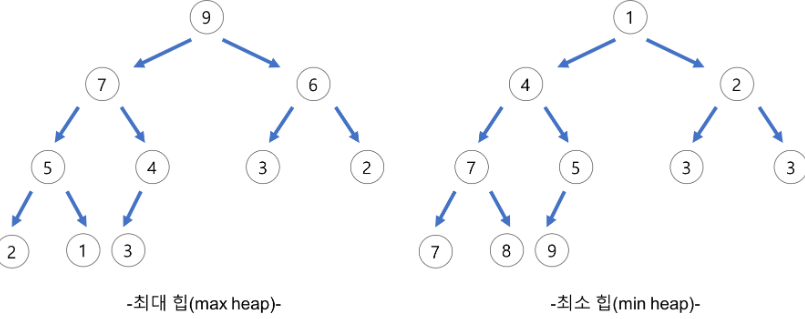
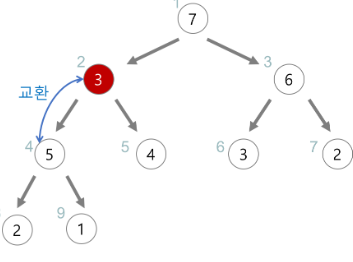

# 1주 자료구조

## 해시 테이블 (Hash Table)

해시 테이블은 Key-Value 형식으로 데이터를 저장하는 자료구조로, 데이터 검색이 빠르게 이루어지는 중요한 자료구조입니다. 각 Key 값은 해시 함수를 사용하여 고유한 인덱스로 매핑되어 빠른 검색이 가능하며, 이로 인해 시간 복잡도는 O(1)입니다. 그러나 해시 충돌이 발생할 경우 Chaining 또는 개방 주소법과 같은 방법으로 충돌을 해결해야 하며, 이로 인해 시간 복잡도는 O(n)으로 증가할 수 있습니다.

### 해시 함수 (Hash Function)

해시 함수는 데이터를 특정 인덱스로 매핑하는 데 사용되는 함수입니다. 간단한 예로, 어떤 정수를 10으로 나눈 나머지를 반환하는 해시 함수를 고려할 수 있습니다. 이러한 함수를 통해 다양한 데이터가 고유한 인덱스로 변환됩니다. 암호화에서도 중요하게 사용되며, SHA (Secure Hash Algorithm) 알고리즘이 대표적인 예입니다.

해시 충돌 (Hash Collision)

해시 충돌은 해시 함수가 서로 다른 데이터에 대해 동일한 해시 값을 반환할 때 발생합니다. 이러한 충돌 문제를 해결하기 위해 여러 방법이 존재합니다.

1. 분리 연결법 (Separate Chaining):
   

   - 각 해시 버킷당 들어갈 수 있는 값의 수에 제한을 두지 않는 방식.
   - 링크드 리스트나 트리와 같은 구조를 사용하여 충돌된 데이터를 연결합니다.

2. 개방 주소법 (Open Addressing):
   
   - 해시 함수로 얻은 인덱스에 데이터를 저장하는 대신, 다른 주소에 데이터를 저장할 수 있도록 합니다.
   - 선형 탐사나 제곱 탐사와 같은 방식을 사용하여 충돌을 해결합니다.
     
     

## 이진 탐색 트리 (Binary Search Tree, BST)

이진 탐색 트리는 각 노드가 왼쪽 서브 트리에는 현재 노드보다 작은 값, 오른쪽 서브 트리에는 현재 노드보다 큰 값을 가지는 자료구조입니다. 이를 통해 데이터의 검색, 삽입 및 삭제를 평균적으로 O(log N)의 시간 복잡도로 수행할 수 있지만, 편향된 트리의 경우 O(N)의 성능을 갖습니다.

### BST의 특징

1. 각 노드는 최대 2개의 자식 노드를 가집니다.
   
2. 왼쪽 서브 트리의 값은 현재 노드보다 작고, 오른쪽 서브 트리의 값은 현재 노드보다 큽니다.
   
3. 중복된 값은 허용되지 않습니다.
   
4. 중위 순회 (inorder) 방식으로 트리를 순회하면 정렬된 순서로 데이터를 얻을 수 있습니다.

## 힙 (Heap)

힙은 완전 이진 트리의 일종으로, 우선순위 큐를 구현하는 데 사용되는 자료구조입니다. 최대 힙은 각 노드의 값이 자식 노드보다 크거나 같으며, 최소 힙은 그 반대입니다. 힙은 가장 큰 값 또는 가장 작은 값을 빠르게 찾을 수 있도록 설계되었습니다.

### 힙의 삽입

(최대 힙의 경우)

1. 가장 마지막 위치에 값을 추가합니다.
2. 부모 노드와 값을 비교하고, 자식 노드가 더 큰 경우 교체합니다.
   
3. 자식 노드보다 큰 경우 교체를 멈춥니다.

### 힙의 삭제

(최대 힙의 경우)

1. 루트 노드를 제거하고 가장 마지막 노드를 루트로 옮깁니다.
2. 루트와 자식 노드 값을 비교하고, 자식 노드 중 더 큰 값과 교체합니다.
3. 자식 노드보다 큰 경우 교체를 멈춥니다.

## BST vs Heap

- 공통점:
  - 둘 다 완전 이진 트리 구조를 가집니다.
- 차이점:
  - 힙은 최대 힙 또는 최소 힙으로 사용되며, 각 노드의 값이 자식보다 크거나 작습니다. BST는 노드의 왼쪽은 더 작고 오른쪽은 더 큰 값으로 구성됩니다.
  - 힙은 우선순위 큐를 위한 구조로 사용되며, BST는 데이터를 탐색하기 위한 구조입니다.

## 힙 정렬

- 힙 정렬은 주어진 배열을 최대 힙 또는 최소 힙으로 구성한 후, 루트 노드를 반복적으로 제거하여 정렬하는 알고리즘입니다.
- 최소 힙의 경우는 오름차순으로 정렬하고, 최대 힙의 경우는 내림차순으로 정렬합니다.
- 힙 정렬의 시간 복잡도는 O(N log N)

입니다.

## 선택 정렬

- 선택 정렬은 정렬되지 않은 배열에서 최소 값을 선택하여 배열의 앞부분부터 차곡차곡 쌓아가는 알고리즘입니다.
- 시간 복잡도는 항상 O(N^2)이며, 평균, 최악, 최선의 경우에도 동일합니다.
- 공간 복잡도는 주어진 배열 내에서 교환 작업을 수행하므로 O(1)입니다.

## 면접 질문

### 힙 & 힙 정렬

- 힙 정렬의 과정을 설명해 주세요.
- 힙 정렬의 시간 복잡도는 어떻게 되고 그러한 시간 복잡도가 나오는 이유를 설명해 주세요.

### 선택 정렬

- 선택 정렬의 시간 복잡도는 어떻게 되고 그러한 시간 복잡도가 나오는 이유를 설명해 주세요.

### BST

- BST와 Heap의 공통점과 차이점을 설명해 주세요.

### 해시 테이블

- 해시 충돌이 발생했을 때 어떻게 해결할 수 있는지 설명해 주세요.
