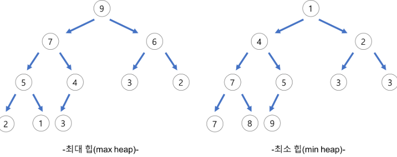
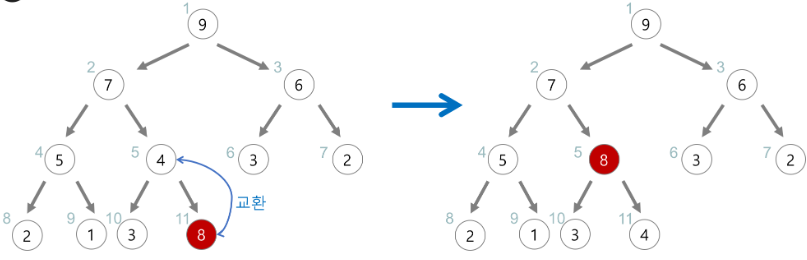
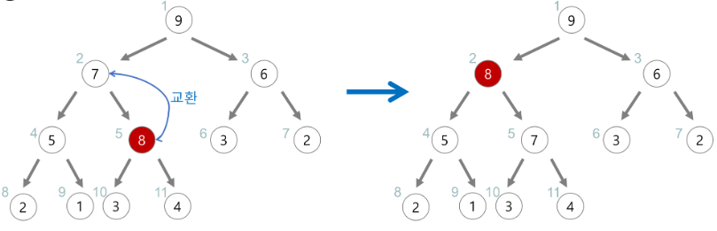

## 힙 (Heap)

힙은 완전 이진 트리의 일종으로, 우선순위 큐를 구현하는 데 사용되는 자료구조입니다. 최대 힙은 각 노드의 값이 자식 노드보다 크거나 같으며, 최소 힙은 그 반대입니다. 힙은 가장 큰 값 또는 가장 작은 값을 빠르게 찾을 수 있도록 설계되었습니다.

### 힙의 삽입

(최대 힙의 경우)

1. 가장 마지막 위치에 값을 추가합니다.
2. 부모 노드와 값을 비교하고, 자식 노드가 더 큰 경우 교체합니다. 
    
3. 자식 노드보다 큰 경우 교체를 멈춥니다.

### 힙의 삭제

(최대 힙의 경우)

1. 루트 노드를 제거하고 가장 마지막 노드를 루트로 옮깁니다. 
    
2. 루트와 자식 노드 값을 비교하고, 자식 노드 중 더 큰 값과 교체합니다. 
    
3. 자식 노드보다 큰 경우 교체를 멈춥니다.
    
   
    

**예상 질문**

- 힙의 삽입 과정을 간단하게 설명해주세요.
- 힙의 삭제 과정을 간단하게 설명해주세요.
- 힙을 어떤 경우에 사용하는지 말해주세요.
