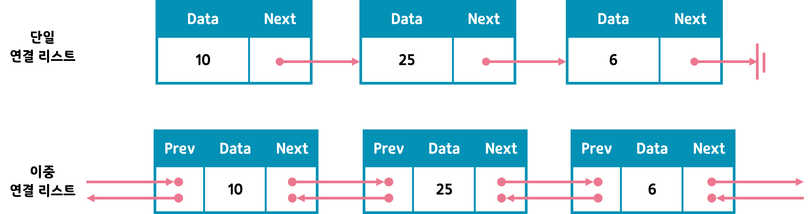

## LinkedList 
- 연속적인 메모리 위치에 저장되지 않는 선형 데이터 구조
- `포인터`로 각 노드를 연결하며, 각 노드는 데이터 필드와 다음 노드에 대한 참조값을 가지고 있다. 

**싱글 연결 리스트**
- next 포인터만 가지는 리스트

**이중 연결 리스트**
- next 포인터와 prev 포인터를 가지는 리스트

**원형 이중 연결 리스트**
- 구조는 이중 연결 리스트와 동일하지만, 마지막 노드의 next노드가 헤드 노드를 가리키고 있어 원형으로 연결된 리스트

## 저장 방식
- Array의 element(요소)들은 인접한 memory의 위치에 저장된다.
- LinkedList의 element들은 memory 어딘가에 파편적으로 저장될 수 있다. 

### 시간 복잡도

- **삽입, 삭제**
    - 연결 리스트
        - 가장 앞 또는 끝에서 데이터를 삽입, 삭제할 경우 : O(1)
        - 앞,끝이 아닌 중간에서 데이터를 삽입, 삭제할 경우 : O(n)
    - 배열 
        - O(n)

- **접근**
    - 연결 리스트
        - O(n)
    - 배열
        - O(1)

---

## 왜 LinkedList를 사용하는가?
- 배열(Array)은 같은 유형의 선형 데이터를 순차적으로 저장하는데 사용할 수 있지만 단점이 몇가지 존재한다. 
- 배열(Array)의 단점
    - 배열의 크기가 고정되어 있어 미리 요소의 수에 대해 할당받아야 한다. 
    - 새로운 요소를 삽입하는 것은 비용이 많이 든다. (삽입, 삭제 시 한 칸 씩 밀거나 당겨야 한다.)

- LinkedList의 장점
    - 동적으로 리스트의 크기를 변경할 수 있다.
    - 리스트에 요소를 삽입하거나 삭제하기 용이하다.
- LinkedList의 단점
    - 순차적 접근을 통해 데이터를 탐색한다. 
    - 포인터를 저장한 여분의 메모리 공간이 필요하다.

- **그렇다면 언제 배열을 사용하고 언제 연결 리스트를 사용해야하는가?**
    - 데이터 추가 및 삭제는 연결 리스트가 더 빠르고 배열은 느리다.
        - 왜?🧐 
            - 배열은 추가 및 삭제시 모든  배열을 앞으로 옮기거나 뒤로 당겨야 추가가 가능하지만, 연결 리스트는 잠깐 포인터를 바꿔서 연결해주기만 하면 된다
    - 탐색은 배열이 더 빠르고 연결리스트가 더 느리다.
        - 왜?🧐 
            - 랜덤 접근이 불가능한, 즉 순차적 접근으로 데이터를 탐색하는 연결 리스트의 특성 상 연결리스트는 포인터를 기반으로 순차적으로 연결된 노드를 다 탐색해야 하기 때문!
    - 결론
        > 데이터 접근이 주 업무이며 데이터의 크기가 정해진 경우 -> Array
        > 데이터 수정이 주 업무이며 데이터의 크기가 정해지지 않은 경우 -> LinkedList

---

### 자바의 ArrryList

 - 자바의 ArrayList는 `Object[] 배열`을 사용하면서 내부 구현을 통해 동적으로 관리한다.
 - primitve 배열(ex int[] 배열)과 유사한 형태
 - 즉, 최상위 타입인 Object 타입으로 배열을 생성하여 사용하기 때문에  접근에서는 탁월한 성능을 보이지만, 중간 요소가 삽입, 삭제 되는 경우 그 뒤의 요소들은 한 칸씩 밀거나 당겨야 하기 때문에 삽입, 삭제에서는 비효율적이다. 

---

### 출처
- https://velog.io/@717lumos/%EC%9E%90%EB%A3%8C%EA%B5%AC%EC%A1%B0-%EC%97%B0%EA%B2%B0%EB%A6%AC%EC%8A%A4%ED%8A%B8Linked-List-%EB%8B%A8%EC%9D%BC%EC%97%B0%EA%B2%B0%EB%A6%AC%EC%8A%A4%ED%8A%B8-%EC%9D%B4%EC%A4%91%EC%97%B0%EA%B2%B0%EB%A6%AC%EC%8A%A4%ED%8A%B8
- https://gyoogle.dev/blog/computer-science/data-structure/Linked%20List.html

--- 
### 예상 문제
- ArrayList와 LinkedList는 어떤 차이가 있는지 시간복잡도를 포함해서 이야기 해주세요.
- Array와 LinkedList의 차이점을 시간복잡도를 포함해서 이야기 해주세요
- ArrayList와 LinkedList 두 자료구조를 어떨 때 사용하면 좋은지 예를 들어 설명해주세요