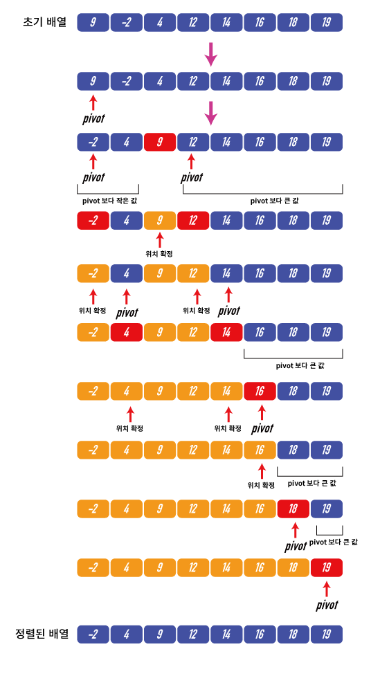

# 퀵 정렬(Quick Sort)

- 분할 정복 알고리즘으로, 문제를 작은 2개의 문제로 분리하고 각각을 해결한 다음, 결과를 모아서 원래의 문제를 해결하는 전략
- 분할, 정복, 결합의 단계들로 이루어짐

## 과정

1. 배열안의 한 요소를 피벗으로 설정한다.

2. 피벗을 기준으로 피벗보다 작은요소는 피벗의 왼쪽으로 피벗보다 큰 요소는 피벗의 오른쪽으로 옮긴다.

3. 피벗을 제외한 왼쪽 배열과 오른쪽 배열을 다시 정렬한다.

4. 분할된 부분 배열에서 다시 피벗을 정한 후 피벗을 기준으로 2개의 부분배열로 나누는 과정을 반복한다.

5. 이런 과정을 부분 배열들이 더 이상 분할할 수 없을 때 까지 반복하고 다시 원래의 정렬에 합병하면 분할이 완료된다.
   

## 장점

- 다른 정렬 알고리즘에 비해 가장 속도가 빠르며 추가적인 메모리공간을 요구하지 않음 O(nlogn)

## 단점

- 정렬된 배열에 대해서는 오히려 수행시간이 더 걸릴 수 있음  
  예를 들어 피봇을 가장 앞에 위치하는 원소로 잡는다면 분할 과정에서 피봇값보다 작은 값은 없기에 비대칭 적인 파티션으로 나뉘게 됨. 이런 방식으로 피봇을 계속 설정하면 분할이 일어날 때마다 비대칭적인 파티션으로 나뉘기 때문에 시간복잡도가 O(n^2)이 됨. 이는 일반적인 수행속도보다 훨씬 느린 속도.  
  => 분할이 비대칭적일수록 속도는 느려진다!

## 예상 질문

- 퀵정렬에 대해 설명해주세요.
- 퀵소트의 장점과 단점이 뭐라고 생각하나요?
- 왜 정렬된 배열에 대해서 수행시간이 더 길어지나요?

## 참고 링크

https://sanghun219.tistory.com/105  
https://wooder2050.medium.com/%EC%A0%95%EB%A0%AC-%EC%95%8C%EA%B3%A0%EB%A6%AC%EC%A6%98-%EC%A0%95%EB%A6%AC-54349222f432
