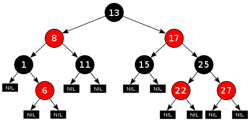

# 레드블랙 트리(Red-black Tree)

- BST 를 기반으로하는 트리 형식의 자료구조
- 이진 탐색 트리는 최악의 경우 한쪽으로 편향된 트리일 때 O(N) 시간이 걸림. 하지만 레드블랙트리는 Search, Insert, Delete 에 **O(log n)의 시간 복잡도**가 소요
- 동일한 노드의 개수일 때, **depth를 최소화**하여 시간 복잡도를 줄인다!

## 정의

1. 노드의 색상은 레드 혹은 블랙이다.
2. 루트 노드는 블랙이다.
3. 모든 리프 노드들은 블랙이다.  
   \*여기서의 리프 노드는 NIL 을 의미한다.
4. 레드 노드의 자식 노드 양쪽은 언제나 블랙이다.  
   \*즉 레드 노드는 연속으로 나올 수 없다. 레드 노드의 부모는 무조건 블랙이다.
5. 모든 리프 노드에서 Balck Depth 는 같다.  
   \*루트 노드에서 리프 노드까지 가는 경로에서 만나는 블랙 노드의 개수는 같다.

## 특징

- 루트 노드부터 가장 먼 경로까지의 거리는, 가장 가까운 경로까지의 거리의 두 배 보다 항상 작다. 이러한 상태를 균형이 잡혀있다고 한다(balanced).
- 삽입, 삭제, 검색시 최악의 경우(worst-case)에서의 시간복잡도가 트리의 높이(또는 깊이)에 따라 결정되기 때문에 보통의 이진 탐색 트리에 비해 효율적
- 삽입과 삭제 시에 주로 4, 5번 정의를 위반하며 이들을 해결하기 위해 구조를 바꿈

## 삽입(insert)

1. 삽입 전 RB 트리 속성 만족한 상태
2. 삽입 방식은 일반적인 BST와 동일
3. 삽입 후 RB 트리 위반 여부 확인
4. RB 트리 속성을 위반했다면 재조정
5. RB 트리 속성을 다시 만족

## 삭제(remove)

1. 삭제 전 RB 트리 속성 만족한 상태
2. 삭제 방식은 일반적인 BST와 동일
3. 삭제 후 RB 트리 속성 위반 여부 확인
4. RB 트리 속성을 위반했다면 재조정
5. RB 트리 속성을 다시 만족

## AVL 트리와 비교

- 삽입/삭제가 거의 없고 검색이 대부분인 상황에서는 AVL트리를 사용하고 삽입/삭제가 많을 때는 red-black tree를 사용하면 좋다.

## 예상 질문

- RBT(Red-Black Tree)에 대해 설명해주세요.
- RB Tree의 삽입, 삭제 알고리즘은 어떻게 구현하나요?
- 다른 이진 탐색 트리 알고리즘들과 비교했을 때, 어떤 장점이 있나요?

## 참고 링크

https://bamtori.tistory.com/90#Red%20Black%20Tree-1  
https://velog.io/@tlatjdgh3778/CS-%EC%A0%95%EB%A6%AC-%EC%9E%90%EB%A3%8C%EA%B5%AC%EC%A1%B03-%EB%A0%88%EB%93%9C-%EB%B8%94%EB%9E%99-%ED%8A%B8%EB%A6%ACRed-Black-Tree  
https://bo5mi.tistory.com/212  
https://hello-judy-world.tistory.com/199
