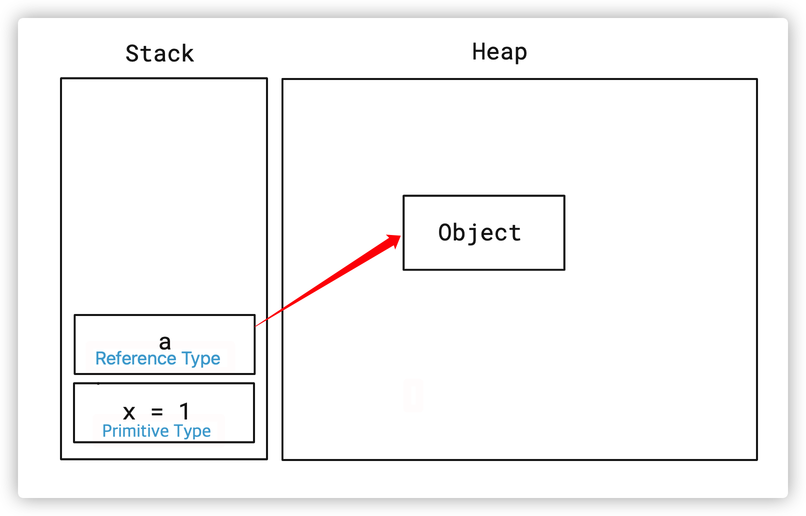
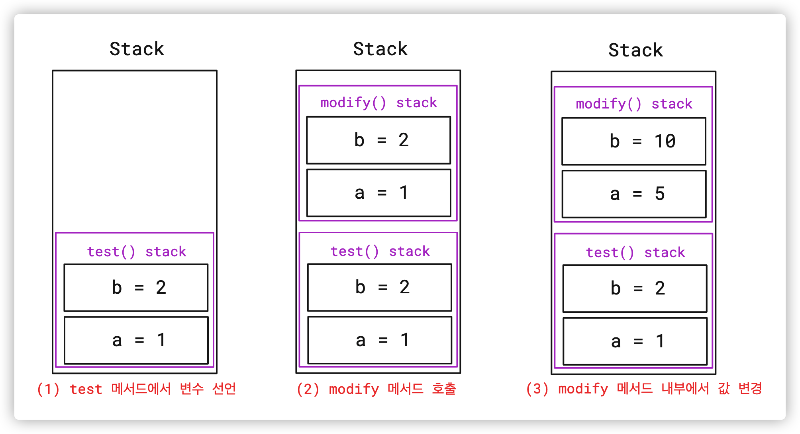
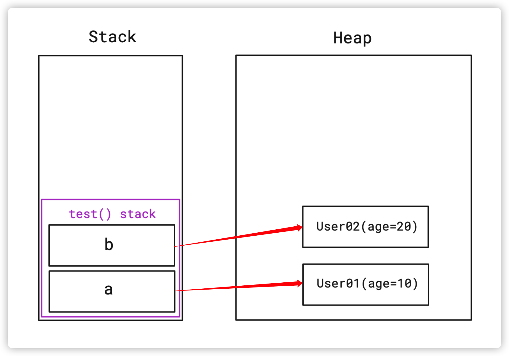
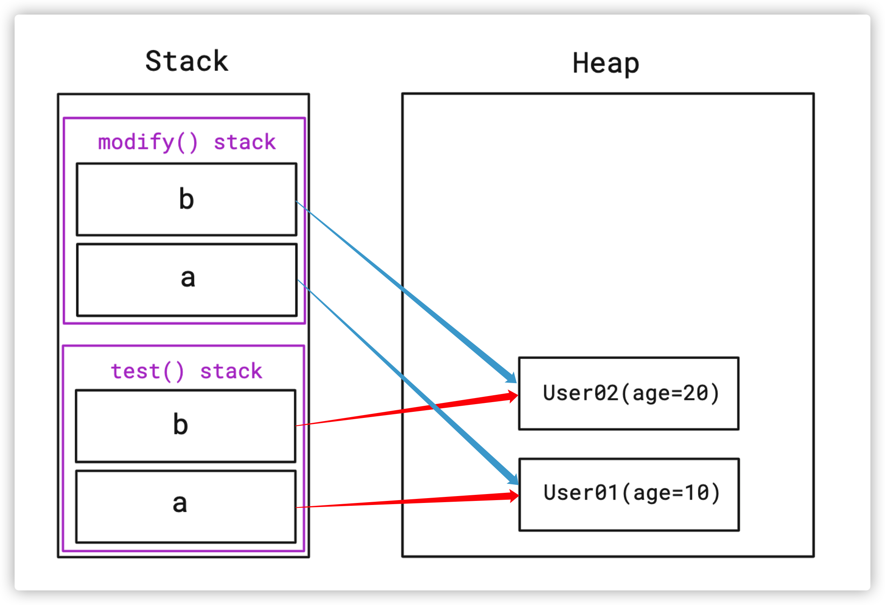
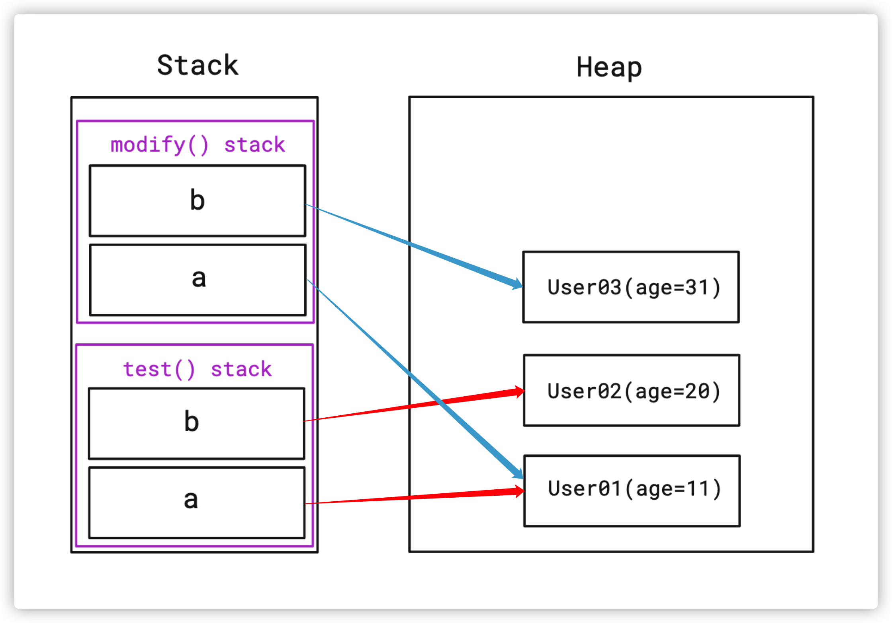
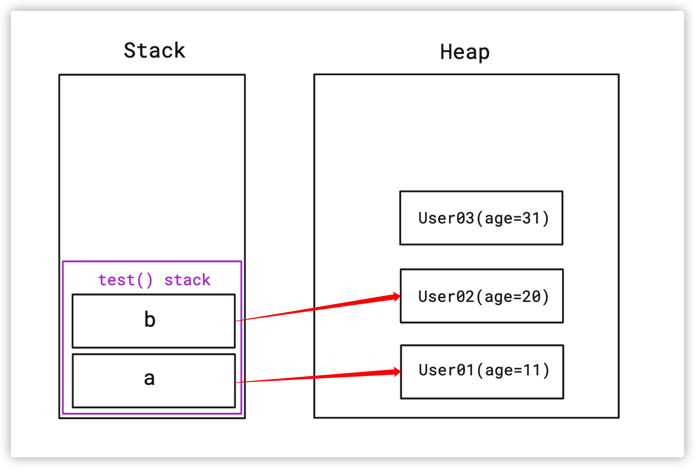

# Call By Value vs Call By Reference

## Call By Value

- 인자로 받은 값을 복사하여 처리한다.
- 원래 값이 수정되지 않는다.
- 변수의 복사본이 전달된다.
- 실제 인수가 다른 메모리 위치에 생성된다.

## Call By Reference

- 인자로 받은 값의 주소를 참조하여 직접 값에 영향을 준다.
- 원래의 값이 수정된다.
- 변수 자체가 전달된다.
- 실제 인수가 같은 메모리 위치에 생성된다.

## 자바의 데이터 형

- 기본형(Primitive type) - BooleanType(boolean), Numeric Type(short, int long, float, double, char)
- 참조형(reference type) - Class Type, Interface Type, Array Type, Enum Type

## JVM 메모리에 변수가 저장되는 위치

- Java에서 변수가 선언되면 Stack 영역에 할당된다.
- 기본형(primitive)은 Stack 영역에 변수와 함께 저장되며 참조형(Reference)은 Heap 영역에 저장되고 Stack 영역에 있는 변수가 객체의 주소값을 가지고 있다.



### 원시타입(Primitive)의 전달

```jsx
public class PrimitiveTypeTest {

    @Test
    @DisplayName("Primitive Type 은 Stack 메모리에 저장되어서 변경해도 원본 변수에 영향이 없다")
    void test() {
        int a = 1;
        int b = 2;

        // Before
        assertEquals(a, 1);
        assertEquals(b, 2);

        modify(a, b);

        // After: modify(a, b) 호출 후에도 값이 변하지 않음
        assertEquals(a, 1);
        assertEquals(b, 2);
    }

    private void modify(int a, int b) {
        // 여기 있는 파라미터 a, b 는 이름만 같을 뿐 test() 에 있는 a, b 와 다른 변수
        a = 5;
        b = 10;
    }
}
```



- test()의 변수 a,b와 modify9(a,b)로 전달받은 파라미터 a,b의 이름은 같지만 다른 변수이다.
    - 즉, modify(a,b)를 호출하는 순간 stack 영역에 새로운 변수 a,b가 새로 생성되어 총 4개의 변수가 존재한다.

### 참조타입(Reference Type)의 전달

- 변수 자체는 Stack 영역에 생성되지만 실제 객체는 heap영역에 위치

```jsx
class User {
    public int age;

    public User(int age) {
        this.age = age;
    }
}

public class ReferenceTypeTest {

    @Test
    void test() {
        User a = new User(10);
        User b = new User(20);

        // Before
        assertEquals(a.age, 10);
        assertEquals(b.age, 20);

        modify(a, b);

        // After
        assertEquals(a.age, 11);
        assertEquals(b.age, 20);
    }

    private void modify(User a, User b) {
        // a, b 와 이름이 같고 같은 객체를 바라본다.
        // 하지만 test 에 있는 변수와 확실히 다른 변수다.

        // modify 의 a 와 test 의 a 는 같은 객체를 바라본다 = 주소값이 같다.
        a.age++;

        // b 에 새로운 객체를 할당하면 가리키는 객체가 달라진다. = 주소값도 달라진다.
        b = new User(30);
        b.age++;
    }
}
```

처음 변수 선언 시 메모리 상태
- 변수만 Stack영역에 생성되고 실제 객체는 Heap 영역에 생성된다.
---


modify(a,b)의 호출 시점의 메모리 상태 
- 넘겨받은 파라미터는 Stack에 생성되고 넘겨받은 주소값을 똑같이 바라본다. 

---

modify(a,b) 수행 직후 메모리 상태
- test()와 modify()의 a변수는 같은 객체를 바라보고 있기때문에 객체를 공유한다.
- b라는 변수는 같은 객체를 바라보고 있었지만, 새로운 객체를 생성해서 할당했기 때문에 User03이라는 새로운 객체를 바라보게 된다. 

---

test()끝난 후 최종 메모리 상태
- modify(a,b) 메소드를 빠져나오면 Stack 영역에 할당된 변수들은 사라진다.
- 최종적으로 User03은 어떤 곳에서도 참조되고 있지 않기 떄문에 나중에 GC에 의해 제거된다.'

<br>

### 자바에는 Call by Reference 개념이 없다?

<aside>
🗣 Java 프로그래밍에서는 Call By Reference라는 것은 존재하지 않는다.

- 오직 Call by Value로서 동작한다
</aside>

- 자바에서의 파라미터는 Call By Value로서만 동작되며, 원시값이 복사되느냐 주소값이 복사되느냐의 차이가 있을 뿐!
    - Java는 C와 달리 포인터를 철저히 숨겨 개발자가 직접 메모리 주소에 접근하지 못하게 했기 때문에 Call By Reference라는 개념이 존재하지 않는다.
- 다만, 외부적인 관점에서는 주소값이 복사되든, 포인터를 이용해 참조하든, 메모리 안에 있는 데이터를 참조해 연산하는 동작 자체는 같기 때문에 비슷하다고 볼 수 있다.

### C언어의 포인터 변수와 자바의 참조 변수

- C언어의 포인터를 이용해 주소값을 직접 가져와 전달할 수 있다.
- 즉, 주소값을 몰래 변조하여 다른 소스 파일에서 이용되는 주소값을 가져올 수 있다는 말이고, 이를 악용하면 핵과 같은 불법 변질 프로그램이 될 수 있다.
- Java에서는 이러한 부분을 철저하게 봉쇄하여, 자바도 포인터로 메모리가 참조되지만 자바는 포인터를 철저하게 숨겨 개발자가 포인터를 이용하지 못하도록 막아버렸다.
- 따라서 Java는 주소값을 복사를 통해 이용이 가능할 뿐, 직접 액세스해서 악용할 수는 없다.

### 다른 언어와의 차이점 정리

- Java
    - 오직 Call By Value
- Python
    - Passed By Assignment
- C
    - Call By Value(포인터는 Call By Address의 개념으로, Call By Value이다.)
- C++
    - Call By Value와 Call By Address(포인터*), Call By Reference(참조연산자&)가 다 있음

## 참고 자료

[[개발공통] Call by value와 Call by reference (Java, Python, C/C++)](https://hoons-dev.tistory.com/76)

[](https://github.com/devFancy/2023-CS-Study/blob/main/java/java_call_by_value.md)

[☕ 자바는 Call by reference 개념이 없다 ❓](https://inpa.tistory.com/entry/JAVA-☕-자바는-Call-by-reference-개념이-없다-❓)

## 질문 정리

> Call By Value와 Call By Reference의 차이점에 대해 설명해주세요.
> 

> Java에는 포인터 개념이 없는 이유가 무엇인가요?
> 

> C언어의 포인터 변수와 Java의 참조 변수의 차이에 대해 설명해주세요.
>