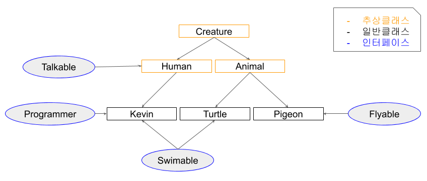

### Default Method

Java 8에서는 기존의 인터페이스를 확장하고자 할 때 발생하는 문제에 대한 해결책으로서 default method가 등장했다.

**문제점**

1. **기존 인터페이스 확장 시의 문제점**

   이미 수많은 클래스들이 해당 인터페이스를 구현하고 있는 상황에서, 새로운 메서드를 추가하면 모든 클래스에서 해당 메서드를 구현해야 했다. 모든 클래스를 수정하지 않으면 컴파일 오류가 발생하는 문제가 있었습니다.

2. **기존 코드 수정 최소화**

   기존의 코드를 최대한 수정하지 않으면서도 새로운 기능이나 메서드를 추가할 수 있다.

이런 문제점을 해결하기 위한 default method는 기존 인터페이스에 새로운 기능을 추가하거나 변경하는 데 효과적으로 활용될 수 있게 되었다.

Java 8의 List 인터페이스의 sort 메서드가 default method로 제공되는 것은 이러한 개념을 실제로 구현한 한 예이다.

```java
public interface List<E> extends Collection<E> {
    // ... 다른 메서드들
    default void sort(Comparator<? super E> c) {
        Object[] a = this.toArray();
        Arrays.sort(a, (Comparator) c);
        ListIterator<E> i = this.listIterator();
        for (Object e : a) {
            i.next();
            i.set((E) e);
        }
    }
    // ... 다른 메서드들
}
```

이렇게 함으로써 기존의 List 구현체들은 해당 메서드를 명시적으로 구현하지 않아도 되며, 여전히 호환성을 유지할 수 있다.

### 인터페이스 vs 추상클래스

**추상 클래스와 인터페이스의 기본 목적**

- **추상 클래스**
  - 미완성 설계도로서, 공통된 속성과 메서드를 가진 클래스들의 추상화를 제공한다.
  - 자손 클래스에서 추상 메서드를 구현하도록 유도한다.
  - 단일 상속만 허용되므로 클래스 간의 계층 구조를 형성할 수 있다.
- **인터페이스**
  - 기본 설계로서, 클래스에 대한 명세를 제공한다.
  - 다중 상속이 가능하므로 여러 개의 인터페이스를 구현할 수 있다.
  - 클래스가 특정 동작을 보장하게끔 한다.

**추상 클래스와 인터페이스의 차이점:**

- **사용의도 차이**
  - 추상 클래스: IS-A 관계, 즉 "클래스 A는 B이다"와 같이 상속을 통한 구조화에 중점을 둔다.
  - 인터페이스: HAS-A 관계, 즉 "클래스 A는 B를 할 수 있다"와 같이 기능을 제공하는 명세에 중점을 둔다.

**공통된 기능 사용 여부:**

- **추상 클래스 활용**
  - 공통된 기능을 제공하고자 할 때, 일반 메서드를 구현하여 자식 클래스에서 공유하도록 한다.
  - 단일 상속을 허용하므로 클래스 간의 공통된 기능을 구현할 때 용이하다.
- **인터페이스 활용**
  - 다중 상속이 가능하므로 여러 인터페이스에서 필요한 기능을 구현할 수 있다.
  - 클래스 간의 공통된 기능이 아닌, 명세에 따라 동작을 보장할 때 사용한다.



### Creature 추상 클래스

```java
public abstract class Creature {
    private int x;
    private int y;
    private int age;

    public Creature(int x, int y, int age) {
        this.age = age;
        this.x = x;
        this.y = y;
    }

    public void age() {
        age++;
    }

    public void move(int xDistance) {
        x += xDistance;
    }

    public int getX() {
        return x;
    }

    public void setX(int x) {
        this.x = x;
    }

    public int getY() {
        return y;
    }

    public void setY(int y) {
        this.y = y;
    }

    public abstract void attack();

    public abstract void printInfo();

    @Override
    public String toString() {
        return "x : " + x + ", y : " + y + ", age : " + age;
    }
}

```

- **`Creature`**: 추상 클래스로서 생명체의 공통 속성과 메서드를 정의.

### Animal 추상 클래스

```java
public abstract class Animal extends Creature {

    public Animal(int x, int y, int age) {
        super(x, y, age);
    }

    @Override
    public void attack() {
        System.out.println("몸을 사용하여 공격!!");
    }
}

```

- **`Animal`**: Creature를 상속받는 추상 클래스로 동물의 특성을 정의.

### Human 추상 클래스

```java
public abstract class Human extends Creature implements Talkable {

    public Human(int x, int y, int age) {
        super(x, y, age);
    }

    @Override
    public void attack() {
        System.out.println("도구를 사용!!");
    }

    @Override
    public void talk() {
        System.out.println("사람은 말을 할 수 있다.");
    }
}

```

- **`Human`**: Creature를 상속받고 Talkable 인터페이스를 구현한 추상 클래스로 사람의 특성을 정의.

### Talkable 인터페이스:

```java
public interface Talkable {
    void talk();
}

```

- **`Talkable`**: 말하는 기능을 제공하는 인터페이스.

### Flyable 인터페이스:

```java
public interface Flyable {
    void fly(int yDistance);
    void flyMove(int xDistance, int yDistance);
}

```

- **`Flyable`**: 날 수 있는 기능을 제공하는 인터페이스.

### Swimable 인터페이스:

```java
public interface Swimable {
    void swimDown(int yDistance);
}

```

- **`Swimable`**: 수영 기능을 제공하는 인터페이스.

### Pigeon 클래스:

```java
public class Pigeon extends Animal implements Flyable {

    public Pigeon(int x, int y, int age) {
        super(x, y, age);
    }

    @Override
    public void fly(int yDistance) {
        setY(getY() + yDistance);
    }

    @Override
    public void flyMove(int xDistance, int yDistance) {
        setY(getY() + yDistance);
        setX(getX() + xDistance);
    }

    @Override
    public void printInfo() {
        System.out.println("Pigeon -> " + toString());
    }
}

```

- **`Pigeon`**: Animal을 상속받고 Flyable 인터페이스를 구현한 클래스로 비둘기의 특성을 정의.

### Turtle 클래스:

```java
public class Turtle extends Animal implements Swimable {

    public Turtle(int x, int y, int age) {
        super(x, y, age);
    }

    @Override
    public void swimDown(int yDistance) {
        setY(getY() - yDistance);
    }

    @Override
    public void printInfo() {
        System.out.println("Turtle -> " + toString());
    }
}

```

- **`Turtle`**: Animal을 상속받고 Swimable 인터페이스를 구현한 클래스로 거북이의 특성을 정의.

### Kevin 클래스:

```java
public class Kevin extends Human implements Programmer, Swimable {

    public Kevin(int x, int y, int age) {
        super(x, y, age);
    }

    @Override
    public void coding() {
        System.out.println("Hello World!");
    }

    @Override
    public void swimDown(int yDistance) {
        setY(getY() - yDistance);
        if (getY() < -10) {
            System.out.println("너무 깊이 들어가면 죽을 수도 있어!!");
        }
    }

    @Override
    public void printInfo() {
        System.out.println("Kevin -> " + toString());
    }
}

```

- **`Kevin`**: Human을 상속받고 Programmer와 Swimable 인터페이스를 구현한 클래스로 Kevin의 특성을 정의.

### Programmer 인터페이스:

```java
public interface Programmer {
    void coding();
}
```

- **`Programmer`**: 코딩 기능을 제공하는 인터페이스.

### 예상 질문

1. default method를 사용하면서 어떤 문제점을 해결할 수 있나요
2. 추상 클래스와 인터페이스의 차이점을 말해주세요.
3. 추상 클래스와 인터페이스의 사용 용도에 맞게 예시를 들면서 설명해주세요.

### 참고 자료

[[JAVA] 추상클래스 VS 인터페이스 왜 사용할까? 차이점, 예제로 확인 :: 마이자몽](https://myjamong.tistory.com/150)
