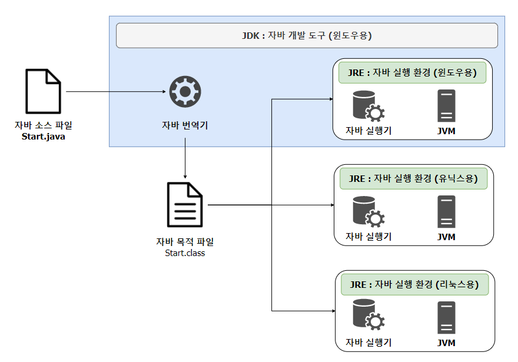
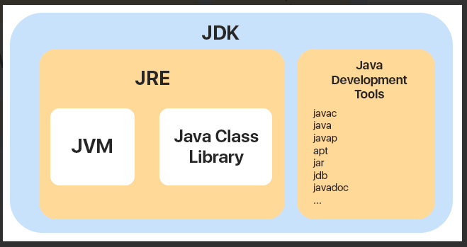

# JDK&JRE&JVM

## 개념정리

> 자바 개발도구인 JDK를 이용해 개발된 프로그램은 JRE에 의해 가상 컴퓨터인 JVM 상에서 구동된다.
> 다만, 배포되는 JDK, JRE, JVM은 편의를 위해 JDK가 JRE를 포함되고 다시 JRE는 JVM을 포함하는 형태로 배포된다.

### 

### JDK (Java Development Kit)

- 개발자들이 자바로 개발하는데 사용되는 SDK이다.
  - SDK란?
    - Software Development Kit로, 하드웨어 플랫폼, 운영체제 또는 프로그래밍 언어 제작사가 제공하는 툴이다.
- 아래 그림에서 볼수 있듯이 JDK는 JVM, JRE를 모두 포함하고, 이외에 자바를 개발 하는데 필요한 development tools 도 포함하고 있는 걸 알 수 있다. 
  

### JRE (Java Runtime Environment)

- 자바를 실행하기 위한 환경을 조성하는 소프트웨어
- 자바 프로그램을 실행시킬때 필요한 라이브러리 API를 함께 묶어서 배포되는 패키지이다. 이외에도 자바 런타임 환경에서 사용하는 프로퍼티 세팅이나 리소스 파일(jar 파일)을 가지고 있다.
- JRE는 JDK에 포함되어 있어 JDK를 설치하면 함께 설치된다.
- 간단히 정리하자면, Java로 프로그램을 직접 개발하려면 JDK가 필요하고, 컴파일 된 Java 프로그램을 실행시키려면 JRE가 필요하다고 보면 된다.

### JVM (Java Virtual Machine)

- 자바를 돌리는 프로그램
- 자바로 작성된 모든 프로그램은 JVM에서만 실행가능하므로, 자바 프로그램을 실행하기위해선 자바 가상 머신이 설치되어야 한다.
- JVM은 자바 실행 환경 JRE(Java Runtime Environment)에 포함되어 있다. 그래서 현재 사용하는 컴퓨터의 운영체제에 맞는 자바 실행환경 (JRE)가 설치되어 있다면 자바 가상 머신이 설치되어 있다는 뜻이기도 하다.
- 역할
  1. 자바 코드로부터 컴파일되어 생성된 자바 바이트 코드를 실행
     - JVM 덕분에 어떤 운영체제를 사용하든지 자바 코드 실행 가능
  2. Garbage Collection을 통한 메모리 관리 수행

## 예상질문

- JDK, JRE, JVM은 무엇인가요?

### 참고자료

https://inpa.tistory.com/entry/JAVA-%E2%98%95-JDK-JRE-JVM-%EA%B0%9C%EB%85%90-%EA%B5%AC%EC%84%B1-%EC%9B%90%EB%A6%AC-%F0%9F%92%AF-%EC%99%84%EB%B2%BD-%EC%B4%9D%EC%A0%95%EB%A6%AC 
https://yeoonjae.tistory.com/entry/Java-JDK-JRE-JVM-%EC%97%90-%EB%8C%80%ED%95%B4-%EA%B0%84%EB%8B%A8%ED%9E%88-%EC%82%B4%ED%8E%B4%EB%B3%B4%EA%B8%B0 
