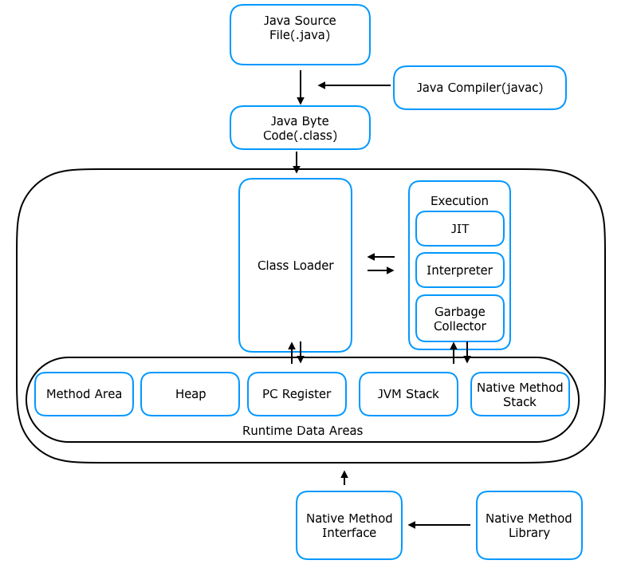

### 컴파일 과정

    
    

1. **소스 코드 작성:**
   - 개발자가 자바 소스 코드(.java)를 작성한다. 이 코드는 텍스트 형식으로 작성되며, 자바 언어의 문법에 맞추어 구성한다.
2. **컴파일러에 의한 컴파일:**
   - 자바 소스 코드를 자바 컴파일러(javac)로 컴파일하고 이 단계에서는 소스 코드가 바이트 코드로 변환된다.
   - 컴파일 명령어: **`javac YourFile.java`**
   - 결과물로는 바이트 코드 파일이 생성되며, 일반적으로는 .class 확장자를 가지고 있다.
3. **바이트 코드의 JVM 로딩:**
   - 컴파일된 바이트 코드(.class)를 JVM의 클래스 로더(Class Loader)에게 전달한다.
   - 클래스 로더는 동적 로딩을 통해 필요한 클래스들을 메모리에 로딩하고 링크된다.
4. **런타임 데이터 영역에 클래스 정보 저장:**
   - 클래스 로더에 의해 로딩된 클래스들은 런타임 데이터 영역(Runtime Data Area)에 저장된다.
   - 이 영역에는 메소드 영역(Method Area), 힙 영역(Heap Area), 스택 영역(Stack Area) 등이 포함되어 있다.
5. **실행 엔진에 의한 실행:**
   - 실행 엔진(Execution Engine)은 런타임 데이터 영역에 저장된 바이트 코드를 명령어 단위로 가져와 실행한다.
   - 두 가지 주요 방식으로 동작한다:
     - **Interpreter (해석기):** 바이트 코드를 한 줄씩 읽어서 해석하고 실행한다. 대화형식 컴파일 방식.
     - **JIT(Just-In-Time) Compiler:** 전체 바이트 코드를 네이티브 코드로 변환하여 실행하므로 성능이 인터프리터보다 우수하다. 실행 시간에 동적으로 컴파일을 수행한다.

**예상 질문**

1. 컴파일 과정을 설명해주세요.
2. 실행 엔진의 방식을 간단하게 설명해주세요.
