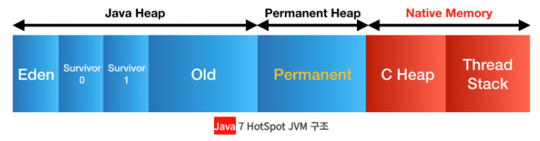
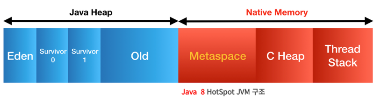

### **Java 8 특징**

1. **Lambda expression(람다 표현식)**
2. **Functional interface(함수형 인터페이스)**
3. **Default method(디폴트 메서드)**
4. **Stream(스트림)**
5. **Optional(옵셔널)**
6. ~~새롭게 추가된 날짜 API~~
7. ~~CompletableFuture(컴플리터블 퓨처)~~
8. **JVM의 변화**

### 람다 표현식(lambda expression)

람다식은 메소드를 간략하고 명확하게 표현한 것으로, 메소드의 이름과 반환값이 없어지면서 익명함수로도 불립니다. 이는 코드를 간결하게 만들어주어 가독성을 향상시키는 장점이 있습니다.

```java
// 일반 메소드
int max(int a, int b){
	return a < b ? a : b;
}

// 람다 표현식
(a, b) -> a < b ? a : b
```

### Functional interface(함수형 인터페이스)

함수형 인터페이스는 추상 메서드가 오직 하나인 인터페이스를 의미합니다. 이러한 인터페이스는 주로 람다 표현식이나 메서드 참조와 함께 사용되어 함수형 프로그래밍을 지원합니다. Java에서는 **`@FunctionalInterface`** 어노테이션을 사용하여 해당 인터페이스가 함수형 인터페이스임을 명시적으로 선언할 수 있습니다.

여러 개의 디폴트 메서드나 static 메서드가 존재해도 함수형 인터페이스로 취급되는데, 이는 디폴트 메서드나 static 메서드는 인터페이스의 메서드 시그니처에 영향을 주지 않기 때문입니다.

아래는 함수형 인터페이스의 예시 코드입니다:

```java
@FunctionalInterface
public interface Math {
    int calculate(int first, int second);
}
```

위의 코드에서 **`@FunctionalInterface`** 어노테이션을 통해 해당 인터페이스가 함수형 인터페이스임을 명시했습니다. 이제 이를 람다 표현식을 사용하여 구현할 수 있다.

```java
public class Main {
    public static void main(String[] args) {
        // 람다 표현식을 사용한 함수형 인터페이스의 구현
        Math addition = (first, second) -> first + second;
        System.out.println(addition.calculate(4, 2));

        // 람다 표현식을 사용하지 않은 다른 방법으로 추상 메서드를 구현
        Math subtraction = new Math() {
            @Override
            public int calculate(int first, int second) {
                return first - second;
            }
        };
        System.out.println(subtraction.calculate(4, 2));
    }
}
```

위의 코드에서는 람다 표현식을 사용하여 함수형 인터페이스를 구현한 예시와, 람다 표현식을 사용하지 않은 다른 방법으로 추상 메서드를 구현한 예시를 보여주고 있다.. **`@FunctionalInterface`** 어노테이션은 함수형 인터페이스의 규칙을 위반했을 때 컴파일 에러를 발생시킴으로써 개발자에게 도움을 준다.

### Default method(디폴트 메서드)

인터페이스의 구현체를 인터페이스 자체에서 기본으로 제공 가능하다. 구현 클래스에서 인터페이스를 구현하지 않아도 된다

```java
interface MyInterface {
    void myMethod(); // 추상 메소드

    default void defaultMethod() {
        System.out.println("기본 메소드 구현");
    }
}

class MyImplementation implements MyInterface {
    @Override
    public void myMethod() {
        System.out.println("구현 클래스에서 추상 메소드 구현");
    }
}

public class Main {
    public static void main(String[] args) {
        MyImplementation myObj = new MyImplementation();
        myObj.myMethod(); // 구현 클래스에서 추상 메소드 호출
        myObj.defaultMethod(); // 인터페이스에서 기본 메소드 호출
    }
}
```

### Stream(스트림)

스트림(Stream)은 자바에서 데이터를 다루는 새로운 접근 방식을 제공하여 코드의 가독성과 재사용성을 향상시킨다. 이전에는 컬렉션이나 배열을 다루기 위해 반복문과 iterator를 사용하는 번거로운 작업이 필요했지만, 스트림은 이런 불편함을 줄이고 일관된 방식으로 데이터를 다룰 수 있도록 도와준다.

스트림은 다양한 데이터 소스를 추상화하여, 예를 들어 List나 배열과 같은 다양한 데이터 소스를 동일한 방식으로 처리할 수 있다. 이로써 코드의 일관성을 유지하면서 재사용성을 높이고 가독성을 개선할 수 있다. 예를 들어, List를 정렬할 때는 **`Collection.sort()`**를 사용하고, 배열을 정렬할 때는 **`Arrays.sort()`**를 사용하는 등의 복잡한 처리를 스트림을 이용하면 간결하게 표현할 수 있습니다.

스트림은 함수형 프로그래밍의 개념을 도입하여 람다식을 통한 간결한 표현이 가능하며, 병렬 처리와 같은 효율적인 작업도 지원합니다. 이를 통해 코드의 가독성을 높이고, 데이터 처리를 보다 효율적으로 수행할 수 있습니다.

```java
public class StreamTest {
    public static void main(String[] args) {
        String[] arr = {"aaa","bbb","ccc"};  //(1)
        List<String> strArr = Arrays.asList(arr);  //(2)

				Stream<String> stream = strArr.stream();  //(3)
        Stream<String> stream2 = Arrays.stream(arr);

        stream.sorted().forEach(System.out::println);  //(4)
        stream2.sorted().forEach(System.out::println);

    }
}
```

다른데이터 소스임에도 스트림을 사용하여 같은 메소드를 사용하다. 이를 통해 코드가 간결해짐과 스트림의 재사용성이 높다는 것을 알 수 있다.

### Optional(옵셔널)

Java 8에서 도입된 Optional은 null 처리에 대한 안전성을 높이기 위한 도구로 등장했고 기존에는 null로 인한 예외 처리나 검증이 필요한 코드들이 많았지만, Optional을 사용하면 이러한 문제들을 보다 깔끔하게 처리할 수 있다.

먼저, 기존의 null 처리 방식을 살펴보면 여러 가지 문제점이 있다.. 객체가 null일 경우의 예외 처리 코드와 그로 인해 생기는 가독성 저하, 메서드 호출 결과로 null을 받을 수 있어 발생하는 신뢰도 저하 등이 그 예시로 나타낸다.

Optional을 활용하면 이러한 문제를 해결할 수 있습니다. 예를 들어, 저자의 이름을 반환하는 메서드에서 Optional을 사용하면 다음과 같이 간결하게 코드를 작성할 수 있다.

```java
public class BookService {
    // Optional을 사용하여 null에서 안전한 코드 작성하기
    public Optional<String> getAuthorName(Book book) {
        return Optional.ofNullable(book)
                .map(Book::getAuthor)
                .map(Author::getName);
    }
}
```

이렇게 함으로써 null 체크를 위한 if문이나 예외 처리 코드를 명시적으로 작성하지 않아도 됩니다. 메서드의 반환 타입도 **`Optional<String>`**으로 지정함으로써 호출하는 측에서 빈 결과를 받을 수 있다는 것을 명확히 알 수 있다.

이를 통해 코드의 가독성을 높이고, null 관련한 예외 처리를 간소화하여 코드 분석이 용이해집니다. 따라서 전체적인 프로젝트의 안정성과 유지보수성을 향상시킬 수 있습니다. Optional은 Java 8부터 제공되므로 적극적으로 활용하여 개발하는 것이 좋습니다.

### JVM 변화

   <br/>
   <br/>

기존 Permanent에 저장된 정보들

- Class의 메타데이터 (바이크코드 포함)
- Method의 메타데이터
- static 객체, static 상수
- 상수화된 String Object
- Class와 관련된 배열 객체 메타데이터
- JVM 내부적인 객체들과 JIT의 최적화 정보

### OOM 문제점

이런 많은것들이 PermG안에 있다보니 , String Constant Pool, static object, Class 메타 데이터들이 쌓여 OOM이 발생하곤 했다. PermG는 시작할때부터 크게 잡지 않는 이상 리사이징이 되지 않아 그런 문제가 발생하곤 했다.

Java 8에서부턴 PermG 영역을 삭제하고 **Metaspace** 영역을 추가해 **Native 메모리의 영역**으로 이동시켰다.

   <br/>
   <br/>

기존의 PermG 영역에 있던 정보들은 이렇게 변경되었다.

- Class의 메타데이터 (바이트코드 포함) → MetaSpace로 이동
- Method의 메타데이터 → MetaSpace로 이동
- static 객체,static 변수 (class variable) → **Heap으로 이동,**
- 상수화된 String Object → **Heap으로 이동**
- Class와 관련된 배열 객체 메타데이터 → Metaspace로 이동
- JVM 내부적인 객체들과 JIT의 최적화 정보 → Metaspace로 이동
