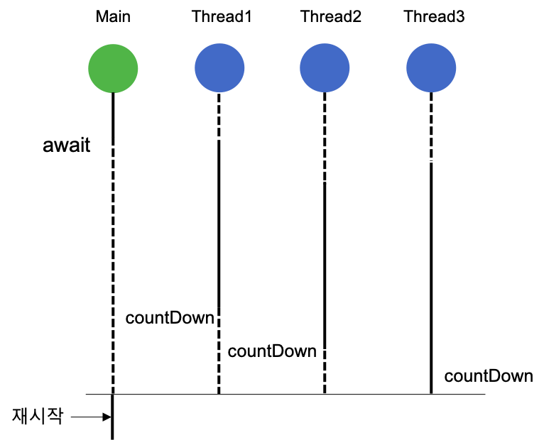
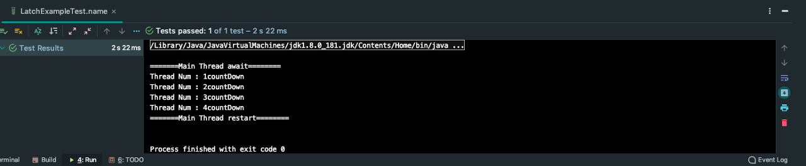
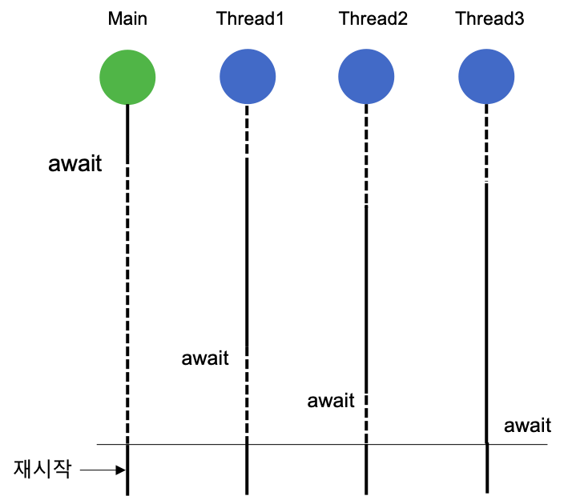
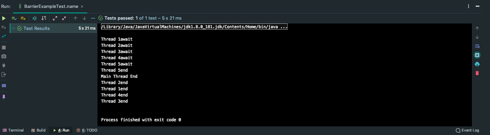

# CountDownLatch vs CyclicBarrier

> `CountDownLatch`와 `CyclicBarrier`은 동기화 장치로 쓰레드를 관리해주는 클래스입니다.

## 개념정리

### CountDownLatch

`CountDownLatch`는 하나 이상의 쓰레드가 다른 쓰레드에서 수행되는 작업이 완료될 때까지 기다릴 수 있도록 해주는 클래스이다.

### CountDownLatch 작동 원리

Latch의 사전적 의미는 '걸쇠'로 원하는 지점에서 `await()`메소드를 호출하여 코드의 실행을 중단시키고 다른 쓰레드들에서 원하는 횟수만큼 `countDown()` 메서드를 호출하여 코드가 진행되는 방식이다.

CountDownLatch는 다음과 같이 생성할 수 있다.

인자로 Latch의 숫자를 전달한다.


```java
//생성할 때 1 이상의 count를 인자값으로 받는다.
CountDownLatch countDownLatch = new CountDownLatch(5);
```

다음과 같이 `countDown()`을 호출하면 Latch의 숫자가 1개씩 감소합니다.

```java
countDownLatch.countDown();
```

`await()`은 Latch의 숫자가 0이 될 때까지 기다리는 코드입니다.

```java
countDownLatch.await();
```

### 예제

```java
public class LatchExampleTest {
    @DisplayName("await 호출 쓰레드는 대기한다.")
    @Test
    public void name() throws InterruptedException {
        CountDownLatch latch = new CountDownLatch(4);

        new Thread(job(latch,1)).start();
        new Thread(job(latch,2)).start();
        new Thread(job(latch,3)).start();
        new Thread(job(latch,4)).start();
        System.out.println("=======Main Thread await========");
        latch.await();
        System.out.println("=======Main Thread restart========");
    }
    Runnable job(CountDownLatch latch, int num) {
        return () -> {
            try {
                Thread.sleep(num*500L);
                System.out.println("Thread Num : "+ num + "countDown");
                latch.countDown();
            } catch (InterruptedException e) {
                e.printStackTrace();
            }
        };
    }
}
```



### CyclicBarrier

`CyclicBarrier`는 `CountDownLatch`와 비슷하다. 하지만 `CountDownLatch`가 다른 스레드가 작업을 완료하고 CountDown을 호출했을때 대기상태를 풀어준다면, `CyclicBarrier는` 다른 스레드가 전부 대기 상태가 되었을 때 모든 스레드의 대기 상태를 해제하고 재사용이 가능하다.

즉, `CyclicBarrier`는 `CountDownLatch` 처럼 1이상의 인자를 count 값을 받는다. 그리고 각 쓰레드에서 `await()`를 호출하면 쓰레드는 대기상태로 들어간다.

`await()`가 count 값만큼 호출이 되면, 대기 상태로 있던 쓰레드는 대기 상태가 해제된다.


### 예제

```java
public class BarrierExampleTest {

    @DisplayName("Barrier는 다른 스레드의 대기 상태를 기다린다.")
    @Test
    void name() throws BrokenBarrierException,InterruptedException{
        CyclicBarrier cyclicBarrier = new CyclicBarrier(6);
        for (int i = 0 ; i < 5 ; i++) {
            new Thread(run(cyclicBarrier,i+1)).start();
        }
        cyclicBarrier.await();
        System.out.println("Main Thread End");
    }

    Runnable run(CyclicBarrier barrier,int num) {
        return () -> {
          try {
              Thread.sleep(num * 1000);
              System.out.println("Thread " + num + "await");
              barrier.await();
              System.out.println("Thread " + num + "end");
          } catch (BrokenBarrierException | InterruptedException e) {
              e.printStackTrace();
          }
        };
    }
}
```



## 예상 질문

- `CountDownLatch`와 `CyclicBarrier`의 차이점은 무엇인가요?

---

### 참고자료

[자바봄](https://javabom.tistory.com/35) <br>
[https://github.com/devFancy/2023-CS-Study](https://github.com/devFancy/2023-CS-Study/blob/main/java/java_countdownlatch_cyclicbarrier.md)
