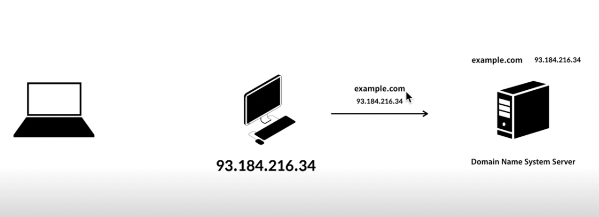
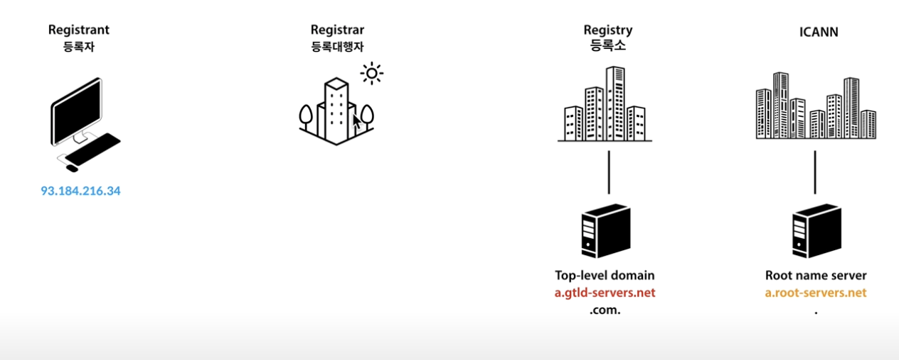
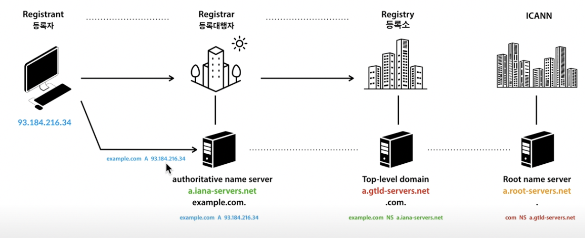
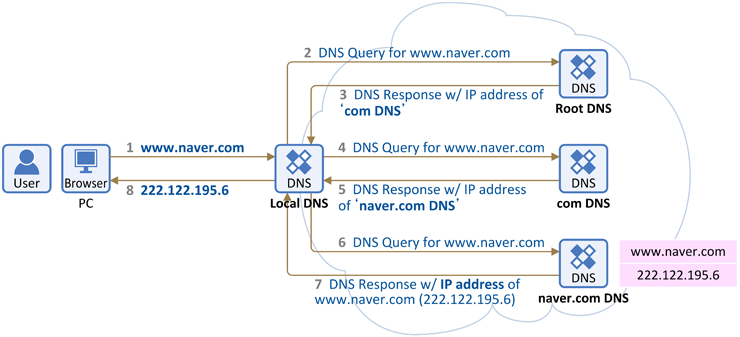

유저의 컴퓨터가 `93.184.216.34`라는 IP 주소를 가지고 있는 컴퓨터에 접속하기 위해서 어떤일이 일어날지에 대한 상황을 토대로 알아보자.

- `93.184.216.34`라는 IP 주소를 가진 컴퓨터에 주인은 자신의 컴퓨터에 사람들이 접속할 때 IP로 접속하는 것이 아닌이름을 적어서 접속하면 좋겠다는 생각을 하게 된다.
- 즉, example.com이라는 주소가 이 컴퓨터를 가리키게 하고 싶다는 것이다.

=> 이때 필요한 것이 바로 **도메인 네임 시스템 서버, 줄여서 DNS Server**라고 하는 것이 필요하다.

## DNS(Domain Name System)

- **도메인 네임 시스템, DNS**은 호스트의 도메인 이름을 호스트의 네트워크 주소로 바꾸거나 그 반대의 변환을 수행할 수 있도록 하기 위해 개발되었다.
    - 간단하게 말하자면 이 시스템은 우리가 사용하는 문자열 인터넷 주소를 IP 주소로 변환하는것을 말한다.
- 예를 들면 우리가 자주 접하는 naver.com , google.com 모두 DNS을 가진 DN(Domain Name)이다.

### DNS 역할

1. DNS Server에게 자신의 IP는 어떤 것인지 알려주고 이 IP가 example.com이라는 주소를 갖도록 요청을 한다.
2. DNS Server는 요청을 받아서 example.com이라는 도메인 네임은 93.184.216.34라는 IP임을 기억한다.

### IP 주소 응답 과정

- 집에 있는 랜선을 유저의 컴퓨터에 꽂거나 또는 와이파이로 접속을 하는 순간에 어떠한 메카니즘(dhcp라는 키워드)에 의해서 유저의 컴퓨터에는 도메인 네임 시스템 서버의 IP 주소가 자동으로 세팅이 된다.
- 따라서 유저의 컴퓨터는 인터넷을 연결하는 순간 도메인 네임 시스템 서버에 IP를 알고 있기 때문에 example.com을 입력하면 약속된 대로
    1. 호스트 파일을 찾아본다. 만약 호스트 파일에 example.com에 대한 설명이 없다면?
        1. hosts 파일이란
            1. hosts 파일은 ip 주소와 도메인을 매핑해주는 리스트입니다.
            2. localhost 가 loopback (127.0.0.1)으로 지정되는 것과 같은 논리입니다.
    2. DNS Server에 접속해서 example.com이라 하는 도메인 네임의 IP가 무엇인지 물어보고 DNS Server는 자신이 기억하고 있는 이 IP 주소를 응답해 주게 된다.

## DNS 작동원리

1. Root Name Server
    - DNS 시스템의 최고 정점, 가장 상위엔 ICANN이라고 하는 비영리 단체가 있으며 이 단체가 하는 일은 전 세계 있는 IP 주소를 관리하며 루트 네임 서버들에 대한 관리 즉, 인터넷이 체계의 관리자와 같은 역할을 한다.
    - Root Name Server는 `a.root-server.net`라는 주소를 가지고 있는 컴퓨터가 존재한다.
        - (a~m까지 반복되는 총 13개 Root Name Server가 전 세계에 흩어져 있고 각각의 컴퓨터들은 전 셰계로 다시 흩어져 수백대의 성능 좋은 컴퓨터가 Root Name Server로서 동작하고 있다.)
2. Top-level domain
    - Root Name Server를 관리하는 ICANN 밑에 Registry(등록소) 라고 하는 기관 또는 기업들이 있다.
    - Registry는 .com/.kr/.net과 같이 Top-level domain들을 관리한다. (닷컴 역시 여러 개의 Name Server를 가지고 있다)
3. Registrar
    - Registar(등록대행자) Top-level domain Name Server에 등록 작업을 대행해주는 업체나 기관이다.
        1. 유저가 example.com이라는 주소를 쓰고 싶다면 직접 Registry(등록소)에게 접근하는 것이 아닌 Registar(등록대행자)에 접근하여 해당 도메인을 쓰고싶다고 요청을한다.
        2. Registar는 Registry에게 example.com을 등록해준다.
            1. (단, 존재하지않는 도메인에 한에서 등록해준다. 또 도메인에 대한 비용, 수수료 등을 지불해야한다.)
    - Registry 등록소는 example.com 처럼 구입한 도메인에 대한 소유권을 Registar 등록대행자를 통해서 유저의 컴퓨터라는 것을 인식할 수 있게 된다.

### Root Name Server의 역할

- 전세계에 있는 Top-level domain 서버들의 주소를 기억하는 것이다.
- 루트 네임 서버에는 `.com`이라고 하는 Top-level domain의 네임서버는 `a.gtld-servers.net`이라는 주소에 있다라고 하는 것이 Root Name Server에 세팅되어 있고 바로 이것으로 인해서 Root Name Server는 `.com`이 누가 관리 하는지를 알 수 있게 된다.

- 실제로 자신의 도메인을 운영하기 위해서는 스스로 서버 1대를 마련해 갖고 거기다가 네임 서버를 깔아야하는데 이 네임 서버를 설치한 컴퓨터가 `a.iana-server.net`이라고 간주해 보자.
- 여기에 유저는 도메인의 세팅하는데 직접 구축할 수도 있지만 많은 경우에 등록대행자 네임 서버를 제공하는 경우가 많다.
- 그리고 유저는 등록대행자에게 어떠한 정보를 보내는 데 Root Name Server가 Top-level domain을 알고 있는 것처럼 Top-level domain도 유저가 사용할 네임서버가 무엇인지를 알고 있어야 된다.
- 그래서 등록자는 `example.com`라는 도메인의 네임서버는 `a.iana-server.net`에 있다는 것을 등록대행자에게 보내준다.
- 등록대행자는 이 정보를 받아서 유저 대신 레지스트리(등록소)에게 `example.com`에 네임 서버는 `a.iana-server.net`이다 라고 알려준다.
- 그렇게 하면 등록소는 자신이 관리하고 있는 Top-level domain에 `example.com`에 네임서버가 누구인지를 기록해 둘 수 있다.(이를 통해서 이제 Top-level domain은 해당 네임 서버를 알게 된 상태가 된다)
- 그 다음에 `example.com`이라는 도메인을 관리할 네임 서버에 접속해 네임서버에게 `example.com`의 address는 `93.184.216.34`라고 알려주면 이 네임 서버는 이제 `example.com`의 IP를 알게 되는 상태가된다.

### 클라이언트 컴퓨터를 갖고 www.naver.com에 접속하는 과정

1. PC에 미리 설정되어 있는 Local DNS에게 www.naver.com라는 hostname에 대한 IP주소 물어보고 Local DNS에 www.naver.com에 대한 IP 있는 경우 PC에 알려준다.
2. 다른 DNS 서버와 통신 시작. 먼저 **Root DNS 서버**에게 질의하면 .com을 관리하는 DNS 서버를 알려준다.
3. Local DNS 서버가 **.com 관리하는 서버(TLD)**에게 www.naver.com 주소 질의하고 naver.com 도메인을 관리하는 DNS 서버를 다시 알려준다.
4. Local DNS 서버가 naver.com 관리하는 서버에게 www.naver.com 주소 질의하면 www.naver.com에 대한 IP 주소 응답해준다.
5. Local DNS에서는 www.naver.com에 대한 IP 주소 캐싱하고 PC에게 IP주소 알려주어 해당 도메인에 접속한다.

### 예상 질문

1. DNS란 무엇인가요?
2. 클라이언트가 www.naver.com에 접속하는 과정에 대해서 설명해주세요.

### 출처

[https://velog.io/@minj9_6/DNS와-작동원리](https://velog.io/@minj9_6/DNS%EC%99%80-%EC%9E%91%EB%8F%99%EC%9B%90%EB%A6%AC)