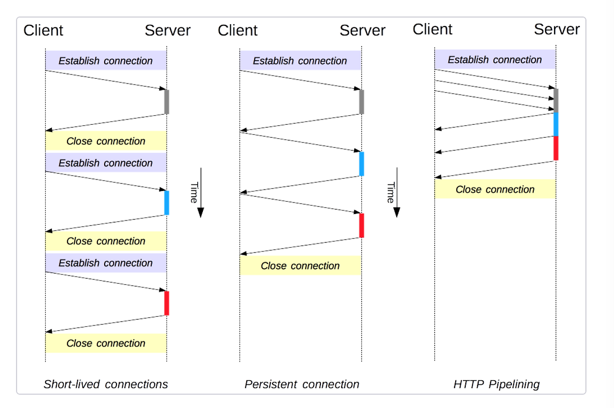
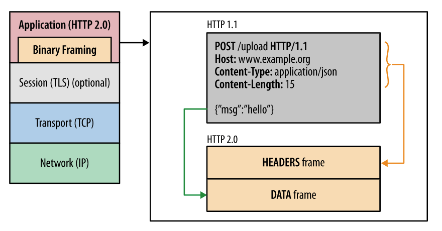
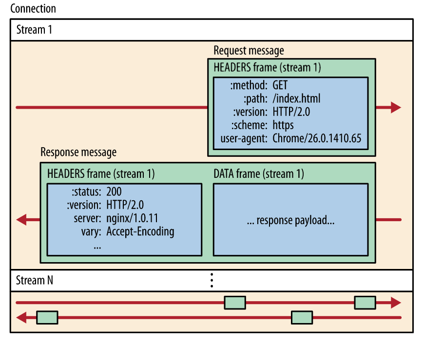
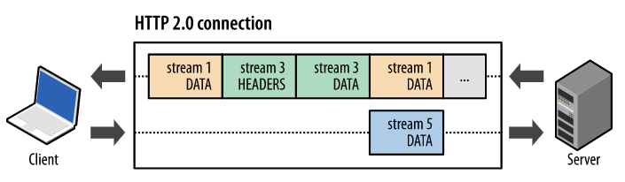
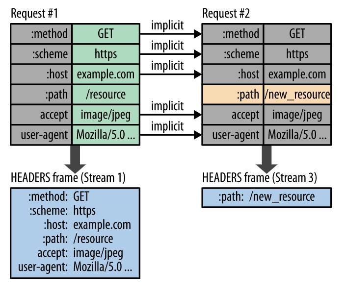
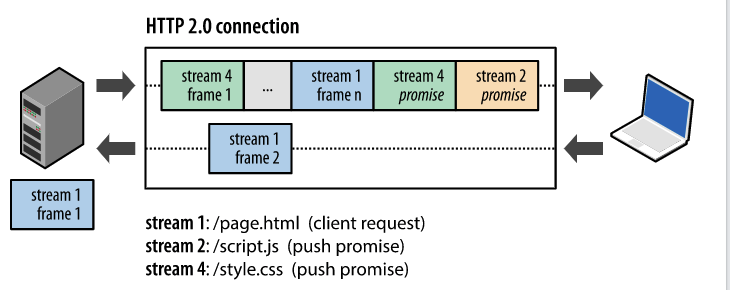

### HTTP

HTTP (Hyper Text Transfer Protocol)은 HTML 문서와 같은 리소스들을 가져올 수 있도록 해주는 프로토콜이다. 웹 브라우저와 웹 서버간 통신을 위해 디자인 되었습니다. http 요청이 발생하면 브라우저는 http 요청 메서지를 생성하고 TCP/IP 프로토콜을 이용하여 웹 서버에 요청을 전달을 합니다. 이후 브라우저는 웹 서버로부터 HTTP 응답을 전달 받습니다.

|  | HTTP 요청 메세지 | HTTP 응답 메세지 |
| --- | --- | --- |
| STARTLINE | 메소드, 경로, 프로토콜 버전 | 프로토콜 버전, 상태 코드, 상태 텍스트 |
| Header | 요청에 설정한 HTTP 헤더 | 응답에 설정한 HTTP 헤더 |
| Body | POST 요청일 경우 추가 | 요청에 대한 응답, 상태가 201, 204일 경우 보통 본문이 없음 |

### HTTP Status Code

- **1xx(정보) :** 요청을 받았으며 프로세스를 계속 진행
- **2xx(성공) :** 요청을 성공적으로 받았으며 인식했고 수용
- **3xx(리다이렉션) :** 요청 완료를 위해 추가 작업 조치가 필요
- **4xx(클라이언트 오류) :** 요청의 문법이 잘못되었거나 요청을 처리할 수 없음
- **5xx(서버 오류) :** 서버가 명백히 유효한 요청에 대한 충족을 실패

**1XX (정보 응답)**

- **100 Continue**
    
    클라이언트가 요청을 계속할 수 있음
    
- **101 Switching Protocols**
    
    클라이언트의 프로토콜 변경 요청을 수락했음
    
- **102 Processing**
    
    서버가 요청을 처리 중이지만 아직 완료하지 못했음
    

**2XX (성공 응답)**

- **200 OK**
    
    요청이 성공적으로 처리되었음
    
- **201 Created**
    
    요청이 성공적으로 처리되었고, 새로운 리소스가 생성되었음
    
- **204 No Content**
    
    요청이 성공적으로 처리되었지만, 응답할 콘텐츠가 없음
    

**3XX (리디렉션 메시지)**

- **301 Moved Permanently**
    
    요청한 리소스의 URI가 영구적으로 변경되었음
    
- **302 Found**
    
    요청한 리소스의 URI가 일시적으로 변경되었음
    
- **303 See Other**
    
    클라이언트가 다른 URI에서 리소스를 받아야 함
    

**4XX (클라이언트 오류 응답)**

- **400 Bad Request**
    
    클라이언트의 요청이 잘못되었음
    
- **401 Unauthorized**
    
    요청한 리소스에 접근하기 위해 인증이 필요함
    
- **404 Not Found**
    
    요청한 리소스가 서버에 없음
    

**5XX (서버 오류 응답)**

- **500 Internal Server Error**
    
    서버 내부에서 오류가 발생했음
    
- **502 Bad Gateway**
    
    서버가 게이트웨이 역할을 하면서 다른 서버로부터 잘못된 응답을 받았음
    
- **503 Service Unavailable**
    
    서버가 요청을 처리할 수 없는 상태임
    

### HTTP 메서드

| HTTP 메소드 | 설명 |
| --- | --- |
| GET | 서버에서 특정 리소스를 조회합니다. 서버의 상태를 변경하지 않습니다. |
| POST | 서버에 새로운 리소스를 생성합니다. 서버의 상태를 변경하며, 서버에 데이터를 전송 |
| PUT | 서버의 특정 리소스를 업데이트하거나, 존재하지 않는 경우 새로 생성 |
| PATCH | 서버의 특정 리소스를 부분적으로 수정합니다. 변경하려는 특정 부분만 전달하여 리소스를 수정 |
| DELETE | 서버의 특정 리소스를 삭제 |
| OPTIONS | 특정 URL에 대해 서버가 어떤 HTTP 메소드를 지원하는지 확인 |

---

### HTTP 특징

1. **비연결성 (connectionless)**
    
    Client와 Server 간 연결을 맺은 후 응답을 마치면 기존의 연결을 끊는 특성을 말한다.
    
    HTTP가 연결을 유지하는 것으로 설계가 됐다면 서버에서는 다수의 클라와 연결을 유지해야한다. 이에 따른 리소스가 발생하게 되는데 연결을 유지하기 위한 리소스를 줄인다면 더 많은 연결을 할 수 있게 된다.
    
    하지만 서버에서는 클라이언트의 요청에 매번 연결 해체하는 과정을 수행해야 되기에 오버헤드가 발생할 수 있다.
    
2. **무상태성 (stateless)**
    
    비연결성으로 인해 이전에 어떠한 정보를 가지고 있는지 알 수가 없다. 예를 들어 로그인 한 후 다음 페이지 이동 시 로그인을 한 상태를 알지 못하므로 다시 로그인을 요청을 할 수가 있다. 이런한 무상태성을 보완하기 위해 쿠키, 세션이 등장하게 됐다. 쿠키는 브라우저에 세션은 DB에 저장돼 관리를 합니다. 쿠키와 세션은 브라우저에 노출 돼 위조가 일어날 수 있다. 세션은 ID만 노출이 되지만 쿠키의 경우 그대로 값이 노출하게 되기에 Oauth, JWT 같은 것들이 등장하게 된다.
    

### URL 이란?

URL이란 웹 상에서 자원을 구별하는 식별자이다. 웹에서는 파일을 자원 또는 리소스라고 부르는데 웹 상에서 자원을 구별하는데 사용하는 식별자는 URL 이다. 

```bash
**http://www.naver.com:80/example
프로토콜://호스트:포트/경로?쿼리**
```

### HTTP 1.0 발생한 문제점

매 요청마다 연결, 해체 과정이 발생 → 3번의 요청이 이루어진다면 3번의 연결 해체 과정이 이루어져야 했고 이로 인한 오버헤드가 발생해 시간의 지연이 일어남. 이는 비연결성, 즉 연결 상태를 서버에서 관리하지 않으면서 더 많은 연결을 하기 위함이었다. HTTP는 불특정 다수와 통신을 하게끔 설계되었기 때문이다.

이를 HTTP 1.1에서 해결한 방식은 다음과 같다.

1. Persistent connection
    
    연결의 지속 시간을 설정해둔다. 설정해둔 연결 지속시간에는 1.0에서 발생했던 연결/해체 과정을 거치지 않아도 된다. 하지만 TCP 특성상 요청 후 응답은 기다려야만 했다. 그래서 대기시간에는 동작을 수행할 수 없었다.
    
2. HTTP Pipelining
    
    위를 개선한 모델로, 요청을 응답과 상관없이 보내고 Server에서 응답을 요청이 들어온 순서대로 보내줍니다. 이 때 Client 에서는 응답의 순서가 잘못되거나 중간에 빠졌다면 누락이 발생한 요청을 다시 보내게 된다.
    
    여기서도 문제점은 발생하고 만다. HOL(Head Of Line) Blocking 문제였다. 
    



1. 서버에서는 1, 2, 3 요청을 처리하는데 각각 50초 2번은 20초 3번 10초 소요 가정
2. 2, 3 요청은 다 처리했지만 1번 먼저 응답을 보내야 하므로 2, 3 요청은 계속 blocking 

이를 HOL Blocking 이라고 한다.

**HTTP 1.1에서  발생한 대표적 문제점**

- HOL Blocking
- 연속된 요청간에 중복된 헤더들

**HTTP 2.0에서의 해결 방안 및 특성**

1. Binary Framing
    
    
    
    요청과 응답 메시지를 바이너리 형식으로 인코딩하여 프레임 단위로 나누어 처리함으로써 파싱과 전송 속도를 향상시킵니다.
    
2. Multiplex Streaming
    
    
    
    한 TCP 연결 내에서 여러 개의 스트림을 생성할 수 있으며, 각 스트림은 독립적인 양방향 데이터 흐름을 지원합니다. 그리고 각 스트림에는 고유 식별자와 우선순위 정보를 가지고 있어 이를 통해 여러 요청과 응답을 병렬로 처리할 수 있습니다.
    
3. 요청 및 응답 다중화
    
    
    
    **서버**
    
    요청 1에 대한 data를 프레임 단위로 보내주고 있고
    
    요청 3에 대한 header, data를 프레임에 추가하여 보내주고 있고
    
    **클라이언트**
    
    요청 5에 대한 data를 서버에게 보내주고 있습니다.
    
    HTTP 메시지를 독립된 프레임으로 세분화 했고 프레임을 받은쪽에서 다시 조립 합니다.
    
    - 여러 요청/응답 을 하나도 차단하지 않고 병렬로 인터리빙할 수 있습니다.=
    - 단일 연결을 사용하여 여러 요청과 응답을 병렬로 인터리빙할 수 있습니다.
4. 스트림 우선순위 지정
5. 헤더 압축 (HPACK)
    
    
    

압축에는 HPACK이라는 알고리즘을 사용하는데 이 알고리즘은 정적 테이블과 동적 테이블을 사용하여 헤더 필드를 압축합니다.  정적 테이블은 공용 HTTP 헤더 필드를 제공하고, 동적 테이블은 특정 연결에 대한 컨텍스트에서 사용되는 헤더 필드를 저장합니다. 압축된 헤더 데이터는 인덱스 값을 사용하여 전송되며, 테이블에 없는 경우 Huffman 인코딩을 사용합니다. 이를 통해 HPACK은 효율적인 헤더 필드 압축을 실현합니다.

1. server push
    
    
    서버에 a에 대한 요청이 왔을때 a에서 필요할것 같은것들을 이후에 보내버리는 방식입니다.


**정리**

| HTTP 1.1 | HTTP 2.0 |
| --- | --- |
| Persistent Connection | HTTP 메시지 전송 방식의 변화 |
| Pipelining | 요청과 응답의 다중화(멀티플렉스 스트림) |
| HTTP의 HOL(Head of Line Blocking) | 리소스간 우선순위 설정 |
| Header 중복 | Server Push |
|  | Header 압축 |
|  | TCP의 HOL(Head of Line Blocking) |

HTTP와 HTTP2.0은 둘다 TCP 기반이므로 TCP의 HOL(Head of Line Blocking)을 피할 수 없다

---

### 면접 질문
1. 

### 참고 링크

[[HTTP] HTTP 특성(비연결성, 무상태)과 구성요소 그리고 Restful API](https://victorydntmd.tistory.com/286)

[HTTP/2 알아보기 - 1편 | 와탭 블로그](https://www.whatap.io/ko/blog/38/)

[네트워크 HTTP, HTTP 1.1, HTTP 2.0 🔥](https://dkrnfls.tistory.com/289)