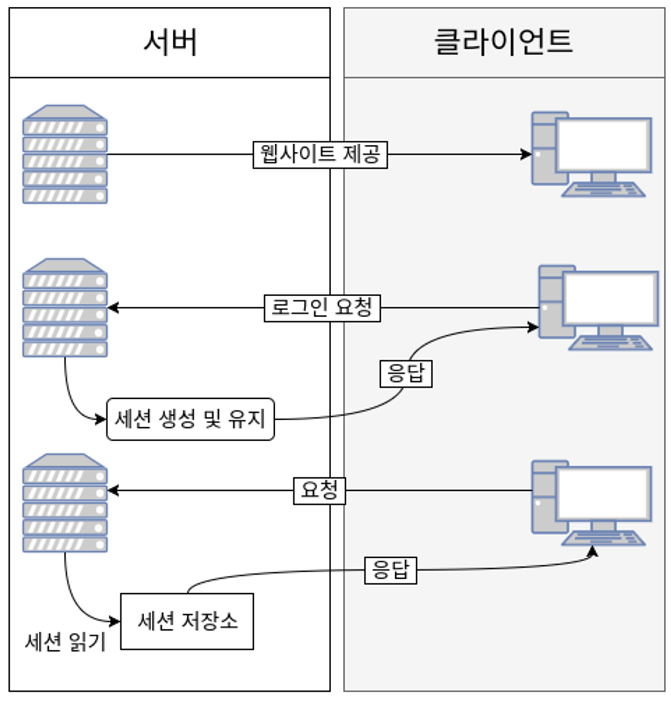
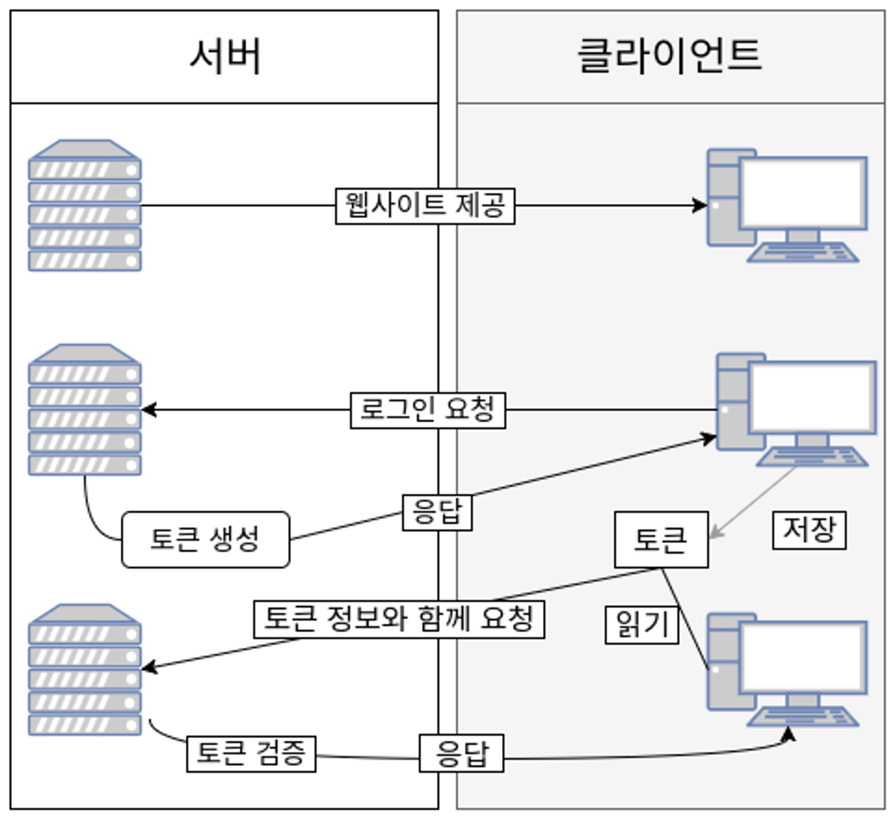
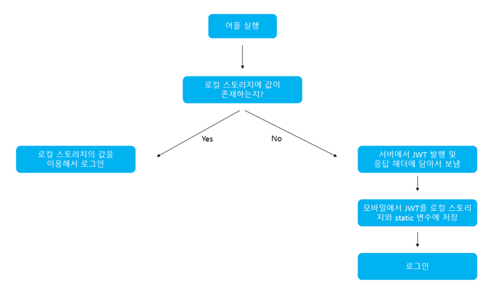
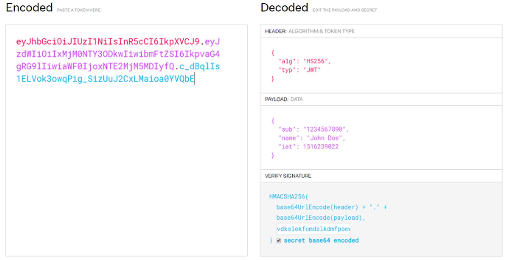
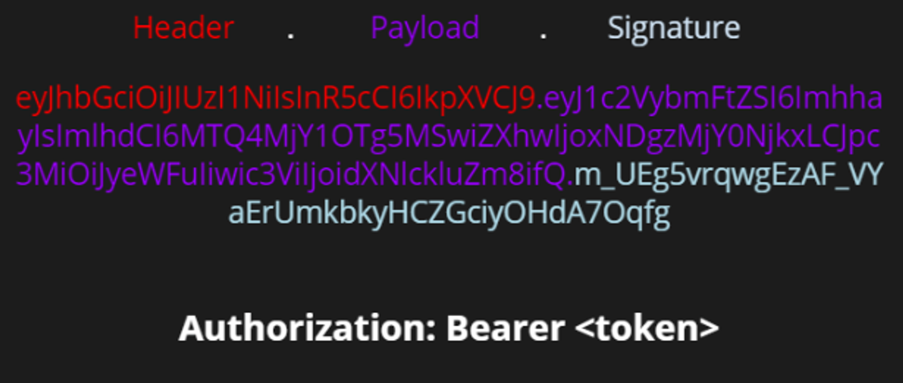

# JWT

## 개념 정리

### 토큰 기반 인증 방식의 등장

- 기존의 시스템에서는 서버 기반의 인증방식 사용
- 하지만 시스템의 규모가 커짐에 따라 서버 기반의 인증 방식에 한계점이 보여 토큰 기반인증 방식이 등장
- 현대 웹서비스에서 API를 이용한 웹 서비스를 개발할 때, 토큰을 사용해 사용자들의 인증 작업을 처리하는 것 가장 좋은 방법

### 서버(세션) 기반 인증 시스템

- 기존의 인증 시스템은 서버 기반 인증 방식
- **서버 측에서 사용자들의 정보를 기억하고 있어야 한다.**
- 사용자들의 정보를 기억하기 위해서는 세션을 유지해야 하기에, 메모리나 디스크 또는 데이터베이스 등을 통해 관리한다.
  - 서버 기반의 인증 시스템은 클라이언트로부터 요청을 받으면, 클라이언트 상태를 계속해서 유지하고 이 정보를 서비스에 이용하는데 이른 Stateful 서버라고 한다.
  - 예를 들어, 사용자가 로그인을 하면, 세션에 사용자 정보를 저장해두고 서비스를 제공할 때 사용하곤 한다.
    
- 이러한 인증 방식은 소규모 시스템에서는 아직 사용하지만, 웹/앱 어플리케이션이 발달하게 문제점을 보이기 시작했다.
  - 세션
    - 사용자가 인증을 할 때, 서버는 이 정보를 저장하는데 이를 세션이라고 부른다.
    - 이를 주로 메모리에 저장하는데, 로그인 중인 사용자가 늘어날 경우에는 서버의 RAM에 부하가 걸리게 된다.
    - 이를 피하기 위해 데이터베이스에 저장을 하기도 하기도 하는데, 이 역시 데이터베이스에 무리를 줄 수 있다.
  - 확장성
    - 사용자가 늘어나게 되면 더 많은 트래픽을 처리하기 위해 여러 프로세스를 돌리거나 컴퓨터를 추가하는 등 서버를 확장해야 한다.
    - 세션을 사용한다면 세션을 분산시키는 시스템을 설계해야 하지만 이러한 과정은 매우 어렵고 복잡하다.
  - CORS(Cross-Origin Resource Sharing)
    - 웹 어플리케이션에서 세션을 관리할 때 자주 사용되는 쿠키는 단일 도메인 및 서브 도메인에서만 작동하도록 설계되어있다. 따라서 쿠키를 여러 도메인에서 관리하는 것은 번거롭다.
  - ⇒ 이러한 문제들 때문에 토큰 기반 인증 시스템을 사용하게 되었다.

### 토큰 기반 인증 시스템이란?

- 토큰 기반의 인증 시스템은 **인증받은 사용자들에게 토큰을 발급**하고, **서버에 요청을 할 때 헤더에 토큰을 함께 보내도록하여 유효성 검사**를 한다.
- 더이상 사용자의 인증 정보를 서버나 세션에 유지하지 않고 클라이언트 측에서 들어오는 요청만으로 작업을 처리한다.
- 즉, 서버 기반의 인증 시스템과 달리 상태를 유지하지 않아 **Stateless**한 구조를 갖는다.
- 최근에는 Json 포맷을 이용하는 JWT(Json Web Token)을 주로 사용한다.
- 토큰 기반의 인증 시스템의 작동 과정
  1. 사용자가 아이디와 비밀번호로 로그인 한다.
  2. 서버 측에서 해당 정보를 검증한다.
  3. 정보가 정확하다면 서버 측에서 사용자에게 Signed 토큰을 발급한다.
     1. Signed는 해당 토큰이 서버에서 정상적으로 발급된 토큰임을 증명하는 Signature를 가지고 있다는 것
  4. 클라이언트 측에서 전달받은 토큰을 저장해두고, 서버에 요청할 때마다 해당 토큰을 서버에 함께 전달
  5. 서버는 토큰을 검증하고, 요청에 응답한다.
     

### 토큰 기반 인증 시스템의 이점

- 무상태성(Stateless) & 확장성(Scalability)
  - 토큰은 클라이언트 측에 저장되기 때문에 서버는 완전 Stateless하며, 클라이언트와 서버의 연결고리가 없어 확장하기 적합하다.
  - 만약 사용자 정보가 서버 측 세션에 저장된 경우에 서버를 확장해 분산처리 한다면, 해당 사용자는 처음 로그인 했었던 서버에만 요청을 받도록 해주어햐한다. 하지만 토큰을 사용한다면 어떤 서버로 요청이 와도 상관없다.
- 보안성
  - 클라이언트가 서버로 요청을 보낼 때 더 이상 쿠키를 전달하지 않으므로, 쿠키 사용에 의한 취약점이 사라지게 된다.
  - 하지만 토큰 환경의 취약점이 존재할 수 있어 이에 대비해야 한다.
- 확장성(Extensibility)
  - 시스템의 확장성을 의미하는 Scalability와 달리 Extensibility는 로그인 정보가 사용되는 분야의 확장을 의미한다.
  - 토큰 기반 인증 시스템에서는 토큰에 선택적인 권한만 부여해 발급할 수 있으며 OAuth의 경우 Facebook, Google 등과 같은 소셜 계정을 이용해 다른 웹서비스에서도 로그인 할 수 있다.
- 여러 플랫폼 및 도메인
  - 서버 기반 인증 시스템의 문제점 중 하나인 CORS를 해결할 수 있는데, 애플리케이션과 서비스의 규모가 커지면 여러 디바이스를 호환시키고 더 많은 종류의 서비스를 제공하게 된다.
  - 토큰을 사용한다면 어떤 디바이스, 어떤 도메인에서도 토큰의 유효성 검사를 진행한 후 요청을 처리할 수 있다.
  - 이런 구조를 통해 assets 파일(image, html, css, js 등)은 모두 CDN에서 제공하고, 서버 측에서는 API만 다루도록 설계할 수 있다.

### JWT(Json Web Token)란?

- JWT는 Json 포맷을 이용해 사용자에 대한 속성을 저장하는 Claim 기반의 Web Token이다.
  - Claim: 신원을 확인하는 사용자의 프로퍼티나 속성
    - 예를 들어 사용자의 ID나 권한, 발급자 정보, 토큰의 만료 시간 등을 포함할 수 있다.
- JWT는 토큰 자체를 정보로 사용하는 Self-Contained 방식으로 정보를 안전하게 전달한다.
- 주로 회원 인증이나 정보 전달에 사용되는 JWT 아래의 로직을 따라 처리된다.



- 애플리케이션이 실행될 때, JWT를 static 변수와 로컬 스토리지에 저장하게 된다.
  - static 변수에 저장되는 이유는 HTTP 통신을 할 때 마다 JWT를 HTTP헤더에 담아서 보내야 하는데, 이를 로컬 스토리지에서 계속 불러오면 오버헤드가 발생하기 때문이다.
- 클라이언트에서 JWT를 포함해 요청을 보내면 서버는 허가된 JWT인지를 검사한다.
- 로그아웃을 할 경우 로컬 스토리지에 저장된 JWT를 제거한다.
  - 실제 서비스의 경우에는 로그아웃 시, 사용했던 토큰을 blacklist라는 DB 테이블에 넣어 해당 토큰의 접근을 막는 작업을 수행해야한다.

### JWT 구조

- Header, Payload, Signature 3부분으로 이루어져있다.
- Json 형태인 각 부분은 Base64Url로 인코딩되어 표현된다.
  - 이는 암호화된 문자열이 아니라, 같은 문자열에 대해 항상 같은 인코딩 문자열을 반환한다.
- 각각의 부분을 이어주기위해 구분자 “.”를 사용해 구분한다.



**[Header 헤더]**

- 토큰의 헤더는 typ과 alg로 구성된다.
- **alg**: Signature를 해싱하기 위한 알고리즘 지정하며, 서명 및 토큰 검증에 사용한다.
  - ex. HS256(SHA256) 또는 RSA
- **typ**: 토큰 타입 지정
  - ex. JWT

```java
{
   "alg": "HS256",
   "typ": JWT
 }
```

[PayLoad 페이로드]

- 토큰의 페이로드에는 **토큰에서 사용할 정보의 조각들인 클레임(Claim)**이 담겨있다.
- 클레임은 총 3가지로 나누어지며, Json(key/value) 형태로 다수의 정보를 넣을 수 있다.

  1. 등록된 클레임(Registered Claim)

     1. 토큰 정보를 표현하기 위해 이미 정해진 종류의 데이터들
     2. 모두 선택적으로 작성 가능하며 사용 권장

     ```java
     //JWT를 간결하게 하기 위해 key는 모두 길이 3의 String이다.
     iss: 토큰 발급자(issuer)
     sub: 토큰 제목(subject) //ubject는 unique한 값을 사용하는데, 사용자 이메일을 주로 사용한다.
     aud: 토큰 대상자(audience)
     exp: 토큰 만료 시간(expiration), NumericDate 형식으로 되어 있어야 함 ex) 1480849147370
     nbf: 토큰 활성 날짜(not before), 이 날이 지나기 전의 토큰은 활성화되지 않음
     iat: 토큰 발급 시간(issued at), 토큰 발급 이후의 경과 시간을 알 수 있음
     jti: JWT 토큰 식별자(JWT ID), 중복 방지를 위해 사용하며, 일회용 토큰(Access Token) 등에 사용
     ```

  2. 공개 클레임(Public Claim)

     1. 공개 클레임은 **사용자 정의 클레임으로, 공개용 정보를 위해 사용**된다.
     2. 충돌 방지를 위해 URI 포맷 이용

     ```java
     {
     	 "https://hongseo.com": true
     }
     ```

  3. 비공개 클래임(PrivateClaim)

     1. 비공개 클레임은 사용자 정의 클레임으로, 서버와 클라이언트 사이에 임의로 지정한 정보 저장

     ```java
     {
         "token_type": access
     }
     ```

**[Signature(서명)]**

- 서명(Signature)은 토큰을 인코딩하거나 유효성 검증을 할 때 사용하는 고유한 암호화 코드이다.
- 헤더와 페이로드 값을 Bade64Url로 인코딩하고, 인코딩한 값을 비밀키를 이용해 헤더에서 정의한 알고리즘으로 해싱하고, 이 값을 다시 Base64Ur로 인코딩해 생성한다.

### 생성된 토큰



- 생성된 토큰은 HTTP 통신을 할 때 Authorization이라는 key의 value로 사용된다.
- 일반적으로 value에는 Bearer이 앞에 붙여진다.

```java
{
    "Authorization": "Bearer {생성된 토큰 값}",
}
```

### JWT 단점 및 고려사항

- Self-contained: 토큰 자체에 정보를 담고 있으므로 양날의 검이 될 수 있다.
- 토큰 길이: 토큰의 페이로드(Payload)에 3종류의 클레임을 저장하기 때문에, 정보가 많아질수록 토큰의 길이가 늘어나 네트워크에 부하를 줄 수 있다.
- Payload 인코딩: 페이로드(Payload) 자체는 암호화 된 것이 아니라, BASE64Url로 인코딩 된 것이다. 중간에 Payload를 탈취하여 디코딩하면 데이터를 볼 수 있으므로, JWE로 암호화하거나 Payload에 중요 데이터를 넣지 않아야 한다.
- Stateless: JWT는 상태를 저장하지 않기 때문에 한번 만들어지면 제어가 불가능하다. 즉, 토큰을 임의로 삭제하는 것이 불가능하므로 토큰 만료 시간을 꼭 넣어주어야 한다.
- Store Token: 토큰은 클라이언트 측에서 관리해야 하기 때문에, 토큰을 저장해야 한다.

## 예상질문

- 토큰 기반 인증 시스템의 등장배경과 장점에 대해서 설명해주세요.
- **JWT는 무엇인가요? 구조를 포함해 설명해주세요.**

---

### 참고자료

https://mangkyu.tistory.com/55<br>
[https://mangkyu.tistory.com/56](https://mangkyu.tistory.com/56#recentEntries)
