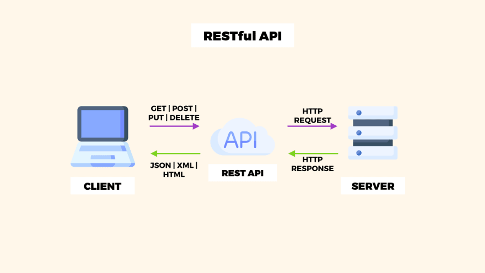
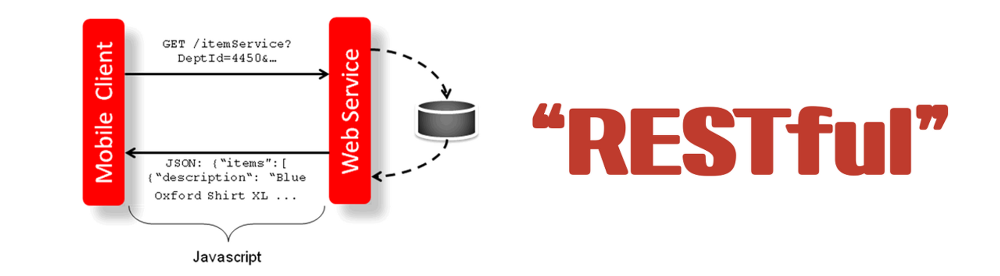

## 개념 정리

## **REST란?**



- REST(Representational State Transfer)의 약자로 자원을 이름으로 구분해 해당 자원 상태를 주고받는 모든 것을 의미한다.
- REST는 웹에서 데이터를 전송하고 처리하는 방법을 정의한 인터페이스이다.
- HTTP URI(Uniform Resource Identifier)를 통해 자원을 명시하고,
- HTTP Method(POST, GET, PUT, DELETE, PATCH 등)을 통해
- 해당 자원(URI)에 대한 CRUD Operation을 적용하는 것을 의미한다.
- 정리하자면, REST는 자원 기반 구조(ROA, Resource Oriented Architecture)로 설계중심에 리소스가 있고, HTTP Method를 통해 자원을 처리하도록 설계된 아키텍처를 의미한다. 웹 사이트 이미지, 텍스트, DB 내용 등의 모든 자원에 고유한 ID인 HTTP URI를 부여한다.

### REST 구성 요소

1. 자원(Resource): HTTP URI
2. 자원에 대한 행위(Verb): HTTP Method
3. 자원에 대한 행위의 내용(Representation): HTTP Message Pay Load

### REST 아키텍처에 적용되는 제한 조건(특징)

1. Server-Client 구조
   1. REST 서버는 API 제공, 클라이언트는 사용자 인증이나 컨텍스트(세션, 로그인 정보) 등을 직접 관리하는 구조로 각각의 역할이 확실히 구분되기 때문에 클라이언트와 서버에서 개발해야 할 내용이 명확해지고 서로 간 의존성이 줄어들게 된다.
2. Stateless(무상태)
   1. REST는 무상태성 성격을 가진다. 다시 말해 작업을 위한 상태정보를 따로 저장하고 관리하지 않는다. 세션 정보나 쿠키 정보를 별도로 저장하고 관리하지 않기 때문에 API 서버는 들어오는 요청만을 단순히 처리하면 된다. 그래서 서비스의 자유도가 높아지고 서버에서 불필요한 정보를 관리하지 않음으로써 구현이 단순해진다.
3. Cacheable(캐시 처리 가능)
   1. REST의 가장 큰 특징 중 하나는 HTTP라는 기존 웹 표준을 그대로 사용하기 때문에, 웹에서 사용하는 기존 인프라를 그대로 활용할 수 있다. 따라서 HTTP가 가진 캐싱 기능이 적용할 수 있다. HTTP 프로토콜 표준에서 사용하는 Last-Modified 태그나 E-Tag를 이용하면 캐싱 구현이 가능하다.
4. Layered System(계층화)
   1. REST 서버는 다중 계층으로 구성될 수 있으며 보안, 로드 밸런싱, 암호화 계층을 추가해 구조상의 유연성을 둘 수 있고 PROXY, 게이트웨이 같은 네트워크 기반의 중간매체를 사용할 수 있게 한다.
5. Uniform Interface(인터페이스 일관성)
   1. HTTP 표준에만 따른다면, 안드로이드/IOS 플랫폼이든, 특정 언어나 기술에 종속되지 않고 모든 플랫폼에 사용할 수 있으며, URI로 지정한 리소스에 대한 조작이 가능한 아키텍처 스타일을 의미한다.

### REST의 장단점

**장점**

- HTTP 프로토콜의 인프라를 그대로 사용하므로 REST API 사용을 위한 별도의 인프라를 구출할 필요가 없다.
- HTTP 프로토콜의 표준을 최대한 활용하여 여러 추가적인 장점을 함께 가져갈 수 있게 해 준다.
- HTTP 표준 프로토콜에 따르는 모든 플랫폼에서 사용이 가능하다.
- Hypermedia API의 기본을 충실히 지키면서 범용성을 보장한다.
- REST API 메시지가 의도하는 바를 명확하게 나타내므로 의도하는 바를 쉽게 파악할 수 있다.
- 여러 가지 서비스 디자인에서 생길 수 있는 문제를 최소화한다.
- 서버와 클라이언트의 역할을 명확하게 분리한다.

단점

- 표준이 자체가 존재하지 않아 정의가 필요하다.
- HTTP Method 형태가 제한적이다.
- 브라우저를 통해 테스트할 일이 많은 서비스라면 쉽게 고칠 수 있는 URL보다 Header 정보의 값을 처리해야 하므로 전문성이 요구된다.
- 구형 브라우저에서 호환이 되지 않아 지원해주지 못하는 동작이 많다.(익스폴로어)

### **REST API란?**

Representational State Transfer API

RESPT API란 REST의 원리를 따르는 API를 의미합니다.

하지만 REST API를 올바르게 설계하기 위해서는 지켜야 하는 몇가지 규칙이 있으며 해당 규칙을 알아 보겠습니다.

### **REST API 설계 예시**

**1. URI는 동사보다는 명사를, 대문자보다는 소문자를 사용하여야 한다.**

```
//BAD
http://sonhongseo.com/do/TEST

//GOOD😃
http://sonhongseo.com/test
```

**2. 마지막에 슬래시 (/)를 포함하지 않는다.**

```
//BAD
http://sonhongseo.com/test/

//GOOD😃
http://sonhongseo.com/test
```

**3. 언더바 대신 하이폰을 사용한다.**

```
//BAD
http://sonhongseo.com/test_book

//GOOD😃
http://sonhongseo.com/test-book
```

**4. 파일확장자는 URI에 포함하지 않는다.**

```
//BAD
http://sonhongseo.com/photo.jpg

//GOOD😃
http://sonhongseo.com/photo
```

**5. 행위를 포함하지 않는다.**

```
//BAD
http://sonhongseo.com/delete-post/1

//GOOD😃
http://sonhongseo.com/post/1
```

### **RESTful이란?**



- RESTFUL이란 REST의 원리를 따르는 시스템을 의미
- 하지만 REST를 사용했다 하여 모두가 RESTful 한 것은 아니다.
- REST API의 설계 규칙을 올바르게 지킨 시스템을 RESTful하다 말할 수 있다.
  - 모든 CRUD 기능을 POST로 처리 하는 API
  - URI 규칙을 올바르게 지키지 않은 API
  - REST API의 설계 규칙을 올바르게 지키지 못한 시스템
  - ⇒ REST API를 사용하였지만 RESTful 하지 못한 시스템!!

## 예상질문

- REST란 무엇인가?
- REST 아키텍처의 조건은 무엇인가?
- Restful API에 대해 설명해주세요.

---

### 참고자료

[https://khj93.tistory.com/entry/네트워크-REST-API란-REST-RESTful이란](https://khj93.tistory.com/entry/%EB%84%A4%ED%8A%B8%EC%9B%8C%ED%81%AC-REST-API%EB%9E%80-REST-RESTful%EC%9D%B4%EB%9E%80)

https://www.incodom.kr/REST

https://appmaster.io/ko/blog/coegoyi-nameoji-api-inteobyu-jilmun

[https://velog.io/@wngkdroqkf441/Frontend-기술-면접-대비-RestAPI](https://velog.io/@wngkdroqkf441/Frontend-%EA%B8%B0%EC%88%A0-%EB%A9%B4%EC%A0%91-%EB%8C%80%EB%B9%84-RestAPI)
