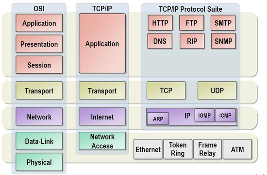
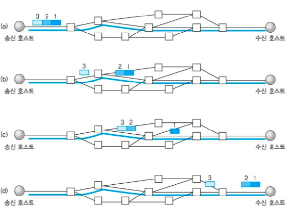
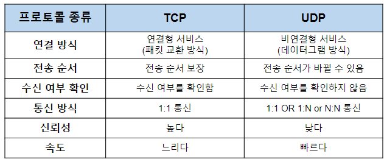

# TCP/UDP



OSI 7계층에서 전송계층은 **송신자와 수신자를 연결하는 통신서비스를 제공하는 계층**으로, 쉽게 말해 **데이터의 전달**을 담당한다.

그리고 데이터를 보내기 위해 사용하는 프로토콜이 있는데, 그 프로콜들이 바로 오늘의 주인공 **TCP**와 **UDP**이다.

## TCP(Transmission Control Protocol)

인터넷상에서 `데이터를 메세지의 형태로 보내기 위해 IP와 함께 사용하는 프로토콜`이다.

일반적으로 TCP와 IP를 함께 사용하는데, IP가 데이터의 배달을 처리한다면 TCP는 \*`패킷을 추적 및 관리`하게 된다.   
TCP는 `연결형 서비스`를 지원하는 프로토콜로 인터넷 환경에서 기본으로 사용한다.



### TCP 특징

- 연결 지향 방식으로 패킷 교환 방식을 사용한다(가상 회선 방식이 아님).

- 3-way handshaking과정을 통해 연결을 설정하고 4-way handshaking을 통해 해제한다.

- 흐름 제어 및 혼잡 제어.

- 높은 신뢰성을 보장한다.

- UDP보다 속도가 느리다.

- 전이중(Full-Duplex), 점대점(Point to Point) 방식.

&nbsp;
&nbsp;

TCP가 연결 지향 방식이라는 것은 패킷을 전송하기 위한 **논리적 경로를 배정**한다는 말이다.  
그리고 3-way handshaking과정은 목적지와 수신지를 확실히 하여 정확한 전송을 보장하기 위해서 세션을 수립하는 과정을 의미한다.

TCP가 이러한 특징을 지니는 이유는 간단명료하다.
바로 TCP는 `연결형 서비스`로 **신뢰성을 보장**하기 때문이다. 그래서 3-way handshaking의 과정도 사용하는 것이고,
 **데이터의 흐름제어나 혼잡 제어**와 같은 기능도 한다. 하지만 이러한 기능때문에 UDP보다 속도가 느리게 된다.  
(이러한 기능은 CPU를 사용하기 때문에 속도에 영향을 주는 것이다)

그렇기에 TCP는 연속성보다 **신뢰성있는 전송이 중요할 때**에 사용하는 프로토콜로 예를 들면 파일 전송과 같은 경우에 사용된다.

- **패킷(Packet)이란?**

```
인터넷 내에서 데이터를 보내기 위한 경로배정(라우팅)을 효율적으로 하기 위해서 데이터를 여러 개의 조각들로 나누어 전송을 하는데 이때, 이 조각을 패킷이라고 한다.
```

&nbsp;

### 3 way-handshake

양쪽 모두 **데이타를 전송할 준비가 되었다는 것을 보장**하고, 실제로 데이타 전달이 시작하기전에 한쪽이 다른 쪽이 준비되었다는 것을 알수 있도록 한다.

양쪽 모두 상대편에 대한 초기 순차일련변호를 얻을 수 있도록 한다.

- **TCP의 3-way Handshaking 과정**


1. A클라이언트는 B서버에 접속을 요청하는 `SYN 패킷`을 보낸다. 이때 A클라이언트는 SYN 을 보내고 SYN/ACK 응답을 기다리는 `SYN_SENT` 상태가 되는 것이다.

2. B서버는 SYN요청을 받고 A클라이언트에게 요청을 수락한다는 `ACK` 와 `SYN flag` 가 설정된 패킷을 발송하고 A가 다시 ACK으로 응답하기를 기다린다. 이때 B서버는` SYN_RECEIVED` 상태가 된다.

3. A클라이언트는 B서버에게 `ACK`을 보내고 이후로부터는 연결이 이루어지고 데이터가 오가게 되는것이다. 이때의 B서버 상태가 `ESTABLISHED` 이다.위와 같은 방식으로 통신하는것이 신뢰성 있는 연결을 맺어 준다는 TCP의 3 Way handshake 방식이다.

### 4 way-handshake

3-Way handshake는 TCP의 연결을 초기화 할 때 사용한다면, 4-Way handshake는 **세션을 종료하기 위해 수행되는 절차**이다.


1. 클라이언트가 연결을 종료하겠다는 `FIN플래그`를 전송한다.

2. 서버는 일단 확인메시지를 보내고 자신의 통신이 끝날때까지 기다리는데 이 상태가 `TIME_WAIT`상태다.

3. 서버가 통신이 끝났으면 연결이 종료되었다고 클라이언트에게 `FIN플래그`를 전송한다.

4. 클라이언트는 확인했다는 메시지를 보낸다.

&nbsp;

그런데 만약 "Server에서 FIN을 전송하기 전에 전송한 패킷이 Routing 지연이나 패킷 유실로 인한 재전송 등으로 인해 FIN패킷보다 늦게 도착하는 상황"이 발생한다면 어떻게 될까?

Client에서 세션을 종료시킨 후 뒤늦게 도착하는 패킷이 있다면 이 패킷은 Drop되고 데이터는 유실될 것이다. 이러한 현상에 대비하여 Client는 Server로부터 FIN을 수신하더라도 일정시간(디폴트 240초) 동안 세션을 남겨놓고 잉여 패킷을 기다리는 과정을 거치게 되는데 이 과정을 `TIME_WAIT` 라고 한다.

## UDP(User Datagram Protocol)

`데이터를 데이터그램 단위로 처리하는 프로토콜`이다.

여기서 데이터그램이란 독립적인 관계를 지니는 패킷이라는 뜻으로, UDP의 동작방식을 설명하자면 다음과 같다.


TCP와 달리 UDP는 비연결형 프로토콜이다. 즉, 연결을 위해 할당되는 논리적인 경로가 없는데,   
그렇기 때문에 **각각의 패킷은 다른 경로로 전송**되고, 각각의 패킷은 독립적인 관계를 지니게 되면서 이렇게 데이터를 서로
다른 경로로 독립적으로 처리하게 된다. 이러한 프로토콜을 UDP라고 한다.

### UDP 특징

- 비연결형 서비스로 데이터그램 방식을 제공한다

- 정보를 주고 받을 때 정보를 보내거나 받는다는 신호절차를 거치지 않는다.

- UDP헤더의 CheckSum 필드를 통해 최소한의 오류만 검출한다.

- 신뢰성이 낮다

- TCP보다 속도가 빠르다

&nbsp;
&nbsp;

UDP는 비연결형 서비스이기 때문에, **연결을 설정하고 해제하는 과정이 존재하지 않는다.**  
서로 다른 경로로 독립적으로
처리함에도 패킷에 순서를 부여하여 재조립을 하거나 흐름 제어 또는 혼잡 제어와 같은 기능도 처리하지 않기에 **TCP보다
속도가 빠르며 네트워크 부하가 적다**는 장점이 있지만 **신뢰성있는 데이터의 전송을 보장하지는 못한다.**  
그렇기 때문에 신뢰성보다는 연속성이 중요한 서비스 예를 들면 실시간 서비스(streaming)에 자주 사용된다.

&nbsp;

- **흐름제어(Flow Control)와 혼잡제어(Congestion Control), 오류 제어(Error Control)란?**

``` 
흐름제어는 데이터를 송신하는 곳과 수신하는 곳의 데이터 처리 속도를 조절하여 수신자의 버퍼 오버플로우를 방지하는 것이다. 예를 들어 송신하는 곳에서 감당이 안되게 데이터를 빠르게 많이 보내면 수신자에서 문제가 발생하기 때문이다.

혼잡제어는 네트워크 내의 패킷 수가 넘치게 증가하지 않도록 방지하는 것이다. 만약 정보의 소통량이 과다하면
패킷을 조금만 전송하여 혼잡 붕괴 현상이 일어나는 것을 막는다.

마지막으로 오류제어는 오류 검출(Error Detection) 과 재전송(Retransmission) 을 포함한다. 프레임이 손상되었거나 손실되었을 경우, 재전송을 통해 오류를 복구한다.
```

## TCP/UDP 비교



## 예상 질문

- TCP와 UDP의 차이를 설명해주세요.
- 3 way-handshaking 얘기 해주셨는데, TCP 통신은 종료시에도 3 way-handshaking을 사용하나요? 3 way-handshake와 4 way-handshake를 설명해주세요.
- 흐름 제어와 혼잡 제어, 오류 제어에 대해 간단히 설명해주세요.

## 참고 링크

https://dev-coco.tistory.com/161  
https://mangkyu.tistory.com/15  
https://dev-coco.tistory.com/144  
https://mindnet.tistory.com/entry/%EB%84%A4%ED%8A%B8%EC%9B%8C%ED%81%AC-%EC%89%BD%EA%B2%8C-%EC%9D%B4%ED%95%B4%ED%95%98%EA%B8%B0-22%ED%8E%B8-TCP-3-WayHandshake-4-WayHandshake  
https://github.com/GimunLee/tech-refrigerator/blob/master/Network/%ED%9D%90%EB%A6%84%EC%A0%9C%EC%96%B4%20%26%20%ED%98%BC%EC%9E%A1%EC%A0%9C%EC%96%B4%20%26%20%EC%98%A4%EB%A5%98%EC%A0%9C%EC%96%B4.md
