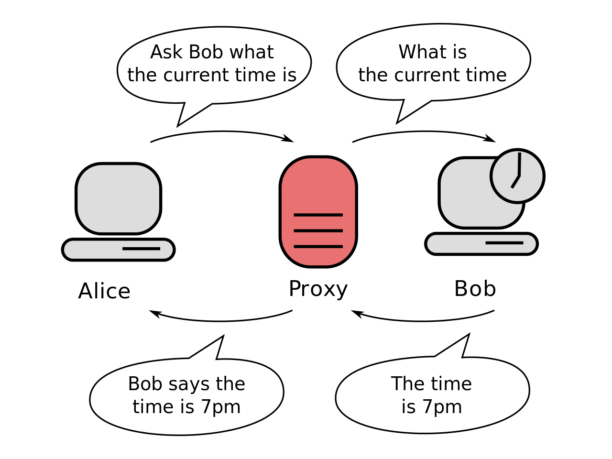
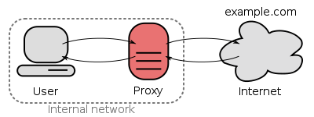
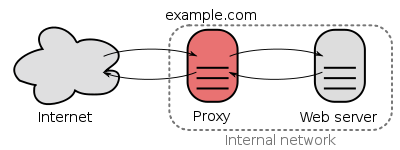

# Proxy Server

프록시 서버란 클라이언트가 **자신을 거쳐 다른 네트워크에 접속할 수 있도록 중간에서 대리해주는 서버**를 말한다.  
서버와 클라이언트 사이에서 대리로 통신을 수행해주는 것을 프록시라고 하고 그 기능을 하는 서버를 프록시 서버라 부르게 되는 것이다.

즉, 프록시 서버는 서버와 클라이언트 사이에서 요청과 응답을 처리해주게 되는 것이다.

1. 클라이언트에서 프록시 서버로 데이터 전송

2. 프록시 서버에서 다시 웹 서버로 웹 요청

3. 웹 서버에서 프록시 서버로 웹 응답

4. 프록시 서버에서 클라이언트로 데이터 전송

## 프록시 서버의 사용 목적

### 1. 개인정보 보호

- 프록시 서버가 없는 경우, 사용자가 네이버에 들어갈 때 IP 주소가 전달이 된다.
- 프록시 서버가 있는 경우, 프록시 서버의 IP를 전달한다. 즉, 사용자의 IP를 보호할 수 있디.

### 2. 속도 향상 - 캐시 사용

- 사용자가 네이버를 요청할 때, 프록시 서버를 통해 네이버 서버로 네이버 웹 페이지를 가져온다.
- 가져온 웹 페이지를 프록시 서버의 DB에 최근 데이터를 저장하고 사용자에게 전달한다.
- 이것을 캐시(Cache)라고 한다.
- 다른 사용자가 같은 프록시 서버로 네이버를 요청하면 네이버 서버로부터 네이버 웹 페이지를 요청하지 않고 저장된 캐시를 이용해 바로 네이버 웹 페이지를 사용자에게 바로 전달한다.
- 캐시 기능을 사용하면 외부 네트워크를 통해 요청 횟 수가 줄어들어 대역폭을 줄이는 효과도 있다.

### 3. 로그 기록 관리

- 요청할 서버에게 개인정보는 보호되지만 프록시 서버에는 사용자 기록이 남아있다.
- 사용자들의 정보를 제어할 수 있기 때문에 프록시 서버는 회사에서 많이 이용한다.
- 네트워크 관리자가 프록시 서버를 열어보면 직원들이 어떤 사이트에 접속했는지 확인이 가능하다.
- 또한, 프록시 서버는 방문할 수 있는 웹 사이트를 제한할 수 있다.

### 4. 방화벽

- 프록시 서버와 방화벽은 다르지만 보안을 위해 함께 사용한다.
- 프록시 서버는 요청을 방화벽은 네트워크 패킷을 제어한다.

### 5. 접속 우회

- 프록시 서버는 여러대 연길 시킬 수 있다.
- 사용자 -> 프록시 서버1 -> 프록시 서버2 -> 서버
- 사용자의 IP를 숨기기 위해 여러 프록시 서버를 경유하는 기술을 Proxy Chaining 이라고 한다.
- 해커들이 IP 주소를 숨기고 공격할 때 쓰는 수법으로 알려진 방법이다.

## 프록시 서버의 암호화

프록시 서버에서는 데이터를 암호화를 제공하지 않는다.

프록시 서버가 사용하는 네트워크는 공용망(Public Network)이기에 해커나 ISP에서 사용자가 보낸 데이터를 탈취할 수 있다.

정보를 암호화 하려면 VPN을 사용해야 한다.

VPN은 가상 네트워크로 서버와 클라이언트 간에 보안 처리된 터널을 만들어 놓는다. 이 터널에서는 암호화된 데이터를 주고 받기 때문에 보안이 유지된다.

프록시 서버 + 방화벽 + VPN은 필연적으로 같이 사용이 된다.

## 프록시 서버 종류

### 1. Forward Proxy

사용자 기준으로 인터넷에 노출되기 전 프록시 서버를 거쳐야하기 때문에 Forward라고 보면 된다.

내부망 -> 외부망으로 데이터 요청이 되는 형태이다.

캐시 기능이 있어 자주 사용되는 컨텐츠라면 성능 향상을 야기한다.
프록시 서버는 특정 사이트만 접근이 가능하도록 제한할 수 있다.  
예) 사용자가 인터넷으로 naver.com을 입력하면 프록시 서버가 naver.com을 가져와 사용자에게 전달한다.

사용자는 직접 서버에 도달한 것처럼 보이지만 내부적으로 프록시 서버가 중간에서 가로채 네트워크를 보호하고 있다.

### 2. Reverse Proxy

사용자 기준으로 인터넷에 노출된 요청을 프록시 서버를 지나기 때문에 Reverse라고 보면 된다.

외부망 -> 내부망으로 데이터 요청이 되는 형태이다.

프록시 서버가 요청을 받아서 실제 내부 서버에 있는 데이터를 받아와 클라이언트에게 전달한다.  
외부 접근으로부터 보호하기 위해 위와 같이 보안상으로 프록시 서버를 구성한다.

통상적으로 WAS 서버는 DB서버와도 함께 연동이 되어 있으므로 WAS가 공격당하면 DB서버도 함께 공격 당하는 문제가 발생한다.

네트워크 환경은 내부 네트워크와 외부 네트워크 사이의 위치한 DMZ를 가지고 있다. 이 구간에는 메일, 웹, FTP서버등 외부 서비스를 제공하기 위한 서버들이 위치하고 있다.

A기업이 특정 서비스를 만들어서 WAS서버를 DMZ쪽에 놓고 다이렉트로 사용을 해도 되지만, 대부분의 WAS 서버는 DB서버와도 함께 연동이 되어 있으므로 WAS가 털리게 된다면 DB서버도 함께 털리는 문제가 발생을 하게 된다.

이러한 이유들 때문에 Reverse Proxy를 두고 실제 서비스는 내부에 위치를 시키고 프록시 서버가 내부 서버와 통신을 해서 데이터를 받아오는 형식을 많이 사용하고 있다.

## 예상 질문

- 프록시 서버에 대해 설명해주세요
- 프록시 서버의 종류를 간단히 설명해주세요

## 참고 링크

https://liveyourit.tistory.com/251  
https://milkye.tistory.com/202
