### 주소 공간 (Address Space)

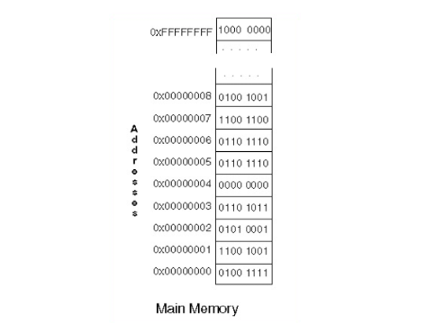

메모리의 주소 공간은 위와 같이 표현이 된다. CPU는 주소값을 통해 메모리에 접근할 수 있다. 메모리 단위는 비트(bit)가 아니라 바이트(byte)다. 위 그림에서 주소 한 칸은 1byte의 데이터를 저장할 수 있다. 즉, 주소 공간은 2^32 이고, 주소의 길이가 32비트를 의미란다.

<aside>
💡 **한정된 메모리 공간을 어떻게 하면 효율적으로 관리할 수 있을까?**

</aside>

CPU가 직접적으로 접근할 수 있는 저장 장치는 메모리이다. 이는 한정적이고 여러 개의 프로그램을 실행해야 하는 운영체제는 협소한 메모리 공간을 최대한 효율적으로 관리해서 CPU가 필요한 데이터를 빨리 끌어오는 것이 목표다. 

<aside>
💡 **CPU와 실행 중인 프로그램은 현재 메모리 몇 번지에 무엇이 저장된 지 알 수 있을까?**

</aside>

다음과 같은 이유로 알 수가 없다.

1. 메모리에 저장된 값들은 시시각각 변함
2. 새롭게 실행되는 프로그램은 새롭게 메모리에 기재
3. 끝난 프로그램은 메모리에서 삭제

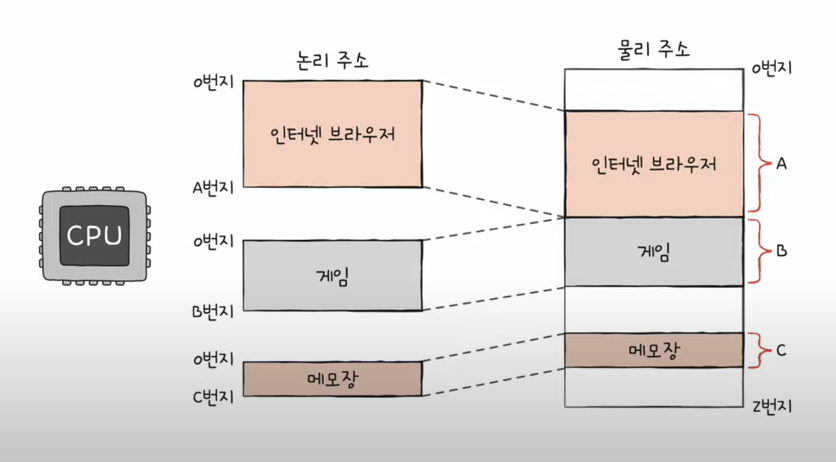

### 물리적 주소 (Physical Address)

메모리는 단순 저장장치에 불과하다는 것을 잊으면 안된다. 메모리의 기능은 데이터를 저장하는 컨테이너 그 이상 그 이하도 아니다. 배열이기 때문에 인덱스를 가지는데, 이 인덱스 값을 ‘물리적 주소’라고 한다. 물리적 주소는 메모리 자체의  인덱스이다.

### 논리적 주소 (Logical Address)

논리적 주소는 쉽게 말해서 **CPU 입장에서의 메모리 주소**, 또는 **프로그램 실행 중에 CPU가 생성하는 주소**이다. 따라서 가상 주소라고도  한다. 그리고 실행 중인 프로그램 각각에게 부여된 0번지부터 시작하는 주소이다. 논리적 주소가 없다면 모든 프로세스는 물리적 주소에 직접 접근할 수 있게 된다. 이러면 아무런 안전 장치가 없기 때문에 프로세스끼리 주소 공간을 침범할 수 있는 문제가 발생한다.

<aside>
💡 **Main Memory에서 서로가 침범하지 않도록 하면 어떻게 하지?**

</aside>

어디서부터 어디까지 자신의 공간이란 것을 표시를 하면 간단하다. 자기가 사용하는 주소 공간을 표현하기 위해서는 ‘시작 주소’와 ‘끝나는 주소’를 나타내는 레지스터가 정의돼 있는데, 이를 각각 ‘Base Register’와 ‘**Limit Register**’라고 부른다.

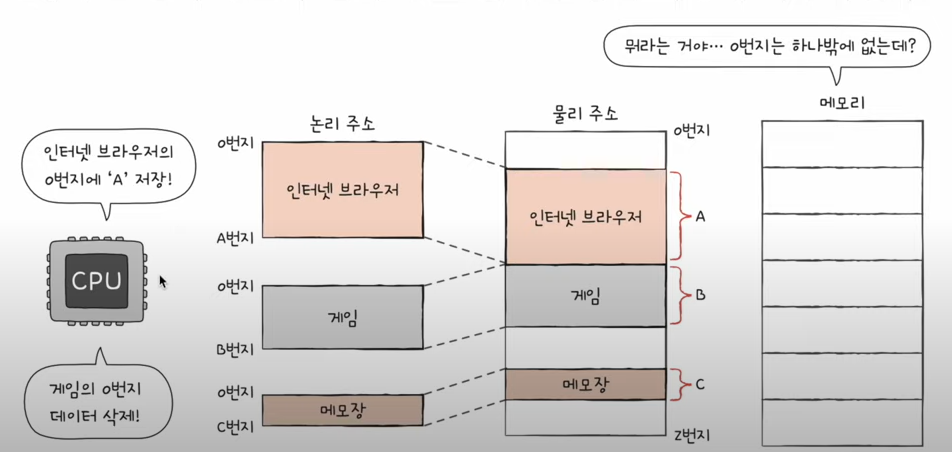

MMU(메모리 관리 장치)라는 하드웨어에 의해 변환

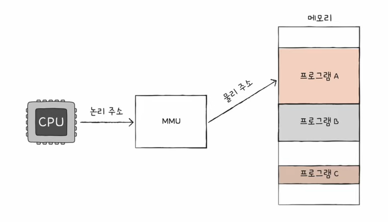

프로세스가 물리적 주소에 접근하려면 논리적 주소를 물리적 주소로 Mapping시키는 과정이 필요한데, MMU가 이 역할을 하게 된다. 주소 매핑 과정은 굉장히 빈번하게 이뤄지므로 하드웨어적으로 구현되어 있다. MMU의 역할은 굉장히 간단하다. 단순 논리적 주소에 **Base Register**를 더해주면 된다.


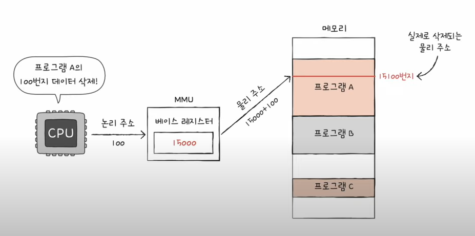

만일 MMU를 통해 변환된 주소 값이 다른 구역을 침범하게 된다면?


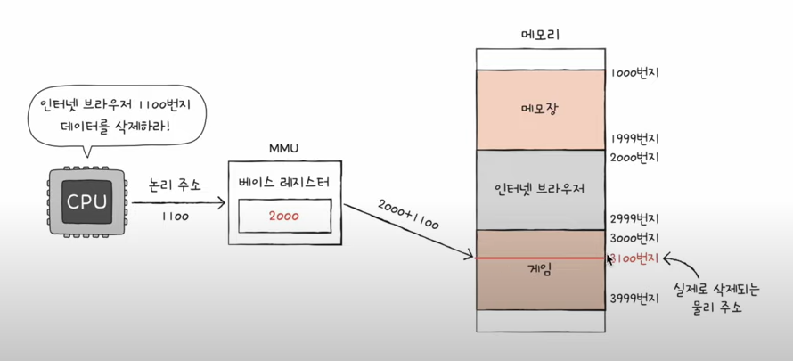

프로그램의 영역을 침범할 수 있는 명령어의 실행을 막을 수 있다.

Base Register ≤ 프로그램의 물리 주소 범위 < Base Rgister + Limit Register


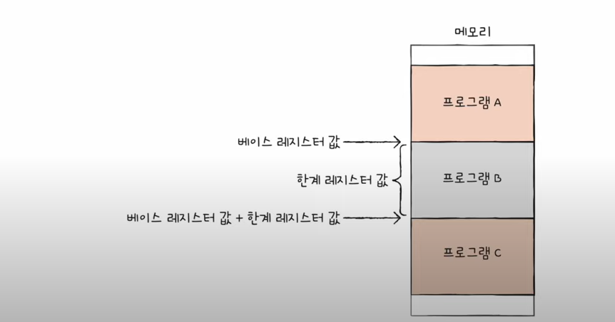

CPU는 메모리에 접근하기 전 접근하고자 하는 논리주소가 한계 레지스터보다 작은지를 항상 검사하는 작업을 수행하게 된다.


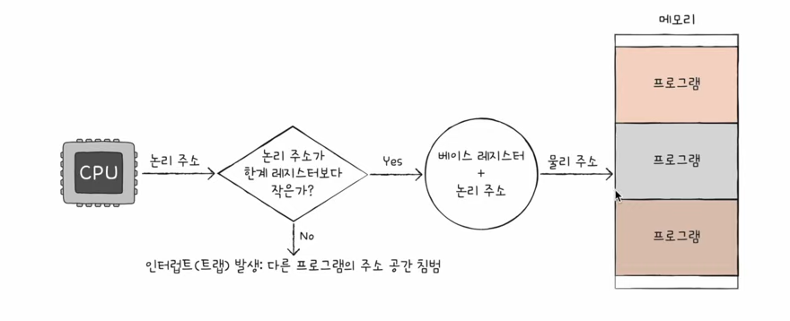

이로써 실행 중인 프로그램의 독립적인 실행 공간을 확보하고 하나의 프로그램이 다른 프로그램그을 침범하지 못하게 보호한다.

### 주소 바인딩

<aside>
💡 **논리적 주소를 물리적 주소를 언제 Mapping 시킬 것인가?**

</aside>

예시)

```c
data  = 10;
```

data 메모리 번지에 10을 write하는 과정이고 실제로 CPU가 명령어를 수행할 때 다음과 같이 표현한다.

```c
store $98000 10 // $98000은 data 논리적 주소
```

- **컴파일 타임 바인딩 (Compile Time Binding)**
    
    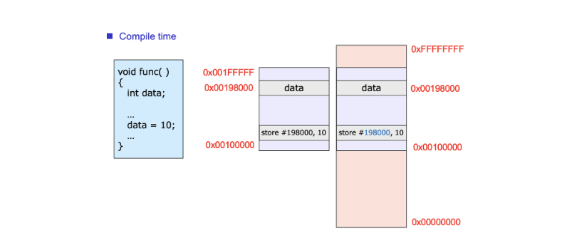
    
    컴파일 타임 바인딩은 프로그램이 컴파일 되는 시점에 실제 메모리 주소가 결정되는 방식을 의미합니다. 이 방식은 프로그램이 메모리에 올라가는 위치가 고정적이어야 하므로, 메모리 관리에 있어서 유연성이 떨어질 수 있습니다. 또한, 한번 컴파일된 프로그램은 메모리 위치를 변경할 수 없어서, 메모리 위치를 바꾸려면 프로그램을 다시 컴파일해야 합니다.
    
    메모리에 오직 한 개의 프로그램만 올라가는 경우라면 , compile time에 메모리 번지가 결정돼도 상관 없습니다.
    

- **로드 타임 바인딩 (Load Time Binding)**
    
    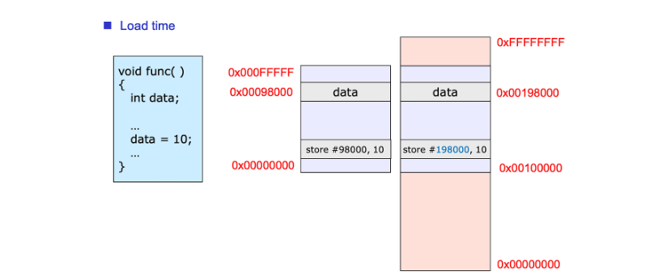
    
    로드 타임 바인딩은 프로그램이 메모리에 로드되는 시점에 실제 메모리 주소가 결정되는 방식을 말합니다. 컴파일 타임 바인딩과 비교할 때, 로드 타임 바인딩은 프로그램이 메모리에 로드될 때마다 실제 메모리 주소가 바뀔 수 있으므로 메모리 관리에 있어서 더 유연합니다. Relocation register가 제 기능을 하기 때문에 프로세스 주소가 어디에나 위치할 수 있기 때문이다. 프로그램 안에 모든 주소를 relocation 시켜야 하기 때문에 로딩할 때 시간이 오래 걸리는 문제가 발생한다.
    
    한번 relocation 되면 바뀌는 일이 없기 때문에 만약, 컴파일러가 주소를 특정할 수 없는 경우 전부 다시 relocation 해야한다. 예를 들어, 프로세스 크기가 불가피하게 다른 프로세스 영역을 침범하게 된다면 전체 코드를 복사해 여유가 있는 공간에 붙여넣기 하는 상황을 말한다.
    

- **실행 타임 바인딩 (Execution Time Binding)**
    
    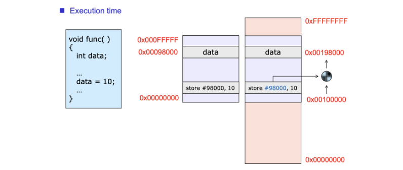
    
    실행 타임 바인딩은 프로그램이 실행되는 동안에 실제 메모리 주소가 결정되는 방식을 가리킵니다. 실행 타임 바인딩은 프로그램 실행 중에도 메모리 주소를 변경할 수 있어, 가장 유연한 메모리 관리 방식입니다. 하지만 이 방식은 복잡한 주소 변환 메커니즘과 높은 실행 시간 오버헤드를 수반할 수 있습니다.
    

**Load Time Binding vs Execution Time Binding**

로드 타임은 메모리에 로딩될 때 주소 변환을 미리 다 해놓는 경우이고, 실행 타임은 프로그램을 실행해서 그 코드가 실행될 때마다 주소를 변환하는 방법이다. 로드 타임의 경우 한 번마 바꿔놓으면 그 다음부터는 해당 주소로 접근하면 되는데, 실행 타임은 변환 작업을 반복 수행해야한다.

로드 타임의 경우 한 번에 변환을 실행하기 때문에, Relocation은 소프트웨어적으로 실행된다. 따라서 한 번 로딩할 때 시간이 오래 걸린다. 하지만 실행 타임은 Relocation이 빈번하게 일어나기 때문에 하드웨어적인 도움이 필요하다. 이 때 쓰는 것이 MMU이다.

### 예상 질문

- 물리적 공간과 논리적 공간이 나오게 된 이유가 뭔가요?
- 각각의 공간이 어떤 의미인지 말해주세요.
- MMU에 대해서 말해주세요.
- 공간을 할당할 때 어떤식으로 이뤄지는지 말해주세요.
- Load Time Binding, Execution Time Binding 차이를 말해주세요.

### 참고 링크

[[운영체제] 메모리 가상화 - 주소변환의 원리](https://80000coding.oopy.io/88ff06d7-7931-4019-9ac2-75a120fc83de)

[[컴퓨터 공학 기초 강의] 17강. 캐시 메모리](https://www.youtube.com/watch?v=qLCP0PwRp_w)

[[ 운영체제 ] 주소 공간(Address Space), 물리적 주소(Physical Address), 논리적 주소(Logical Address), 주소 바인딩(Address Binding)](https://charles098.tistory.com/103)