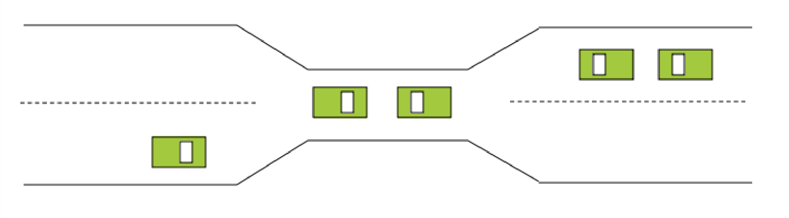
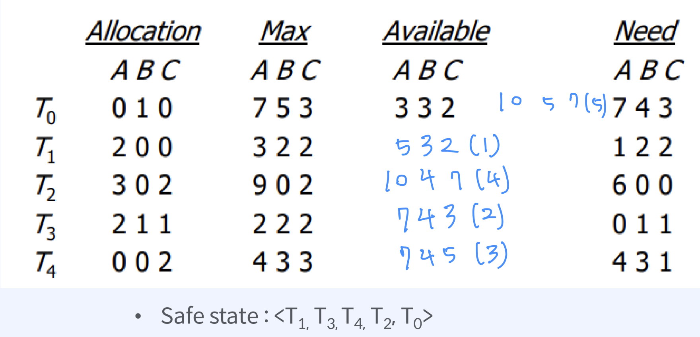
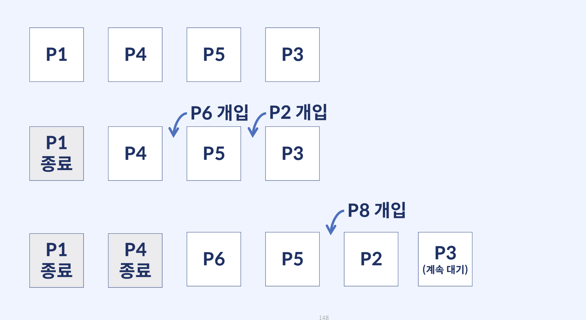

교착 상태(DedLock)는 두 개 이상의 프로세스들이 서로가 가진 자원을 기다리며 중단된 상태를 말한다.

- 그림의 자동차가 프로세스라고 가정해본다면, 어떻게 교착상태를 해결할 수 있을까?

  ⇒ 한 대의 차량이 후진하면 해결 가능하다.(선점 리소스 및 롤백)

    - 선점 리소스: 후진하는 차 덕을 보는 차
    - 롤백: 후진하는 차
- 교착상태 발생 시 여러 대의 차량을 후진시켜야할 수도 있다.
- 기아 발생 가능성이 있다.

## 교착 상태의 원인

아래 조건이 모두 성립해야 데드락이 발생한다.

1. 상호 배제(Mutual Exclusion)
    - 두 프로세스는 동시에 같은 자원에 접근할 수 없다.
    - 다른 프로세스가 그 자원을 요청하면, 요청 프로세스는 자원이 해제될 때까지 대기한 뒤 사용가능하다.
2. 점유하며 대기(Hold-and-wait)
    - 특정 프로세스가 점유한 자원을 다른 프로세스가 요청하는 상태.
    - 프로세스는 최소한 하나의 자원을 점유한 채, 현재 다른 프로세스에 의해 점유된 자원을 추가로 얻기 위해 반드시 대기해야 한다.
3. 비 선점(No preemtion)
    - 다른 프로세스의 자원을 강제적으로 가져올 수 없다.
    - 즉, 자원들을 선점할 수 없고, 점유하고 있는 프로세스가 태스크를 종료한 후에만 해제된다.
4. 순환 대기(Circular wait)
    - 자원들이 cyclic하게 점유한 자원들을 대기해야 한다.
    - 프로세스 A는 프로세스 B의 자원을 요구하고, 프로세스 B는 프로세스 A의 자원을 요구하는 등 서로가 서로의 자원을 요구하는 상황을 말한다.

## 교착 상태의 해결 방법

### 1) 교착 상태의 방지

> 자원이 어떻게 요청될 수 있는지를 좀 제한하는 것이 기본 원리라고 할 수 있으나, 어느정도 비효율적으로 작동하는 것을 감안한다는 의미하므로 추천되는 방법은 아니다.
>
1. 상호 배제(Mutual Exclusion)
    - ~~두 프로세스는 동시에 같은 자원에 접근할 수 없다.~~
    - ~~다른 프로세스가 그 자원을 요청하면, 요청 프로세스는 자원이 해제될 때까지 대기한 뒤 사용가능하다.~~
    - **⇒ 공유 가능한 리소스 설정(ex. 읽기 전용 파일)**
2. 점유하며 대기(Hold-and-wait)
    - ~~특정 프로세스가 점유한 자원을 다른 프로세스가 요청하는 상태.~~
    - ~~프로세스는 최소한 하나의 자원을 점유한 채, 현재 다른 프로세스에 의해 점유된 자원을 추가로 얻기 위해 반드시 대기해야 한다.~~
    - **⇒ 프로세스가 자원을 수행하기 전에 필요한 자원을 모두 요청하고 획득해야 함(최대 자원 할당)**
    - **⇒ 단점: 리소스 활용도가 낮고, 기아 발생 가능성이 있다.**
3. 비 선점(No preemtion)
    - ~~다른 프로세스의 자원을 강제적으로 가져올 수 없다.~~
    - ~~즉, 자원들을 선점할 수 없고, 점유하고 있는 프로세스가 태스크를 종료한 후에만 해제된다.~~
    - **⇒ 이미 할당된 자원에 대한 선점권이 없어야 한다.**
    - **⇒ 기존 사용중이던 프로세스가 작업 내용을 잃을 수 있기 때문이다.**
4. 순환 대기(Circular wait)
    - ~~자원들이 cyclic하게 점유한 자원들을 대기해야 한다.~~
    - ~~프로세스 A는 프로세스 B의 자원을 요구하고, 프로세스 B는 프로세스 A의 자원을 요구하는 등 서로가 서로의 자원을 요구하는 상황을 말한다.~~
    - ⇒ 리소스에 고유한 번호를 할당한다.
        - 번호 순서대로 리소스를 요청하도록 한다.

### 2) 교착 상태의 회피

- **실행 환경에서** 자원 요청에 대한 부가적인 정보를 이용해서 Deadlock의 가능성이 없는 경우에만 자원을 할당
    - **부가적인 정보** : 현재 사용 가능한 자원, 이미 할당된 자원, 앞으로 있을 자원 요청이나 반환 등
- 시스템 state가 원래 state로 돌아올 수 있는 경우에만 자원 할당

**은행가 알고리즘(뱅커스 알고리즘)**

- 상태를 안전 상태(safe state) / 불안전 상태(unsafe state)로 분류
- 안전 상태를 유지할 수 있는 요청만을 수락, 불안전 상태의 경우 추후 만족하는 상태로 바뀔 때까지 계속 거절
1. 현재 점유량(Aollocation): 현재 프로세스 별 할당 자원의 수
2. 최대 요구 자원(MAX): 프로세스 별 최대 자원의 요구
3. 현재 여유 자원(Available): 사용 가능한 자원의 수
4. 필요량(Need)
    1. 프로세스 별 추가로 필요한 자원의 수
    2. Need[i][j] = Max[i][j] - Allocation[i][j]
        1. i: 프로세스 인덱스, j: 자원 인덱스

### 3) Deadlock Detection and recovery (탐지 & 회복)

- Deadlock 발생은 허용하되 그에 대한 detection 루틴을 두어 Deadlock 발견 시 recover

**[ 복구 전략 ]**

1. 프로세스를 종료한다. (데드락에 빠진 프로세스 모두 강제 종료)(작업 중인 자료를 잃을 수 있어 risk가 큼)
2. 자원의 일시적인 선점을 허용한다.

### 4) Deadlock Ignorance (무시)

- Deadlock을 시스템이 책임지지 않음
- UNIX를 포함한 대부분의 OS가 채택

## 기아 상태(Starvation)

특정 프로세스보다 우선순위가 낮아 원하는 자원을 계속 할당받지 못하는 상태이다. 주로 priority scheduling에서 일어난다.

### 예상 질문

- 데드락이 무엇인가요?
- 데드락 발생조건 4가지를 설명해 주세요.
- 데드락의 해결방법에 대해서 설명해 주세요.

출처

https://github.com/devSquad-study/2023-CS-Study/blob/main/OS/os_deadLock.md

https://samsungsds.fastcampus.app/course-detail/206060

https://product.kyobobook.co.kr/detail/S000001834833