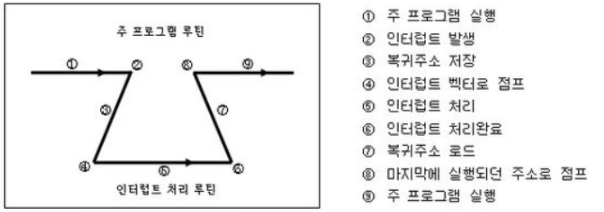

### 인터럽트란?

인터럽트는 CPU가 특정 기능을 수행하는 도중에 급하게 다른 일을 처리하기 위해 사용되는 기능입니다. 대부분의 컴퓨터는 한 개의 CPU를 사용하기 때문에 한 순간에는 하나의 일만 처리할 수 있습니다. 따라서, 현재 처리 중인 작업에 우선 순위가 더 높은 일이 발생했을 때 대처할 수 있는 방법이 필요합니다.

예를 들어, 키보드의 키를 누르면 해당 키의 코드 값이 키보드 버퍼에 입력되고, CPU에 인터럽트가 발생합니다. 이때 CPU는 현재 수행 중인 작업에 대한 정보를 저장한 뒤, 인터럽트 서비스 루틴(Interrupt Service Routine)을 실행합니다. 인터럽트 서비스 루틴은 키보드 버퍼에 있는 키 코드 값을 가져오는 등의 작업을 수행합니다. 인터럽트 처리가 완료되면 CPU는 이전에 처리하던 작업으로 돌아가게 됩니다.

인터럽트는 컴퓨터 시스템에서 여러 가지 용도로 활용됩니다. 예를 들어, 외부 장치의 입력을 실시간으로 처리하거나, 예외 상황을 적절히 처리하거나, 다중 프로그래밍 환경에서 프로세스 스케줄링을 효율적으로 관리하는 등의 기능을 수행합니다. 이를 통해 시스템의 효율성과 신뢰성을 높일 수 있습니다.

### 인터럽트는 왜 필요한가?

1. **프로세스 스케줄링:** 선점형 스케줄러 등의 시스템에서 현재 실행 중인 프로세스를 중단하고 다른 프로세스로 교체하기 위해 사용됩니다. 이를 통해 스케줄러는 실행 중인 프로세스를 중단시키고 다른 프로세스를 실행할 수 있습니다.
2. **I/O 상태 처리:** 프로세스가 I/O 작업이나 다른 작업을 수행해야 할 때 Blocked 상태가 되거나 종료되어 Ready 상태로 전환됩니다. 스케줄러는 이를 강제로 조정하는데, 이때 인터럽트가 사용됩니다.
3. **하드웨어 이벤트 처리:** 하드웨어 장치에서 발생하는 이벤트를 실시간으로 처리하는 데 사용됩니다. 예를 들어, 하드웨어 장치의 입력이나 예외 상황 등을 적절히 처리할 수 있습니다.
4. **예외 처리:** 예외 상황이 발생했을 때 이를 적절히 처리하는 데에 활용됩니다. 이는 프로그램의 안정성을 높이고 예외 상황에 대한 대처를 가능하게 합니다.
5. **효율적인 다중 프로그래밍:** 다중 프로그래밍 환경에서 프로세스 스케줄링을 효율적으로 관리하기 위해 사용됩니다. 이를 통해 여러 프로세스 간의 조율을 실시간으로 수행하며 시스템의 효율성과 신뢰성을 향상시킬 수 있습니다.

### 인터럽트의 종류

1. **외부 인터럽트 (External Interrupt):**
    - *정의:* 외부적인 요인에 의해 발생하는 인터럽트로, 시스템 외부에서의 변화에 대응합니다.
        
        외부 인터럽트는 주로 **입출력장치** 에 의해 발생된다.
        
        1. 타이머 인터럽트 : 타이머가 일정한 시간 간격으로 중앙처리장치에게 인터럽트를 요청
        2. 입출력 인터럽트 : 속도가 느린 입출력장치가 입출력 준비가 완료되었음을 알리기 위해 인터럽트를 요청
    - *예시:* 전원 이상 인터럽트, 기계 고장 인터럽트 등이 여기에 속합니다.
2. **입출력 인터럽트 (I/O Interrupt):**
    - *정의:* 입출력 장치의 작업이 완료되었거나 CPU의 처리가 필요한 경우에 발생하는 인터럽트로, 입출력 장치의 상태 변화를 감지하여 발생합니다.
    - *예시:* 입출력 연산의 완료를 알리는 역할을 합니다.
3. **내부 인터럽트 (Internal Interrupt):**
    - *정의:* 잘못된 명령어나 데이터를 사용할 때 발생하는 인터럽트로, 주로 프로그램 내의 오류나 예외 상황에 대응합니다.
        1. 하드웨어 고장(Hardware Interrupt)
            - 컴퓨터 고장
            - 데이터 전달 과정에서의 비트 오류
            - 전원이 나간 경우
        2. 실행할 수 없는 명령어 : 기억장치에서 인출한 명령어의 비트 패턴이 정의되어 있지 않은 경우
        3. 명령어 실행 오류 : 나누기 0을 하는 경우
        4. 사용 권한 위배 : 사용자가 운영체제만 사용할 수 있는 자원에 액세스하는 경우
    - *예시:* 0으로 나누는 경우, 오버플로우 또는 언더플로우, 프로그램 상의 오류, 잘못된 명령어 사용 등이 여기에 해당됩니다.
4. **소프트웨어 인터럽트 (Software Interrupt):**
    - *정의:* 소프트웨어에서 의도적으로 발생시키는 인터럽트로, CPU가 실행 중인 프로그램의 특정 지점에서 소프트웨어 인터럽트 명령을 만나면 발생하며, 특정 작업을 수행하기 위해 사용됩니다.
    - *예시:* 프로그램의 특정 지점에서 다른 작업을 수행하는 데 활용됩니다.

> ***내부 인터럽트 === 소프트웨어 인터럽트
외부 인터럽트 === 하드웨어 인터럽트***
> 

### 인터럽트 처리 과정

1. 현재 주 프로그램을 실행중 (①)
2. 인터럽트가 발생 (②)
3. 현재 진행중인 프로그램을 중단하고 현재 프로그램 상태를 저장한다. (③)
4. 인터럽트 서비스 루틴으로 점프 후 처리(④, ⑤, ⑥)
5. 인터럽트 작업이 끝나면 원래 하던 프로그램 상태 로드 (⑦, ⑧)
6. 다시 주 프로그램 실행(원래 하던 곳 이어서 진행) (⑨)

> 4번 과정을 추가적으로 설명하자면 인터럽트 벡터는 인터럽트가 발생했을 때, 그 인터럽트를 처리할 수 있는 서비스 루틴(ISR)들의 주소를 가지고 있는 공간이다.
> 

> 운영체제는 각종 인터럽트별로 인터럽트 발생 시 처리해야할 내용이 이미 프로그램되어 있으며 이를 인터럽트 서비스 루틴 또는 인터럽트 핸들러이다.
> 

---

### 참고 자료

[https://parkmuhyeun.github.io/etc/operating system/2022-08-28-Interrupt/](https://parkmuhyeun.github.io/etc/operating%20system/2022-08-28-Interrupt/)

[[컴퓨터구조] 인터럽트(Interrupt)란?](https://whatisthenext.tistory.com/147#내부-인터럽트)

---

### 예상 질문

1. **인터럽트란 무엇인가요? 인터럽트의 개념과 역할에 대해 설명해주세요.**
2. **내부 인터럽트와 외부 인터럽트의 차이점은 무엇인가요? 각각의 예시를 들어 설명해주세요.**
3. **인터럽트 처리 과정은 어떻게 이루어지나요? 인터럽트가 발생하면 어떤 일이 벌어지는지 설명해주세요.**