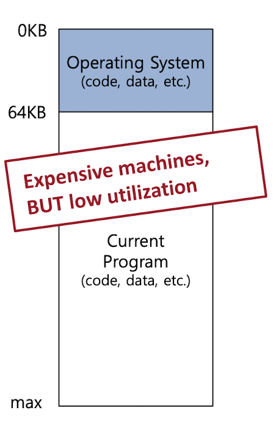
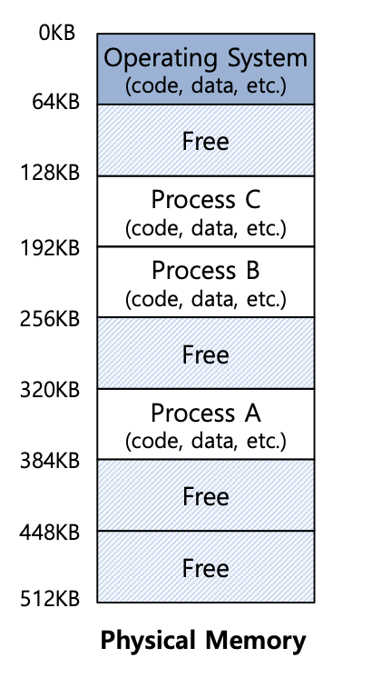
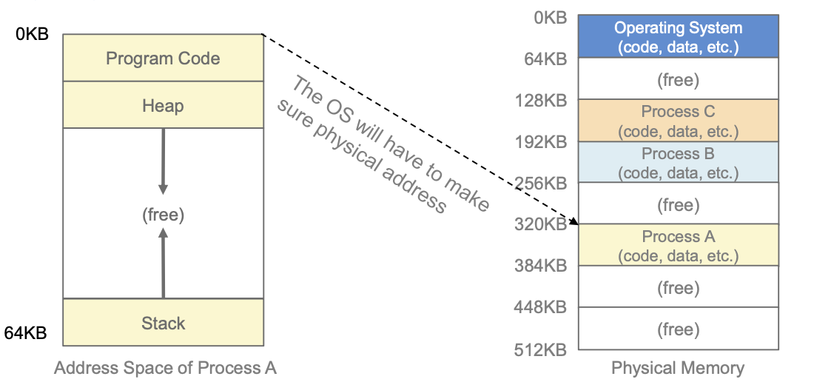
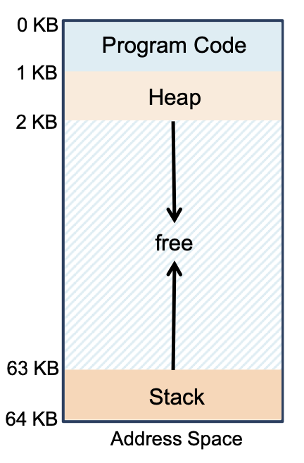
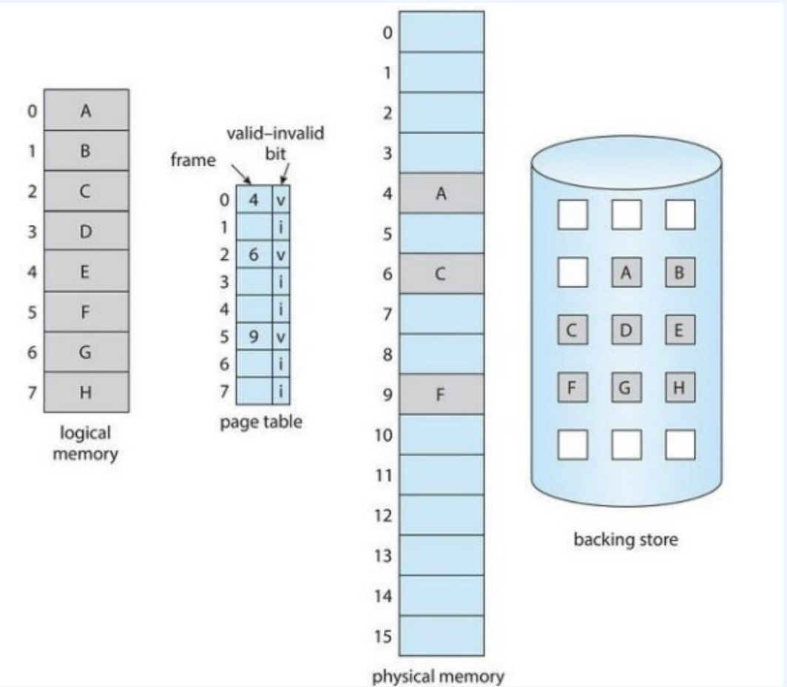
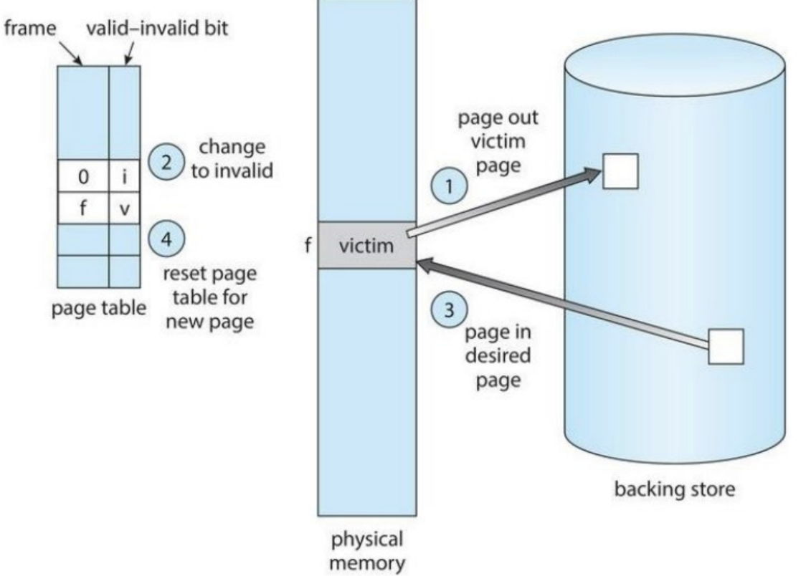

# The Abstractoin: Address Space

## OS in The Early System

- 다음은 초기 컴퓨터 메모리 구성은 다음과 같다.

- 초기 컴퓨터의 메모리 구성은 **추상화**라는 것이 없었다.
- 한번에 **하나의 Process가 전체 메모리를 사용**하고 있었다.
- 과거에는 하나의 프로그램을 실행할 때 OS와 하나의 Process만 사용했기 때문에, 메모리를 단순하게 사용해도 문제가 없었다.

## Multiprogramming and Time Sharing

- 하지만 최근 컴퓨터에서는 여러 개의 프로그램을 동시에 실행하기 때문에 **초기 컴퓨터의 메모리 구성으로는 활용성(utilization)과 효율성(efficiency)이 부족**해서 더 이상 사용할 수 없었다.
- 그래서 해결방안으로 Time Sharing 기법을 사용하여 여러 개의 프로그램을 실행하도록 메모리 구성을 다음과 같이 바꿨다.

- 하나의 메모리 공간에서 여러 개의 프로세스(multiple processes)가 실행할 수 있도록 메모리 안에 프로세스가 사용할 수 있는 공간을 나눴다.
- 그래서 하나의 메모리 공간에서 여러 개의 프로세스가 전환이 되므로 **활용성과 효율성이 증가**하게 되었다.
- 하지만 여러 개의 프로세스들이 한 번에 메모리에 접근하면, 기존에 실행 중인 프로세스에 접근할 수 있기 때문에 **보안상 문제**가 발생할 수 있다.

## Virtual Memory

- `Address space`(주소 공간)은 **OS가 실제 메모리를 `추상화(abstraction)` 해서 현재 실행 중인 프로그램(process)에게 나눠 주는 것**을 의미한다.

- 예를 들어, OS가 실제 메모리를 추상화해서 Process A에게 주소 공간을 나눠준다.
- 이때, `Process A`는 추상화된 주소 공간(가상 주소 공간)에서는 0~64KB라는 주소를 가지고 있고 0KB에 접근하지만, 실제 메모리(Physical memory)에서는 320 ~ 384KB라는 주소를 가지고 320KB에 접근한다.
- 여기서 중요한 점은 OS가 **`Process A`에게 특정 주소의 메모리에 Load 되고 잠재적으로 매우 큰 주소 공간을 가지고 있다고 착각하게 만드는 것**이 `메모리 가상화`의 핵심이다.

## Address Space

- 정리하자면, OS가 실제 메모리(physical memory)를 추상화해서 만든 것이 `Address space`(주소 공간)이다.
- Address space에는 현재 실행중인 프로그램, 즉 프로세스에 대한 모든 것이 들어있다.

- Address space 안에는 `Program code`, `Heap`, `Stack` 그리고 etc 등이 있다.
    - Program code : Data 영역을 포함하며, static 변수, 전역 변수가 저장되는 공간이다.
    - Heap : new() 또는 malloc()을 사용한 동적 할당된 데이터가 저장되는 공간이다.
    - Stack : 함수를 호출하여 위치를 추적할 수 있도록 return address 또는 values 가 저장되는 공간이다. 지역 변수도 포함된다.
- 현실적으로 하나의 프로세스가 전체의 메모리를 차지하지 않는다.
- 그러므로 `추상화`는 OS가 메모리를 **가상화**(virtualize)하기 위해 필요하다. OS가 실제 메모리를 추상화함으로써 여러 개의 프로그램을 동시에 실행할 수 있기 때문이다.
- Virtual address는 `Logical address`라고 부르기도 하며, CPU에 의해 만들어진 주소를 의미한다.
- Physical address는 메모리 장치에 의해 만들어진 주소이며, OS가 관리한다.

## Goal of Memory Virtualization

- 메모리를 가상화하는 점에는 다음과 같은 이점이 있다.
1. 프로그래밍에서의 사용이 편리하다.
2. Transparency(투명성)
    1. OS가 실행 중인 프로그램이 메모리가 가상화되는지 알지 못하도록 착각하게 만들어야 한다.
    2. 프로그램은 마치 자신에게 하나의 독립적인 실제 메모리가 있는 것처럼 작동해야 한다.
3. Efficiency(효율성)
    1. OS는 시간(times)과 공간(space)의 면에서 메모리를 효율적으로 사용해야 한다.
    2. 성능에 부정적으로 영향을 미치지 않도록 시간을 정하고, 가상화를 위한 최소한의 공간을 발생시키도록 공간을 정해야 한다.
    3. 이러한 효율성을 위해 OS는 TLB와 같은 하드웨어 지원을 받아야 한다.
4. Protection(보호)
    1. OS는 프로세스들로부터 프로세스를 보호하고 OS 자신도 프로세스로부터 보호해아한다.

### 요구페이징

- 실행 가능한 프로그램이 보조 저장소에서 메모리에 적재되는 방법을 생각해볼 때
    - 요구 페이징 가상 메모리를 사용하면, 프로그램 실행 중 요청이 있을 때만 페이지가 로드됨.
    - 액세스되지 않은 페이지는 물리 메모리에 적재되지 않음
    - 스왑 인(메모리를 읽어들이는 것), 스왑 아웃(메모리를 바깥으로 빼내는 것)을 관리하는 페이저 존재
- 메모리에 존재하는 페이지와 디스크에 존재하는 페이지를 구별하기 위해 하드웨어 지원이 필요
    - 유효-무효 비트(valid-invalid bit)
        - valid: 관련 페이지가 메모리에 존재함
        - invalid: 페이지가 유효하지 않거나, 유효하지만 현재 메모리에 존재하지 않고 보조 저장소에 있다는 의미

### 페이지 폴트

- 페이지 폴트(Page fault): 무효로 표시된 페이지에 대한 액세스
- 페이지 폴트 처리절차
    1. 유효한 메모리 접근인지, 무효한 메모리 접근인지 확인을 하기 위해 프로세스 내부 테이블을 확인한다.
    2. 유효하지 않은 경우 프로세스를 종료하고, 유효하지만 아직 해당 페이지를 가져오지 않은 경우 페이지를 입력한다.
    3. 비어있는 프레임을 검색한다.
    4. 원하는 페이지를 새로 할당된 프레임으로 읽어들이기 위해 2차 저장작업을 예약한다.
    5. 저장소 읽기가 완료되면 프로세스와 함께 유지되는 내부 테이블과 페이지 테이블을 수정하여 페이지가 현재 메모리에 있음을 나타낸다.
    6. 트랩에 의해 중단된 명령어를 재개하고, 프로세스는 메모리에 있었던 것처럼 페이지 액세스가 가능해진다.

### 페이지 교체

1. 보조 저장소에서 원하는 페이지의 위치를 검색한다.
2. 빈 프레임을 찾는다.
    1. 빈 프레임이 존재한다면 사용하면 된다.
    2. 빈 프레임이 존재하지 않는다면, 페이지 교체 알고리즘을 사용하여 희생 프레임을 선택한다.
    3. 희생 프레임을 (필요하다면) 2차 저장소에 기록하고, 그에 따라 페이지 및 프레임 테이블을 변경한다.
3. 원하는 페이지를 새롭게 비게 된 프레임으로 읽는다. 페이지 및 프레임 테이블을 변경한다.
4. 페이지 폴트가 발생한 유저 프로세스를 계속 진행한다.

- 수정 비트(혹은 더티 비트)를 사용하여 페이지가 수정되지 않은 경우 I/O 시간을 1/2로 줄이기 때문에 페이지 폴트를 처리하는데 필요한 시간을 크게 줄일 수 있다.
- 프레임 할당 알고리즘
    - 메모리에 여러 프로세스가 있는 경우 각 프로세스에 할당할 프레임 수 결정이 필요하다.
- 페이지 교체 알고리즘
    - 페이지 교체가 필요한 경우 교체할 프레임을 선택해야한다.
    - FIFO: 가장 간단한 페이지 교체 알고리즘. 페이지를 교체해야 하는 경우 가장 오래된 페이지가 선택된다.
    - 최적 페이지 교체: 모든 알고리즘 중 가장 낮은 페이지 폴트율을 계산하여 페이지를 교체한다. 구현하기 어렵다는 단점이 있다.
    - LRU(Least-Recently-Used) 페이지 교체: 최적 알고리즘의 근사치. 마지막으로 사용된 각 페이지를 교체한다.

## 예상 질문

- 메모리 가상화가 생긴 이유는 무엇인가요?
- 가상 메모리 계층 구조에 대해서 설명해 주세요.
- 메모리 가상화의 목적은 무엇인가요?

## Reference

- 학교 수업 내용 - [Operating Systems Three Easy Pieces](https://www.amazon.com/Operating-Systems-Three-Easy-Pieces/dp/198508659X)
- [[OS] 메모리 가상화를 위한 메모리 추상화, 주소 공간](https://icksw.tistory.com/129)