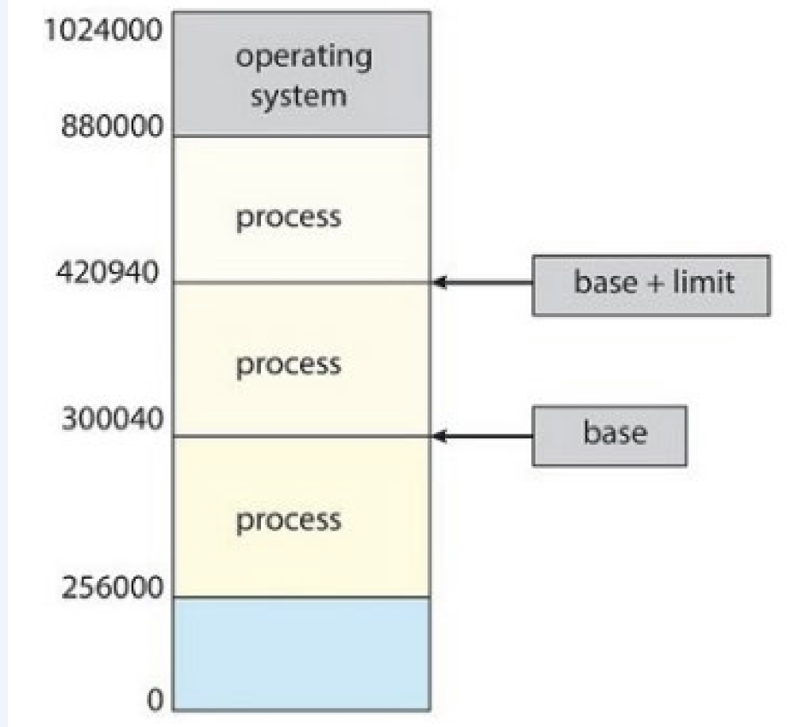
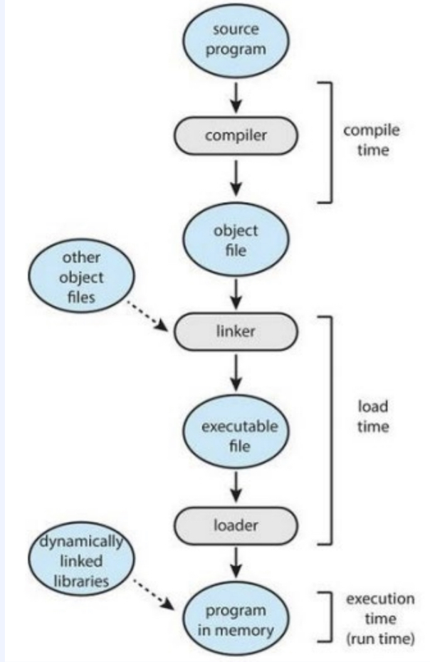
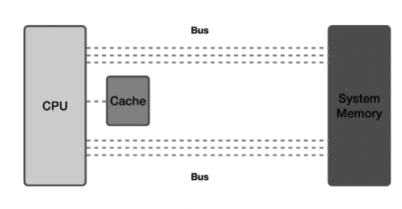
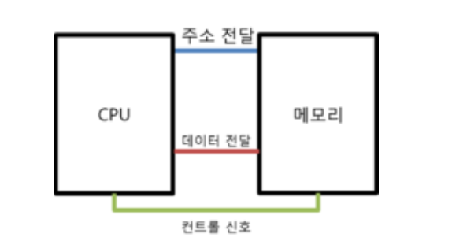
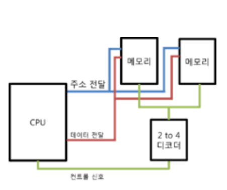

# 운영체제 - 메모리 계층

# 메모리 (Memory)

메인 메모리란

- **PU가 직접 접근할 수 있는 기억장치**
- 프로그램이 실행될 때 프로그램이 복사되어 메모리에 적재 ⇒ 프로세스가 됨
- CPU는 PC(프로그램 카운터)가 지시하는 대로 연산을 수행한 후 메인 메모리에 데이터를 저장하거나 필요한 데이터를 요구

### 프로세스와 메모리 공간의 보호

- 각 프로세스는 별도의 메모리 공간이 존재한다.

  

    - 기본 레지스터(Base Register): 가장 합법적인 물리 메모리 주소
    - 상한 레지스터(Limit Register): 주어진 영역의 크기
- 기본과 상한 레지스터는 하드웨어를 통하여 유저 프로그램이 운영체제나 다른 유저의 데이터 구조를 수정하는 것을 방지한다.

### 주소의 할당(Address Binding)

- 프로그램이 실행되려면, 메모리로 적재한 뒤 프로세스 컨텍스트 내에 배치해야 한다.
- 유저 프로그램이 실행되기 전 주소 바인딩 단계

  

    1. 원시 프로그램에서의 주소는 일반적으로 기호(symbolic) 형태로 표현
    2. 컴파일러는 이런 기호 주소를 재배치 가능한 주소에 바인딩
    3. Linker나 Loader는 재배치 가능한 주소를 절대 주소로 바인딩
- 가상 주소에서 실제 주소로의 실행 시간 매핑은 MMU(메모리 관리 장치; Memory Management Unit)라고 하는 하드웨어 장치에 의해 수행
    - 주소가 메모리로 전송될 때, 유저 프로세스에 의해 생성된 모든 주소에 재배치 레지스터(기본 레지스터)의 값이 추가됨
    - 유저 프로그램은 실제 물리적 주소에 절대 접근할 수 없음.

## 1. 메모리의 특징

- **지역성** : 데이터 접근이 시간적, 혹은 공간적으로 가깝게 일어나는 것
    - **시간적 지역성(Temporal locality)** : 특정 데이터가 한 번 접근되었을 경우, 가까운 미래에 또 한 번 데이터에 접근할 가능성이 높음
    - **공간적 지역성(Spatial locality)** : 액세스 된 기억장소와 인접한 기억장소가 액세스 될 가능성이 높음
- 지역성 원리를 이용하여 계층으로 구성됨
    - 위로 갈수록 접근시간 감소, 속도 증가, 비용 비쌈, 용량 적음
- 성능 결정 요인 : 기억용량(capacity), 접근시간(access time), 사이클 시간(cycle time), 기억장치 대역폭(bandwidth), 가격(cost)

## 2. 메모리 계층 = 기억장치 계층

✔ 세 가지 주요 특성인 **용량, 접근속도, 비용** 간의 절충 관계를 파악해 필요에 따라 채택할 수 있게 나타낸 구조

- 메모리를 필요에 따라 여러종류로 나누면 **CPU가 메모리에 더 빨리 접근** 가능함
- 각각의 특징이 있는 서로 다른 종류의 저장 장치를 함께 사용하여 **최적의 효율**을 낼 수 있음

| 명칭 | 위치 | 접근속도 | 기억용량 | 휘발성여부 |
| --- | --- | --- | --- | --- |
| 레지스터 | CPU 내부 | 가장 빠름 | 가장 적음 | 휘발성 |
| 캐시 | CPU 내부 | 빠름 | 적음 | 휘발성 |
| 메모리(주기억장치) | CPU 외부 | 보통 | 보통 | 휘발성 |
| SSD(Solid State Disk) | CPU 직접 접근 불가 | 약간 낮음 | 많음 | 비휘발성 |
| 하드 디스크(보조기억장치) | CPU 직접 접근 불가 | 낮음 | 많음 | 비휘발성 |

> 하드디스크의 경우 데이터를 메모리로 이동시켜 접근가능하기 때문에 속도가 낮음
>

### 1) 레지스터(Register) 🚑

- **CPU가 요청을 처리하는 데 필요한 데이터를 일시적으로 저장하는 기억장치**
    - CPU는 자체적으로 데이터를 저장할 방법이 없으므로 메모리로 직접 데이터를 전송할 수 없음
    - → **연산을 위해서 반드시 레지스터를 거쳐야 하며**, 이를 위해 레지스터는 **특정 주소를 가리키거나 값을 읽어올 수 있음**
- 프로세서에 위치한 고속 메모리로, **프로세스가 바로 사용할 수 있는 데이터(소량의 데이터, 처리 중인 중간 결과 등)를 담고 있는 영역**

### [ CPU 내부 레지스터 종류 ]

| 종류 | 설명 |
| --- | --- |
| 프로그램 계수기(PC, Program Counter) | 다음에 실행할 명령어(instruction)의 주소를 가지고 있는 레지스터 |
| 누산기(AC, ACcumulator) | 연산 결과 데이터를 일시적으로 저장하는 레지스터 |
| 명령어 레지스터(IR, Instruction Register) | 현재 수행 중인 명령어를 가지고 있는 레지스터 |
| 상태 레지스터(SR, Status Register) | 현재 CPU의 상태를 가지고 있는 레지스터 |
| 메모리 주소 레지스터(MAR, Memory Address Register) | 메모리로부터 읽어오거나 메모리에 쓰기 위한 주소를 가지고 있는 레지스터 |
| 메모리 버퍼 레지스터(MBR, Memory Buffer Register) | 메모리로부터 읽어온 데이터 또는 메모리에 써야할 데이터를 가지고 있는 레지스터 |
| 입출력 주소 레지스터(I/O AR, I/O Address Register) | 입출력 장치에 따른 입출력 모듈의 주소를 가지고 있는 레지스터 |
| 입출력 버퍼 레지스터(I/O BR, I/O Buffer Register) | 입출력 모듈과 프로세서 간의 데이터 교환을 위해 사용되는 레지스터 |
| 기본 레지스터(Base Register)  | 가장 합법적인 물리 메모리 주소 |
| 상한 레지스터(Limit Register) | 주어진 영역의 크기 |

### 2) 캐시(Cache) 🚗

**사용되었던 데이터는 다시 사용되어질 가능성이 높다**는 개념을 이용하여 데이터나 값을 **미리 복사해 놓는 임시 장소**

- **중앙처리장치와 주기억장치 간의 속도 차이 개선을 목적**
- **시스템의 효율성**을 위해 사용
    - 캐시의 접근 시간에 비해 원래 데이터를 접근하는 시간이 오래 걸리는 경우
    - 값을 다시 계산하는 시간을 절약하고 싶은 경우
- 속도가 빠른 장치와 느린 장치 사이에서 속도차에 따른 **병목 현상을 완화**하기 위한 범용 메모리

> 캐싱(Caching) : 캐시(Cache)라고 하는 좀 더 빠른 메모리 영역으로 데이터를 가져와서 접근하는 방식
>

### [ 종류 ]

- CPU 캐시
    - 대용량의 메인 메모리 접근을 빠르게 하기 위해 CPU 칩 내부나 바로 옆에 탑재하는 작은 메모리
    - 하드웨어를 통해 관리

| 종류 | 설명 | CPU 성능에 직접적인 영향 |
| --- | --- | --- |
| L1 캐시 | 일반적으로 CPU 칩안에 내장되어 데이터 사용 및 참조에 가장 먼저 사용되는 캐시 메모리 | O |
| L2 캐시 | - L1 캐시 메모리와 용도와 역할이 비슷 - 속도 : L1 캐시 > L2 캐시 > 일반메모리(RAM) | O |
| L3 캐시 | - L1 캐시, L2 캐시와 동일한 원리로 작동
- 대부분 CPU가 아닌 메인보드에 내장 | X |
- 디스크 캐시(=디스크 버퍼) :
    - 하드 디스크에 내장된 작은 컴퓨터가 소유한 작은 메모리
        - 하드 디스크에 내장된 작은 컴퓨터: 디스크 제어, 외부와의 인터페이스
        - 작은 메모리: 디스크에 입출력되는 데이터를 저장하는 작은 메모리
    - 일종의 기법(하드디스크와 RAM 사이 존재)
- 그 외
    - 소프트웨어적으로 관리
    - 페이지 캐시 : 운영체제의 메인 메모리를 하드 디스크에 복사해 놓는 캐시
        - ex) 웹 페이지 캐시

**캐시가 효율적으로 동작하기 위해서는 캐시가 저장할 데이터가 지역성을 가져야 함**

### [ 캐시히트(Cache Hit) ]

캐시 메모리에 찾는 데이터가 **존재**하였을 때

### [ 캐시미스(Cache Miss) ]

- 캐시 메모리에 찾는 데이터가 **존재하지 않을 때**, **메모리** 저장소로부터 필요한 데이터를 찾아 캐시 메모리에 로드
- 메모리에서 가져오게 되면 시스템 버스를 기반으로 작동하기 때문에 **속도가 느리다.**

### [ 캐시매핑(Cache maaping) ]

- 캐시가 히트되기 위해 매핑하는 방법
- 메모리 관리 장치(MMU)가 가운데에서 번역을 하여 물리 주소로 변환해준다.
- 매핑 방식
    1. 직접 매핑(Direct Mapping)
        1. 메모리 주소와 캐시의 순서를 일치시킨다.
        2. 메모리가 1~100까지 있고 캐시가 1~10까지 있다면
            1. 1~10까지의 메모리는 캐시의 1에 위치
            2. 11~20까지의 메모리는 캐시의 2에 위치
        3. 구현이 간단하지만 캐시가 효율적이지 않게 자꾸 교체되어야 하는일이 생긴다. → LRU 기법을 쓴다.
    2. 연관 매핑(Associative Mapping)
        1. 순서를 일치시키지 않는다.
        2. 필요한 메모리 값을 캐시의 어디든 편하게 저장할 수 있다.
        3. 찾는 과정은 태그마다 비교해야하기 때문에 복잡하고 느릴 수 있다.
        4. 하지만 정말 필요한 캐시들 위주로 저장할 수 있기 때문에 적중률은 높다.
    3. 직접 연관 매핑(Set Associative Mapping)
        1. 연관 매핑에 직접 매핑을 합쳐놓은 방식이다.
        2. 순서를 일치시키고 편하게 저장하되, 일정 그룹을 두어 그 그룹 내에서 편하게 저장시키는 것이다.
        3. 예를 들어 메모리가 1~100까지 있고, 캐시가 1~10까지 있다.
            1. 캐시 1~5에는 1~50까지의 데이터를 무작위로 저장시킨다.
        4. 블록화가 되어있기 때문에 검색은 좀더 효율적이고 직접매핑처럼 저장 위치에 대한 큰 제약이 있는 것은 아니기 때문에 적중률이 많이 떨어지지도 않는다.

[참고자료](https://ssoonidev.tistory.com/35)

### 3) 메인 메모리 (Main Memory) 🛵

- **주 기억장치**(= 1차 기억장치)
- 컴퓨터에서 수치·명령·자료 등을 기억하는 컴퓨터 하드웨어 장치
- **RAM(Random Access Memory)** : **휘발성** 기억 장치
    - 빠른 액세스를 위해 데이터를 단기간 저장하는 구성 요소
    - 사용자가 요청하는 프로그램이나 문서를 스토리지 디스크에서 메모리로 로드하여 각각의 정보에 액세스
    - 전원이 유지되는 동안 CPU의 연산 및 동작에 필요한 모든 내용이 저장
    - 전원 종료시 기억된 내용 삭제
    - `Random Access` : 어느 위치에서든 똑같은 속도로 접근하여 읽고 쓸 수 있다는 의미
    - DRAM과 SRAM이 있는데 주기억장치는 주로 DRAM을 의미한다. (SRAM은 캐시나 레지스터)

> 🙋‍♀️ DRAM과 SRAM이란?
>
>
> DRAM - Dynamic RAM
>
> - 동적 메모리
> - 전원이 계속 공급되더라도 주기적으로 재충전되어야 기억된 내용을 유지할 수 있다.
> - 주로 대용량의 기억장치에 사용되며 가격이 저렴하다.
> - 주로 RAM이라고 표현하는 것(주기억장치)은 거의 DRAM을 칭하는 것이다.
>
> SRAM - Static RAM
>
> - 정적 메모리
> - 전원 공급이 되는 동안은 기록된 내용이 지워지지 않기 때문에 재충전이 필요없다.
> - 접근 속도가 빠르고 가격이 비싸다는 특징이 있으며 주로 캐시메모리나 레지스터로 사용된다.
- **ROM(Read Only Memory)** : **고정 기억** 장치
    - 컴퓨터에 지시사항을 영구히 저장하는 **비휘발성** 메모리
    - 전원 종료시 기억된 내용 유지
    - 변경 가능성이 희박한 기능 및 부품에 사용
        - 소프트웨어 : 초기 부팅 관련 부분
        - 하드웨어 : 프린터 작동에 관여하는 펌웨어 명령 등
    - ROM은 주기억장치로 사용되기보다는 주로 기본 입,출력 시스템(BIOS), 자가 진단 프로그램(POST)같은 변경 가능성이 희박한 시스템 소프트웨어를 기억시키는데 이용한다.

### 4) 보조 기억장치 (Auxiliary Memory, Secondary Memory) 🚲

물리적 디스크가 연결되어 있는 기억장치

- **HDD(Hard Disk Drive), SSD(Solid State Drive)**
- 컴퓨터 전원을 꺼도 저장된 데이터가 사라지지 않음(**비휘발성**)
- 중앙처리장치와 직접 자료 교환 불가능
- 접근시간이 오래 걸림
- 일반적으로 주기억장치에 데이터를 저장할 때에는 DMA방식 사용
- CPU 직접 접근 불가

> 주기억장치 vs 보조기억장치
>
>
> 주기억 장치인 메모리는 CPU가 직접 접근 가능하지만, 보조기억장치인 디스크는 먼저 주기억 장치에 적재되어야 CPU가 접근 가능함
>
> **CPU** : 사람의 두뇌
> **메모리** : 작업을 위한 공간(ex.책상,메모지) : CPU가 뭔가를 처리할 때 작업을 하는 공간
> **저장장치(디스크)** :저장을 위한 공간(ex.책장,정리노트) : 작업결과를 나중에 찾아 볼 수 있도록 작업의 내용을 저장하는 공간, 저장장치의 종류에는 컴퓨터 안에 들어 있는 하드디스크, 별도로 연결하는 외장하드, USB등이 있다.
>

## 3. 메모리 계층 구조의 필요성

### 1) 디코딩(명령어 해독 단계) 속도

- **디코딩(Decoding)** : 복호화라고도 하며, 부호화(Encoding)된 정보를 부호(code)화되기 전으로 되돌리는 처리 혹은 그 처리 방식
- CPU는 3개의 버스를 통해 메모리에 접근함
    - 주소 전달 버스 : CPU가 메모리의 어느 부분의 데이터를 접근할지 나타냄
    - 데이터 전달 버스 : 메모리와 CPU 간 데이터 전송
    - 컨트롤 신호 버스 (제어 버스) : 제어 신호 전달, CPU의 메모리 접근 여부 표시
- 그림 1 : 주소 전달 버스 및 데이터 전달 버스에 값이 존재할 때, 컨트롤 신호를 전송하는 즉시 CPU가 메모리 업무 수행
- 그림 2 : 디코딩하여 한 메모리에 컨트롤 신호 전달, 큰 메모리 용량을 사용할 경우 디코딩하는 데 더 많은 시간 소요됨
  → **CPU가 빠르게 데이터에 접근하기 위해서는 데이터를 저장하는 메모리가 작아야 함**

### 2) 자주 쓰는 데이터는 계속 자주 쓰임(참조의 지역성)

- 큰 메모리를 사용한다고 해도 그 안의 모든 데이터를 고르게 접근하지 않음
- **자주 쓰이는 데이터는 계속 자주 쓰이고, 자주 쓰이지 않는 데이터는 계속 자주 쓰이지 않음**
  운영체제·CPU → 자동으로 자주 쓰이거나 쓰일 것 같은 데이터를 메모리에서 **캐시**로 읽어옴
- 자주 쓰이는 데이터는 전체 데이터 양에 비해 **작은 양**이므로 캐시는 메모리보다, 메모리는 하드디스크보다 더 작아도 됨

### 3) 경제성

- 메모리 구조에서 상층에 속할수록 더 비쌈
- 비싼 하드웨어는 꼭 필요한 만큼의 크기만 사용
- 싼 하드웨어를 넉넉한 크기만큼 사용

### 메인 메모리를 휘발성 메모리로 사용하는 이유

- 주 기억장치로서 CPU의 데이터 처리에 있어 보조 기억장치보다 우선적으로 탐색의 대상이 되기 때문에, 빠르고 정확한 데이터 탐색을 위해서는 무한정 데이터를 저장하는 것이 아니라 사용자의 PC 이용 과정에서 생성된 다시 이용될 가능성이 높은 데이터만을 저장, 보관하는 것이 목적이기 때문이다.
- CPU는 방대한 보조 기억장치에서 데이터를 일일이 검색하는 것이 아니라 탐색 범위를 RAM으로 한정하면 되기 때문에 작업 효율을 높일 수 있다.
- RAM의 용량이 커지는 것은 필요하지 않은 데이터까지 전부 저장하기 위한 목적이 아니라, 고사양 프로그램을 구동할 수록 한 번에 연산이 요구되는 데이터의 크기가 방대하여 CPU의 메모리만으로는 연산 과정에서 우선 처리된 데이터가 뒤로 가면서 소실되는 것을 방지하여 정확한 데이터 처리를 지원함에 그 목적이 있다.

---

### ❓ 관련 질문

1. 만약 필요한 데이터가 하드디스크에 있다면, CPU에서 바로 하드디스크에 접근해서 데이터를 가져오면 더 빠를텐데 왜 굳이 모든 계층구조를 모두 통해서 가져올까요?
2. 캐시를 사용하는 이유는 무엇인가요?
3. 왜 불편하게 전원이 차단되면 모든 기억된 내용이 지워지는 휘발성 장치를 사용할까요?

### 📖 참고 자료