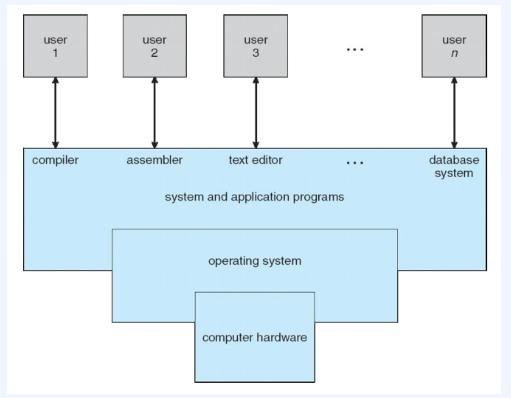

### 컴퓨터 시스템의 기본 구성

1. 하드웨어(CPU, 메모리, I/O 장치)
2. 운영체제
3. 응용 프로그램
4. 사용자(사람, 기계, 컴퓨터)

### 운영체제란?

- Operating System

  : 일반 컴퓨터나 노트북의 전원을 켜면 가장 먼저 만나게 되는 소프트웨어

  (컴퓨터 HW 바로 윗단에 설치되는 SW)

- 정의

  : 사용자에게 편리한 인터페이스를 제공하고 컴퓨터 시스템의 자원을 효율적으로 관리하는 소프트웨어

### 운영체제의 역할

1. 리소스 할당의 주체
    - 모든 리소스를 관리
    - 자원에 대한 충돌되는 요청 사이에서 효율적이고 공정하게 사용 리소스 분배
2. 제어 프로그램
    - 프로그램 실행을 제어, 오류 및 부적절한 사용 방지

### 운영체제의 구조

1. 커널 : 프로세스 관리, 메모리 관리, 저장장치 관리와 같은 운영체제의 핵심기능을 모아놓은 공간
    1. 시스템 호출
        - 커널이 자신을 보호하기 위한 인터페이스이다.
        - 커널은 사용자나 응용프로그램으로부터 컴퓨터 자원에 직접 접근하는 것을 막는다.
        - 시스템호출이라는 인터페이스를 이용하여 접근 하여야 한다.ex) 함수 호출
    2. 드라이버
        - 커널과, 하드웨어 사이의 인터페이스
        - 하드웨어 특성을 반영한 소프트웨어를 하드웨어 제작에게 받아 커널이 실행될 때 함께 실행되도록 하는 것이다.
        - 하드웨어는 커널에서 "직접" 연결되기도 하고, "드라이버"를 통해 연결되기도 한다.
2. 인터페이스: 사용자와 응용프로그램에 인접하여 커널에 명령어를 전달하고 실행결과를 돌려준다.

### 운영체제가 사용자의 편의성을 위해 제공하는 서비스

1. 유저 인터페이스(User Interface)
    - GUI(Graphic User Interface)
    - CLI(Command Line Interface)
    - 터치 스크린
2. 프로그램 실행
    - 시스템은 반드시 메모리에 프로그램을 적재하고, 실행하고,  구동 종료까지 가능하게 하도록 함.
3. I/O 수행
    - 실행 프로그램에 입출력이 필요할 경우 지원
4. 파일시스템 조작
    - 파일 및 디렉토리 읽기, 쓰기, 생성, 삭제 지원.
5. 통신
    - 동일하거나 다른 컴퓨터 시스템의 프로세스 사이의 통신을 가능하게 함.
6. 리소스 할당
    - 다수 개의 사용자 혹은 일을 동시에 처리할 때, 각각의 리소스에게 적당한 할당을 진행
7. 로깅
    - 어떤 프로그램이 얼마나 많은 / 어떤 종류의 컴퓨터 자원을 사용했는지 계속 추적
8. 보호와 보안
    - 다수 사용자나 네트워크 구성된 시스템이 동시 처리시 서로 방해되지 않도록 함

[[OS] 1. 운영체제와 컴퓨터](https://velog.io/@thalals/OS-1.-운영체제와-컴퓨터)

[Fastcampus](https://samsungsds.fastcampus.app/course-detail/206060)

### 예상 질문

1. 운영체제는 무슨 일을 하나요?
2. 운영체제는 어떻게 구성되나요?
3. 운영체제가 사용자의 편의성을 위해 제공하는 서비스는 어떤 것들이 있나요?