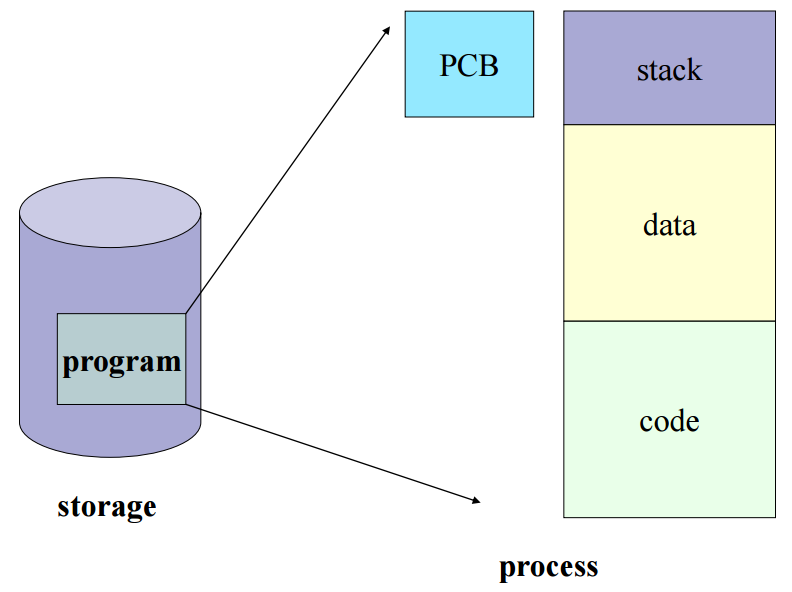
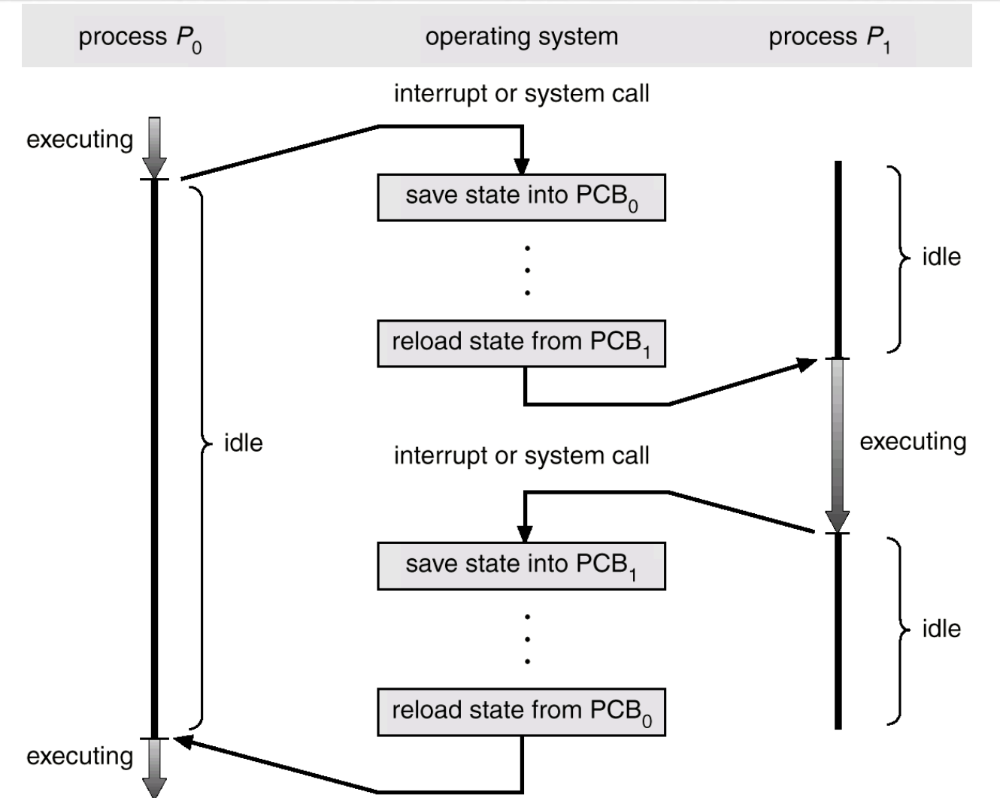

# PCB와 Context Switching

**프로세스 관리**란 구동중인 프로세스가 여러 개일 때, CPU 스케줄링을 통해 프로세스를 관리하는 것을 의미한다.  
이때 CPU 들은 각 프로세스들에 대해서 구분할 수 있어야 관리가 가능하다. 따라서 각기다른 프로세스들의 본연의 특징을 갖고 있는 **Process Metadata** 라는 정보를 활용한다.

프로세스 메타데이터가 담고있는 정보

- 프로세스 고유 ID (PID)
- 프로세스 상태
- 프로세스 우선순위
- Program Counter (PC)
- CPU 레지스터
- Owner
- Memory Limit
- 기타 등등

메타데이터는 프로세스가 생성될 때마다 **PCB (Process Control Block)** 이라는 곳에 저장된다.

## PCB (Process Control Block)

위에서 설명한 것처럼 프로세스들의 메타데이터를 저장하는 곳이며, **한 PCB 안에는 한 프로세스의 정보**가 담기게 되는 구조이다.

프로그램이 실행되어 메모리에 적재됐을 때 프로세스가 생겨나고, 프로세스 주소 공간에 코드&데이터&스택 공간이 생성된다. 이후 해당 프로세스의 메타데이터들이 PCB 에 저장된다.

CPU 에서는 프로세스의 상태에 따라 **프로세스 교체작업**이 이루어지게 된다.

만약 어떤 프로세스로부터 인터럽트가 발생해서, 현재 프로세스가 잠시 대기 상태가 되고 인터럽트가 발생된 프로세스를 실행 상태로 바꿔치기 할 때, 대기 중인 프로세스의 정보를 잃어버리게 되면 프로그램을 처음부터 다시 시작해야 한다. 이렇게 되면 사용자 입장에선 당혹스러울 것이다.

따라서, 대기하다가 다시 실행할 때 **대기 상태로 바뀌기 직전의 실행 정보를 고스란히 저장**해둔다면 다시 실행 상태로 돌아왔을 때 아무 일도 없었단 듯이 흘러갈 수 있을 것이다. 이 동작을 위해 PCB 가 필요한 것이다.

정리하자면, 프로세스 A 에서 B 로 교체될 때 아래와 같은 과정이 일어나게 된다.

    1. B 에서 인터럽트 발생
    2. A 의 현재 실행 정보를 PCB 에 저장
    3. A 를 대기 상태로 돌리고 B 를 실행 상태로 전환
    4. B 의 PCB 정보를 기반으로 실행 재개
    5. B 가 원하는 동작을 모두 수행함
    6. B 의 현재 실행 정보를 PCB 에 저장
    7. B 를 대기 상태로 돌리고 A 를 실행 상태로 전환
    8. A 의 PCB 정보를 기반으로 실행 재개

### PCB 관리 방식

**한 프로세스에 한 PCB**가 생성된다.

따라서 PCB 는 프로세스가 생성될 때마다 하나씩 늘어나게 되는데, 이 때 PCB 들을 관리하는 자료구조는 바로 **Linked List** 형태이다.

PCB List Head 에 PCB 들이 생성될 때마다 하나씩 이어붙게 된다.  
 주소값으로 연결되는 형태이기 때문에 새로운 녀석이 들어오거나, 기존의 녀석이 나갈 때 뛰어난 효율을 보이게 된다. (삽입 삭제에 용이한 Linked List 의 특성 활용)

프로세스가 종료된다면 PCB 도 제거된다.

## Context Switching

위에서 프로세스를 갈아끼우는 사례를 예로 들었는데, 이 프로세스를 갈아끼우는 행위 자체를 **Context Switching** 이라고 한다. 원래 실행중이던 프로세스의 상태를 PCB 에 보관하고, 새로 들어오는 프로세스의 PCB 정보를 바탕으로 레지스터에 값을 적재하는 과정을 일컫는 말이다.

보통 인터럽트 발생, 혹은 현재 프로세스의 선점 허용 기간을 모두 소모한 상황, 입출력을 위해 대기하는 경우에 Context Switching 이 발생하게 된다.

- idel: 유후상태
- excuting: 실행중인 상태

사실 Context Switching 을 하는 동안에는 CPU 가 아무것도 하지 못하게 된다.

따라서, 만일 쓰레드 및 프로세스의 개수가 엄청 많아져 Context Switching 이 빈번히 일어나게 된다면, 오버헤드가 잦아져 성능이 악화될 가능성도 있다.  
이를 **Context Switching Overhead** 라고 한다.

### Context Switching Cost

Context Switching이 발생하게 되며 다음과 같은 Cost가 소요된다.

- Cache 초기화
- Memory Mapping 초기화
- 메모리의 접근을 위해서 Kernel은 항상 실행되어야 함

위의 같은 문제점을 해결할려면, 여러 프로세스에 context switching을 하지 말고, 단일 프로세스에 여러 쓰레드를 생성하여 쓰레드에서 Context Switching을 하면 된다.

쓰레드의 경우, 메모리 공간을 공유하고 있어, 스택을 정리만 하면 되기 때문에 프로세스보다 비용이 적게 든다.

## 예상 질문

- Context Switching은 무엇인가요?
- 프로세스의 Context Switching Cost의 해결방안은 무엇일까요?

## 참고 링크

https://velog.io/@haero_kim/PCB-%EC%99%80-Context-Switching-%EC%95%8C%EC%95%84%EB%B3%B4%EA%B8%B0
https://velog.io/@heetaeheo/PCB-%EC%99%80-Context-Switching  
https://github.com/devSquad-study/2023-CS-Study/blob/main/OS/os_pcb_and_context_switching.md
