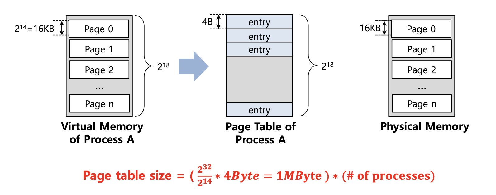
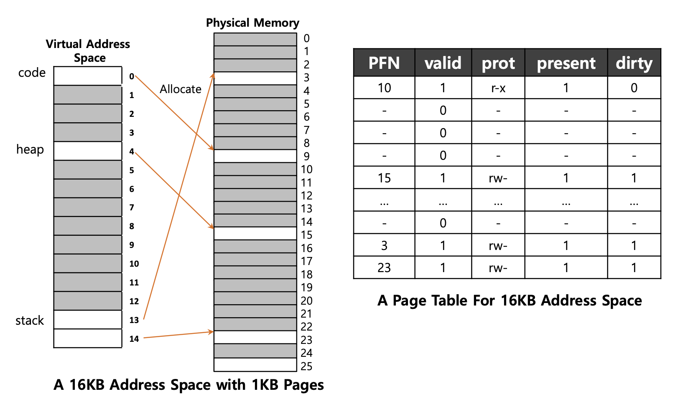
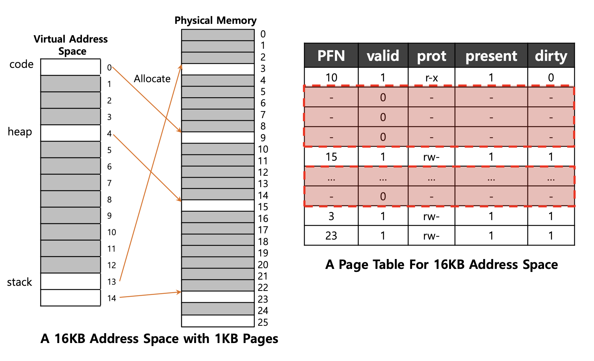
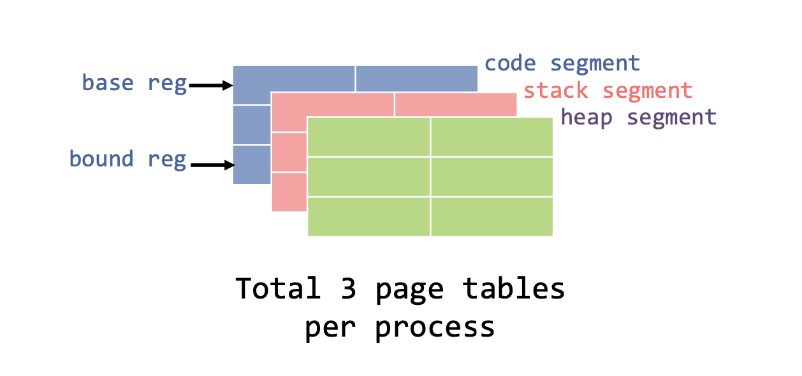
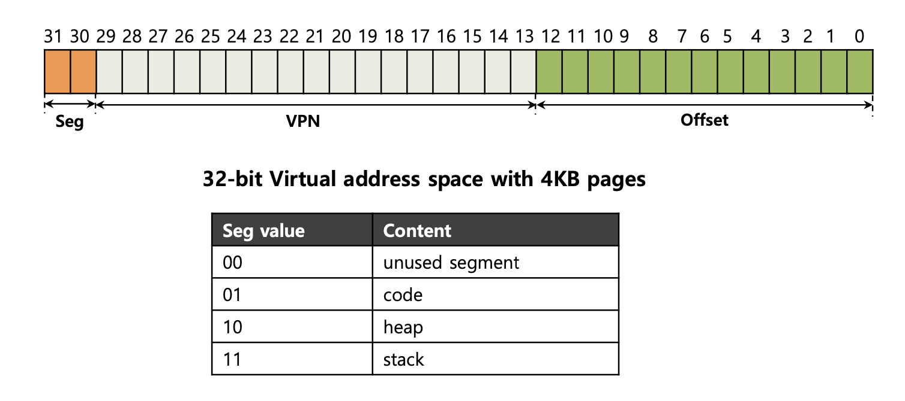
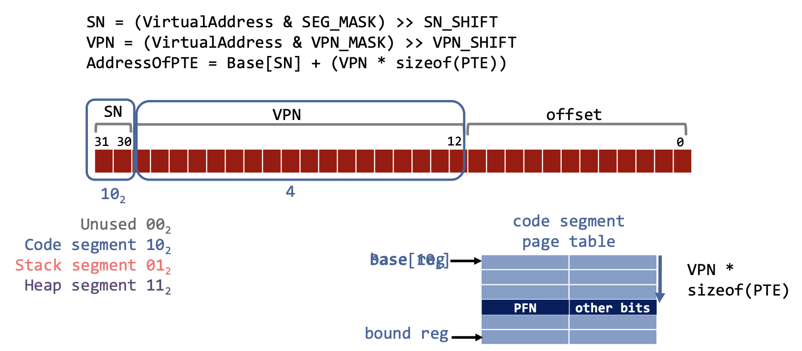
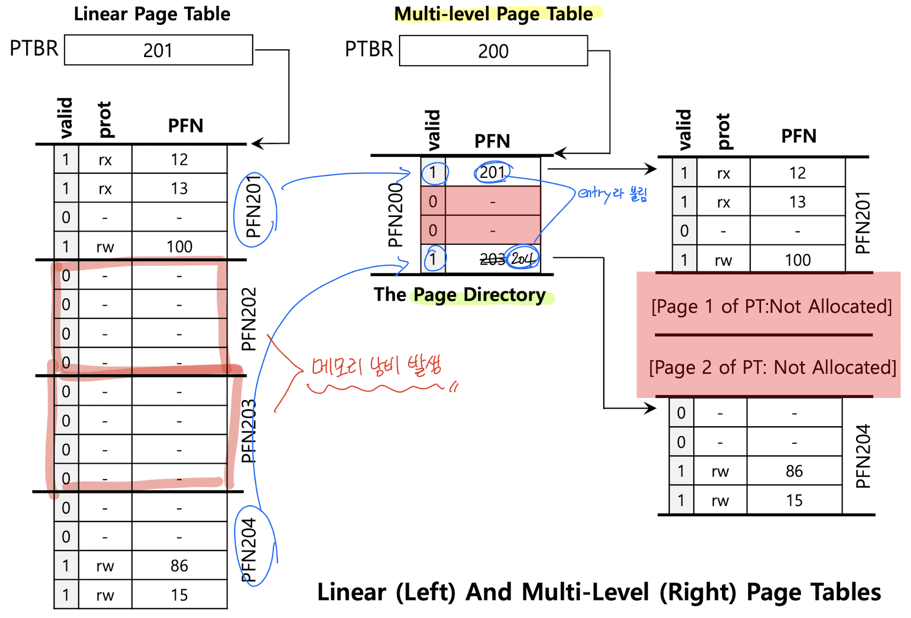

### Paging Table

주소 공간을 빈틈 없이 분할하여 관리하기 때문에 External fragmentation이 발생하지 않으며, Segmetation보다 상대적으로 개념이 단순해 관리하기 편한 장점이 있다. 하지만 페이지가 많아질수록 메모리를 엄청 잡아먹는다. TLB를 통해 연결 정보를 Caching해서 Locality를 이용해 빠르게 주소 변환을 수행할 수 있지만 Page table자체가 너무 많은 공간을 점유하는 이슈는 해결할 수 없다.

### Paging Table : Smaller Table

Paging에서 "Smaller Table"을 사용하는 이유는 메모리 절약을 위해서이다. 일반적으로 페이지 테이블은 각 프로세스마다 할당되며, 페이지 테이블의 크기는 가상 주소 공간의 크기에 비례한다. 그러나 페이지 테이블이 너무 크면 많은 메모리를 사용하게 되어 메모리 낭비가 발생할 수 있다.

"Smaller Table"은 페이지의 크기를 늘려서 페이지 테이블의 크기를 줄이는 방법이다. 페이지의 크기를 늘리면 페이지 테이블에 필요한 엔트리 수가 감소하므로, 페이지 테이블의 크기를 줄일 수 있고 이를 통해 메모리를 절약할 수 있다.

하지만 페이지 크기를 너무 크게 만들면 내부 단편화가 발생할 수 있다. 내부 단편화란 프로세스가 필요한 양보다 더 큰 메모리가 할당되어 남는 공간을 의미하며 따라서 페이지 크기를 선택할 때는 메모리 절약과 내부 단편화 사이에서 적절한 균형을 찾아야 한다.

### **Large Page: Smaller Table**

주소 공간의 비트 길이는 딱 정해져 있으므로, VPN과 Offset은 서로 한쪽이 커지면 한쪽이 그만큼 작아지는 관계이다. 

만약, 주소 공간이 32bit이고 페이지 크기를 4KB에서 16KB로 4배 늘어났다고 가정해볼 때, 원래 페이지 크기와 같은 의미를 가지는 Offset이 총 (2+10) 12bit였으니, 여기서 페이지 크기가 4배 늘어난다고 하면 Offset이 14bit로 늘어나는 것이므로 VPN은 18bit로 줄어들게 된다. 즉 주소 공간 안에 페이지가 총 2^18 만큼 존재하므로 PTE 크기를 4Byte로 잡으면 2^20 = 2^10 * 2^10 = 1MB 기존 크기의 1/4이 된다. 

문제는 메모리르 페이지 단위로만 떼어 줘야 하기 때문에 주어진 페이지의 크기보다 페이지를 조금만 사용할 때 발생하는 Internal fragmentation이 심해진다. 페이지를 쪼금씩만 떼어 준 것 같은데 어느새 페이지를 몽땅 내어줘버리는데, 심지어 놀고 있는 공간이 많아지는 것이기 때문에 그다지 좋은 선택지는 아닐 것이다.

### **Hybrid Approach: Paging and Segments**

위에서 생긴 문제점(Internal fragmentation)을 Segmentation을 통해 해결했었는데, 이에 착안해 Code, Stack, Heap을 따로 관리해보는 것이다.

각각의 Process는 연관된 3개의 Page table을 가진다고 가정한다.

- Page의 크기는 `4KB`, 가상 주소 공간의 크기는 `32-bit`, 4개의 Segment 중 `3개`만 사용한다고 가정한다.
- Process가 실행 중일 때 이러한 각 Segment의 `base 레지스터`는 해당 Segment에 대한 linear page table의 **실제 주소(physical address)가 포함**된다.

### TLB miss

- **하드웨어**는 Page table 으로 부터 **실제 주소(physical address)** 를 얻을 수 있다.
    - 하드웨어는 세그먼트 비트(SN)를 사용하여 사용할 base 및 bount 쌍을 결정한다.
    - 그런 다음 하드웨어는 **실제 주소(physical address)** 를 가져와서 다음과 같이 VPN과 결합하여 page table entry(PTE)의 주소를 형성한다.

- 위의 예시는 `Code segment`(10)와 VPN 값 4를 가지고 있다.
- 여기서 TLB miss가 발생했어도 segment 비트를 사용해서 주소 변환을 진행하면 된다.
- 기존 paging 기법과의 차이점은 bount 레지스터가 page table의 끝 값을 가지기 때문에 사용하지 않는 page table의 공간을 유지할 필요가 없어지므로 메모리 낭비를 줄일 수 있다.

하지만 이런 Hybrid에도 문제점이 존재한다. 사용 빈도가 낮지만 큰 Heap이 있다면 여전히 너무 많은 Page Table이 낭비 될 수 있다. 이러한 문제점은 다시 External Fragmentation을 발생시킨다.

### **Multi-level Page Tables**

사용하지 않는 공간은 메모레에서 제거하는 방법이다. 이 방법은 실제 OS에서 사용되며 효과적이라고 한다. 

Linear page table을 Tree와 같은 무언가로 바꿔준다.

- Page table을 page크기의 단위로 잘라주고 만약 Page table entries의 전체 page에 유효하지 않은 경우(하나라도 유효한 entry가 없다면), 해당 Page table을 할당하지 않는다.
- Page table의 page가 유효한지 아닌지 추적하기 위해 `Page Directory`라는 새로운 구조를 사용한다.

- Page table을 `page`로 자른 뒤 하나라도 유효한 entry가 없다면, page table을 유지하지 않는다고 했다.
    - 위의 예시를 확인해보면, `PFN202` 와 `PFN203`은 유효하지 않으므로, 해당 Page table을 할당하지 않는 것을 확인할 수 있다.
- `Page Directory`의 역할은 page table의 page가 어디에 있는지, 해당 page table에 유효한 page가 있는지 알려주는 것이다.

**장점**

- 공간 효율성
    
    Single-level Page Table과 비교했을 때, Multi-level Page Table은 사용하는 만큼의 메모리만을 주소 공간으로 사용해서 공간 측면에서 더욱 효율적이다.
    
- 메모리 관리 용이성
    
    Page table을 Entry로 취급하여 Page Directory에 저장한다. 이는 메모리 관리를 더욱 용이하게 합니다. Single-level Page Table에서는 Entry 하나하나가 연속된 페이지를 의미하므로, 큰 공간을 할당받으려면 연속된 큰 공간을 찾는 데 어려움이 있을 수 있지만 Multi-level Page Table에서는 Page Directory에서 valid bit가 0인 Entry를 찾아서 사용하면 되므로, 미사용 중인 Page Table을 쉽게 찾을 수 있다.
    

**단점**

- 메모리 액세스 시간 증가
    
    TLB(TLB Miss)를 사용할 경우, Single-level Page Table에서는 한 번의 메모리 접근만 필요했지만, Multi-level Page Table에서는 두 번의 메모리 액세스가 필요하다. 이는 메모리 액세스에 소요되는 시간을 증가시키며, 이는 성능상의 단점으로 작용할 수 있다.
    
- 구현 복잡성
    
    Single-level Page Table에 비해 Multi-level Page Table의 구현은 복잡하다. 레지스터의 수가 늘어나고, 주소 변환 단계도 늘어나며, Context switching 시 저장 및 복구해야 할 데이터도 복잡해집니다. 이로 인해 설계 및 유지 관리가 어려워질 수 있다.
    

### 참고 링크

[[OS] 20. Paging: Smaller Tables](https://velog.io/@qkrdbqls1001/OS-20.-Paging-Smaller-Tables)

[[OS] Github](https://github.com/devSquad-study/2023-CS-Study/blob/main/OS/os_smaller_table.md)

[[OS] Paging - Smaller Table](https://rond-o.tistory.com/267)

### 예상 질문

1. 단순히 페이지 크기를 넓히는 방법의 문제점은 무엇인가요?
2. 위의 문제점을 해결하고 대체 방안으로 나온 것은 무엇이고 한계에 대해서 말해주세요.
3. 그렇다면 효과적이라고 생각되는 방법은 무엇이고 장단점을 간단히 말해주세요.