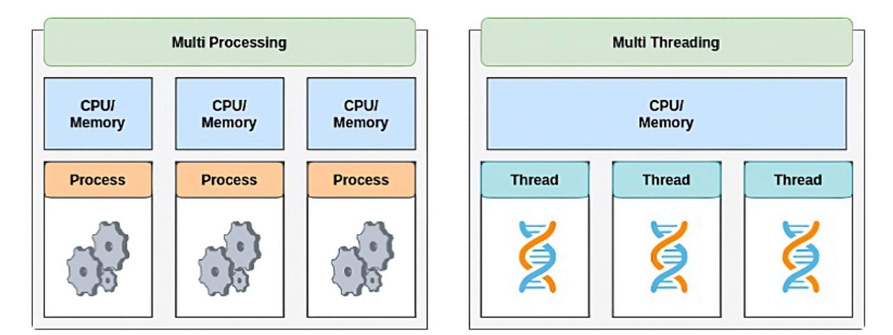

# 프로세스와 스레드

## 개념 정리

### 프로그램

프로그램은 .exe파일이나 .dmg파일과 같은 컴퓨터에서 실행할 수 있는 파일을 통칭한다.

하지만 아직 파일을 실행하지 않은 상태이므로 정적프로그램이고, 이를 줄여서 프로그램이고 부른다.

이것은 단순한 코드 덩어리이다.

### 프로세스(Process)

메모리에 적재되고 CPU자원을 할당받아 프로그램이 실행되고 있는 상태이다.

즉, 프로그램을 실행시켜 정적인 프로그램이 동적으로 변하여 프로그램이 돌아가고 있는 상태를 말한다.

모든 프로그램은 운영체제가 실행되기 위한 메모리 공간을 할당해줘야 실행 가능하다. 그래서 실행하는 순간 메모리에 올라가게되고, 운영체제로부터 시스템 자원을 할당받아 프로그램 코드를 실행시켜 우리가 서비스를 이용할 수 있게 된다.

### 각 구조의 특징

- 코드 영역
  - 프로그래머가 작성한 프로그램이 코드영역에 작성
- 데이터 영역
  - 코드가 실행되면서 사용한 전역변수나 각종 데이터들이 모여있다.
  - 데이터영역은 .data ,.rodata, .bss 영역으로 세분화 된다.
    - .data : 전역 변수 또는 static 변수 등 프로그램이 사용하는 데이터를 저장
    - .BSS : 초기값 없는 전역 변수, static 변수가 저장
    - .rodata : const같은 상수 키워드 선언 된 변수나 문자열 상수가 저장
- 스택 영역
  - 지역변수와 같은 호출한 함수가 종료되면 되돌아올 임시적인 자료와 돌아올 메모리의 주소를 스택에 저장하고 함수의 호출이 완료되면 소멸한다.
- 힙 영역
  - 동적으로 할당되는 데이터들을 위해 존재하는 공간
- 코드 영역과 데이터 영역은 선언할 때, 그 크기가 결정되는 정적 영역
- 스택 영역과 힙 영역은 프로세스가 실행되는 동안 크기가 늘어났다 줄어들기도 하는 동적 영역
  - 서로 다른 프로세스 간의 메모리 공간 접근은 허용되지 않는다.

### 프로세스의 한계

- 과거에는 프로그램을 실행할 때 프로세스 하나만을 사용해서 이용했었지만 기술이 발전됨에 따라 프로그램이 복잡해지고 다채로워짐으로써 프로세스 작업 하나만을 사용해서 프로그램을 실행하기에는 한계가 있었다.
- 과거에는 파일을 다운받으면 실행 시작부터 실행 끝까지 프로세스 하나만을 사용하기 때문에 다운이 완료될때까지 하루종일 기다려야 했다. 오늘날처럼 동시에 여러 프로그램을 이용하는 것은 불가능이다.
- 그렇다고 동일한 프로그램을 여러 개의 프로세스로 만들게 되면, 그만큼 메모리를 차지하고 CPU에서 할당받는 자원이 중복되게 될 것이다.
- ⇒ 스레드(Thread)는 이러한 프로세스 특성의 한계를 해결하기 위해 탄생

### 스레드(Thread)

스레드는 어떠한 프로그램 내에서, 특히 프로세스 내에서 할당받은 자원을 이용하는 실행되는 흐름의 단위이다.

이해하기 쉽게 비유를 들자면, 크롬 브라우저가 실행 되면 프로세스 하나가 생성될 것이다. 그런데 우리는 브라우저에서 파일을 다운 받으며 온라인 쇼핑을 하면서 게임을 하기도 한다.

즉, 하나의 프로세스 안에서 여러가지 작업 흐름이 동시에 진행되고 있어 이러한 일련의 작업 흐름들을 스레드라고 하며 여러개가 있다면 이를 멀티 스레드라고 부른다.

하나의 프로그램은 하나 이상의 프로세스를 가지고 있고, 하나의 프로세스는 반드시 하나 이상의 스레드를 갖는다.

프로세스를 생성하면 기본적으로 하나의 main 스레드가 생성되고, 스레드 2개, 3개는 프로그램을 개발한 개발자가 직접 프로그래밍해 위치 시켜줘야 한다.

스레드는 프로세스 내에서 각각 Stack만 따로 할당받고, Code,Data,Heap 영역은 공유한다. 스레드는 한 프로세스 내에서 동작되는 여러 실행의 흐름으로, 같은 프로세스 안에 있는 여러 스레드들은 같은 힙공간을 공유한다.

프로세스는 다른 프로세스의 메모리에 직접 접근할 수 없다.

### 멀티태스킹

OS를 통해 CPU가 작업하는데 필요한 자원(시간)을 프로세스 또는 스레드간에 나누는 행위

### 멀티 프로세스

- 멀티 프로세스는 운영체제에서 하나의 응용 프로그램에 대해 동시에 여러 개의 프로세스를 실행할 수 있게하는 기술
- 보통 하나의 프로그램 실행에 하나의 프로세스가 메모리에 생성되지만, 부가적인 기능을 위해 여러개의 프로세스를 생성하는 것이다.
- 멀티 프로세스 내부를 보면, 하나의 부모 프로세스에서 여러 자식 프로세스를 생성함으로서 다중 프로세스를 구성하는 구조이다.
  - 한 프로세스는 실행되는 도중 시스템콜 통해 새로운 프로세스 생성
    - 부모 프로세스: 다른 프로세스를 생성하는 프로세스
    - 자식 프로세스: 다른 프로세스에 의해 생성된 프로세스
  - 부모 프로세스와 자식 프로세스는 각각 고유한 PID를 가지고 있고, 부모와 자식은 서로의 PID를 가지고 있어 서로 통신할 수 있다.
- **프로세스의 자원 공유**
  - 각 프로세스는 메모리에 별도의 주소 공간에서 실행되므로, 한 프로세스에서 다른 프로세스의 변수나 자료구조에 접근할 수 없다.
  - 다른 프로세스 정보에 접근하기 위해서는 다음과 같은 방법이 있다.
    - IPC 사용
    - LPC 사용
    - 별도의 공유 메모리를 만들어 정보를 주고 받기
  - 그러나 프로세스 자원 공유는 단순히 CPU 레지스터 교체뿐만 아니라 RAM과 CPU 사이의 캐시 메모리까지 초기화되어 자원 부담이 크다.
  - 그래서 스레드를 이용해 다중작업을 하는 것이 더 효율적이다.
  - 다만, 통신이 가능할 뿐이지, 부모 프로세스와 자식 프로세스는 서로 다른 프로세스로 독립적으로 실행된다.

### 멀티 프로세스의 특징

**장점**

- 프로그램 안전성
  - 멀티 프로세스는 각 프로세스가 독립적인 메모리 공간을 가지므로, 한 프로세스가 비정상적으로 종료되어도 다른 프로세스에 영향을 주지 않는다.
- 프로그램 병렬성
  - 멀티 프로세스와 여러개의 CPU 코어를 활용해 둘의 시너지를 합쳐, 다중 CPU 시스템에서 각 프로세스를 병렬적으로 실행해 성능을 향상 시킬 수 있다.
  - 예를들어, 이미지 처리나 비디오 인코딩 같은 작업 빠르게 진행 가능
  - 근데 멀티 스레드도 있는 장점이고, 훨씬 빠름
- 시스템 확장성
  - 각 프로세스가 독립적이므로 새로운 기능, 모듈을 추가하거나 수정할때 다른 프로세스에 영향을 주지 않는다.

**단점**

- Context Switching Overhead
  - 멀티 태스킹을 구성하는 핵심 기술인 컨텍스트 스위칭 과정에서 성능 저하가 올 수 있다.
  - CPU가 어떤 하나의 프로세스를 실행하고 있는 상태에서 인터럽트 요청에 의해 다음 우선 순위의 프로세스가 실행되어야 할 때 기존의 프로세스의 상태 또는 레지스터 값(Context)을 저장하고 CPU가 다음 프로세스를 수행하도록 새로운 프로세스의 상태 또는 레지스터 값(Context)를 교체하는 작업을 Context Switch(Context Switching)라고 한다.
  - CPU는 다음 프로세스의 정보를 불러오기 위해 메모리를 검색하고, CPU 캐시 메모리를 초기화하하며, 프로세스 상태 저장하고, 불러올 데이터를 준비해야함…..
    - 빈번한 컨텍스트 스위칭은 비용 오버헤드를 일으킨다.
- 자원 공유 비효율성
  - 각 프로세스가 독립적인 메모리 공간을 가져서 메모리 사용량이 증가한다.
  - 그리고 각 프로세스 간 자원 공유가 필요할 경우 프로세스 사이에 어렵고 복잡한 통신기법인 IPC 써야한다.

### 멀티 스레드

멀티 스레드란 하나의 프로그램을 여러 개의 스레드로 구성하여 하나의 스레드가 하나의 작업을 처리하도록 하는 것이다.

웹 서버는 대표적인 멀티 스레드 응용 프로그램이다. 사용자가 서버 데이터베이스에 자료를 요청하는 동안 브라우저의 다른 기능을 이용할 수 있는 이유도 바로 멀티 스레드 기능 덕분인 것이다. 즉, 하나의 스레드가 지연되더라도, 다른 스레드는 작업을 지속할 수 있게 된다.

- 스레드의 자원 공유
  - 스레드끼리 프로세스의 자원을 공유하면서 프로세스 실행 흐름의 일부가 되기 때문에 동시 작업이 가능한 것이다.
  - 이때 프로세스의 4가지 메모리 영역(Code, Data, Heap, Stack) 중 스레드는 Stack만 할당받아 복사하고 Code, Data, Heap은 프로세스내의 다른 스레드들과 공유된다.
  - 따라서 각각의 스레드는 별도의 stack을 가지고 있지만, heap 메모리는 공유하기 때문에 서로 다른 스레드에서 가져와 읽고 쓸 수 있게 된다.
  - 별도의 Stack을 가지고 있어 독립적인 함수 호출이 가능하다. 그러므로 각 스레드는 독립적인 실행흐름을 가져갈 수 있다.
    

### 멀티 스레드의 특징

**장점**

- 스레드는 프로세스보다 가볍다.
  - 프로세스 내에서 생성되므로 스레드의 실행 환경 설정 작업 간단해 생성 및 종료가 빠르다.
- 자원의 효율성
  - heap 영역과 같은 공유 메모리에 대해 스레드간 자원공유 가능하다.
  - 쉽게 자원 공유가 가능해서 지원의 효율적인 활용이 가능해 시스템 지원 소모가 줄어든다.
- Context Switching 비용 감소
  - stack, register만 교체하면 되므로 컨텍스트 스위칭 비용이 낮다.
- 응답시간 단축
  - 자원 공유 용이, 컨텍스트 스위칭 오버헤드가 작아서 응답 시간이 빠르다.

**단점**

- 안정성 문제
  - 하나의 스레드에서 문제가 발생하면 다른 스레드들도 영향을 받아 전체 프로그램이 종료될 수 있다.
- 동기화로 인한 성능 저하
  - 공유 자원에 여러 스레드가 접근할 수 잇어 동기화 문제가 발생 가능하다.
  - 여러 스레드가 동시에 한 자원을 변경해 버리면 엉뚱한 값을 읽어 서비스에 치명적인 버그가 생길 수 있다.
  - 동기화 작업은 이러한 문제를 방지하기위해 자원에 대한 접근을 순차적으로 통제하는 것이다.
  - 그러나 병목현상이 일어나 성능 저하 가능성이 높다.
- 데드락(교착 상태)
  - 다른 프로세스나 스레드가 점유한 자원을 기다리는 상황에서 발생하는 교착상태
  - 스레드가 서로 대기하면서 무한정 기다릴 수 있다.
- 그래도 컨텍스트 스위칭 오버헤드
  - 스레드 수가 많으면 그만큼 컨텍스트 스위칭이 많이 발생해서 성능 저하로 이어질 수 있다.

## 예상질문

- Process와 Thread의 특징과 차이를 설명해 주세요.
- Multi Process와 Multi Thread의 특징과 차이를 설명해 주세요.

---

### 참고자료

https://github.com/devSquad-study/2023-CS-Study/blob/main/OS/os_process_thread.md

[https://inpa.tistory.com/entry/👩‍💻-프로세스-⚔️-쓰레드-차이](https://inpa.tistory.com/entry/%F0%9F%91%A9%E2%80%8D%F0%9F%92%BB-%ED%94%84%EB%A1%9C%EC%84%B8%EC%8A%A4-%E2%9A%94%EF%B8%8F-%EC%93%B0%EB%A0%88%EB%93%9C-%EC%B0%A8%EC%9D%B4)

[https://inpa.tistory.com/entry/👩‍💻-multi-process-multi-thread](https://inpa.tistory.com/entry/%F0%9F%91%A9%E2%80%8D%F0%9F%92%BB-multi-process-multi-thread)
