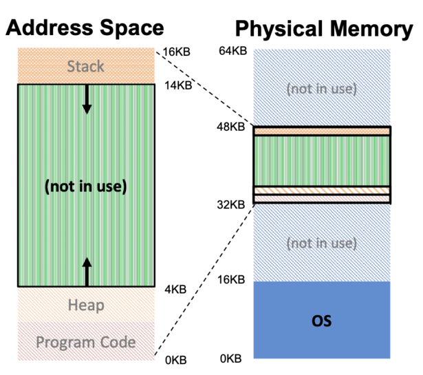
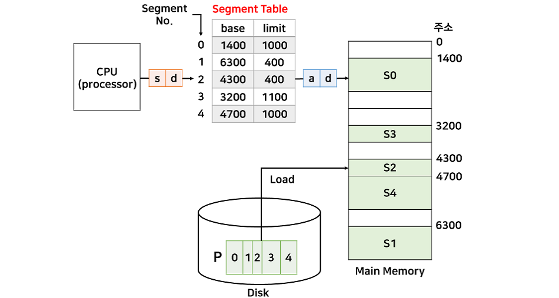
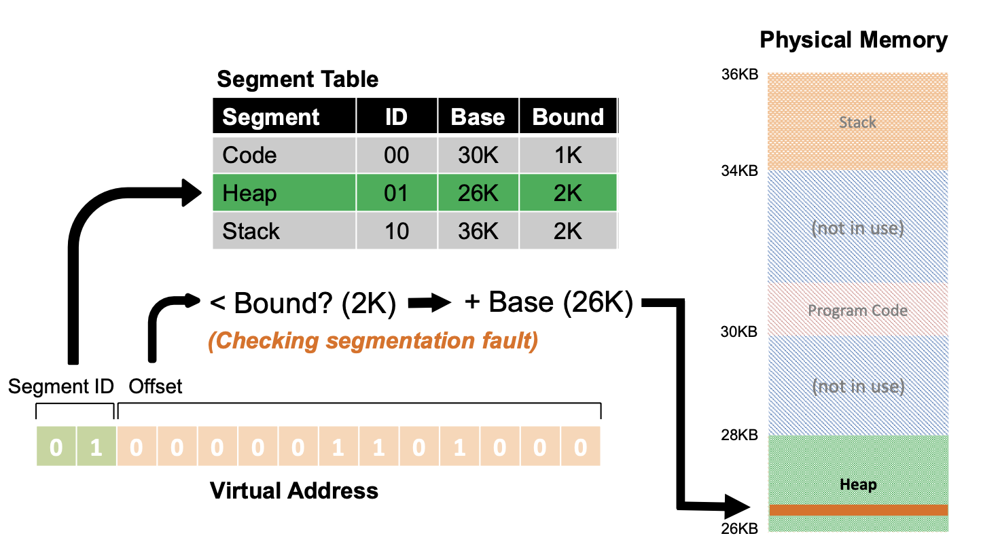
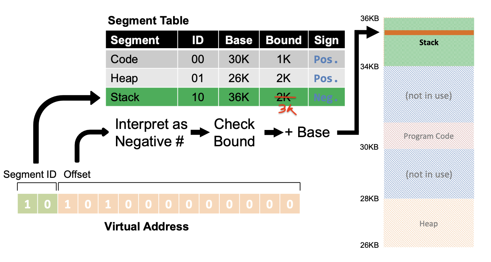
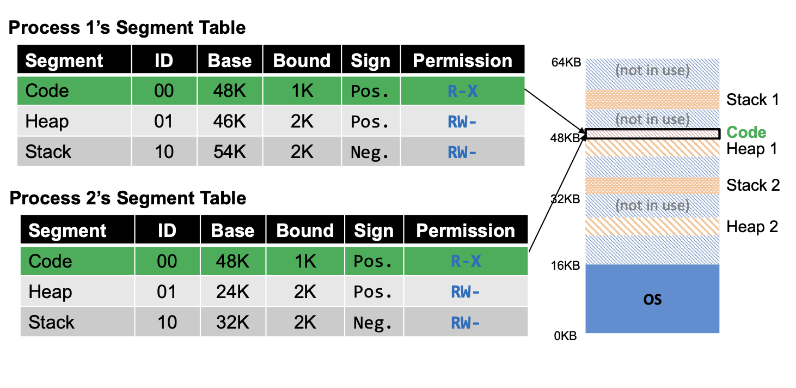
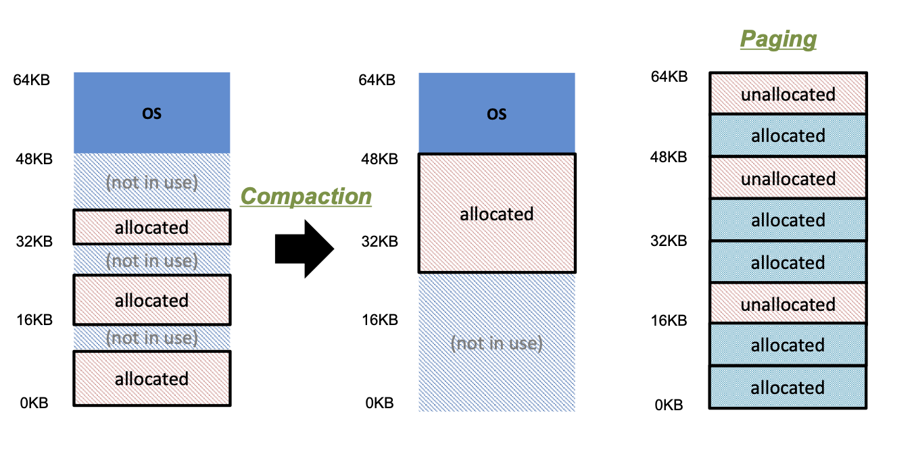

## Motivation

- 주소 변환하면서 몇가지 비효율적인 문제가 발생한다.



- 기존 가상 주소 공간에서는 **Heap과 Stack 사이의 사용하지 않는 공간도 할당되므로 비효율성**이 발생한다.
    - [1] 사용하지 않는 크기가 발생하므로 **메모리 공간이 낭비**된다.
    - [2] 위의 그림과 같이 (16KB 이상의) 메모리가 **큰 주소 공간에는 프로세스를 지원할 수 없다.**
    - [3] Code 공간에 여러 코드가 들어가서 **중복**이 발생할 수 있다.
- 이러한 문제점을 해결하기 위해 `Segmentation` 이라는 아이디어가 나오게 되었다.

## Segmentation

- `세그먼테이션`은 **가상 주소 공간을 세그먼트 단위로 실제 메모리 주소 공간에 독립적으로 각각 매핑**하는 방식이다.



- 이로 인해 heap과 stack 사이의 사용하지 않는 비효율성인 문제를 해결하게 되었다.
    - [1] 더이상 **메모리 공간이 낭비되지 않는다.**
    - [2] 이전보다 **훨씬 더 많은 주소 공간을 지원할 수 있다.**
    - [3] 세그먼트는 주소 공간 간에 **Code를 공유하면서 메모리를 절약할 수 있다.**
- 세그먼트(Segment)는 메모리에서 일정 부분을 의미하며 일반적인 주소 공간은 **3개의 세그먼트(Code, Stack, Heap)**으로 구성된다.
- OS는 3개의 세그먼트를 메모리에 배치하여 heap과 stack 사이의 공간을 낭비하지 않도록 하는 것이다.

## Implementation

### Basic

- 그럼 이제 세그먼테이션에서 **Virtual memory 주소를 받고 Physical memory 주소를 찾는 방법**(**주소 변환**)에 대해 알아보자.
- 가상주소는 `segment id + offset` 으로 구할 수 있다.
    - segment id 는 상위 2개 비트로 구분할 수 있고, offset은 하위 12개 비트로 계산할 수 있다.



- 위의 그림을 예시로 들어보자.
- [1] Segment ID가 01인 Heap 영역에 가서 **Base 값**을 찾는다. (Base = 26K)
- [2] **Offset 을 계산**한다. (16진수 Hex -> 10진수 Decimal)
    - 0x068 -> (Decimal) (16^1 * 6) + (16^0 * 8) = 104
- [2-2] segmentation fault 발생하는지 확인한다. (segmentation fault : 프로그램이 허용되지 않은 메모리 영역에 접근을 시도하거나(free 공간), 허용되지 않은 방법으로 메모리 영역에 접근을 시도할 경우 발생한다)
    - Offset 값인 104가 Bound인 값인 2K (104 < 2000) 보다 작기 때문에 segmentation fault 발생하지 않는다.
    - Bound가 상한선이라고 보면 된다.
- [3] Physical memory 주소를 찾는다. (**base + offset**)
    - Segment ID가 01인 Heap 영역에서 Base 값과 offset 값을 더하면 된다.
    - 따라서 실제 메모리 주소는 **26KB + 104**가 된다.
- 이러한 계산을 코드로 나타내면 다음과 같이 표현할 수 있다.

```
// get top 2 bits of 14-bit VA 2 (상위 2 비트를 가지고 온다)
Segment = (VirtualAddress & SEG_MASK) >> SEG_SHIFT 3

// now get offset (하위 12 비트로 offset을 구한다)
Offset = VirtualAddress & OFFSET_MASK

// Offset 이 limit 을 넘는지 확인한다.
if (Offset >= Bounds[Segment])
    RaiseException(PROTECTION_FAULT)
else
    PhysAddr = Base[Segment] + Offset
    Register = AccessMemory(PhysAddr)
```

### Stack 인 경우



- `Stack`은 Code, Heap 부분과 다르게 거꾸로 확장되기 때문에 주소 변환을 다르게 해야한다.
    - Code, Heap은 Sign이 Positive인 반면에 Stack은 Sign이 **Negative**이다.
- Stack 세그먼트의 base 레지스터는 **가장 높은 주소**에서 시작한다.
- [1] Segement ID가 10인 Stack 영역에 가서 Base 값을 찾는다. (Base = 36K)
- [2] **Offset 을 계산**한다. (16진수 Hex -> 10진수 Decimal)
    - 0xA00 -> (Decimal) (16^2 * 10) + (16^1 * 0) + (16^0 * 0) = 2560
- [2-2] segmentation fault 발생하는지 확인한다.
    - Offset 값인 104가 Bound인 값인 3K (2560 < 3000) 보다 작기 때문에 segmentation fault 발생하지 않는다.
- [3] Physical memory 주소를 찾는다. (**base - offset**)
    - Stack 에서는 base인 36KB에 offset인 2560을 더하는 것이 아닌 빼주면 된다.
    - 따라서 실제 메모리 주소는 **36KB - 2560**이 된다.

### Code Sharing



- 세그먼트는 추가적인 하드웨어 지원을 통해 **주소 공간 사이에서 공유**될 수 있다.
- 그래서 다중 프로세스는 Code 세그먼트를 공유할 수 있는데, **읽고 실행은 가능하지만 값을 변경할 수는 없다.**
- 즉, 코드가 지정된 영역은 접근 가능하지만,(읽고 실행 가능) 값을 바꿀 순 없다.

## Problem of Segmentation(OS Support)

- Context-Switch(문맥교환)문제에 대해서는 OS가 어떻게 처리하는가?
    - 세그먼트 레지스터(base & bound 레지스터)의 값들을 저장하고 복원해주는 방식으로 처리한다.
- 세그먼트의 수가 증가하거나 감소할 때 OS와 어떻게 상호작용하는가?
    - 상황) heap 공간이 부족해서 malloc()에 의해 heap 공간을 더 늘려야 하는 경우
    - 해결방안) 공간을 늘리기 위해 sbrk() system call을 사용한다. (sbrk()는 힙을 늘리거나 줄이는 함수이다)
- Physical memory에 여유공간을 어떻게 관리할건가?
    - 프로세스마다 크기가 모두 다르기 때문에 각 세그먼트의 크기도 모두 다르다. 그로 인해 **`외부 단편화`(external fragmentaion)** 문제가 발생한다.
    - `외부 단편화`란 외부가 잘게 쪼개진 형태를 의미한다.
        - 즉, 요청을 충족하기에 충분한 총 메모리 공간이 있지만, 사용 가능한 공간이 연속적이지 않은 경우를 말한다.

  

    - 상황) 왼쪽 메모리에서 20KB 크기를 갖는 세그먼트를 할당하려고 한다.
    - 하지만, 전체로 보면 24KB 여유 공간(free)이 있지만 16KB, 4KB, 4KB로 인접하지 않은 세그먼트로 20KB 크기를 갖는 공간을 할당받을 수 없다.
    - 이를 해결하기 위해 OS는 가운데 그림처럼 `Compaction` 이라는 방법으로 실제 메모리에 있는 **기존의 세그먼트를 재배치**시킨다.
        - 하지만 Compaction 방법은 **비용이 발생하여 성능이 떨어지는** 문제점이 있다.
    - 그래서 결국 맨 오른쪽 그림처럼 `Paging`(페이징) 이라는 기법을 통해 **고정적인 크기(fixed-size)의 세그먼트로 외부 단편화를 제거하여 여유 공간을 관리할 수 있다.**
    - 하지만 페이징 기법 역시 `내부 단편화`(internal fragmentation) 문제가 남아 있다.
        - 내부 단편화란, 프로세스에 할당된 메모리가 요청된 메모리보다 약간 클 수 있는데, 이들 두 크기 사이의 남는 부분을 말한다.
        - 내부 단편화의 문제점은 다음과 같다.
            - 15KB 요청이 오면 8KB * 2번으로 16KB를 주게 되면 1KB의 안쓰는 공간이 생긴다.
            - 이때 이 1KB가 내부 단편화의 문제점이다.

### 세그먼테이션에서 보호와 공유

- 먼저, 결론부터 말하면 페이징보다 **세그먼테이션에서의 보호와 공유는 더 효율적**이다.
- 보호에서는 세그먼테이션 역시 **r,w,x 비트**를 **테이블에 추가**하는데, 세그먼테이션은 **논리적으로 나누기 때문에 해당 비트를 설정하기 매우 간단하고 안전하다**.
    - 페이지 테이블마다 **r**(read), **w**(write), **x**(execute) **비트**를 두어, **해당 비트가 켜져있을 때,** 그 **수행**이 가능하도록 한다.
    - 페이징은 code+data+stack 영역이 있을 때, 이를 일정한 크기로 나누므로 두 가지 영역이 섞일 수 있다.
    - 그러면 비트를 설정하기가 매우 까다롭다.
- **공유에서도 마찬가지**다.
    - 페이징에서는 code 영역을 나눈다해도 다른 영역이 포함될 확률이 매우 높다.
    - 하지만, 세그먼테이션은 정확히 code 영역만을 나누기 때문에 더 효율적으로 공유를 수행할 수 있다.

### 세그먼테이션과 페이징

- 세그먼테이션은 페이징과 유사하고 보호와 공유 측면에서는 더 나은 성능을 보여주었지만, **현재 대부분은 페이징 기법을 사용한다**.
    - 그 이유는 **세그먼테이션에는 치명적인 단점이 존재**하기 때문이다.
- 메모리 할당을 처음 시작할 때, 다중 프로그래밍에서의 문제는 크기가 서로 다른 프로세스로 인해 여러 크기의 hole이 발생한다.
    - 이로 인해 어느 hole에 프로세스를 할당하는 것에 대한 최적화 알고리즘이 존재하지 않고, 외부 단편화로 인해 메모리 낭비가 크다고 했었다.
- 세그먼테이션도 똑같은 문제점이 발생한다.
    - 왜냐하면 세그먼테이션은 **논리적인 단위로 나누기 때문에 세그먼트의 크기가 다양하다.**
    - 이로 인해 **다양한 크기의 hole이 발생**하므로 같은 문제가 발생한다.
    - 결국 외부 단편화라는 단점이 발생하는 것이다.

## 예상 질문

- 세그먼테이션은 무엇이고, 세그먼테이션으로 인해 어떤 장점이 있는지 설명하시오.
- 세그먼테이션으로 주소변환 하는 방법에 대해 설명하시오.
- 세그먼테이션의 문제점과 해결방안은 무엇인지 설명하시오.

## 출처

https://github.com/devSquad-study/2023-CS-Study/blob/main/OS/os_segmentation.md

[[OS] 페이징 & 세그먼테이션](https://dar0m.tistory.com/269)