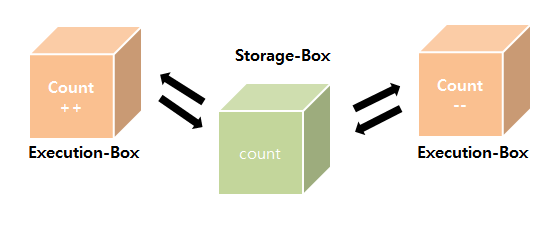
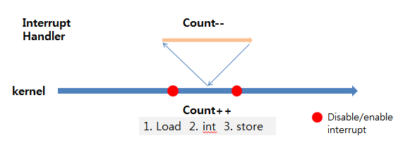

# Process Synchronization(프로세스 동기화)

## 개념정리

### synchronization (동기화)란?

여러 프로세스/스레드를 동시에 실행해도 공유 데이터의 일관성을 유지하는 것

### 동기화 문제의 등장

데이터가 저장되어 있는 위치로부터 데이터를 읽어와서 연산한 뒤, 연산한 결과를 이전에 저장되어있던 그 위치에 다시 저장한다.

데이터를 읽기만 하면 문제가 없는데, 데이터를 연산하고 **수정**하게 되면 누가 먼저 읽어 갔는지에 따라 결과가 달라질 수 있다.

이때 발생할 수 있는게 Synchronization(동기화) 문제이다.<br>


### Process Synchronization

- 공유 데이터(shared data)의 동시 접근(concurrent access)은 데이터 불일치 문제(inconsistency)를 발생시킬 수 있다.
- 따라서 일관성(consistency) 유지를 위해서는 협력 프로세스 간의 실행 순서를 정해주는 메커니즘이 필요하다.

### Race Condition(경쟁상태)

- 여러 프로세스/스레드 동시에 같은 데이터를 조작할 때 타이밍이나 접근 순서에 따라 결과가 달라질 수 있는 상황
- 아것을 막기 위해서 concurrent process(동시에 접근하는 프로세스)는 동기화가 되어야 한다.
- Storage-Box를 공유하는 Execution-Box가 여러 개 있는 경우 race condition 가능성 있다.
  - 
  - Count++ 연산이 실행되는 동안 이전에 데이터를 읽어간 Count-- 에서 연산을 마치고 저장해버림
  - 이후에 이전에 읽어간 데이터로 Count++을 마친 데이터를 스토리지 박스에 저장
  - => Count++ 연산만 적용된다.

### Race Condition은 언제 발생할까?

1.  **kernel 수행 중 인터럽트 발생**<br>

```
ex) Initial counter = 10
```

- 커널모드 running 중 Count++ 하고 있었다.
- 
- (1번)에 CPU 레지스터로 데이터를 읽어온 상황에서 (2번)인터럽트가 들어오면 인터럽트 처리루틴이 수행되며 Count--를 하고 반영한다.
- 그리고 다시 (3번)이 실행되는데 이미 1번에서 읽어오는 작업은 끝났기 때문에 Count++후 저장한다.

```
Expected : Counter = 10
Unexpected : Counter = 11🥲
```

=> 그래서 running 중에 작업이 끝날 때까지는 disable interrupt 상태로 해서 현재 작업이 끝나기 전까지는 인터럽트가 실행되지 않도록 한다.

2. **Process가 system call을 하여 kernel mode로 수행 중인데 context switch가 일어나는 경우**

- (이때 U는 유저모드, K는 커널모드)
- 
- 커널 모드에서 수행 중일 때는 CPU를 선점 못한다. 커널 모드에서 유저 모드로 돌아갈 때 선점한다(preempt).
- (CPU 할당 시간에 편차가 생길 수 있다.)

3. **Multiprocessor에서 shared memory 내의 kernel data에 접근할 때**

- (방법1)
  - 한 번에 하나의 CPU만이 커널에 들어갈 수 있도록 하고, 하나의 커널을 lock으로 막고, 커널을 빠져나올 때 unlock.
  - 커널 전체를 lock하기 때문에 비효율적
- (방법2)
  - 커널 내부에 있는 각 공유 데이터에 접근할 때마다 **그 데이터에 대한** lock/unlock

### 프로세스 일반적인 구조

- critical section(임계영역)은 공유 데이터의 일관성을 보장하기 위해서 하나의 프로세스/스레드만 집입해서(mutual exclusion) 가능한 영역이다.
- 따라서 하나의 프로세스가 critical section에 있을 때 다른 모든 프로세스는 critical section에 들어갈 수 없어야 한다.
- critical section problem을 해결하기 위한 기본 뼈대

```
do {
    entry section       // 공유 데이터에 접근하기 이전에 lock을 건다 - acquire lock
    	critical section    // 공유 데이터를 접근하는 코드
    exit section        // 끝나면 unlock(다른 프로세스가 critical-section에 들어갈 수 있게) - release lock
    	remainder section
} while(1);
```

### critical section problem 해결책이 되기 위한 조건

아래 조건이 모두 만족해야한다.

- mutual exclusion (상호 배제)
  - 한 번에 하나의 프로세스/스레드가 critical section에서 실행할 수 있다.
- progress (진행)
  - 아무도 critical section에 있지 않으면 들어가고자 하는 프로세스가 있으면 critical section에 들어가게 해주어야 한다.
- bounded waiting (한정된 대기)
  - 하나의 프로세스/스레드가 critical section에 들어가기 위해서 무한정 기다리는 상황이 되면 안된다.
  - 다른 프로세스들의 기아(Starvation)을 막기 위해서

### 해결책

> 상호 배제 보장 -> 락(lock) 사용
> 락을 획득하기 위해 경쟁

### 1. spinlock(스핀락)

- 락을 가질 수 있을 때 까지 반복해서 시도
- 임계영역이 lock이 걸려서 진입이 불가능할 때,
  - 임계영역이 unlock되어 진입이 가능해질 때까지 루프를 돌면서 재시도하여 스레드가 CPU를 점유하고 있는 상태<br>

**단점**

- 기다리는 동안 CPU를 낭비한다는 단점
- Busy-Waiting 상태
- 예시 - TestAndSet을 통해 T1, T2가 동시에 실행하지 않도록 함

  ````c
  volatile int lock = 0; // global

      void critical() {
          while (test_and_set(&lock) == 1);
          ...critical section
          lock = 0;
      }

      /*
      기존 lock을 반환하는 함수. 반환 전 lock을 1로 바꾼다. 실제 구현부가 해당 코드로 이루어져 있진 않다.
      */
      int TestAndSet(int*lockPtr) {
          int oldLock = *lockPtr;
          *lockPtr = 1;
          return oldLock;
      }
      ```

      ```
      - T1 시작) while 루프 조건문, 내부적으로 lock은 1로 바꾸고 기존 lock 0을 반환
      - 조건문을 만족하지 않아 루프 탈출
      - critical section 실행
      - T2 시작) while 루프 조건문, 내부적으로 - lock은 1로 바꾸고 기존 lock 1을 반환
      - 조건문 만족하여 루프 반복
      - T1이 lock=0 반환 및 종료
      - T2 while 루프 탈출
      - critical section 실행
      - T2이 lock=0 반환 및 종료
      ```

  }
  ````

### 2. Mutex (뮤텍스)

- 
- 공유된 자원의 데이터 혹은 임계영역 등에 하나의 프로세스 혹은 스레드가 접근하는 것을 막아줌(동기화 대상이 하나)
- 임계구역을 가지는 스레드들의 실행시간이 서로 겹치지 않고 각각 단독으로 실행되도록(상호배제) 하는 기술
- 한 프로세스에 의해 소유될 수 있는 key를 기반으로 상호배제
  - 어떤 객체가 있고 이 객체를 소유한 스레드, 프로세스만 공유자원 접근 가능
- 다중 프로세스들의 공유 리소스에 대한 접근을 조율하기 위해 동기화 또는 락을 사용함으로써 뮤텍스 객체를 두 스레드가 동시에 사용 불가
- 락을 가질 수 있을 때까지 휴식
- Mutual Exclusion의 약자
- **스핀락과 차이점**
  - 스핀락이 임계영역이 unlock(해제)되어 권한을 획득하기까지 Busy-Waiting 상태를 유지한다면,
    - 뮤텍스는 Block(Sleep) 상태로 들어갔다 Wakeup 되면 다시 권한 획득을 시도한다.
  - `Block-Wakeup 상태`
  - 뮤텍스 lock은 내부적으로 **value**로 컨트롤하는데 value를 가질 수 없을 때는 큐에서 Block하면서 기다린다. 그래서 CPU 사이클을 불필요하게 낭비하는 것을 최소화시켜준다.

mutex의 lock을 획득하기 위해 프로세스/스레드가 경합하게 된다.

```c
mutex -> lock();
...critical section
mutex -> unlock();
```

**value**<br>

- value = 1을 취득해야 critical section에서 동작 가능하다.
- 이때 value 역시 서로 취득하려고 하는 공유되는 데이터이다.
- 뮤텍스는 상태가 0, 1이다.

**guard**<br>

- race condition 발생을 막기 위해 지켜주는 장치이다.
- 아래 lock과 unlock을 보면 value값을 바꿔주는 로직을 보호하기 위해서 guard를 사용하고 있다.

```c++
class Mutex {
    int value = 1;
    int guard = 0;
}
```

그래서 만약 value가 누군가 가지고 있다면 큐에 들어가게 되고, 획득할 수 있다면 value를 가지고 다른 프로세스가 가질 수 없도록 value는 0으로 설정해둔다.

```c++
Mutex::lock() {
    while (test_and_set(&guard));
    if (value == 0) {
    	...현재 스레드를 큐에 넣음;
        guard = 0; & go to sleep
    } else {
    	value = 0;
        guard = 0;
    }
}
```

unlock 시에는 큐에 있을 때는 그 중 하나를 깨우고, 없다면 다시 획득할 수 있는 상태로 value를 1로 설정해둔다.

```c++
Mutex::unlock() {
    while (test_and_set(&guard));
    if (큐에 하나라도 대기중이라면) {
    	그 중 하나를 깨운다;
    } else {
    	value = 1;
    }
    guard = 0;
}
```

🤔 뮤텍스가 스핀락보다 항상 좋을까?

🙋‍♀️💡 멀티 코어 환경이고, critical section에서의 작업이 컨텍스트 스위칭보다 더 빨리 끝난다면 스핀락이 뮤텍스보다 더 이점이 있다.

### 3. semaphore (세마포어)

- 공유된 자원의 데이터 혹은 임계영역 등에 여러 프로세스 혹은 스레드가 접근하는 것을 막아줌(동기화 대상이 하나 이상)
- 사용하고 있는 스레드/프로세스의 수를 공통으로 관리하는 하나의 값을 이용해 상호배제를 달성합니다.
  - 공유 자원에 접근할 수 있는 프로세스의 최대 허용치만큼 동시에 사용자가 접근할 수 있으며, 각 프로세스는 세마포어의 값을 확인하고 변경할 수 있습니다.
  - 자원을 사용하지 않는 상태가 될 때, 대기하던 프로세스가 즉시 자원을 사용하고. 이미 다른 프로세스에 의해 사용중이라는 사실을 알게 되면, 재시도 전에 일정시간 대기해야 합니다.
  - 일반적으로 비교적 긴 시간을 확보하는 리소스에 대해 사용하게 됩니다.
  - 
  - 목적: Mutual Exclusion이 아닌 공유 자원에 대한 관리
  - 스핀락과 뮤택스와 달리 표현형이 정수형이다. 아래 value가 0,1,2, .... 가능하다.
    - 이 점을 살려 하나 이상의 컴포넌트가 공유자원에 접근할 수 있도록 허용할 수 있다.
- **진행**
  - 컴포넌트가 특정 자원에 접근할 때 wait이 먼저 호출되어 임계영역에 들어갈 수 있는지 먼저 확인한다.
  - 임계영역에 접근이 가능하다면 wait을 빠져나와 임계영역에 들어가고, 이후 signal이 호출되어 임계영역에서 빠져나옵니다.

**세마포어 P, V 연산**

```c++
semaphore -> wait();  // P : 임계 구역 진입할 때 외친다.
...critical section
semaphore -> signal();  // V : 임계 구역을 빠져나올 때 외친다.
```

**종류**

- Binary Semaphore : mutex(뮤텍스)와 동일하게 value를 1을 가지는 세마포어
- Counting Semaphore : value값이 1보다 큰 세마포어

```c++
class Semaphore {
    int value = 1;
    int guard = 0;
}
```

**wait 연산**

- 세마포어의 값을 감소.
- 만약 값이 음수가 되면 wait을 호출한 스레드는 블록되지만 음수가 아니면 작업을 수행한다.

```
Semaphore::wait() {
    while (test_and_set(&guard));
    if (value == 0) {
    	...현재 스레드를 큐에 넣음;
        guard = 0; & go to sleep
    } else {
    	value -= 1;
        guard = 0;
    }
}
```

**signal 연산**

- 세마포어의 값을 증가.
- 만약 값이 양수가 아니라면 wait 연산에 의해 블록된 스레드를 다시 wake시킨다.

```
Semaphore::signal() {
    while (test_and_set(&guard));
    if (큐에 하나라도 대기중이라면) {
    	그 중 하나를 깨워 준비 시킨다
    } else {
    	value += 1;
    }
    guard = 0;
}
```

### Signaling 메커니즘

- 세마포어는 순서를 정해줄 때 사용한다.

- 세마포어는 Signaling 메커니즘으로 락을 걸지 않은 스레드도 signal을 통해 락을 해제할 수 있다.

- 예시 : 멀티 코어 환경
  - 상황

```
class Semaphore {
    int value = 0;
    int guard = 0;
}
```

```
< P1 >
task1
semaphore -> signal()
< P2 >
task2
semaphore -> wait()
task3
```

- 경우 1
  - task1과 task2 실행
  - task1이 먼저 수행을 끝내고 signal() 호출 -> value = 1
  - 그 다음 task2 수행이 끝나고 wait() 호출 -> value = 0
  - task3 실행
- 경우 2

  - task1과 task2 실행
  - 먼저 task2 수행이 끝나고 value = 0 이라서 wait에 들어가지 못하고 queue에 넣고 block
  - 그 다음 task1이 수행을 끝내고 signal() 호출 -> 잠자는 P2 깨운다.
  - task3 실행
  - -> 순서가 있다.
  - -> P2가 wait하고 P1이 signal을 보낸다.

- 예시로 설명
  > (식당을 예시로 생각해 보자.)

```
- 🍽️ 식당: 임계 영역
- 🧍‍♀️ 손님: 프로세스/스레드
- 🔒 가게 문 잠금: lock
- 💤 대기실: 큐
- 👩‍🍳 직원: 코어
```

**상황 1 - 뮤텍스**

- (가게가 작아서 좌석이 하나뿐이다. 그래서 한 명씩 입장해서 식사를 할 수 있다.)
- (이때 가게로 기연이 가게로 들어온다.)
- 기연 : 떡볶이 1인분이요~
- (자리가 꽉 찼기 때문에 직원은 가게 문을 lock 잠근다.)
- (이어서 맛집 소문이 났는지 재화가 가게 앞으로 온다.)
- 재화: 아;; 꽉 찼네?

이때 재화가 대기하는 방법 두 가지<br>

1. 자리가 생길 때까지 계속 문을 두드린다. -> spinlock (스핀락)

- "자리 없어요??? 자리 없어요???" => Busy-Waiting 상태
- 재화도 힘들고, 직원은 계속 대답해야 해서 다른 설거지 등 업무를 할 수 없어 비효율적이다.
- cf: 이 방식이 빠른 경우도 있다.
  - 대기실로 가는 시간(=컨텍스트 스위칭)보다 손님의 식사 속도가 더 빠른 경우
  - 직원이 여러 명(=멀티 코어) 있는 식당인 경우

2. 대기실에서 기다리다가 부르면 들어간다. -> 뮤텍스(Mutex), 큐에 Block-Wakeup

- 계속 기다리다가 먼저 온 손님부터 차례로 입장한다.=>Block-Wakeup, Blocking-lock 상태
  - (떡볶이를 다 먹은 기연)
  - 기연: 잘 먹었습니다~
  - (기연이 나가기 때문에 문을 연다. unlock)
  - 재화 : 이야~~ 자리가 생겼다. 들어가자~
  - (드디어 재화가 입장한다.)

**상황 2 - 세마포어**

- 스핀락과 뮤택스와 달리 표현형이 정수형이다. 아래 value가 0,1,2, .... 가능하다.
- 이 점을 살려 하나 이상의 컴포넌트가 공유자원에 접근할 수 있도록 허용할 수 있다.
- 식당이 리모델링으로 3자리로 늘렸다.
- 문 앞에 남은 좌석 3으로 걸려있다.
- (손님 3명이 입장한다.)
- 이때 남은 좌석을 정확하게 표시하기 위해 식당에 규칙이 생겼다.
  - 일명 PV(wait, signal) 규칙!
- 입장하는 손님은 P를 외치면서 들어온다.
- 기연, 재화, 경찬 : PPP~
- 남은 좌석은 0이 된다.
- 이때 뒤늦게 등장한 홍서.
- 홍서 : 아쉽다... 홍서 역시 계속 문을 두드릴 수도 있고 대기실에서 기다릴 수도 있다.
- 홍서가 대기실로 가는 순간 남은 좌석은 -1가 된다.
- 먹는 속도가 빠른 경찬! 먼저 온 기연과 재화보다보다 먼저 식사를 마치고 식당을 빠져나간다.
- 경찬 : V~~
- 이때 나가면서 대기실을 보니 홍서 있다. 홍서를 깨운다.

### 뮤텍스 vs 이진(binary) 세마포어

**뮤텍스**

- 락(lock)을 가진 자만 락을 해제할 수 있다.
- priority inheritance 속성을 가진다.
  **세마포어**
- Signaling 메커니즘으로 락을 걸지 않은 스레드도 signal을 통해 락을 해제할 수 있다.
  **정리**
- 상호 배제만 필요하면 뮤텍스 권장
- 작업 간의 실행 순서 동기화가 필요하면 세마포 권장

## 예상질문

- 임계영역이 무엇인가요? 임계영역이 만족해야 하는 조건과 함께 설명해주세요.
  <br>키워드 : 상호 배제(Mutual exclution), 진행(Progress), 한정 대기(Bounded waiting)
- Race Condition(경쟁 상태)에 대하여 간단한 예시를 들어 설명해주세요.
- 뮤텍스와 세마포어 차이점에 대해 설명해주세요.

---

### 참고자료

https://github.com/devSquad-study/2023-CS-Study/blob/main/OS/os_process_synchronization.md#-%EB%8D%B0%EC%9D%B4%ED%84%B0-%EC%A0%91%EA%B7%BC-

https://heeonii.tistory.com/14
