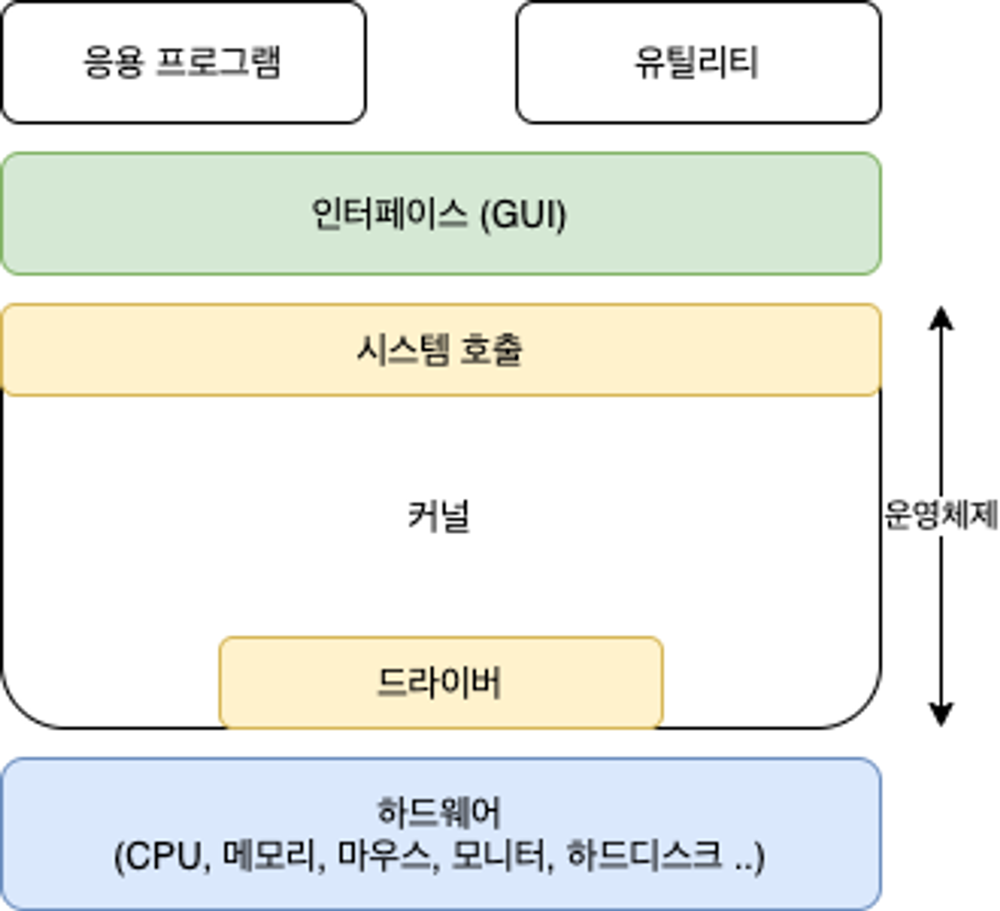
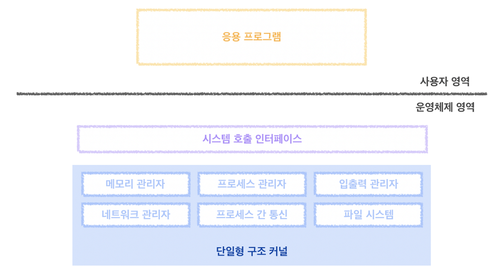
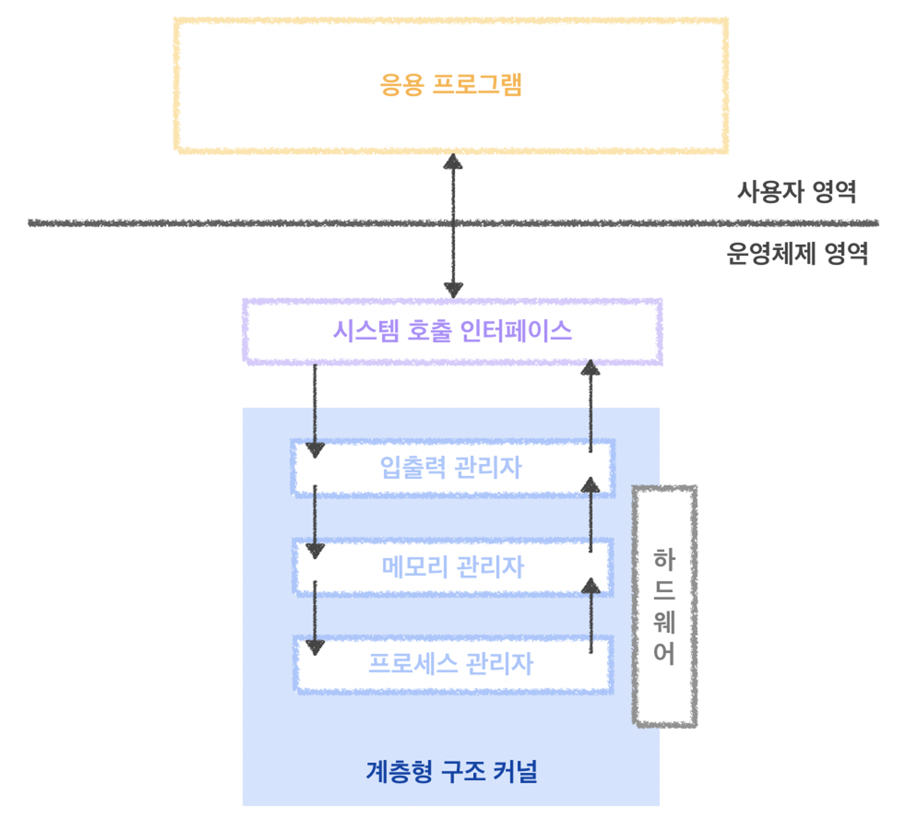
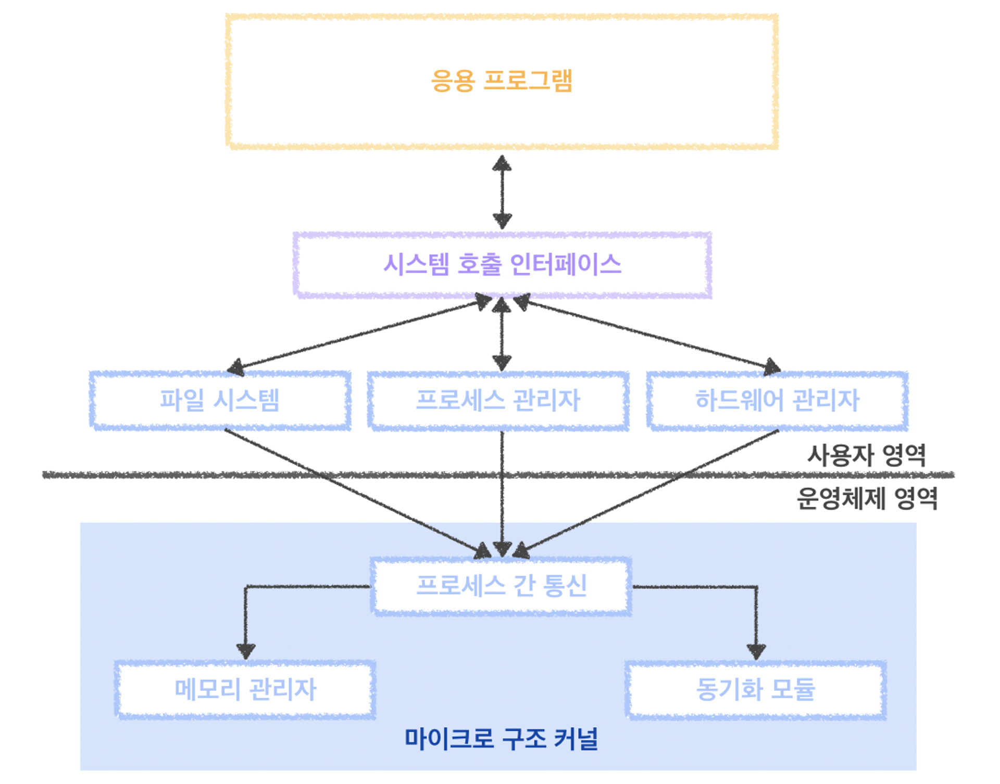
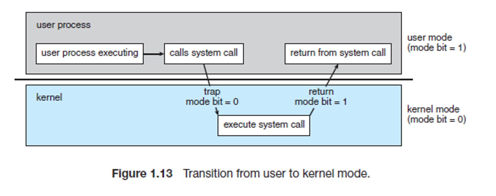

# 시스템 콜

## 개념정리

### 운영체제

- 컴퓨터의 자원을 효율적으로 관리하며 사용자가 컴퓨터를 편리하고 효율적으로 사용할 수 있도록 환경을 제공하는 여러 프로그램 모임
- 컴퓨터 사용자와 컴퓨터 하드웨어 간의 인터페이스로서 동작하는 시스템 소프트웨어의 일종으로, 다른 응용프로그램이 유용한 작업을 할 수 있도록 제공해 준다.

### 운영체제 구조

**커널**

- 프로세스 관리, 메모리 관리, 저장장치 관리와 같은 운영체제의 핵심적인 기능을 모아놓은것
- 컴퓨터의 전원을 켜면 운영체제는 이와 동시에 수행된다.
  - 소프트웨어 컴퓨터 시스템에서 수행되기 위해서는 메모리에 그 프로그램이 올라가 있어야 한다.
  - 마찬가지로 운영체제 자체도 소프트웨어로서 전원이 켜짐과 동시에 메모리에 올라가야 한다.
- 하지만 운영체제처럼 규모가 큰 프로그램이 모두 메모리에 올라가면 한정된 메모리 공간이 낭비가 심할 것이다.
- 따라서 운영체제 중 항상 필요한 부분만을 전원이 켜짐과 동시에 메모리에 올려놓고, 그렇지 않은 부분은 필요할 때 메모리에 올려서 사용하게 된다.
  - 이때 메모리에 상주하는 부분을 kernel(커널)이라고 한다.

**커널의 구성**

- 프로세스 관리: 프로세스에 CPU를 분배하고 작업에 필요한 제반 환경 제공
- 메모리 관리: 프로세스에 작업 공간을 배치하고 실제 메모리보다 큰 가상공간 제공
- 파일 시스템 관리: 데이터 저장하고 접근할 수 있는 인터페이스 제공
- 입출력 관리: 필요한 입출력 서비스 제공
- 프로세스 간 통신 관리: 공동 작업을 위한 각 프로세스 간 통신 환경 제공

**단일형 구조 커널(Monolithic Architecture)**

- 단일형 구조커널은 초창기의 운영체제 구조로, 커널의 핵심 기능을 구현하는 모듈들이 구분 없이 하나로 구성되어 있다.
- 장점
  - 모듈 간 통신 비용이 줄어든다.
- 단점
  - 모듈들이 하나로 묶여 오류를 잡기 어렵다.
  - 작은 기능적 오류가 시스템 전체에 영향을 미친다.
  - 다양한 환경의 시스템에 적용하기 어렵다.

**계층형 구조 커널(Layered Architecture)**

- 계층형 구조 커널은 단일형 구조 커널이 발전된 형태로, 비슷한 기능을 가진 모듈을 묶어서 하나의 계층으로 만들고 계층 간의 통신을 통해 운영체제를 구현하는 방식
- 단일형 구조보다 오류를 처리하는 것이 쉽다.
- 오류가 발생했을 때 전체 커널이 아닌 해당 계층만 따로 수정하면 되기 때문에 디버깅이 쉽다.

**마이크로 구조 커널(Micro Architecture)**

- 계속해서 모듈을 추가할 수 있는 계층형 구조 커널과 반대되는 개념을 가진다.
- 프로세스 관리, 메모리 관리, 프로세스 간 통신 관리 등가장 기본적인 기능만 제공하며,각 모듈은 독립적으로 작동하기 때문에 하나의 모듈이 실패하더라도 전체 운영체제가 멈추지 않는다.
- 많은 컴퓨터에 이식하기 쉽고 커널이 가벼워 CPU 용량이 작은 시스템에도 적용 가능하다.
- 이 구조를 사용하는 대표적인 운영체제인 마하(Mach)는 Mac OS X와 iOS의 커널로 사용되어 유명해졌다.

### 인터페이스

- 커널에 사용자의 명령을 전달하고 실행 결과를 사용자에게 알려주는 역할
- 운영체제는 두 부분으로 나뉜다.
  - 인터페이스: 커널에 명령을 전달하고, 실행 결과를 사용자와 응용프로그램에 돌려주는 역할
  - 커널: 운영체제의 핵심 기능
- 운영체제는 커널과 인터페이스를 분리해, 같은 커널이어도 다른 인터페이스 형태로 제작 가능하다.
  - 같은 커널이라도 다른 인터페이스가 장착되면 사용자에게 다른 운영체제로 보인다.
- 예를들어, 유닉스의 사용자 인터페이스는 쉘(Shell)이라고 하며, bash 쉘, C 쉘, T 쉘 등 여러 종류의 쉘이 있다.

### 시스템 콜(System Call)\*\*

시스템 콜은 운영체제의 커널이 제공하는 서비스에 대해, 응용 프로그램의 요청에 따라 커널에 접근하기 위한 인터페이스이다.

**필요한 이유**

- 응용 프로그램은 OS가 제공하는 인터페이스를 통해서만 OS의 자원을 사용할 수 있다.
- 우리가 일반적으로 사용하는 프로그램은 응용 프로그램이다.
- 유저 레벨의 프로그램은 유저레벨 함수들 만으로는 많은 기능 구현이 어려워 커널의 도움을 반드시 받아야 한다.
- 이러한 작업은 응용프로그램으로 대표되는 유저 프로세스에서 유저모드에서는 수행할 수 없다.
- 반드시 커널에 관련된 것은 커널모드로 전환한 후에야, 해당 작업을 수행할 권한이 생긴다.
- 커널 모드를 통한 이러한 작업은 반드시 시스템 콜을 수행하도록 설계되어 있다.
- 시스템콜은 커널 영역의 기능을 사용자 모드가 사용할 수 있도록 해준다.
- 보통 직접적으로 시스템콜을 사용하기보다는 API(라이브러리 함수)를 통해 사용하게 된다.

### **CPU 모드(이중 동작 모드의 구조)**

CPU는 사용자 애플리케이션(User application)이 시스템을 손상시키는 것을 방지하기 위해 이중 동작 모드를 제공한다.

CPU에 있는 Mode bit를 구분하여 나눠서 구동한다.

- 0은 커널모드
  - 운영체제(OS)가 CPU를 사용하는 모드이다.
  - 시스템 콜을 통해 커널모드가 전환이 되면 운영체제는 하드웨어를 제어하는 명령어(Privileged instruction)를 실행한다.
- 1은 사용자모드
  - 사용자 모드에서 사용자 애플리케이션 코드가 실행된다. 사용자가 접근할 수 있는 영역에 제한이 있기 때문에 해당 모드에서는 하드웨어(디스크, I/O 등)에 접근할 수 없다.

**사용예시**

- 해커가 피해를 입히기 위해 악의적으로 시스템 콜을 사용하는 경우나 초보 사용자가 하드웨어 명령어를 잘 몰라서 아무렇게 함수를 호출했을 경우에 시스템 전체를 망가뜨릴 수도 있기 때문에 이러한 명령어들은 특별하게 커널 모드에서만 실행할 수 있도록 설계되었다.
- 만약 유저 모드에서 시스템 콜을 호출할 경우에는 운영체제에서 불법적인 접근이라 여기고 trap을 발생시킵니다.

**구조**

1. 사용자가 사용하는 응용프로그램은 유저 모드에서 작동이 되어지게 한다.
2. 해당 프로그램이 운영체제에게 시스템 사용을 요청하게 되면 커널모드로 바꾸어서 요청된 시스템을 실행
3. 다시 사용자 모드로 전환

**모드의 변화 과정**

1. 컴퓨터 부팅 과정 - 커널 모드
2. 애플리케이션 실행 과정 - 커널 모드
3. 애플리케이션 실행중 - 유저 모드
4. 인터럽트 발생 후 처리 과정 - 커널 모드

   (하드웨어 인터럽트라 가정시)

   1. 하드웨어 인터럽트 발생후 CPU로 인터럽트 신호 요청 (유저모드)
   2. CPU에서 모드 플래그를 커널모드 값(0)으로 변경
   3. 해당 하드웨어 인터럽트 서비스 루틴(ISR)으로 이동 (커널 모드)
   4. 인터럽트 처리 (커널모드)
   5. 인터럽트 처리 완료 후 CPU의 모드 플래그를 다시 유저모드 값(1)으로 변경
   6. 원래의 애플리 케이션 위치로 복귀 (유저모드) -> 상위 5번과정.

5. 인터럽트 처리 후 - 유저 모드

### **시스템 콜의 종류**

- 프로세스 제어(Process Control)
  - 끝내기(exit), 중지(abort)
  - 적재(load), 실행(execute)
  - 프로세스 생성(create process) - fork
  - 프로세스 속성 획득과 속성 설정
  - 시간 대기(wait time)
  - 사건 대기(wait event)
  - 사건을 알림(signal event)
  - 메모리 할당 및 해제
- 파일 조작(File Manipulation)
  - 파일 생성/삭제(create/delete)
  - 열기/닫기/읽기/쓰기(open, close, read, write)
  - 위치 변경(reposition)
  - 파일 속성 획득 및 설정(get file attribute, set file attribute)
- 장치 관리(Device Manipulation)
  - 하드웨어의 제어와 상태 정보를 얻음(ioctl)
  - 장치를 요구(request device), 장치를 방출(relese device)
  - 읽기(read), 쓰기(write), 위치 변경
  - 장치 속성 획득 및 설정
  - 장치의 논리적 부착 및 분리
- 정보 유지(Information Maintenance)
  - getpid(), alarm(), sleep()
  - 시간과 날짜의 설정과 획득(time)
  - 시스템 데이터의 설정과 획득(date)
  - 프로세스 파일, 장치 속성의 획득 및 설정
- 통신(Communication)
  - pipe(), shm_open(), mmap()
  - 통신 연결의 생성, 제거
  - 상태 정보 전달
  - 원격 장치의 부착 및 분리
- 보호(Protection)
  - chmod()
  - umask()
  - chown()

### 드라이버

응용 프로그램과 커널의 인터페이스가 시스템 호출이라면, **커널**과 **하드웨어**의 **인터페이스**는 드라이버가 담당한다.

하드웨어의 종류는 다양하고, 직접 각 하드웨어에 맞는 인터페이스를 개발하기는 어려워 커널은 입출력의 기본적인 부분만 제작하고, 하드웨어의 특성을 반영한 소프트웨어를 하드웨어 제작자에게 받아 커널이 실행될 때 함께 실행되도록 한다.

이때, 하드웨어 제작자가 만든 소프트웨어를 디바이스 드라이버라고 부른다.

## 예상질문

- 시스템 콜에 대해 역할과 함께 설명해주세요.
- 시스템 콜의 이중동작 모드에 대해서 설명해주세요.

---

### 참고자료

https://brightstarit.tistory.com/13

https://beenii.tistory.com/100

https://dong-co.tistory.com/47
