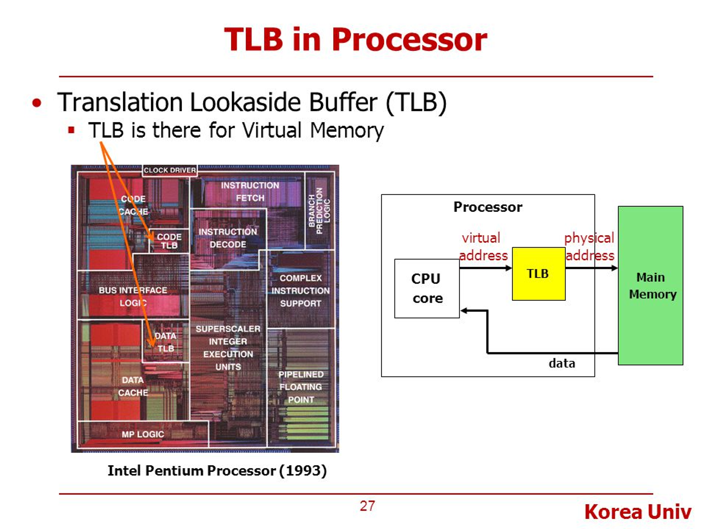
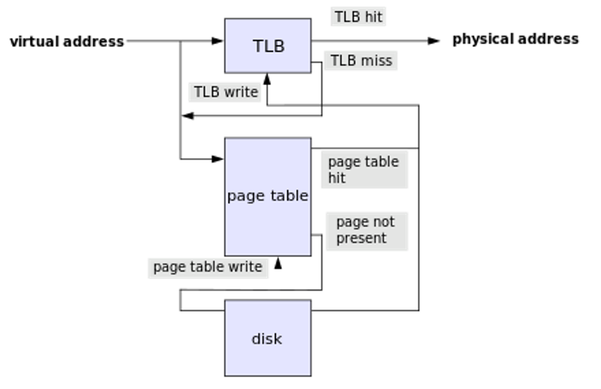
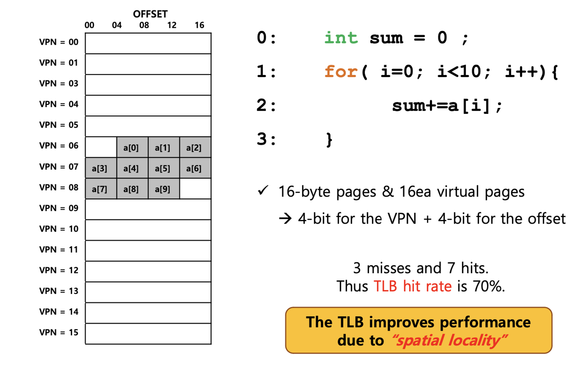
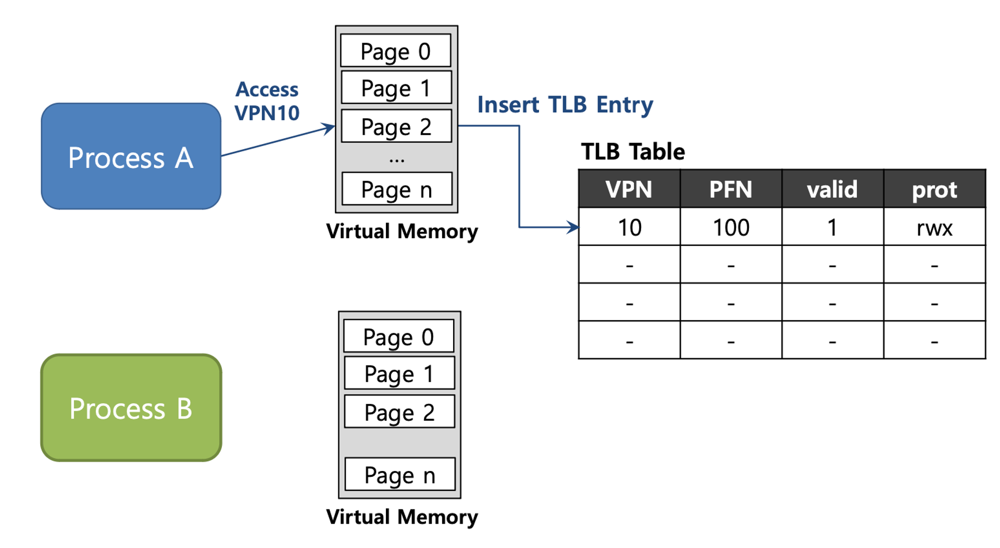
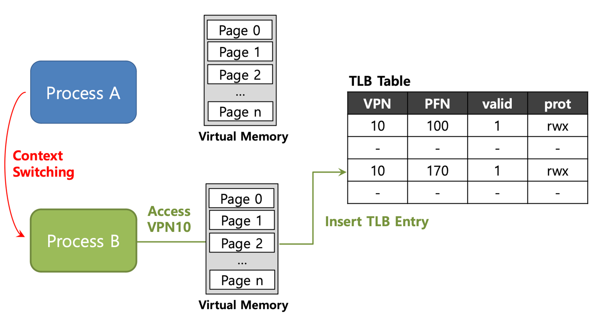
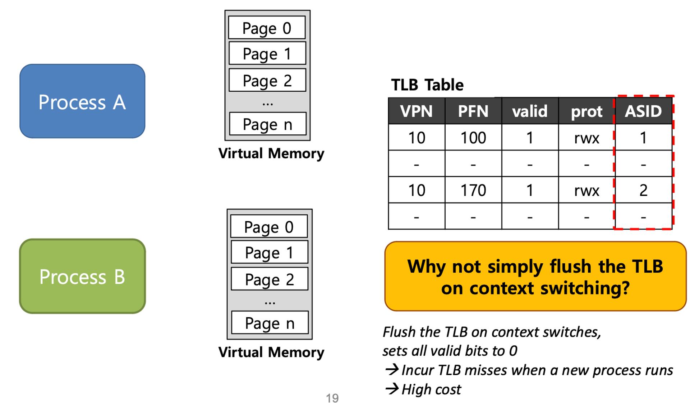

# TLB(Translation Lookaside Buffers)

## 개념 정리

### 등장

- Paging을 사용하여 메모리 가상화를 지원한다면 오버 헤드가 발생합니다. 메모리에 자주 접근하게 되고 page table을 위한 메모리도 존재해야 합니다.
  - 주소를 물리 주소로 변환하기 위한 페이지 테이블이 필요하다.
  - 테이블은 프로세스당 하나가 필요하며, 가상 주소 공간이 클수록 페이지 테이블의 크기도 커지기때문에 매번 메모리에 접근할 때마다 이 테이블을 참조해야 하므로 오버헤드가 발생한다.
- 속도 차이떼문에 CPU가 메모리에 접근해서 page table 정보로 주소 변환을 하는 것은 매우 느린 변환 방법이다.

⇒ TLB 등장

- 메모리의 잦은 접근을 줄이기 위해 CPU의 MMU에 위치한 translation lookaside buffer(TLB)를 사용한다.
- TLB를 사용하면 주소 변환을 위해 메모리에 접근하는 일이 줄어들기때문에 주소 변환이 빠르게 수행된다.

### 정의

- MMU(Memory Management Unit)은 가상 메모리 주소를 실제 메모리 주소로 변환하며, 메모리 보호, 캐시 관리를 담당하는 메모리 관리 장치장치이다. 이 MMU는 TLB라는 캐시를 저장하고 있다.
- TLB에는 virtual page number(VPN)와 physical frame number(PFN) 정보가 쌍으로 존재하며 이를 사용해 주소변환을 하도록 도와주는 하드웨어 cache이다.
- 이를 사용해 CPU는 paging 기법으로 주소변환을 할 때 메모리의 page table을 먼저 보는 것이 아닌 TLB를 먼저 확인하여 TLB에 정보가 존재한다면 해당 정보로 빠르게 주소변환을 할 수 있다.
- TLB는 processor 안에 있으며 page table에 경우 주로 메모리에 있으나 운영체제마다 다르다.
  

### 탐색 과정

- 가상 주소가 물리 주소로 변환되어야할 때, `**TLB**`에서 우선 검색된다.
- 해당 되는 주소가 있으면 (TLB hit) 물리주소가 리턴되고 메모리에 접근
- TLB에서 해당되는 주소가 없을 경우 (TLB miss) **`페이지테이블`**에서 맵핑이 존재하는지 찾는다.
- 페이지 테이블에 존재할 경우에 (page table hit) 이 값은 다시 TLB에 쓰이고 그 주소를 갖고 물리 주소로 변환 후, 메모리에 접근한다.
- 페이지 테이블에서도 찾지 못할 경우에는 **`disk`**에서 찾게 되고 그 값을 다시 페이지테이블에 쓰이고 TLB에 쓰이고 물리주소로 변환 후 메모리에 접근한다.
- ⇒ 다시 정리하면, 가상 주소를 갖고 물리 주소에 접근할 때 TLB -> page table -> disk 순으로 접근한다고 생각하면 된다.
  

메모리의 어떤 주소든지 캐시의 어떤 위치에도 저장될 수 있습니다.

### TLB entry(TLB 안에는 무엇이 있을까?)

- TLB는 **Full Associative** method에 의해 관리된다.
  - 메모리의 어떤 주소든지 캐시의 어떤 위치에도 저장 가능
  - 일반적인 TLB는 32, 64 또는 128개의 항목을 가질 수 있다.
  - 하드웨어는 전체 TLB를 병렬로 검색하여 원하는 변환을 찾습니다
  - Other bits : valid bits , protection bits, address-space identifier, dirty bit
- 정리하자면, 자주 사용하는 TLB에는 VPN(virtual page number)과 PFN(Page Frame Number) 정보가 쌍으로 존재하며, 이를 사용해 주소 변환을 하도록 도와주는 Hardware Cache이다.

### 예시: 배열 접근

> TLB가 메모리 성능을 어떻게 향상시키는 지 예시

- 가정) Page의 크기는 16-byte이며 가상 주소 공간의 크기를 8-bit(2^8=196byte)라고 가정한다.
- 가상 주소 공간에 존재하는 Page 수는 16개(가상 주소 공간의 크기 / Page의 크기)가 된다.
- int 자료형이 4byte이므로 for문에 적용하면 총 배열의 크기는 40byte이다. (배열이 가상 주소 공간 100에서 시작하면 Page Table이 왼쪽 그림과 같이 그려진다)

1. for문을 돌리고, [1] a[0]이 요청이 오면 VPN = 6(a[0] ~ a[2])이 전부 올라간다.
2. a[3]이 요청이 오면 VPN = 6에 없으므로 `miss` 가 되고, VPN = 7(a[3] ~ a[6])에 올라간다.
3. 결론적으로 3개의 miss와 7개의 hit이 생겼고, 그러므로 **TLB hit rate = 70%** 이라는 결론이 나왔다.

- 3개의 `miss`는 a[0], a[3], a[7]이며, 7개의 `hit`은 a[1], a[2], a[4], a[5], a[6], a[8], a[9]이다.
  - a 배열에 요청이 올 때 해당하는 값이 VPN에 없으면 miss가 발생하고, 한 번 접근한 뒤에 다시 a 배열에 요청이 오면 이미 TLB에 변환 정보가 존재하기 때문에 hit으로 처리된다.
  - 여기서는 page의 크기가 16byte이므로 hit rate가 70%라는 값이 나왔지만, 배열의 요소 개수가 이 보다 더 많이 증가한다면, 100%에 가깝게 될 것이다.
- TLB에서 주소변환이 성공한 것을 `TLB Hit`이라고 한다.
- TLB가 없는 상황에서는 총 10번의 반복이 발생하고, 반복할 때 마다 page table에 접근하여 주소 변환을 해줘야 한다.
- 하지만, 위의 그림처럼 TLB가 있는 상황에서는 a 배열에 대한 10번의 접근 중 3번의 TLB miss만 발생했기 때문에, 3번만 page table에 접근하여 주소 변환을 해주면 된다.
- TLB는 **`Spatial Locality`(공간 지역성)로 인해, 성능을 향상**시킨다.

### Effective Access Time(EAT)

- **실제 메모리에 접근하는 시간(EAT)를 구하는 방법**에 대해 알아보자.
- 다음 예시를 가정해보자.
  - TLB hit ratio = 80%
  - TLB search : 20 ns (TLB에서 해당 정보를 찾는 시간)
  - Memory access : 100 ns (메모리에 한번 접근하여 데이터를 가져오는 시간)
- `EAT` = 0.80 x (20 + 100) + 0.20 x (20 + 100 + 100) = 140 ns
  - `(20 + 100)` : TLB Hit이 된 경우 TLB에 가서 메모리가 접근한 시간을 의미한다.(TLB가 있는 경우)
  - `(20 + 100 + 100)` : TLB search + Page table에 접근한 시간 + Memory access 합한 값을 의미한다. (TLB가 없는 경우)
- **ns** 로 표기하는 것이 중요하고 잊지 말자.

### TLB Issue: Context Switching

> TLB를 사용할 때 Context Switching이 발생한다면 어떻게 되는지 다음 예시를 통해 알아보자.

- `Process A`의 VPN 10에 대한 주소 변환 정보가 TLB에 저장되어 있다.
- 참고로 Process마다 각자의 Virtual Memory를 가지고 있다.

- 이때 Context Switching이 발생하여 `Process B`로 넘어가게 되는데, Process B 역시 VPN 10에 대한 주소 변환 정보가 TLB에 저장되어 있다.
- 이런 경우 Process A, B 둘다 **VPN은 10으로 동일하지만 PFN은 서로 다른 것을 확인**할 수 있다.

- 하지만 위와 같이 TLB에 정보를 저장하게 되면 **어떤 정보가 어떤 Process의 정보인지 알 수가 없다**.
- Process에서 서로의 주소 공간이 아닌 곳에 접근을 하게 될 경우 문제가 발생하므로 이를 해결할 방법이 필요하다.

**To Solve Problem**

- 위의 문제를 해결하기 위해 하드웨어의 도움을 받아 TLB에서 `ASID`(address space identifier)라는 정보를 추가하여 문제를 해결하는 것이다.

- 어떤 프로세스의 정보인지 구별하기 위해 TLB에서 `ASID`를 제공한다.
- 이를 통해 프로세스마다 다른 ASID 정보를 저장하여 주소 변환을 성공적으로 수행할 수 있도록 한다.

## TLB Replacement Policy

- TLB에 저장 가능한 공간이 꽉 찼을 경우 새로운 프로세스가 실행된다면, 어떤 프로세스를 빼고 새로운 것을 넣어야 하는지에 대해 알아보자.
- 우선, 목표는 **TLB miss rate를 최소화** 하는 것이다. (TLB hit rate를 향상시키는 것과 같은 말이다)
- 전형적으로 2가지 간단한 접근 방법이 있다. (LRU, Random policy)
- `LRU`(Least-recently-used) : 최근에 사용하지 않는(예전에 사용하고 지금은 사용하지 않는) Process를 내보내는 방법이다.
  - LRU는 위에서 설명한 `Temporal Locality`의 장점을 이용한다.
- `Random policy` : 이름 그대로 랜덤하게 제거하는 방법이다.

## 예상질문

- TLB가 나오게 된 배경은 무엇이고, TLB 개념에 대해 설명해주세요.
- 전체적인 페이지 탐색과정은?
- TLB가 메모리 성능을 어떻게 향상시키는지 `TLB hit rate` 와 `Spatial Locality` 개념과 연관지어 설명해주세요.

---

### 참고자료

- https://icksw.tistory.com/149
- https://about-myeong.tistory.com/35
- https://github.com/devSquad-study/2023-CS-Study/blob/main/OS/os_tlb_advanced.md
