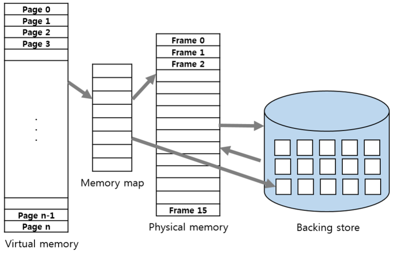
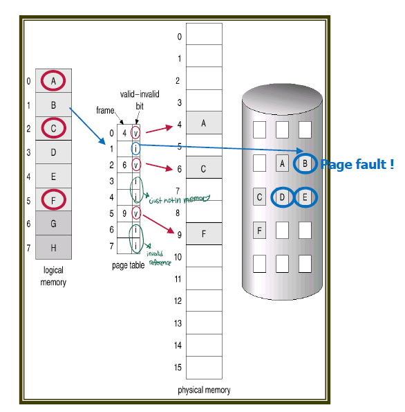
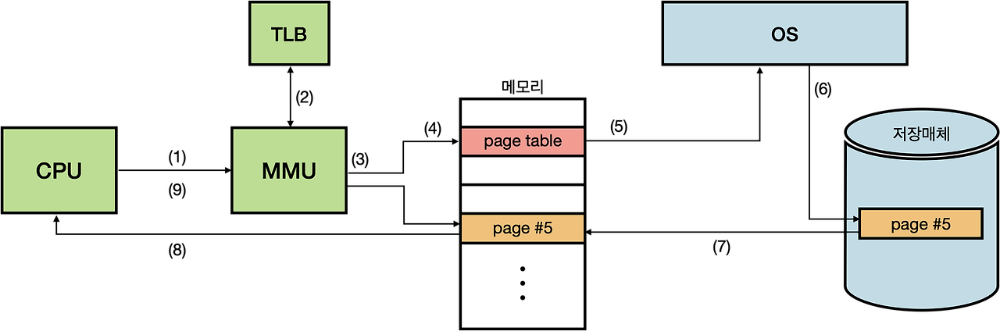
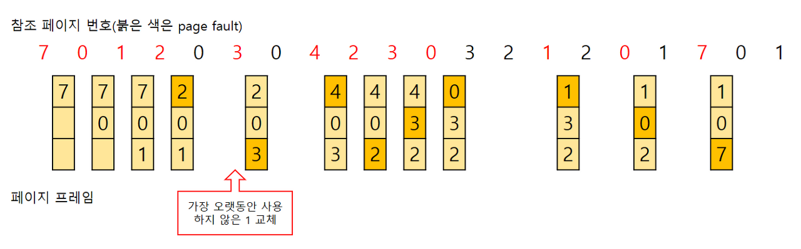

# 가상메모리와 요구 페이징, 페이지 교체

예전의 메모라 관리 기법 방식은 프로세스 전체가 메모리 내에 올라와야 한다는 것을 전제로 하고 있었다.

**프로세스 전체가 메모리 내에 올라오지 않더라고 실행히 가능하도록 하는 기법을 가상메모리**라고 한다.

가상메모리는 물리 메로리로부터 사용자 관점의 논리 메모리를 분리시켜 주 메모리를 균인한 크기의 저장 공간으로 구성된 엄청나게 큰 배열로 추상화 시켜준다.

따라서 작은 메모리를 가지고도 큰 가상 주소 공간을 제공한다.

### 장점

- 사용자 프로그램이 물리 메모리보다 커져도 된다. 즉, 메모리 크기의 제약으로부터 자유로워진다.

- 각 사용자 프로그램이 더 작은 메모리를 차지하므로 더 많은 프로그램을 동시에 수행할 수 있다. 이에 따라 응답시간은 늘어나지 않으면서 CPU 이용률과 처리율이 높아진다.

- 프로그램을 메모리에 올리고 스왑하는데 필요한 입/출력 횟수가 줄어든다. 따라서 프로그램들이 보다 빨리 실행된다.

- 가상메모리 파일의 공유를 쉽게 해주고 공유 메모리 구현을 가능하게 한다.

- 프로세스 생성을 효율적으로 처리할 수 있는 메커니즘도 제공한다.

### 단점

- 구현이 어렵고, page fault로 인해 성능이 저하될 수 있다.

## 요구 페이징 (demand paging)



프로세스를 실행 시 모든 부분이 필요한 것은 아니다. 따라서 실행 시 필요한 부분만 메모리에 올림으로써 메인 메모리에 올라가는 프로세스의 크기를 줄일 수 있다.

요구 페이징은 실행시킬 프로세스들을 페이징 과정을 통해 외부 단편화 문제를 해결한다. 따라서 프로세스를 페이지 단위로 나누어 실행에 필요한 부분과 필요 없는 부분으로 나눈다. 이때 **당장 실행에 필요한 페이지만 메모리에 적재하는 기법**이 **요구 페이징**이다. 당장 실행에 필요없는 부분은 **Backing Store**에 저장해놓았다가 필요할 때 메모리에 올리게 된다.

요구 페이징 기법을 사용할 때, 필요한 페이지가 메모리에 존재할 수도 있고 Backing Store에 존재할 수도 있다. 이때 페이지가 메모리에 적재되어 있는지 판단할 방법이 필요하다. 여기서 이용하는 것이 **Valid-Invalid Bit**이다.



모든 페이지 테이블에는 valid-invalid bit이 존재한다. 이때 valid(1)는 페이지가 메모리에 존재한다는 뜻이고, invalid(0)는 페이지가 메모리에 존재하지 않는다는 뜻이다.

따라서 페이지 테이블을 통해 논리주소에서 물리 주소로 접근할 때 valid(1)하다면 바로 해당 페이지를 접근하게 되고, 
만약 invalid(0)하다면 Page Fault가 발생한다.

### 페이지 부재(Page Fault) 과정



```
1. 프로세스에 대한 내부테이블을 검사해서 그 메모리 참조가 유효/무효 인지 알아 낸다.

2. 무효한 페이지에 대한 참조라면 프로세스는 중단된다. 유효한 참조인 경우 메모리에 없으면 디스크로부터 가져와야 한다.
(프로세스가 메모리에 없는 페이지를 접근하려 할 때 페이지 부재 트랩 page-fault-trap을 발생시킨다)

3. 빈 공간, 자유 프레임(free frame)을 찾는다.

4. 디스크에 새로이 할당된 프레임으로 해당 페이지를 읽어 들이도록 요청

5. 디스크 읽기가 끝나면 이 페이지가 메모리에 있다는 것을 알리기 위해 페이지 테이블을 갱신하며 프로세스가 유지되고 있는 내부테이블을 수정한다.

6. 트랩에 의해 중단되었던 명령을 다시 수행하며 프로세스는 그 페이지가 항상 메모리에 있엇던 것처럼 간주하여 해당 페이지를 접근할 수 있다.
```

## 페이지 교체 (Page Replacement)

프로그램 실행 시 모든 항목이 물리 메모리에 올라오지 않기 때문에, 프로세스의 동작에 필요한 페이지를 요청하는 과정에서 Page Fault가 발생하면 원하는 페이지를 보조 저장장치에서 가져오게 된다.

만약 물리 메모리가 모두 사용중인 상황이라면, 페이지 교체가 이뤄져야 한다.

### 메모리 교체 흐름

1. 디스크에서 필요한 페이지의 위치를 찾는다.
2. 빈 페이지 프레임을 찾는다.
3. 페이지 교체 알고리즘을 통해 희생될 페이지를 고른다.
4. 희생될 페이지를 디스크에 기록하고 관련 페이지 테이블을 수정한다.
5. 새롭게 비워진 페이지 테이블 내 프레임에 새 페이지를 읽어오고, 프레임 테이블을 수정한다.
6. 사용자 프로세스를 재시작한다.

### 페이지 교체 알고리즘

#### 1. FIFO

먼저 물리 메모리에 들어온 페이지 순서대로 페이지 교체 시점에 먼저 나가게 되는 알고리즘

**장점**

- 이해하기 쉽고 프로그래밍하기 쉽다.
- 가장 간단한 페이지 교체 알고리즘으로 FIFO의 흐름을 가진다.

**단점**

- 오래된 페이지라도 중요한 정보를 포함할 수 있다.
- 처음부터 활발하게 사용되는 페이지를 교체해서 페이지 부재율을 높이는 부작용을 초래할 수 있다.

#### 2. 최적 페이지 교체(Optimal Page Replacement)

앞으로 가장 오랫동안 사용되지 않을 페이지를 찾아서 교체하는 알고리즘

**장점**

- Belady의 모순이 발생하지 않는다.
- 가장 낮은 페이지 부재율을 보장한다.

**단점**

- 구현이 불가능하다.
- 모든 프로세스의 메모리 참조 계획을 미리 파악할 방법이 없다.

#### 3. LRU(Least Recently Used)



FIFO 알고리즘보다 우수하고 OPT 알고리즘보다는 그렇지 못하다.  
많이 사용되는 알고리즘.

**장점**

- 시간 지역성(temporal locality)성질 고려함.(최근에 참조된 페이지가 가까운 미래에 다시 참조될 가능성이 높은 성질)

**단점**

- 프로세스가 주기억장치에 접근할때마다 참조된 페이지 시간을 기록해야 하므로 막대한 오버헤드가 발생  
  카운터나 큐, 스택과 같은 별도의 하드웨어가 필요

#### 4. LRU(Least Recently Used)

참조 회수가 가장 작은 페이지를 교체하는 알고리즘  
활발하게 사용되는 페이지는 참조 횟수가 많아질 거라는 가정에서 만들어진 알고리즘이다.

실제 구현이 쉽지 않고 최적 알고리즘에 근사하기 어렵다.

#### 4. MFU(Most Frequently Used)

가장 많이 사용된 페이지를 교체하는 알고리즘  
가장 적게 사용된 페이지가 최근에 올라오고 계속 사용될 것이라는 가정에서 만들어진 알고리즘이다.

실제 구현이 쉽지 않고 최적 알고리즘에 근사하기 어렵다.

## 예상 질문

- 요구 페이징의 개념과 페이지 폴트 처리 과정을 간단하게 설명해주세요.
- 페이지 교체란 무엇이고 어떤 흐름으로 처리되는지 설명해 주세요.

## 참고 링크

https://seungahyoo.tistory.com/70  
https://just-my-blog.tistory.com/36
