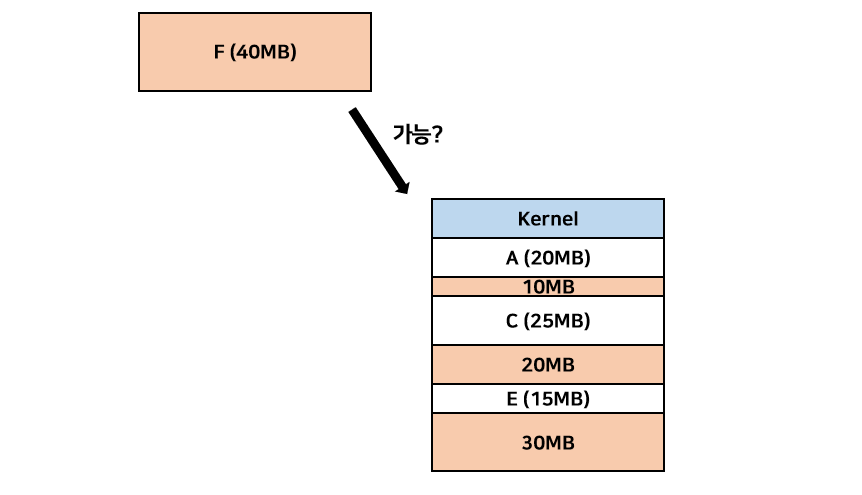
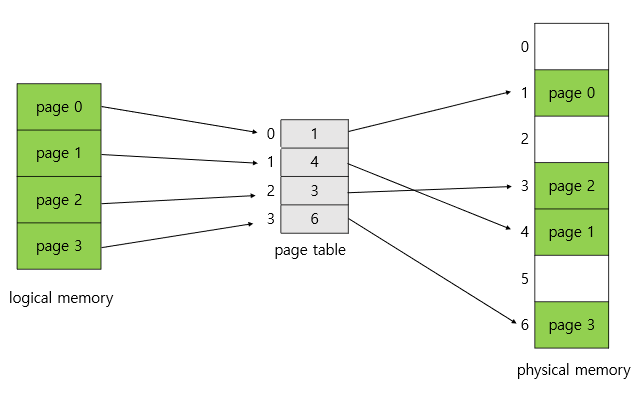
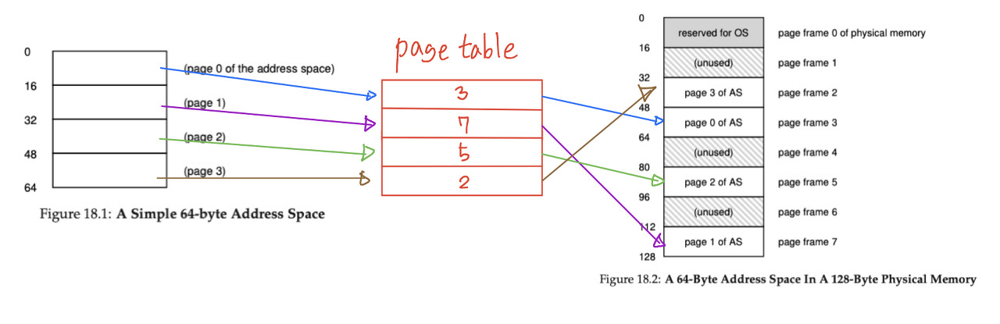
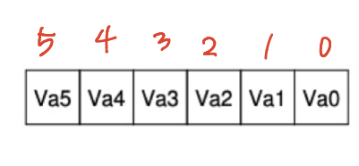
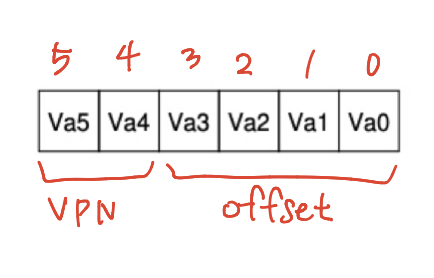
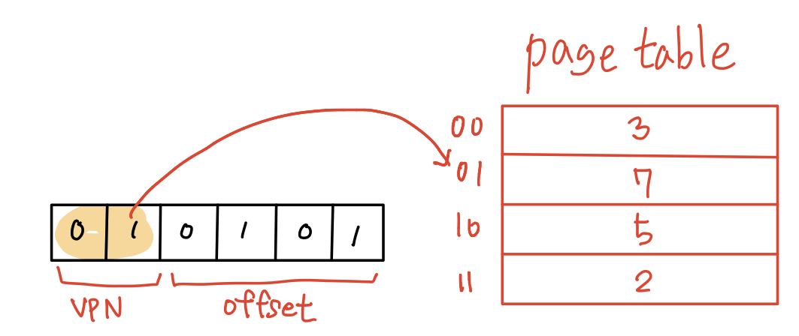
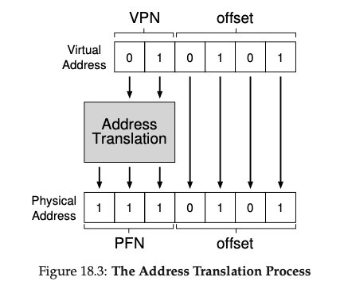
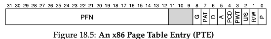

# 페이징 (paging)

Paging은 **프로세스의 가상 주소 공간을 가변 크기가 아닌 고정 크기로 나누어서 메모리에 할당**하는 개념이다.

이때 가상공간에서 나누어진 고정 크기 단위를 page라고 한다. 그리고 이러한 가상공간의 page를 실제 메모리에 할당하게 되는데 실제 메모리에는 이를 page frame이라는 단위로 사용한다.

즉 가상 메모리에서는 page, 실제 메모리에서는 frame이라고 불리는 고정 크기의 공간으로 프로세스를 실행한다는 뜻이다.

## 외부 단편화(External Fragmentation)

메모리 단편화란 메모리의 공간이 작은 조각으로 나뉘어져 충분히 사용 가능한 메모리가 있음에도 시스템이 메모리 할당을 할 수 없는 상태를 의미한다.

메모리 단편화가 발행하는 원인에 따라 ‘내부 단편화’와 ‘외부 단편화’로 구분할 수 있다.  
그중에서도 외부 단편화는 메모리가 할당되고 해제되는 작업이 반복될 때, 작은 메모리가 많이 생겨나면서 총 사용 가능한 메모리 공간은 충분하지만 실제로 할당할 수 없는 상황을 말한다.



이러한 외부 단편화를 해결하기 위한 방법 중 하나로 paging이 사용된다.

## 페이지 테이블 (page table)

```
Page (페이지) : 가상 메모리를 일정한 크기로 나눈 블록
Frame (프레임) : 물리 메모리를 일정한 크기로 나눈 블록

페이지 크기 = 프레임 크기
```



모든 프로세스는 페이지 크기만큼 조각화되고, 물리적 메모리도 페이지 크기만큼 조각화된다. 그리고 프로세스의 각 페이지는 물리적 메모리의 조각인 프레임에 불연속적으로 할당된다. 이때, 페이지와 프레임의 대응 관계도는 '페이지 테이블'에 저장된다.  
즉, 페이지 테이블이란 **물리 주소(physical address)의 페이지를 실제 물리 주소 정보와 매핑한 표를 담고 있는 테이블**이다.

위 그림에서 논리적 메모리에서는 연속적이던 페이지들이 페이지 테이블을 거치고 나서는 불연속적으로 바뀐 것에 주목하자.

참고로 페이지 테이블은 모든 프로세스마다 개별적으로 가지고 있는 정보다. 따라서 n개의 프로세스가 있다면 페이지 테이블 또한 n개 있다는 뜻이다.

## 페이징 기법의 이점

- **주소를 연속적으로 할당함으로써 외부 단편화를 해결할 수 있다.**

  위 그림에서 물리적 메모리의 2번 인덱스가 비어있지만 페이지와 프레임의 크기가 똑같으므로 다른 페이지가 2번 인덱스에 들어갈 수 있기 때문이다. '빈 공간(프레임)'이 있어도 크기가 항상 페이지와 같으므로 더이상 '빈 공간'은 걱정하지 않아도 된다.

- **프로세스끼리 메모리 공유가 훨씬 용이해진다.**

  프로세스별로 공유하는 페이지의 물리적 주소를 페이지 테이블에 저장하면 되기 때문이다.

## Page → Frame Mapping

가상 주소 공간에는 두 가지 요소가 있다.

**VPN:** Virtual Page Number  
**Offset:** page 안에 있는 offset. 위치를 찾기 위해 더해주는 값

다음 예시를 보자.



위의 예에서 가상 주소의 크기가 64바이트이므로 가상 주소를 나타내는데 필요한 비트 수는 6이다. 따라서 6비트를 다음과 같이 표현할 수 있다.



위와 같이 나타낸 6비트에서 VPN, offset을 구분해야 하므로 비트를 구분하면 아래와 같아진다.



위 예에서는 64바이트 크기의 가상공간을 16바이트의 page로 나눠 사용했으니 총 4개의 page가 사용될 수 있다.  
4개의 page를 구분하기 위해 상위 2비트에 저장하는 것이다. 그리고 하위 4비트에는 offset는 각 page의 자세한 위치를 알려준다.  
여기서는 page의 크기가 16바이트였으니 2^4 = 16이므로 4비트가 offset으로 사용되는 것이다.

그럼 위의 예에서 21이라는 가상 주소를 변환해보자.

21은 2진수로 표현하면 010101이다. 이를 그림으로 나타내면..



이렇게 나타나게 되고 이를 해석하면 가상 주소 21은 가상 page 01 인덱스에 존재하는 page의 5바이트를 가리키는 것이다.  
page table의 01인덱스에는 실제 메모리에서의 physical frame number가 저장되어 있는데 여기서는 7이다. 이제 이 정보를 사용하여 physical frame number(PFN)으로 변환하면 실제 메모리의 주소를 얻을 수 있다.



아까 예에서 실제 메모리의 크기는 128바이트였다.  
따라서 필요한 실제 메모리를 나타내는데 필요한 비트 수는 7이고, 아까 page table을 보니 page 01 인덱스는 PFN 7이었으므로 01->111로 변환된다.  
이렇게 VPN -> PFN으로 변환해주고 offset은 그대로 사용하면 된다. 그럼 위와 같이 실제 메모리 주소는 1110101이 된다.

## 페이지 테이블은 어디에 저장되는가?

page table은 가변 크기 할당에서 사용하던 segment table이나 base, limit 레지스터를 사용하는 것 보다 필요한 크기가 훨씬 커질 수 있다.

예를 들어 4KB page를 갖는 32 비트의 가상 주소 공간을 생각해보자.

이 가상 주소는 20비트의 VPN, 12비트의 offset으로 분할된다. VPN이 20개의 비트로 표현된다라는 말은 OS가 각 프로세스에 대해 관리해야 하는 page수가 100만 개 정도 된다는 것이다. 또한 하나의 page의 정보를 저장하기 위한 page table의 크기가 4바이트라고 한다면 4바이트 \* 100만 = 4MB이다. 이러한 프로세스가 100개라면, 400MB의 메모리를 필요로 하게 된다. 이를 CPU의 레지스터에 저장한다는 것은 불가능하다.

실제로 page table은 **OS 가상 메모리**에 저장된다.

## 페이지 테이블의 구조

Page table의 역할은 가상 주소를 실제 메모리 주소로 변환해줄 때 사용하는 자료구조이다. 이를 위한 가장 간단한 구조는 **1차원 배열**을 사용하는 것이다.

VPN으로 해당 프로세스의 page table 배열을 인덱싱하고 변환을 위해 해당 인덱스의 page table entry(PTE)를 조회한다. 여기서 PTE는 page table에서 각 page의 정보라고 생각하면 된다. PTE의 구조는 아래와 같다.



    - P : 현재 실제 메모리나 디스크에 존재하는 page인지 확인하는 비트

    - R/W : page가 쓰기가 허용되는지 여부를 결정하는 비트

    - U/S : User Mode 프로세스가 page에 접근할 수 있는지에 대한 비트

    - PWT, PCD, PAT, G : page에 대해 하드웨어 캐싱이 작동하는 방식을 결정하는 비트
    - A : 최근 참조된 적이 있는지에 대한 정보 (페이지 교체 정책에서 사용됨)

    - D : page가 수정된 적이 있는지에 대한 정보

그리고 나머지는 page frame number로 구성된다.

## 페이징의 문제점

페이징의 문제점은 속도가 느리다는 것이다.

페이징은 다음과 같은 과정을 거친다.

    1. 프로세스의 page table을 살펴본다.

    2. Page table의 정보를 통해 주소 변환을 한다.

    3. 실제 메모리에서 데이터를 가져온다.

이를 수행하면 메모리에서 데이터를 가지고 오는데 메모리를 한 번 참조하는 것이 아닌 두 번 참조하게 되고 성능도 그만큼 저하되게 된다.  
Paging 방법을 사용하는 것은 메모리 가상화를 위한 좋은 방법처럼 보이지만 성능도 안 좋고 메모리도 많이 사용하는 방법이다. 즉 이를 극복해야 실제로 사용할 수 있다.

## 예상 질문

- Paging(페이징)이 왜 나오게 되었고, 개념에 대해 말씀해주세요.
- Paging의 장점과 단점에 대해 말씀해주세요.
- Paging을 이용한 주소 변환 과정에 대해 말씀해주세요. (Page table, PTE, PFN 개념 언급)

## 참고 링크

https://icksw.tistory.com/148  
https://charles098.tistory.com/106  
https://jerryjerryjerry.tistory.com/187
