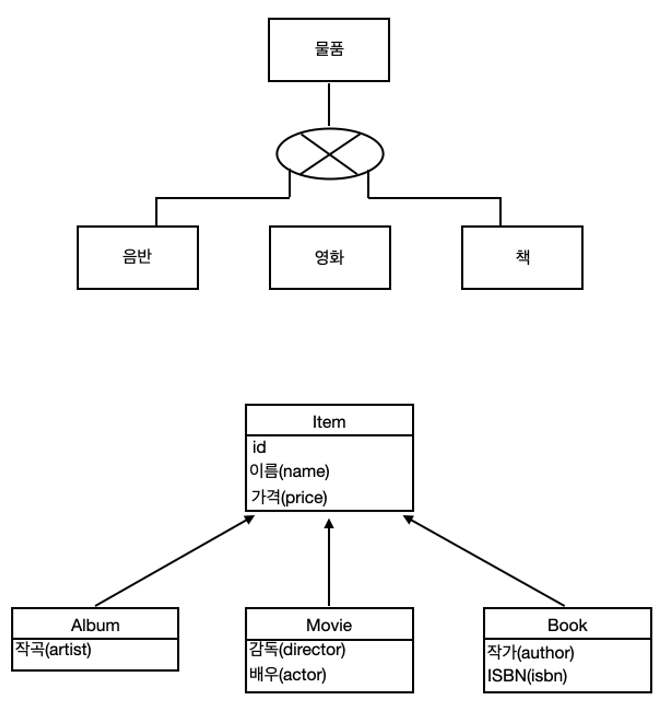
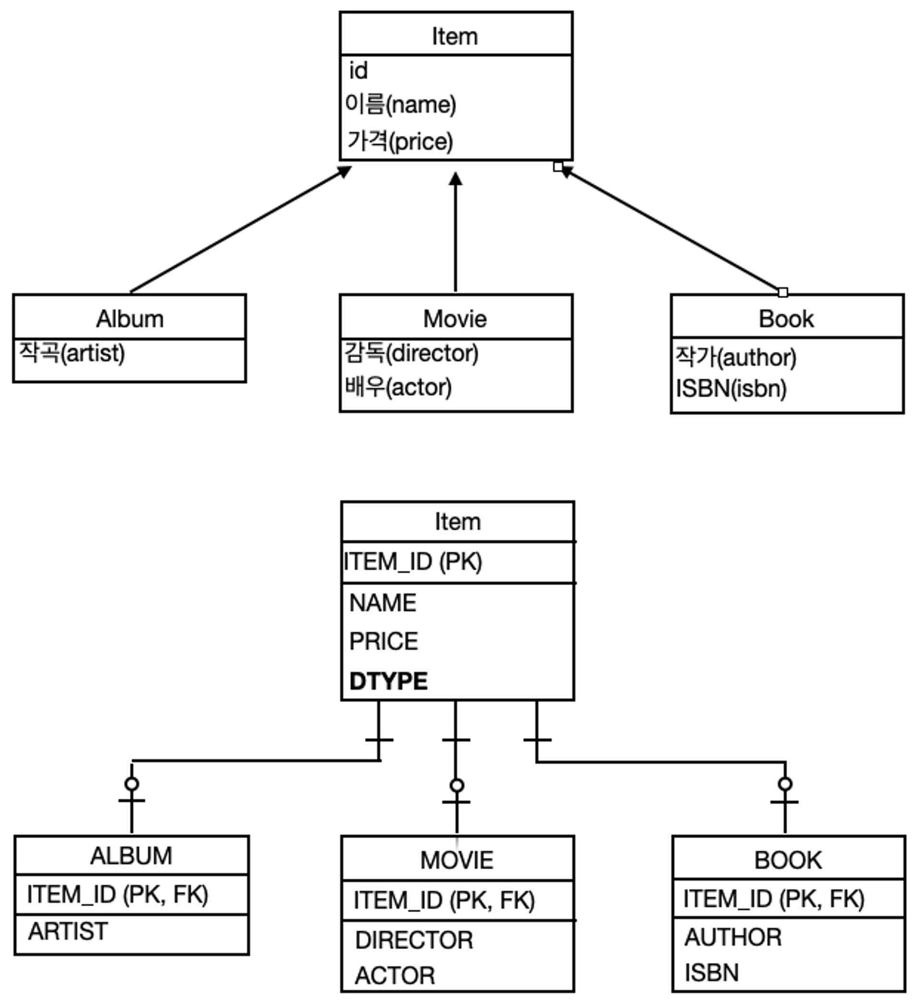
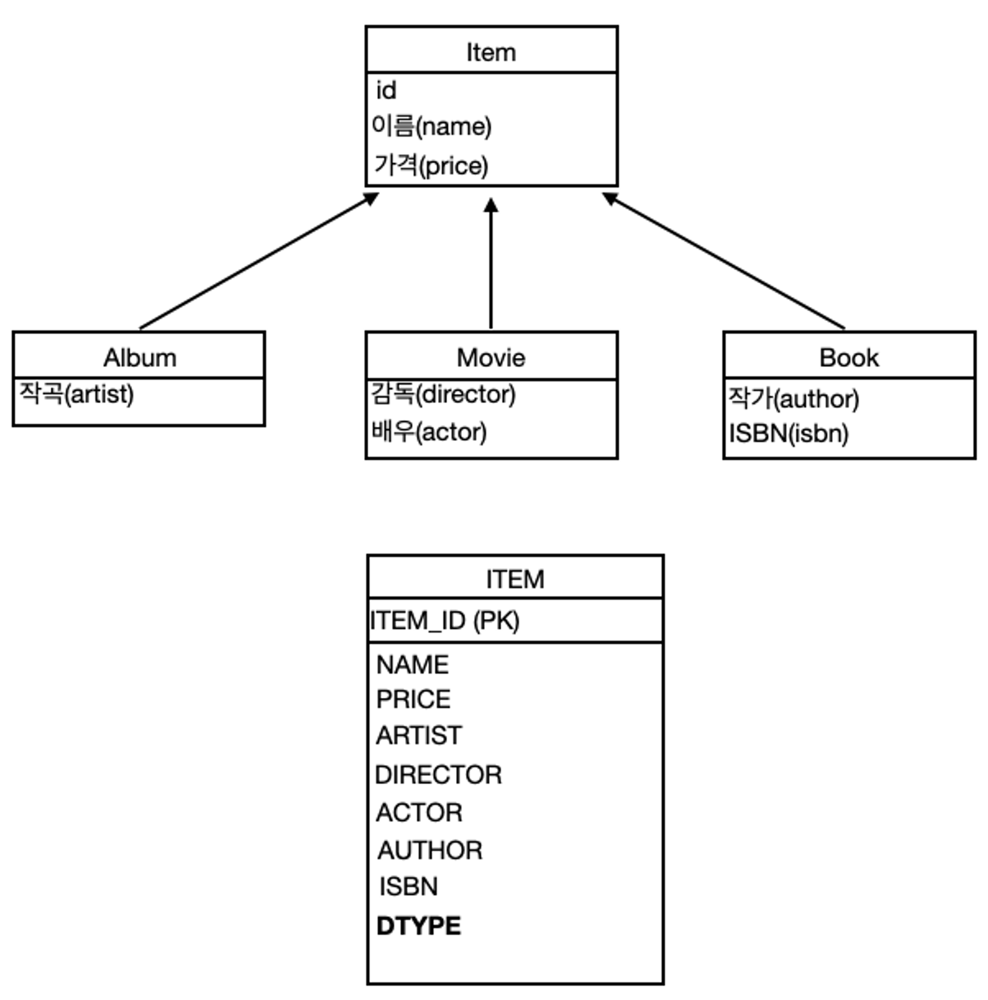
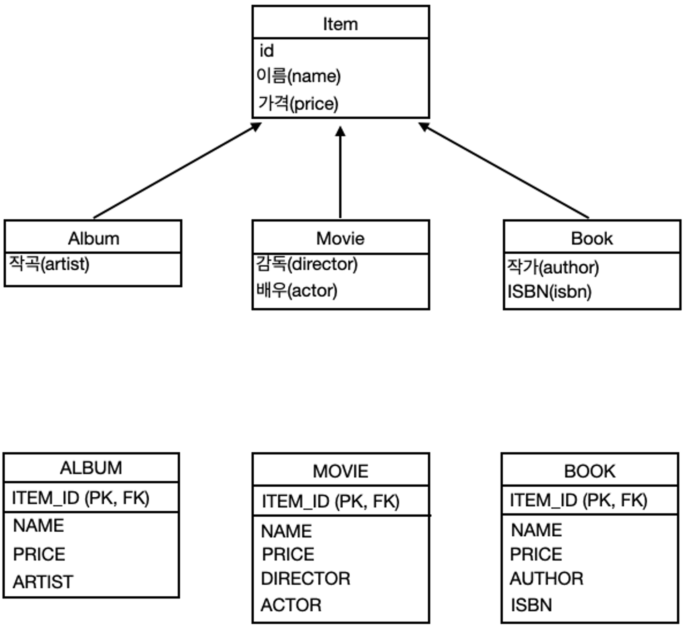
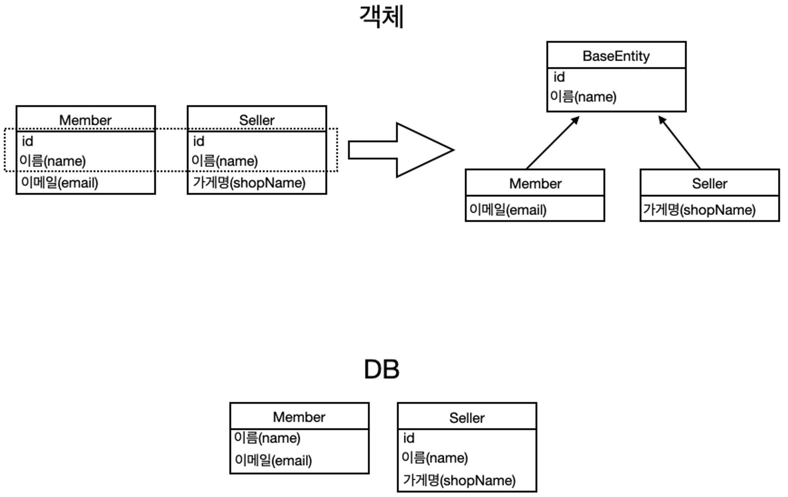

# **상속관계 매핑**

## 개념 정리

### **자바와 관계형 데이터베이스의 차이**



- 관계형 데이터베이스는 **상속관계**라는 것이 따로 없다.
- **슈퍼타입 서브타입 관계**라는 모델링 기법이 객체의 상속과 유사하다.
- 따라서 상속관계 매핑은 객체의 상속관계와 데이터베이스의 슈퍼타입 서브타입 관계를 매핑하는 것을 말한다.

### **슈퍼타입 서브타입 논리 모델을 실제 물리 모델로 구현하는 방법**

- **각각 테이블**로 변환하는 경우 : **조인 전략**
- **통합 테이블**로 변환하는 경우 : **단일 테이블** 전략
- **서브타입 테이블**로 변환하는 경우 : **구현 클래스마다 테이블 전략**

### **주요 애너테이션**

**@Inheritance(strategy=InheritanceType.XXX)**

- JOINED : 조인 전략
- SINGLE_TABLE : 단일 테이블 전략
- TABLE_PER_CLASS : 구현 클래스마다 테이블 전략

**@DiscriminatorColumn(name="DTYPE")**

- 부모 클래스에 선언
- 하위 클래스를 구분하는 용도의 컬럼
- 관례는 default = DTYPE
- 부모 클래스가 **`Animal`**이고 하위 클래스로 **`Dog`**와 **`Cat`**이 있다면, "DTYPE" 열에는 "Dog" 또는 "Cat"과 같은 값이 저장

**@DiscriminatorValue("XXX")**

- 하위 클래스에 선언
- 엔티티를 저장할 때 슈퍼타입의 구분 컬럼에 저장할 값을 지정
- 어노테이션을 선언하지 않을 경우 기본값으로 클래스 이름이 들어간다.

### **조인 전략**



**장점**

- 테이블 정규화
- 외래키 참조 무결성 제약조건 활용가능
- 저장공간 효율화

**단점**

- 조회시 조인을 많이 사용하게 되어 성능이 저하됨
- 조회 쿼리가 복잡함
- 데이터 저장시 INSERT SQL 2번 호출

### **단일 테이블 전략**



**장점**

- 조인이 필요없어 조회 성능이 빠름
- 조회 쿼리가 단순함

**단점**

- 자식 엔티티가 매핑한 컬럼은 모두 null을 허용
- 단일 테이블에 모든 것을 저장하므로 테이블이 커질 수 있다. 상황에 따라서 조회 성능이 오히려 느려지는 경우도 있음

### **구현 클래스마다 테이블 전략**



- 이 전략은 데이터베이스 설계자와 ORM 전문가 둥 다 추천하지 않는다.

**장점**

- 서브 타입을 명확하게 구분해서 처리할 때 효과적이다.
- not null 제약조건 사용 가능

**단점**

- 여러 자식 테이블을 함께 조회할 때 성능이 느림(UNION SQL 필요)
- 자식 테이블을 통합해서 쿼리하기 어려움

### **@MappedSuperclass**

> 테이블과 관계없이 단순히 엔티티가 공통으로 사용하는 매핑 정보를 모으는 역할



- **공통 매핑 정보가 필요할때 사용**한다.(id, name)
  - 상속관계 매핑이 아니다.
- **엔티티가 아니기 때문에** 테이블 매핑이 되지 않는다.
- 부모클래스를 상속받는 **자식 클래스에 매핑 정보만 제공**한다.
- 조회, 검색 불가(em.find(BaseEntity) 불가)
- 직접 생성해서 사용할 일이 없으므로 **추상 클래스를 권장**한다.
- 주로 등록일, 수정일, 등록자, 수정자 같은 전체 엔티티에서 공통으로 적용하는 정보를 모을 때 사용
- 참고 : @Entity 클래스는 엔티티나 @MappedSuperclass로 지정한 클래스만 상속 가능

### 임베디드 타입

- 복합 값 타입을 의미합니다.
- 새로운 값 타입을 직접 정의할 수 있습니다.
- JPA는 임베디드 타입(embedded type)이라고 불려집니다.
- 주로 기본 값 타입을 모아서 만들어서 복합 값 타입이라고도 하며, int, String과 같은 값 타입을 의미합니다.
- @Embeddable: 값 타입을 정의하는 곳에 표시
- @Embedded: 값 타입을 사용하는 곳에 표시
- 기본 생성자 필수


```java
@Entity
public class Member extends BaseEntity {
    @Id
    @GeneratedValue
    @Column(name = "MEMBER_ID")
    private Long id;

    @Column(name = "USERNAME")
    private String username;

    @Embedded  // (1)
    private Period workPeriod;

    @Embedded  // (1)
    private Address homeAddress;
}
```

```java
@Getter
@Setter
@NoArgsConstructor  // (1)
@AllArgsConstructor
@Embeddable  // (2)
public class Address {
    private String city;
    private String street;
    private String zipcode;
}

@Getter
@Setter
@NoArgsConstructor
@AllArgsConstructor
@Embeddable  // (2)
public class Period {
    private LocalDateTime startDate;
    private LocalDateTime endDate;

    public boolean isWork() {
        // 현재 일하고 있는지에 대한 로직
    }
}
```

**장점**

- 재사용
- 높은 응집도
- Period.isWork()처럼 해당 값 타입만 사용하는 의미있는 메소드를 만들 수 있음
- 임베디드 타입을 포함한 모든 값 타입은 값 타입을 소유한 엔티티에 생명주기를 의존함

**임베디드 타입과 테이블 매핑**

- 임베디드 타입은 엔티티의 값일 뿐
- 임베디드 타입을 사용하기 전과 후에 매핑하는 테이블에는 변화가 없다.
- 객체와 테이블을 아주 세밀하게 매핑하는 것이 가능
- 잘 설계한 ORM 애플리케이션은 매핑한 테이블의 수보다 클래스의 수가 더 많다. (Address, Period 등 class로 뺴놓으면 활용할 수 있는 것이 많다. 이러한 value 타입들이 많아져 클래스 수가 더 많다고 볼 수 있다.)
- 도메인의 언어를 공통으로 맞출 수 있다는 장점이 있다. (예 : Address를 사용할 때에는 city, street, zipcode 필드를 고정으로 사용)
- 임베디드 클래스 안에 entity를 넣어서 사용할 수 있다.

## 예상질문

- 상속관계 매핑 전략을 특징과 함께 말해주세요.
- @MappedSuperclass의 역할을 말해주세요.
- 임베디드 타입에 대해서 설명해주세요.

---

### 참고자료

https://suzuworld.tistory.com/227

[https://velog.io/@eunsiver/JPA-MappedSuperclass와-Embedded-Type의-차이](https://velog.io/@eunsiver/JPA-MappedSuperclass%EC%99%80-Embedded-Type%EC%9D%98-%EC%B0%A8%EC%9D%B4)

https://tall-developer.tistory.com/16
