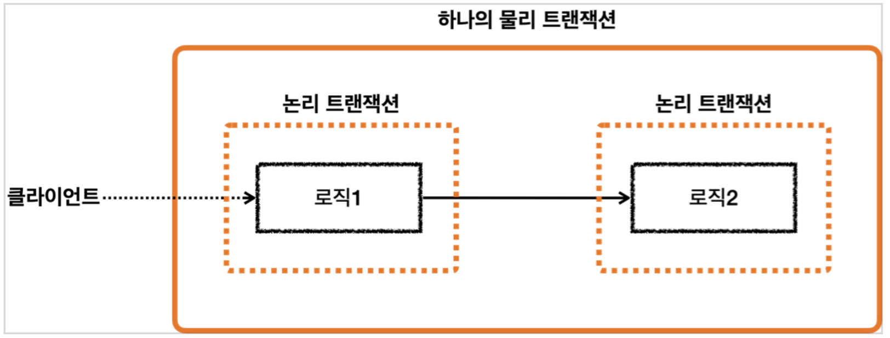
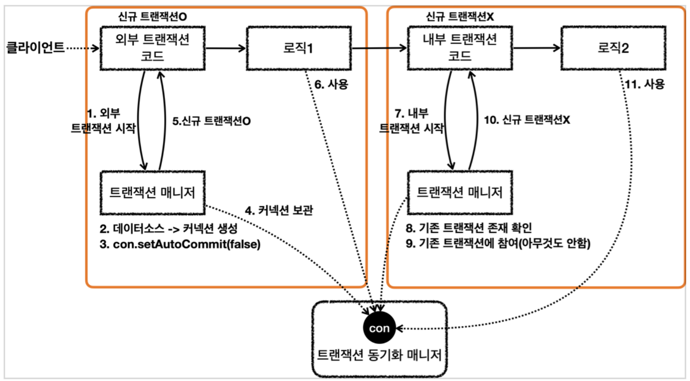
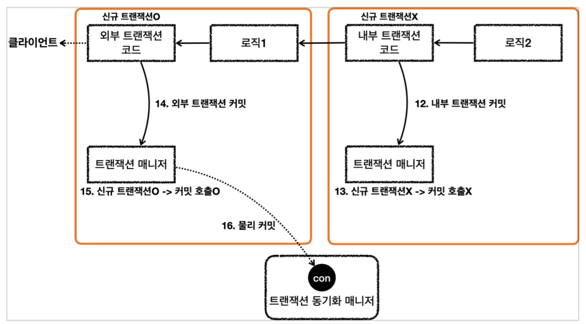
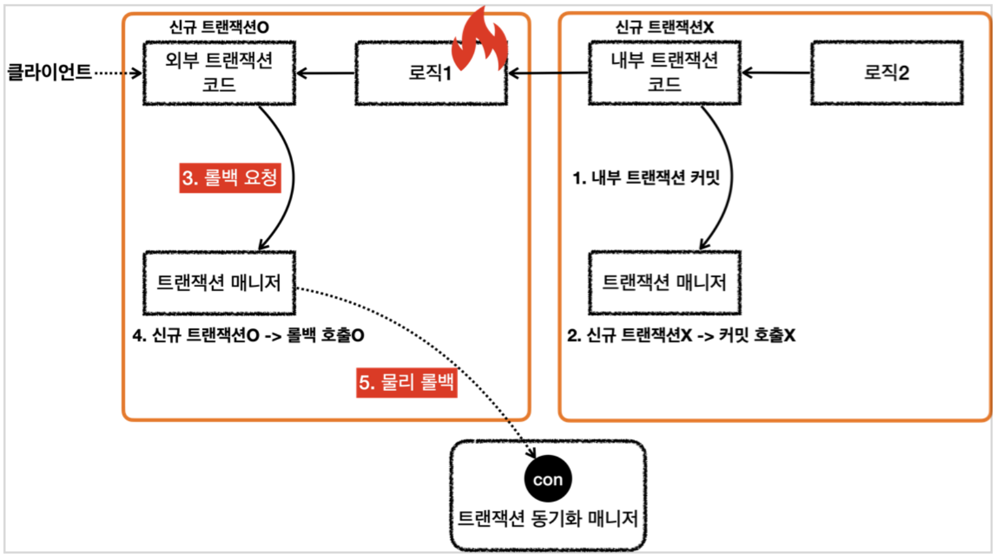
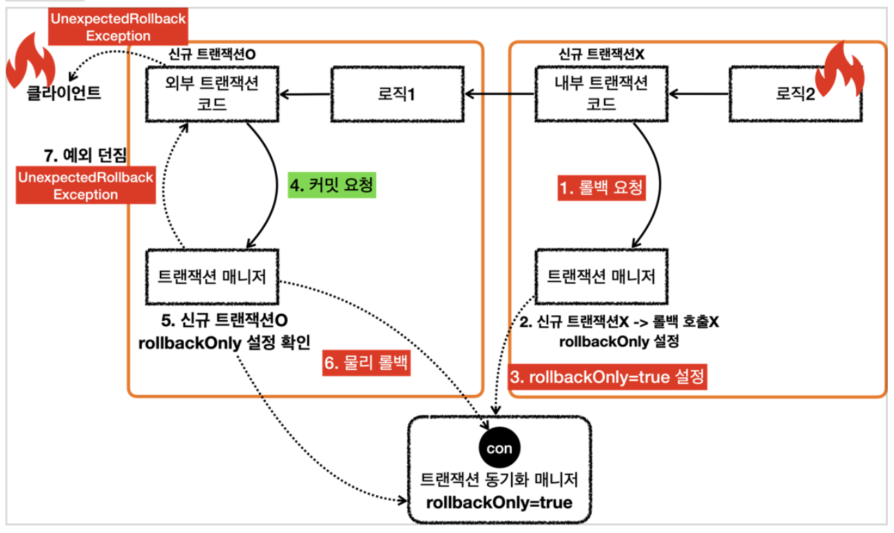

# @Transactional

### 스프링의 트랜잭션이 필요한 이유

- 스프링의 트랜잭션을 사용하지 않으면 데이터 접근 기술을 변경할 때마다 트랜잭션을 사용하는 코드도 모두 변경해야 한다.
- 스프링은 이런 문제를 해결하기 위해 `PlatformTransactionManager` 인터페이스를 통해 트랜잭션 추상화를 제공한다.

    ```java
    public interface PlatformTransactionManager extends TransactionManager {
    		TransactionStatus getTransaction(@Nullable TransactionDefinition definition) throws TransactionException;
    
    		void commit(TransactionStatus status) throws TransactionException;
    
    		void rollback(TransactionStatus status) throws TransactionException;
    }
    ```

- 스프링은 트랜잭션을 추상화해서 제공할 뿐만 아니라, 다양한 데이터 접근 기술에 대한 트랜잭션 매니저의 구현체도 제공한다.
- 스프링 부트는 어떤 데이터 접근 기술을 사용하는지를 자동으로 인식해서 적절한 트랜잭션 매니저를 선택해서 스프링 빈으로 등록해주기 때문에 트랜잭션 매니저를 선택하고 등록하는 과정도 생략할 수 있다.

---

### 동작 원리

- 트랜잭션은 **Spring AOP**를 통해 구현되어있다.
    - 더 정확하게 말하면, 어노테이션 기반 AOP를 통해 구현되어있다.
- AOP에 따른 특징
    - 클래스, 메소드에 `@Transactional`이 선언되면 해당 클래스에 트랜잭션이 적용된 프록시 객체 생성
    - 트랜잭션 프록시가 트랜잭션 처리 로직을 모두 가져가므로 서비스 계층에는 순수한 비즈니스 로직만 남길 수 있다.
- 프록시 객체는 `@Transactiona`이 포함된 메서드가 호출될 경우, 트랜잭션을 시작하고 Commit or Rollback을 수행
    - CheckedException or 예외가 없을 때는 Commit
    - UncheckedException이 발생하면 Rollback

---

### `@Transactional` 의 우선순위

더 구체적이고 자세한 것이 높은 우선순위를 가진다.

1. 클래스 메서드
2. 클래스
3. 인터페이스 메서드
4. 인터페이스
- 인터페이스보다는 클래스에 적용하는 것을 권고한다.
    - 인터페이스 기반 프록시에서만 유효한 트랜잭션 설정이 된다.
    - 자바 어노테이션은 인터페이스로부터 상속되지 않기 때문에  **클래스 기반 프록시 or AspectJ 기반에서 트랜잭션 설정을 인식 할 수 없다.**

---

### 주의사항

- 반드시 public 메서드에 적용되어야한다.
    - Protected, Private Method에서는 선언되어도 에러가 발생하지는 않지만, 동작하지도 않는다.
    - Non-Public 메서드에 적용하고 싶으면 AspectJ Mode를 고려해야한다.
- `@Transactional`이 적용되지 않은 Public Method에서 `@Transactional`이 적용된 Public Method를 호출할 경우, 트랜잭션이 동작하지 않는다.
- 다른 AOP 기능과의 충돌을 고려해야 한다.
    - 예를 들어 `@Secured`를 통해 권한이 있는 사용자 여부를 확인하는데 `@Transactional`이 먼저 수행된다면 권한 검사가 무의미해진다.
    - 이를 방지하기 위해서는 `@Order`를 이용해 적용 순서를 정하거나 적용범위를 조정해서 해결할 수 있다.
- **Exception을 고려하자.**
    - 트랜잭션은 RuntimeException과 Error에서는 롤백되지만, Checked exceptions에서는 롤백되지 않습니다.
    - Checked exceptions는 예측가능한 에러를 말하는데, 아래와 같이 @Transactional에 **rollbackFor** 속성을 두어 롤백처리가 되도록 할 수도 있습니다.

        ```java
        @Transactional(rollbackFor={Exception.class})
        ```


---

### 트랜잭션의 전파에 대해서

- 물리 트랜잭션: 실제 커넥션을 통해서 트랜잭션을 시작(`setautoCommit(false)`)하고, 실제 커넥션을 통해서 커밋, 롤백하는 단위
- 논리 트랜잭션: 트랜잭션 매니저를 통해 트랜잭션을 사용하는 단위



- 원칙
    1. 모든 논리 트랜잭션이 커밋되어야 물리 트랜잭션이 커밋된다.
    2. 하나의 논리 트랜잭션이라도 롤백되면 물리 트랜잭션은 롤백된다.





- 여기서 핵심은 트랜잭션 매니저에 커밋을 호출한다고해서 항상 실제 커넥션에 물리 커밋이 발생하지는 않는다는 점이다.
- 신규 트랜잭션인 경우에만 실제 커넥션을 사용해서 물리 커밋과 롤백을 수행한다.
    - 신규 트랜잭션이 아니면 실제 물리 커넥션을 사용하지 않는다.
- 트랜잭션이 내부에서 추가로 사용되면, 트랜잭션 매니저를 통해 논리 트랜잭션을 관리하고, 모든 논리 트랜잭션이 커밋되면 물리 트랜잭션이 커밋된다고 이해하면 된다.

- 외부 트랜잭션에서 롤백이 발생할 경우

  

    1. 트랜잭션 매니저는 신규 트랜잭션이 아니기 때문에 커밋을 호출하지 않는다.
    2. 로직1이 끝나고 트랜잭션 매니저를 통해 외부 트랜잭션을 롤백한다.
    3. 트랜잭션 매니저는 롤백 시점에 신규 트랜잭션 여부에 따라 다르게 동작한다.
        - 외부 트랜잭션은 신규 트랜잭션이다.
        - 따라서 DB 커넥션에 실제 롤백을 호출한다.
    4. 트랜잭션 매니저에 롤백하는 것이 논리적인 롤백이라면, 실제 커넥션에 롤백하는 것을 물리 롤백이라 할 수 있다.
        - 실제 데이터베이스에 롤백이 반영되고, 물리 트랜잭션도 끝난다.
- 내부 트랜잭션에서 롤백이 발생할 경우

  

    - 내부 트랜잭션은 1번에서 마찬가지로 신규 트랜잭션이 아니기 때문에 실제 롤백을 호출하지 않는다.
    - 물리 트랜잭션을 롤백하지 않는 대신 트랜잭션 동기화 매니저에 `rollbackOnly=true` 라는 표시를 해둔다.
    - 로직1이 끝나고 트랜잭션을 통해서 외부 트랜잭션을 커밋할 때, 트랜잭션 동기화 매니저에 롤백 전용(`rollbackOnly=true`) 표시가 있는지 확인한다.
    - 롤백 전용 표시가 있으면 물리 트랜잭션을 커밋하는 것이 아니라 롤백한다.

  > 트랜잭션 매니저에 커밋을 호출한 개발자 입장에서는 분명 커밋을 기대했는데 롤백 전용 표시로 인해 실제로는 롤백이 되어버렸다.
  >
  > - 시스템 입장에서는 커밋을 호출했지만 롤백이 되었다는 것은 분명하게 알려주어야 한다.
  > - 예를 들어서 고객은 주문이 성공했다고 생각했는데, 실제로는 롤백이 되어서 주문이 생성되지 않은 것이다.
  > - 스프링은 이 경우 `UnexpectedRollbackException` 런타임 예외를 던진다.
  > - 그래서 커밋을 시도했지만, 기대하지 않은 롤백이 발생했다는 것을 명확하게 알려준다.

### 물리 트랜잭션을 분리하기 위해 사용되는 `REQUIRES_NEW` 옵션

- 외부 트랜잭션과 내부 트랜잭션이 각각 별도의 물리 트랜잭션을 가진다.
- 별도의 물리 트랜잭션을 가진다는 뜻은 DB 커넥션을 따로 사용한다는 뜻이다.
- 이 경우 내부 트랜잭션이 롤백되면서 로직 2가 롤백되어도 로직 1에서 저장한 데이터에는 영향을 주지 않는다.
- 최종적으로 로직2는 롤백되고, 로직1은 커밋된다.

### 출처

[[Spring] @Transactional의 이해](https://imiyoungman.tistory.com/9)

[@Transactional 바르게 알고 사용하기](https://medium.com/gdgsongdo/transactional-바르게-알고-사용하기-7b0105eb5ed6)

### 예상 질문

1. 스프링 트랜잭션을 사용하는 이유가 무엇인가요?
2. `@Transactional` 사용시 주의사항이 무엇인가요?
3. 트랜잭션 전파 시 하나의 트랜잭션이라도 롤백이 된다면 어떻게 동작하는지 설명해주세요. (내부, 외부 트랜잭션 나눠서 설명)