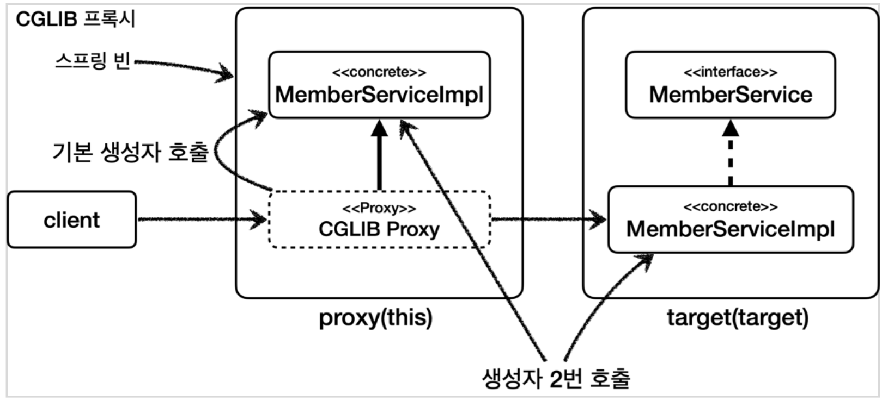

# AOP - JDK Dynamic Proxy, CGLIB Proxy

---

## AOP란

관점 지향 프로그래밍(Aspect-Oritented Programming)이라는 의미로, aspect를 사용한 프로그래밍 방식을 말한다.

### Aspect란

우리 말로 관점이라는 뜻인데, 애플리케이션을 바라보는 관점을 하나하나의 기능에서(⇒) 횡단 관심사(cross-cutting concerns) 관점으로 달리 보는 것이다.

### 횡단 관심사(cross-cutting concerns)

- 보통 부가 기능은 여러 클래스에 걸쳐서 함께 사용된다.
- 횡단 관심사란, 핵심적인 기능이 아닌 중간중간 삽입되어야 할 기능들 관심을 말한다.

[AOP란? 횡단 관심사? 흩어진 관심사?](https://willseungh0.tistory.com/61)

### 핵심 기능 vs. 부가 기능

- 핵심 기능: 해당 객체가 제공하는 고유의 기능
- 부가 기능: 핵심 기능을 보조하기 위해 제공되는 기능
    - 예를 들어 로그 추적 로직, 트랜잭션 기능이 해당된다.
    - 부가 기능은은 단독으로 사용되지 않고, 핵심 기능과 함께 사용된다.

## AOP 적용 방식

1. 컴파일 시점
    1. `.class` 를 만드는 시점에 부가 기능 로직을 추가하는 방식
    2. AspectJ가 제공하는 특별한 컴파일러를 사용해야 한다.
    3. 특별한 컴파일러가 필요하고 복잡하다는 단점이 있다.
2. 클래스 로딩 시점
    1. `.class` 를 JVM에 저장하기 전에 조작하는 방식
    2. 로드 타임 위빙이라고도 한다.
    3. 클래스 로더 조작기를 지정해야 하는데 번거롭다는 단점이 있다.
3. 런타임 시점(프록시)
    1. Java의 메인 메서드가 실행된 다음 적용되는 방식
    2. 스프링과 같은 컨테이너의 도움을 받는다.
    3. 적용 가능한 지점이 메서드로 제한된다.
        1. 컴파일 시점과 클래스 로딩 시점의 경우, 적용 가능 지점이 생성자, 필드 값 접근, static 메서드 접근, 메서드 실행 모두에 적용가능하다.

# JDK Dynamic Proxy

---

### 동적 프록시란

- 프록시를 사용하기 위해서는 대상 클래스 수만큼의 프록시클래스를 하나하나 만들어줘야하고 그 안에 들어가는 반복되는 코드때문에 코드중복이라는 단점이 있습니다.
- 이러한 단점들을 보완하여 컴파일 시점이아닌, 런타임 시점에 프록시 클래스를 만들어주는 방식이 **동적 프록시**입니다.

[[Java] 동적 프록시(Dynamic Proxy)](https://gong-story.tistory.com/22)

### JDK 동적 프록시의 특징

- 인터페이스를 기반으로 프록시를 동적으로 만들어주기 때문에 ⇒ 인터페이스가 필수다.
- `InvocationHandler` 인터페이스를 구현하면 된다.
    - 예시 코드

        ```java
        package hello.proxy.jdkdynamic.code;
        
        import lombok.extern.slf4j.Slf4j;
        import java.lang.reflect.InvocationHandler;
        import java.lang.reflect.Method;
        
        @Slf4j
        public class TimeInvocationHandler implements InvocationHandler {
        
            private final Object target;
        
            public TimeInvocationHandler(Object target) {
                this.target = target;
            }
        
            @Override
            public Object invoke(Object proxy, Method method, Object[] args) throws Throwable {
                log.info("TimeProxy 실행");
                long startTime = System.currentTimeMillis();
        
                // method : 프록시의 어떤 메서드가 넘어오는지 전달해준다.
                Object result = method.invoke(target, args);
        
                long endTime = System.currentTimeMillis();
                long resultTime = endTime - startTime;
                log.info("TimeProxy 종료 resultTime={}", resultTime);
                return result;
            }
        }
        ```

        ```java
        package hello.proxy.jdkdynamic;
        
        import hello.proxy.jdkdynamic.code.*;
        import lombok.extern.slf4j.Slf4j;
        import org.junit.jupiter.api.Test;
        import java.lang.reflect.Proxy;
        
        @Slf4j
        public class JdkDynamicProxyTest {
        
            @Test
            void dynamicA() {
                AInterface target = new AImpl();
                TimeInvocationHandler handler = new TimeInvocationHandler(target);
        
                // JDK 에서 생성해주는 프록시
                // 첫 번째 인자 : 프록시가 어디에 생성될지 지정해준다.
                // 두 번째 인자 : 프록시 기반이 되는 인터페이스. 인터페이스가 여러 개일 수 있으므로 배열이다.
                // 세 번째 인자 : 이 프록시가 사용될 로직
                AInterface proxy = (AInterface) Proxy.newProxyInstance(AInterface.class.getClassLoader(), new Class[]{AInterface.class}, handler);
        
                proxy.call();
                log.info("targetClass={}", target.getClass());
                log.info("proxyClass={}", proxy.getClass());
            }
        
            @Test
            void dynamicB() {
                BInterface target = new BImpl();
                TimeInvocationHandler handler = new TimeInvocationHandler(target);
        
                BInterface proxy = (BInterface) Proxy.newProxyInstance(BInterface.class.getClassLoader(), new Class[]{BInterface.class}, handler);
        
                proxy.call();
                log.info("targetClass={}", target.getClass());
                log.info("proxyClass={}", proxy.getClass());
            }
        }
        ```


### 한계

- 구체 클래스로 타입 캐스팅이 불가능하다.
- 왜냐하면 JDK 동적 프록시는 인터페이스를 기반으로 프록시를 생성하기 때문이다.
    - JDK Proxy는 인터페이스를 기반으로 생성된 프록시이다.
    - 따라서 JDK Proxy는 해당 인터페이스로 캐스팅은 가능하지만 해당 인터페이스를 구현한 클래스는 어떤 것인지 전혀 알지 못한다.
    - 캐스팅을 시도하면 `ClassCastException.class` 예외가 발생한다.


- 반면에 CGLIB는 구체 클래스를 기반으로 프록시를 생성하기 때문에 인터페이스든, 구체 클래스든 타입 캐스팅이나 의존관계 주입이 모두 가능하다.

    

# CGLIB

---

### CGLIB란

- Code Generator Library 약자로, 바이트코드를 조작해서 동적으로 클래스를 생성하는 기술을 제공하는 라이브러리
- 인터페이스가 없어도 구체 클래스만 가지고 동적 프록시를 만들어낼 수 있다.
- `MethodInterceptor` 인터페이스를 구현하면 된다.
    - 예제 코드

        ```java
        package hello.proxy.cglib.code;
        
        import lombok.extern.slf4j.Slf4j;
        import org.springframework.cglib.proxy.MethodInterceptor;
        import org.springframework.cglib.proxy.MethodProxy;
        
        import java.lang.reflect.Method;
        
        @Slf4j
        public class TimeMethodInterceptor implements MethodInterceptor {
        
            private final Object target;
        
            public TimeMethodInterceptor(Object target) {
                this.target = target;
            }
        
            @Override
            public Object intercept(Object obj, Method method, Object[] args, MethodProxy methodProxy) throws Throwable {
                log.info("TimeProxy 실행");
                long startTime = System.currentTimeMillis();
        
                Object result = methodProxy.invoke(target, args);
        //        Object result = method.invoke(target, args); // 이렇게 써도 되지만 CGLIB 는 methodProxy 가 더 빠르므로 사용하는 것을 권장한다.
        
                long endTime = System.currentTimeMillis();
                long resultTime = endTime - startTime;
                log.info("TimeProxy 종료 resultTime={}", resultTime);
                return result;
            }
        }
        ```

        ```java
        package hello.proxy.cglib;
        
        import hello.proxy.cglib.code.TimeMethodInterceptor;
        import hello.proxy.common.service.ConcreteService;
        import lombok.extern.slf4j.Slf4j;
        import org.junit.jupiter.api.Test;
        import org.springframework.cglib.proxy.Enhancer;
        
        @Slf4j
        public class CglibTest {
        
            @Test
            void cglib() {
                ConcreteService target = new ConcreteService();
        
                Enhancer enhancer = new Enhancer();
                enhancer.setSuperclass(ConcreteService.class);
                enhancer.setCallback(new TimeMethodInterceptor(target));
                ConcreteService proxy = (ConcreteService) enhancer.create();
                log.info("targetClass={}", target.getClass());
                log.info("proxyClass={}", proxy.getClass());
        
                proxy.call();
            }
        }
        ```


### 한계

- 대상 클래스에 기본 생성자가 필수로 필요하다.
    - CGLIB는 구체 클래스를 상속받기 때문에 Java 문법에 따라 부모 클래스의 기본 생성자가 꼭 있어야 프록시가 생성될 수 있다.
- 생성자를 2번 호출한다.
    1. 실제 target 객체를 생성할 때
    2. 프록시 객체를 생성할 때 부모 클래스의 생성자 호출

  

- final 키워드를 클래스, 메서드에 사용할 수 없다.
    - final 키워드가 클래스에 있으면 상속이 불가능하다.
    - final 키워드가 메서드에 있으면 오버라이딩이 불가능하다.
- 스프링의 해결책
    - 스프링은 CGLIB 라이브러리를 내부에 패키징하여 별도의 라이브러리 추가 없이 사용할 수 있게 하였다.
    - `objenesis` 라는 특별한 라이브러리를 사용
        - 기본 생성자 없이 객체 생성이 가능하다.
        - 생성자도 1번만 호출한다.

# 프록시 내부 호출 주의

---

- AOP를 적용하려면 프록시를 통해서 대상 객체(Target)를 호출해야 한다.
- 만약 프록시를 거치지 않고 대상 객체를 직접 호출하게 되면 AOP가 적용되지 않는다.
    - 예제 코드

        ```java
        package hello.aop.internalcall;
        
        import lombok.extern.slf4j.Slf4j;
        import org.springframework.stereotype.Component;
        
        @Slf4j
        @Component
        public class CallServiceV0 {
        
            public void external() {
                log.info("call external");
                internal(); // 내부 메서드 호출(this.internal())
            }
        
            public void internal() {
                log.info("call internal");
            }
        }
        ```


### 해결 방안

1. 자기 자신 주입
    - 예제 코드

        ```java
        package hello.aop.internalcall;
        
        import lombok.extern.slf4j.Slf4j;
        import org.springframework.beans.factory.annotation.Autowired;
        import org.springframework.stereotype.Component;
        
        /**
         * 참고: 생성자 주입은 순환 사이클을 만들기 때문에 실패한다.
         */
        @Slf4j
        @Component
        public class CallServiceV1 {
        
            private CallServiceV1 callServiceV1;
        
            @Autowired
            public void setCallServiceV1(CallServiceV1 callServiceV1) {
                log.info("callServiceV1 setter={}", callServiceV1.getClass());
                this.callServiceV1 = callServiceV1;
            }
        
            public void external() {
                log.info("call external");
                callServiceV1.internal(); // 외부 메서드 호출
            }
        
            public void internal() {
                log.info("call internal");
            }
        }
        ```

2. 지연 조회
    1. `ObjectProvider(Provider)` 혹은 `ApplicationContext` 를 사용
    - 예제 코드

        ```java
        package hello.aop.internalcall;
        
        import lombok.RequiredArgsConstructor;
        import lombok.extern.slf4j.Slf4j;
        import org.springframework.beans.factory.ObjectProvider;
        import org.springframework.beans.factory.annotation.Autowired;
        import org.springframework.context.ApplicationContext;
        import org.springframework.stereotype.Component;
        
        /**
         * ObjectProvider(Provider), ApplicationContext 를 사용해서 지연(LAZY) 조회
         */
        @Slf4j
        @Component
        @RequiredArgsConstructor
        public class CallServiceV2 {
        
        //    private final ApplicationContext applicationContext;
            private final ObjectProvider<CallServiceV2> callServiceProvider;
        
            public void external() {
                log.info("call external");
        //        CallServiceV2 callServiceV2 = applicationContext.getBean(CallServiceV2.class);
                CallServiceV2 callServiceV2 = callServiceProvider.getObject();
                callServiceV2.internal(); // 외부 메서드 호출
            }
        
            public void internal() {
                log.info("call internal");
            }
        }
        ```

3. 구조 변경
    1. 내부 호출이 발생하지 않도록 구조를 변경하는 것이다.
    2. 가장 권장되는 방법이다.
    - 예제 코드

        ```java
        package hello.aop.internalcall;
        
        import lombok.RequiredArgsConstructor;
        import lombok.extern.slf4j.Slf4j;
        import org.springframework.stereotype.Component;
        
        /**
         * 구조를 변경(분리)
         */
        @Slf4j
        @Component
        @RequiredArgsConstructor
        public class CallServiceV3 {
        
            private final InternalService internalService;
        
            public void external() {
                log.info("call external");
                internalService.internal(); // 외부 메서드 호출
            }
        }
        ```

        ```java
        package hello.aop.internalcall;
        
        import lombok.extern.slf4j.Slf4j;
        import org.springframework.stereotype.Component;
        
        @Slf4j
        @Component
        public class InternalService {
        
            public void internal() {
                log.info("call internal");
            }
        }
        ```


###  예상 질문

- AOP란 무엇인가요?
- 핵심 기능과 부가 기능의 차이는 무엇인가요?
- 동적 프록시란 무엇인가요?
- JDK 동적 프록시의 한계점은 무엇인가요?
- CGLIB의 한계점은 무엇인가요?
- 프록시 내부 호출시 발생하는 문제점과 그 해결 방안에 대해서 설명해주세요.
