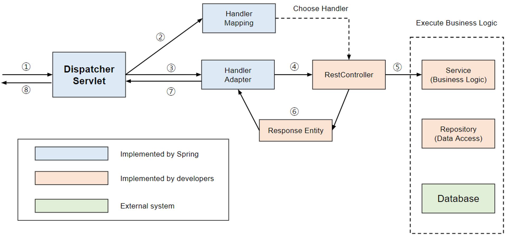
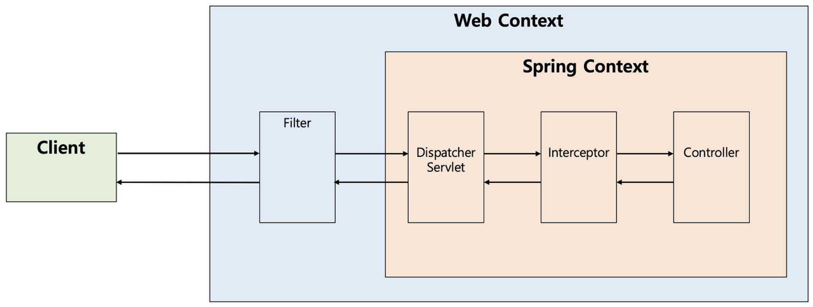

# Dispatcher Servlet(디스패처 서블릿)

## 개념정리

### Dispatcher Servlet이란?

- 디스패처 서블릿의 dispatch는 “보내다”라는 뜻을 가지고 있다.
- 디스패처 서블릿은 HTTP 프로토콜로 들어오는 모든 **요청**을 가장 **먼저 받아 적합한 컨트롤러에 위임해주는 프론트 컨트롤러(Front Controller)**라고 정의할 수 있다.
- 흐름
  - 클라이언트로부터 요청이 오면, Tomcat(톰캣)과 같은 서블릿 컨테이너가 요청을 받게 된다.
  - 이 모든 요청을 프론트 컨트롤러인 디스패처 서블릿이 가장 먼저 받는다.
  - 디스패처 서블릿은 공통적인 작업을 먼저 처리한 후에 해당 요청을 처리해야 하는 컨트롤러를 찾아서 직업을 위임한다.
    - 이때 프론트 컨트롤러라는 용어가 사용된다.
    - 프론트 컨트롤러는 주로 서블릿 컨테이너의 제일 앞에서 서버로 들어오는 클라이언트의 모든 요청을 받아서 처리해주는 컨트롤러로써, MVC 구조에서 함꼐 사용되는 디자인패턴이다.

### 장점

- Spring MVC는 DispatcherServlet이 등장함에 따라 web.xml의 역할을 축소
- `과거`: 모든 서블릿을 URL 매핑을 위해 web.xml에 모두 등록해줘야 한다.
- `Dispatcher Servlet 등장 이후`: 디스패처 서블릿이 해당 어플리케이션으로 들어오는 모든 요청을 핸들링해주고 공통 작업을 처리하면서 편리하게 이용 가능
  - 컨트롤러를 구현해두기만 하면 디스패처 서블릿을 알아서 적합한 컨트롤러로 위임을 해주는 구조

### 정적 자원의 처리

- DispatcherServlet이 요청을 Controller로 넘겨주는 방식은 효율적이지만, DispatcherServlet이 모든 요청을 처리하다보니 이미지나 HTML/CSS/JavaScript와 같은 정적 파일 요청도 가로채 정적 자원을 불러오지 못하는 상황이 발생하곤 했다.
- 해결방법
  1. 정적 자원 요청과 애플리케이션 요청 분리
  2. 애플리케이션 요청을 탐색하고 없으면 정적 자원 요청으로 처리

1. 정적자원 요청과 애플리케이션 요청 분리
   1. 클라이언트 요청을 2개로 분리
      1. /apps의 URL로 접근하면 DispatcherServlet이 담당
      2. /resources의 URL로 접근하면 DispatcherServlet이 컨트롤할 수 없으므로 담당하지 않는다.
   2. 코드가 지저분하고, 모든 요청에 대해 URL을 붙여주어야 하므로 직관적인 설계가 불가능하다.
2. 애플리케이션 요청을 탐색하고 없으면 정적 자원 요청으로 처리
   1. 먼저 DispatcherServlet이 요청을 처리할 컨트롤러를 먼저 찾는다.
   2. 요청에 대한 컨트롤러를 찾을 수 없는 경우에 2차적으로 설정된 자원 경로를 탐색해 자원 탐색
   3. 영역을 분리하면 효율적인 리소스 관리 지원 뿐 아니라 추후 확장에 용이

### 디스패처 서블릿의 동작과정

디스패처 서블릿의 역할: 적합한 컨트롤러를 찾아 요청 위임

1. 클라이언트의 요청을 디스패처 서블릿이 받음

   1. 디스패처 서블릿은 가장 먼저 요청을 받는 프론트 컨트롤러이다.
   2. 서블릿 컨텍스트(웹 컨텍스트)에서 **필터들을 지나** 스프링 컨텍스트에서 디스패처 서블릿이 가장 먼저 요청을 받게된다.
   3. 실제로는 인터셉터가 컨트롤러로 요청을 위임하지 않으므로, 아래의 그림은 처리 순서를 도식화한 것이다.
      

2. 요청 정보를 통해 요청을 위임할 컨트롤러 찾음
   1. 디스패처 서블릿은 요청을 처리할 핸들러(컨트롤러)를 찾고 해당 객체의 메소드를 호출
   2. 먼저 어느 컨트롤러가 요청을 처리할 수 있는지 식별하고 이 역할을 하는 것이 HandlerMapping
3. 요청을 컨트롤러로 위임할 핸들러 어댑터 찾아 전달
   1. 컨트롤러로 요청을 위임해야 하는데 디스패처 서블릿은 컨트롤러로 요청을 직접 위임하는 것이 아니라 Handler Adapter를 통해 위임한다.
   2. 왜냐하면 컨트롤러 구현 방식은 다양하기(어노테이션 방식, 인터페이스 구현 방식) 때문에 이를 대비하기 위해 HandlerAdpter 인터페이스를 통해 어댑터 패턴을 적용하여 컨트롤러 구현 방식 상관없이 요청을 위임한다.
4. 핸들러 어댑터가 컨트롤러로 요청을 위임
   1. 핸들러 어댑터가 컨트롤러로 요청을 위임한 전/후에 공통적인 전/후처리 과정이 필요
   2. 대표적으로 인터셉터들을 포함해 요청 시에 @RequestParam. @RequestBody등을 처리하기 위한 ArgumentResolver들과 응답 시에 ResponseEntity의 Body를 Json으로 직렬화하는 등으 처리를 하는 RetunValueHandler 등이 핸들러 어댑터에서 처리된다.
   3. ArgumentResolver등을 통해 파라미터기 준비 되면 리플렉션을 이용해 컨트롤로 요청 위임
5. 비즈니스 로직 처리
   1. 컨틀로러가 서비스를 호출하고 비즈니스 로직 수행
6. 컨트롤러가 반환값을 반환
   1. 비즈니스 로직이 처리되면 컨트롤러가 반환값을 반환
   2. 주로 ResponseEntity를 반환하고 원하면 String으로 View 이름을 반환한다.
7. 핸들러 어댑터가 반환값 처리
   1. HandlerAdapter는 컨트롤러부터 받은 응답을 응답 처리기인 ReturnValueHanlder가 후처리한 후에 디스패처 서블릿으로 돌려준다.
   2. 만약 컨트롤러가 ResponseEntity를 반환하면 HttpEntityMethodProcessor가 MessageConverter를 사용해 응답 객체를 직렬화하고 응답 상태(HttpStatus)를 설정한다.
   3. 만역 컨트롤러가 View 이름을 반환하면 ViewResolver를 통해 View를 반환
8. 서버의 응답을 클라이언트로 반환
   1. 디스패처 서블릿을 통해 반환되는 응답은 다시 필터들을 거쳐 클라이언트에게 반환된다.
   2. 이때, 데이터라면 그대로 반환되고, 화면이라면 View를 찾아서 반환해주는 ViewResolver가 적절한 화면을 내려준다.

## 예상 질문

- 디스패처 서블릿 등장으로 인한 장점에 대해 설명해주세요.
- 디스패처 서블릿의 동작과정을 설명해주세요.

---

### 참고 자료

https://mangkyu.tistory.com/18 
