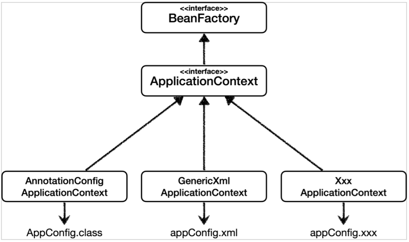
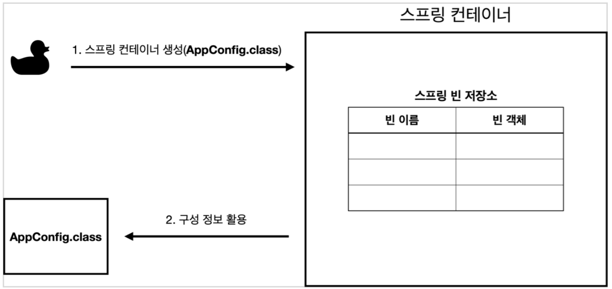
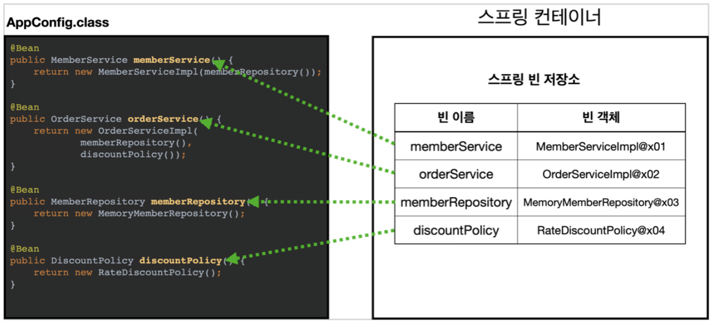
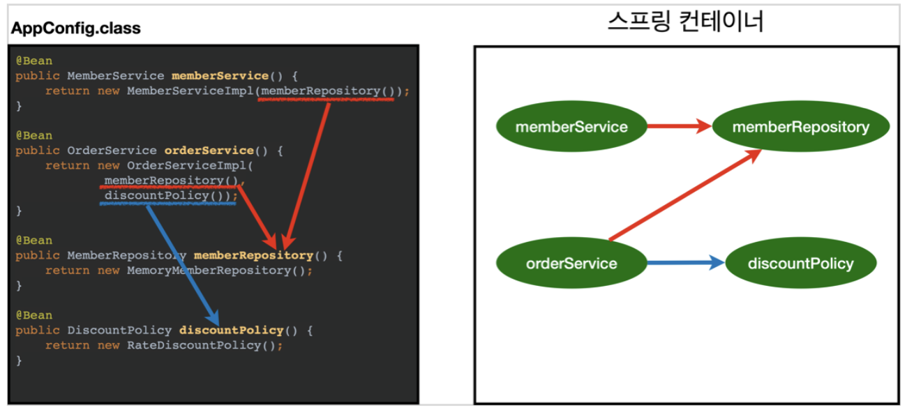
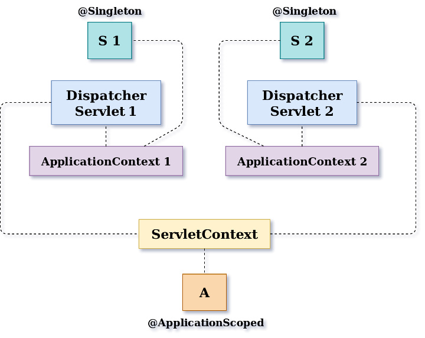

# IOC란

---

- `IoC(Inversion of Control)`란 "제어의 역전" 이라는 의미로, 말 그대로 **메소드나 객체의 호출작업을 개발자가 결정하는 것이 아니라, 외부에서 결정되는 것을 의미**
    - 객체의 **의존성을 역전시켜 객체 간의 결합도를 줄이고 유연한 코드를 작성**할 수 있게 하여 **가독성 및 코드 중복, 유지 보수를 편하게** 할 수 있게 한다.
- 기존의 객체 생성 및 실행 순서
    1. 객체 생성
    2. 의존성 객체 **생성**

       *클래스 내부에서 생성*

    3. 의존성 객체 메소드 호출
- IOC 객체 생성 및 실행 순서(스프링)
    1. 객체 생성
    2. 의존성 객체 **주입**

       *스스로가 만드는것이 아니라 제어권을 **스프링에게 위임하여 스프링이 만들어놓은 객체를 주입**한다.*

    3. 의존성 객체 메소드 호출

[[Spring] DI, IoC 정리](https://velog.io/@gillog/Spring-DIDependency-Injection)

### DI와 IOC

- 즉, 밖에서 나에게 의존성을 주입해주는 것을 DI(Dependency Injection) 라고 합니다. **따라서 DI는 IoC의 일종이라고 생각하시면 됩니다.**

[[Spring] Spring의 IoC(Inversion of Control)과 Bean](https://chanhuiseok.github.io/posts/spring-4/)

- 하지만 사실 IoC와 DI는 다른 개념이다.
- **절대 IoC == DI가 아니다! (DI ⊂ IoC 라면 몰라도)** DI 없이도 IoC를 만족하는 프로그램을 만들 수 있다.
    - 템플릿 메소드 패턴
- IoC는 프로그램 제어권을 역전시키는 개념이고, DI는 해당 개념을 구현하기 위해 사용하는 디자인 패턴 중 하나로, 이름 그대로 객체의 의존관계를 외부에서 주입시키는 패턴을 말한다.
- A가 B에 의존한다.

    ```java
    public class A {
        private B b = new B();
    }
    ```

- A가 B에 의존한다. 하지만 의존 대상을 직접 생성(결정)하는 것이 아니라 외부로부터 주입받는다.

    ```java
    public class A {
        private B b;
    
        public A(B b) {
            this.b = b;
        }
    }
    ```

- 의존성 주입 방법 3가지
    1. 생성자 주입(Constructor Injection)
    2. Setter 주입(Setter Injection)
    3. 인터페이스 주입(Interface Injection)

[[Spring DI/IoC] IoC? DI? 그게 뭔데?](https://velog.io/@ohzzi/Spring-DIIoC-IoC-DI-그게-뭔데)

## 스프링 컨테이너

---

- 스프링 컨테이너는 스프링 프레임워크의 핵심 컴포넌트이다.
    - 스프링 컨테이너는 자바 객체의 생명 주기를 관리하며, 생성된 자바 객체들에게 추가적인 기능을 제공한다.
    - 즉, 스프링 컨테이너는 내부에 존재하는 빈의 생명주기를 관리(빈의 생성, 관리, 제거 등)하며, 생성된 빈에게 추가적인 기능을 제공하는 것이다.

### 스프링 컨테이너의 종류



- 스프링 컨테이너는Beanfactory와ApplicationContext 두 종류의 인터페이스로 구현되어 있다.
    - 빈 팩토리는 빈의 생성과 관계설정 같은 제어를 담당하는 IoC 오브젝트이고, 빈 팩토리를 좀 더 확장한 것이 애플리케이션 컨텍스트이다.
    - `BeanFactory`
        - 빈을 등록, 생성, 조회 등의 빈을 관리하는 역할
        - `getBean()` 을 통해서 빈을 인스턴스화 기능 제공
        - `@Bean` 어노테이션이 붙은 메서드의 이름을 스프링 빈의 이름으로 사용하여 빈 등록
    - `ApplicationContext`
        - `BeanFactory` 가 제공하는 기능 외 부가적인 기능 제공
            - `MessageSource` : 메시지 다국화를 위한 인터페이스
            - `EnvironmentCapable` : 개발, 운영, 환경변수 등으로 나누어 처리하고, 애플리케이션 구동 시 필요한 정보들을 관리하기 위한 인터페이스
            - `ApplicationEventPublisher` : 이벤트 관련 기능을 제공하는 인터페이스
            - `ResourceLoader` : 파일, 클래스 패스, 외부 등 리소스를 편리하게 조회

### 스프링 컨테이너의 기능

- 스프링 컨테이너는 빈(Bean)의 인스턴스화, 구성 및 제거까지 관리한다.
- 의존성 주입(DI)을 통해 애플리케이션의 컴포넌트를 관리할 수 있다.
- 스프링 컨테이너는 서로 다른 빈을 연결하여 애플리케이션 빈을 연결하는 역할을 한다.

### 스프링 컨테이너를 사용하는 이유

- 객체 간의 의존성을 낮추어(느슨한 결합) 결합도는 낮추고, 높은 캡슐화를 위해 스프링 컨테이너가 사용된다.
- 구현 클래스에 있는 의존성을 제거하고 인터페이스에만 의존하도록 설계할 수 있다.

[[Spring] 스프링 컨테이너(Spring Container)란 무엇인가?](https://ittrue.tistory.com/220)

### 스프링 컨테이너의 생성 과정

- 스프링 컨테이너 생성

  

- 스프링 빈 등록

  

- 스프링 빈 의존관계 설정

  


## 싱글톤 컨테이너

---

### 싱글톤 패턴의 문제점들

- 싱글톤 패턴을 구현하는 코드 자체가 많이 들어간다.
- 의존관계상 클라이언트가 구체 클래스에 의존한다.
    - DIP를 위반한다.
    - OCP를 위반할 가능성이 높다.
- 테스트하기 어렵다
    - 예제 코드

        ```java
        public class ASingleton {
            private static ASingleton aSingleton = new ASingleton();
            private int count;
        
            public static ASingleton getInstance() {
                return aSingleton;
            }
        
            public void addCount() {
                this.count++;
            }
        
            public int getCount() {
                return count;
            }
        }
        ```

        ```java
        class ASingletonTest {
            ASingleton aSingleton;
        
            @BeforeEach
            void init() {
                aSingleton = ASingleton.getInstance();
            }
        
            @Test
            @DisplayName("test1")
            void test1() {
                aSingleton.addCount();
                Assertions.assertThat(aSingleton.getCount()).isEqualTo(1);
            }
        
            @Test
            @DisplayName("test2")
            void test2() {
                aSingleton.addCount();
                Assertions.assertThat(aSingleton.getCount()).isNotEqualTo(1);
                Assertions.assertThat(aSingleton.getCount()).isEqualTo(2);
            }
        }
        ```

- private 생성자로 자식 클래스를 만들기 어렵다.

### 싱글톤 컨테이너란

- 스프링 컨테이너는 싱글톤 패턴을 적용하지 않아도, 객체 인스턴스를 싱글톤으로 관리한다.
- 스프링 컨테이너는 싱글톤 컨테이너 역할을 한다. 이렇게 싱글톤 객체를 생성하고 관리하는 기능을 **싱글톤 레지스트리**라고 한다.
- 스프링 컨테이너의 이러한 기능 덕분에 싱글톤 패턴의 모든 단점을 해결하면서 객체를 싱글톤으로 유지할 수 있다.
    - 싱글톤 패턴을 위한 지저분한 코드가 들어가지 않아도된다.
    - DIP, OCP, 테스트, private 생성자로부터 자유롭게 싱글톤을 사용할 수 있다.
    - 예제 테스트 코드

        ```java
        public class SingletonContainer {
            private int count;
        
            public void addCount() {
                count++;
            }
        
            public int getCount() {
                return count;
            }
        }
        ```

        ```java
        class SingletonContainerTest {
            ApplicationContext ac;
        
            @BeforeEach
            void init() {
                ac = new AnnotationConfigApplicationContext(SingletonContainer.class);
            }
        
            @Test
            void test1() {
                SingletonContainer singletonclass = ac.getBean( SingletonContainer.class);
                singletonclass.addCount();
                assertThat(singletonclass.getCount()).isEqualTo(1);
            }
        
            @Test
            void test2() {
                SingletonContainer singletonclass = ac.getBean( SingletonContainer.class);
                singletonclass.addCount();
                assertThat(singletonclass.getCount()).isEqualTo(1);
            }
        }
        ```


### 싱글톤 방식의 주의점(싱글톤 패턴, 싱글톤 컨테이너 모두 포함)

> 싱글톤 객체는 전역에서 공유되는 객체이므로 멀티쓰레드 환경에서의 동시성 문제를 해결해야한다.
>
- 전역에서 공유된다는 것, 메모리 영역에서 프로세스 전체에서 공유된다는 것.
    - 생성된 인스턴스는 JVM 메모리의 힙영역에 할당되니까!
    - 개별 쓰레드당 할당되는 것이 아니다.
- 둘 이상의 스레드가 동시에 공유변수 (임계구역)에 접근할 때
    - 상호배제를 보장해주어야한다.
    - 아니면 아예 공유하는 값이 없도록 상태를 유지하지 않도록 설계해야한다.
- **스프링 빈(싱글톤 빈)의 필드에 공유 값을 사용하면 정말 큰 장애가 발생할 수 있다.**

## 스프링 빈

---

- 스프링 빈이란, 스프링 컨테이너에 의해 관리되는 인스턴스화된 객체를 의미한다.
    - 스프링 컨테이너에 등록된 객체를 스프링 빈이라고 생각하면 된다.
- `@Bean` 어노테이션을 통해 메서드로부터 반환된 객체를 스프링 컨테이너에 등록한다.
- 빈은 클래스의 등록 정보, Getter/Setter 메서드를 포함하며, 컨테이너에 사용되는 설정 메타데이터로 생성된다.
    - 설정 메타데이터 : XML 또는 자바 어노테이션, 자바 코드로 표현하며, 컨테이너의 명령과 인스턴스화, 설정, 조립할 객체 등을 정의한다.

[[Spring] 스프링 빈(Bean)이란 무엇인가?](https://ittrue.tistory.com/221)

### 빈 생명주기 콜백

- 먼저 콜백에 대해서
    - 주로 콜백함수를 부를 때 사용되는 용어이며 콜백함수를 등록하면 특정 이벤트가 발생했을 때 해당 메소드가 호출된다.
    - 즉, 조건에 따라 실행될 수도 실행되지 않을 수도 있는 개념이라고 보면된다.

- 스프링 빈도 위와 같은 원리로 초기화 작업과 종료 작업이 나눠서 진행된다.
    - 간단히 말해서 객체 생성 → 의존관계 주입이라는 라이프사이클을 가진다.
    - 즉, 스프링 빈은 의존관계 주입이 다 끝난 다음에야 필요한 데이터를 사용할 수 있는 준비가 완료된다.

**스프링 빈의 이벤트 라이프 사이클**

```
스프링컨테이너생성 ⇒ 스프링빈생성 ⇒ 의존관계주입(setter injection이나 필드 injection의 경우) ⇒ 초기화콜백 ⇒ 사용 ⇒ 소멸전콜백 ⇒ 스프링 종료
```

- **초기화 콜백**: 빈이 생성되고, 빈의 의존관계 주입이 완료된 후 호출
- **소멸전 콜백**: 빈이 소멸되기 직전에 호출

**스프링이 지원하는 빈 생명주기 콜백 3가지 방법**

1. 인터페이스(`InitializingBean`, `DisposableBean`)
    - 구현하는 메서드
        - **`afterPropertiesSet()`**
        - **`destroy()`**
    - 단점
        - 이 인터페이스는 스프링 전용 인터페이스에 의존한다.
        - 초기화, 소멸 메서드의 이름을 변경할 수 없다.
        - 내가 코드를 고칠 수 없는 외부 라이브러리에 적용할 수 없다.
2. 설정 정보에 초기화 메서드, 종료 메서드 지정

    ```java
    public class NetworkClient {
    
        private String url;
    
        public NetworkClient() {
    				System.out.println("생성자 호출, url = " + url);
    		}
    
    		//...
    		public void init() {
    				System.out.println("NetworkClient.init");
    				connect();
    				call("초기화 연결 메시지");
    		}
    
        public void close() {
            System.out.println("NetworkClient.close");
            disConnect();
    		}
     }
    ```

    ```java
    @Configuration
    static class LifeCycleConfig {
    
        @Bean**(initMethod = "init", destroyMethod = "close")**
        public NetworkClient networkClient() {
    
            NetworkClient networkClient = new NetworkClient();
            networkClient.setUrl("http://hello-spring.dev");
            return networkClient;
    		}
    }
    ```

    - 단점
        - Bean 지정시 initMethod와 destoryMethod를 직접 지정해야 하기에 번거롭다.
3. `@PostConstruct`, `@PreDestroy` 애노테이션 지원

    ```java
    public class NetworkClient {
    
        private String url;
    
        public NetworkClient() {
    				System.out.println("생성자 호출, url = " + url);
    		}
    
    		//...
    		@PostConstruct
    		public void init() {
    				System.out.println("NetworkClient.init");
    				connect();
    				call("초기화 연결 메시지");
    		}
    
    		@PreDestroy
        public void close() {
            System.out.println("NetworkClient.close");
            disConnect();
    		}
     }
    ```

    - 장점
        - 최신 스프링에서 가장 권장하는 방법이다.
        - 어노테이션 하나만 붙이면 되므로 굉장히 편리하다.
        - 컴포넌트 스캔과 잘 어울린다.
    - 단점
        - 커스터마이징이 불가능한 외부 라이브러리에서 적용이 불가능하다.
            - 외부 라이브러리에서 초기화, 종료를 해야하는 경우는 2번째 방식을 사용하면 된다.

### 빈 스코프

**빈 스코프란**

- 빈 스코프는 번역 그대로 “빈이 존재할 수 있는 범위”를 뜻한다.

**스프링이 제공하는 스코프 종류**

- 싱글톤: 기본 스코프로, 스프링 컨테이너의 시작과 종료까지 유지되는 가장 넓은 범위의 스코프다.
- 프로토타입: 생성과 의존관계 주입까지만 관여하고 더이상 관리되지 않는 매우 짧은 범위의 스코프다.
- 웹 관련 스코프
    - request: 웹 요청이 들어오고 나갈 때까지 유지되는 스코프다.
    - session: 웹 세션이 생성되고 종료될 때까지 유지도니느 스코프다.
    - application: 웹의 서블릿 컨텍스트와 같은 범위로 유지되는 스코프다.

> **싱글톤 스코프와 application 스코프의 차이점**
>
>
> ⇒ 스프링 컨테이너와 서블릿 컨텍스트의 차이점
>
> 결론부터 말하자면, **둘은 다른 게 맞다.** **하나의 웹 어플리케이션에서 서블릿 컨텍스트는 1개의 인스턴스만 존재하는 반면, 스프링 컨테이너는 여러 개의 인스턴스를 띄울 수 있기 때문이다.**
>
> 
>
> 하나의 어플리케이션에서 여러개의 웹 기술을 사용할 때나, 기능별로 별도의 스프링 설정을 적용하고 싶을 때 이런 방식을 사용한다.
>
> [싱글톤 스코프 vs 어플리케이션 스코프 차이점](https://velog.io/@gorapaduckoo/싱글톤-스코프-vs-어플리케이션-스코프-차이점)
>

**프로토타입 스코프**

- 싱글톤 스코프의 경우, 스프링 컨테이너는 항상 같은 인스턴스의 스프링 빈을 반환한다.
    - 프로토타입 스코프의 경우, 스프링 컨테이너는 항상 새로운 인스턴스를 생성해서 반환한다.
- 그래서 `@PreDestroy` 같은 종료 메서드가 호출되지 않는다.
- 싱글톤 빈과 함께 사용시 주의점
    - 싱글톤 빈이 내부에 갖고 있는 프로토타입 빈은 이미 과거에 주입이 끝난 빈이므로 사용할 때마다 새로 생성되는 빈이 아니라는 점이다.
    - 예시 코드

        ```java
        package hello.core.scope;
        
        import org.junit.jupiter.api.Test;
        import org.springframework.beans.factory.annotation.Autowired;
        import org.springframework.context.annotation.AnnotationConfigApplicationContext;
        import org.springframework.context.annotation.Scope;
        import javax.annotation.PostConstruct;
        import javax.annotation.PreDestroy;
        import static org.assertj.core.api.Assertions.*;
        
        public class SingletonWithPrototypeTest1 {
        
        	  @Test
        	  void singletonClientUsePrototype() {
        	      AnnotationConfigApplicationContext ac = new AnnotationConfigApplicationContext(ClientBean.class, PrototypeBean.class);
        
        	      ClientBean clientBean1 = ac.getBean(ClientBean.class);
        	      int count1 = clientBean1.logic();
        	      assertThat(count1).isEqualTo(1);
        
        	      ClientBean clientBean2 = ac.getBean(ClientBean.class);
        	      int count2 = clientBean2.logic();
        	      assertThat(count2).isEqualTo(2);
        	  }
        
        	  static class ClientBean {
        
        	      private final PrototypeBean prototypeBean;
        
        	      @Autowired
        	      public ClientBean(PrototypeBean prototypeBean) {
        	          this.prototypeBean = prototypeBean;
        	      } // prototype을 의존관계를 받아오는 케이스
        
        	      public int logic() {
        	          prototypeBean.addCount();
        	          int count = prototypeBean.getCount();
        	          return count;
        				}
        		}
        
        	  @Scope("prototype")
        	  static class PrototypeBean {
        
        	      private int count = 0;
        
        	      public void addCount() {
        						count++;
        				}
        
                public int getCount() {
                    return count;
        				}
        
                @PostConstruct
                public void init() {
                    System.out.println("PrototypeBean.init " + this);
                }
        
                @PreDestroy
                public void destroy() {
                    System.out.println("PrototypeBean.destroy");
                }
        		}
        }
        ```

- 해결책: Dependency Lookup(DL; 의존관계 조회)
    - `ObjectFactory`, `ObjectProvider`의 `.getObject()`
    - `Provider`의 `.get()`

**웹 스코프**

- 특징
    - 웹 환경에서만 동작한다.
    - 포로토타입과는 다르게 종료 메서드가 호출된다.
- 주의점
    - request나 session의 경우, 싱글톤 빈에서 바로 사용하면 오류가 발생한다.
        - (application은 결국 스프링 컨테이너가 서블릿 컨텍스트 위에서 동작하므로 싱글톤 빈 내부에서 호출하는 시점에는 당연히 빈이 존재하므로 문제 없다.)
    - 예시 코드

        ```java
        import org.springframework.context.annotation.Scope;
        import org.springframework.stereotype.Component;
        import javax.annotation.PostConstruct;
        import javax.annotation.PreDestroy;
        import java.util.UUID;
        
        @Component
        @Scope(value = "request") // value는 빼고 @Scope("request")라고만 해도 된다.
        public class MyLogger {
        
            private String uuid;
            private String requestURL;
        
            public void setRequestURL(String requestURL) {
                this.requestURL = requestURL;
        		}
        
            public void log(String message) {
                //...
        		}
        
        		@PostConstruct
            public void init() {
                //...
            }
        
        		@PreDestroy
            public void close() {
        				//...
            }
        }
        ```

        ```java
        import hello.core.common.MyLogger;
        import lombok.RequiredArgsConstructor;
        import org.springframework.stereotype.Service;
        
        @Service
        @RequiredArgsConstructor
        public class LogDemoService {
        
            private final MyLogger myLogger;
        
            public void logic(String id) {
                myLogger.log("service id = " + id);
        		}
        }
        ```

    - 빈이 생성되지 않은 상태에서 호출을 시도했기 때문이다.
- 해결책
    - `ObjectProvider`의 `.getObject()`나 `Provider`의 `.get()`
    - `proxyMode = ScopedProxyMode.TARGET_CLASS`
        - 예시 코드

            ```java
            @Component
            @Scope(value = "request"**, proxyMode = ScopedProxyMode.TARGET_CLASS**) // 파라미터를 여러가지 넣기 위해서는 value="request"형식으로 써야한다. 프록시 파라미터 미설정시 @Scope(request)로 작성 가능
            public class MyLogger {
            }
            ```

        - 이 경우, 호출은 [이렇게](https://www.notion.so/1-IOC-bacf6b0f26ad4669bea2ac5fd8ca2906?pvs=21) 그냥 하면 된다.

**마지막으로**

이런 특별한 스코프는 꼭 필요한 곳에서 최소화해서 사용하자.

무분별하게 사용하면 유지보수하기 어려워진다.

---

# 예상 질문

1. IOC란 무엇인가요?
2. IOC랑 DI랑 차이점에 대해서 말씀해주세요.
3. 스프링 컨테이너를 사용하는 이유에 대해서 말씀해주세요.
4. 스프링 컨테이너의 생성 과정에 대해서 말씀해주세요.
5. 싱글톤 패턴의 단점에 대해서 말씀해주세요.
6. 싱글톤 컨테이너를 사용할 때 주의사항이 무엇인가요?
7. 빈 스코프란 무엇인가요?
8. 빈 스코프의 종류에는 어떤 것들이 있나요?
    1. 싱글톤패턴이랑 application 스코프의 차이점은 무엇인가요?
9. 프로토타입 스코프와 싱글톤 스코프의 차이점은 무엇인가요?