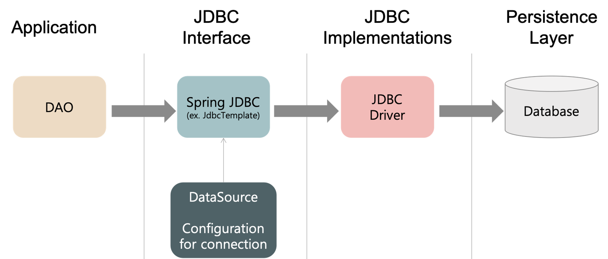
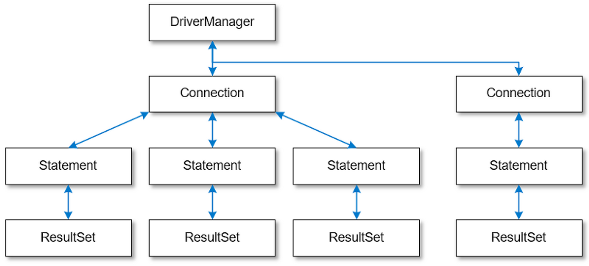
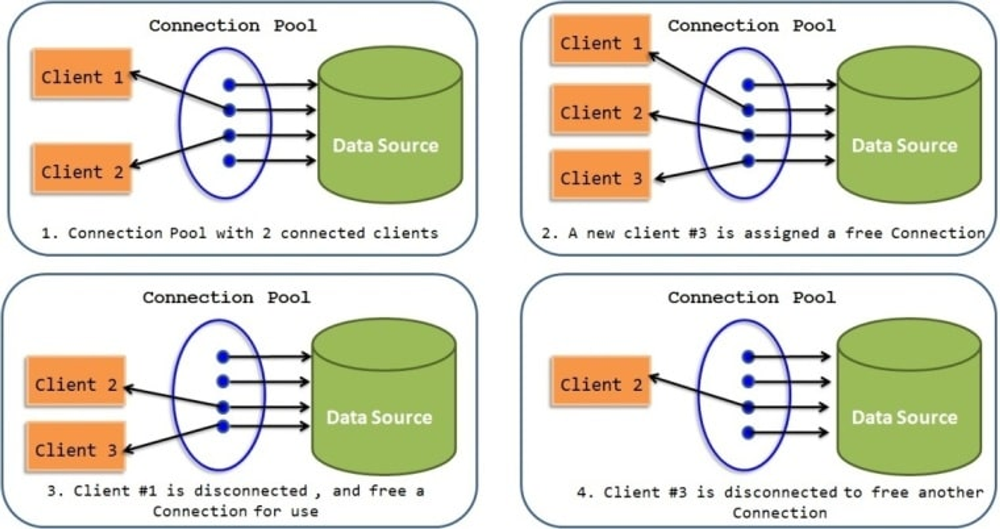

# JDBC,Spring JDBC

## 개념정리

### JDBC란?

JDBC(Java Database Connectivity)는 자바에서 데이터베이스에 접속할 수 있는 API(응용 프로그래밍 인터페이스)이다. JDBC는 데이터베이스와의 통신을 가능하게 하며, 데이터베이스에서 데이터를 가져오거나 변경할 수 있는 기능을 제공한다.

즉, JDBC를 사용하면, Java 애플리케이션에서 데이터베이스에 접근해 데이터를 검색, 삽입, 갱신, 삭제할 수 있다.

**동작 순서**


**등장 배경**

- 이전에는 각각의 데이터베이스(mysql, redis, mongoDB 등등) 사용방법, 접근 방법이 달라 데이터베이스를 변경할 때마다 데이터베이스 접근 코드도 함께 변경되어야 했다.
- 이러한 문제를 해결하기위해 JDBC라는 자바에서 데이터베이스 접근하는 표준 인터페이스가 나왔다.

**문제점**

- 작성해야하는 코드가 너무 많아서 중복코드 발생
  - DB연결과 종료, 예외처리, statement 준비, 실행, 반복문, ResultSet 등
- DB별로 적절한 예외처리를 해주어야함
- 오타로인한 오류가능성

### Spring JDBC는?

Spring JDBC는 Spring Framework에서 제공하는 JDBC 모듈이다.

즉, Spring Framework에서 제공하는 JDBC 추상화 라이브러리이다.

**Spring JDBC는 JDBC를 보다 쉽고 효율적으로 사용할 수 있도록 추상화된 기능을 제공하는데, 이를 통해 개발자는 반복적이고 번거로운 JDBC 작업을 간소화하고 생산성을 향상시킬 수 있다.**



> DAO(Data Access Object)는 실제로 DB에 접근하는 객체이다.
> Service(비즈니스 로직)과 DB의 연결고리!

Spring JDBC는 JDBC의 모든 저수준 처리를 스프링 프레임워크에 위임하므로써,

- `Connection` 연결 객체 생성 및 종료
- `Statement` 준비/실행 및 종료
- `ResultSet` 처리 및 종료
- `예외 처리`, `트랙잭션` 등의 반복되는 처리

이러한 일을 개발자가 직접하지 않고 Database에 대한 작업을 수행할 수있다.

아래는 기존에 `Connection` 연결 객체 생성 및 종료하는 예제이다.

```java
//반복되는 작업을 스프링 프레임워크에 위임하는 것이다.
Connection connection = null;
try {
    connection = dataSource.getConnection();
    if(connection != null) {
        System.out.println("DB 연결 성공!");
    }
} catch (Exception e) {
    e.printStackTrace();
} finally {
    if(connection != null) {
        try {
            connection.close();
        } catch(Exception e) {
            e.printStackTrace();
        }
    }
}
```

### Spring JDBC 패키지

**org.springframe.jdbc.core**

- SQL Query 수행하기 위해 필요한 저수준 작업을 내부적으로 처리해주고 보다 추상적인 기능을 제공하는`JdbcTemplate`, `SimpleJdbcInsert`, `NamedParameterJdbcTemplate` 객체와 `Helper 객체(RowMapper)` 등을 포함한다.
- 따라서, `JdbcTemplate` 등의 객체를 이용하면 `Connection` 연결/종료와 같은 세부적인 작업을 직접 처리하지 않아도 된다.
  
- 또한, `JDBC`에서 발생하는 에러는 `Runtime Exception`이다. 따라서, 이를 일반 예외(Exception)로 감싸 처리해주어야 하는데 Spring JDBC는 이를 내부적으로 커스텀한 일반 예외로 변환해 전파해준다.

**org.springframework.jdbc.datasource**

- 트랜잭션 매니저 및 다양한 Datasource 구현을 제공한다.

**org.springframework.jdbc.object**

- RDBMS 쿼리, 업데이트 및 저장 프로시저를 나타내는 객체 지향적인 방식으로 JDBC 작업을 수행할 수 있도록 하는 클래스들을 제공한다.
- 이를 통해 Thread-Safe하고 재사용 가능한 JDBC 작업을 정의한다.

**org.springframework.jdbc.support**

- JDBC 작업에서 발생할 수 있는 예외를 처리하는 데 도움을 주는 클래스를 포함한다.
- `SQLExceptionTranslator` 인터페이스를 구현한 클래스가 있어 JDBC 예외를 Spring의 일반적인 예외로 변환해 처리 가능

### Connection Pool

- JDBC를 사용할때, 요청마다 새로운 Connection을 생성하는 것은 매우 많은 비용이 든다.
- 따라서, 이러한 Connection을 미리 만들어 놓고 재사용한다면 불필요한 네트워크 비용을 줄일 수 있다.
  - ⇒ Connection Pool의 등장
  - 커넥션을 미리 커넥션 풀에 생성해두고 꺼내쓰는 방식



- Connection Pool에서 커넥션 객체를 관리하는 관리자가 필요한데, 이를 `Datasource` 객체가 수행한다.
- `Datasource` 객체는 DB와 연결된 `Connection` 객체를 Pool에서 가져오고, 이를 다시 Pool에 반납하는 작업을 수행한다.
- `Datasource` 는 커넥션을 획득하는 방법을 추상화하는 인터페이스이다.
  - 개발자는 DataSource인터페이스에 의존해 개발한다.
  - 구현체는 DBCP2 커넥션풀, HikariCP 커넥션 풀 등이 있다.

## 예상질문

- JDBC와 Spring JDBC는 무엇인가요?
- Spring에서의 커넥션 풀에 대해 설명해주세요.

---

### 참고자료

https://mininkorea.tistory.com/39

https://sharonprogress.tistory.com/194

[https://engineerinsight.tistory.com/57#💋 Spring JDBC를 사용하면 편리해진다!-1](https://engineerinsight.tistory.com/57#%F0%9F%92%8B%20Spring%20JDBC%EB%A5%BC%20%EC%82%AC%EC%9A%A9%ED%95%98%EB%A9%B4%20%ED%8E%B8%EB%A6%AC%ED%95%B4%EC%A7%84%EB%8B%A4!-1)

https://juntcom.tistory.com/2

https://velog.io/@koseungbin/Spring-JDBC

https://thalals.tistory.com/358 추천!

https://thalals.tistory.com/368 추천!
