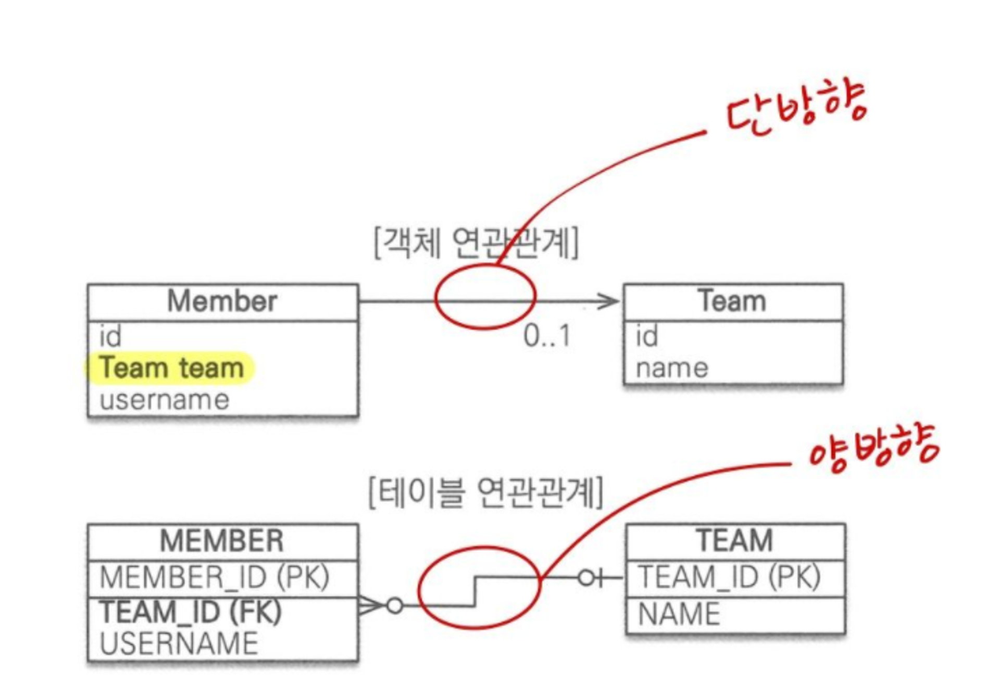

# 단뱡향/양방향 매핑

## 개념 정리

### 매핑을 하는 이유

- 엔티티들은 다른 엔티티들과 연관관계를 맺고 조회를 한다.
- 테이블에서는 외래키를 사용해 서로의 테이블을 조회하는 것이 가능하고, 객체는 다른 객체와의 참조를 통해 조회하는 것이 가능하다.
- 객체의 경우 서로 다른 객체 중 **참조가 있는 객체 쪽에서** 조회가 가능하다.
- ⇒ 이를 구현하기위해서 매핑을 진행!

### 특징

**방향**

- 단방향과 양방향 매핑이 있다.
- 단방향 매핑
  - 서로 다른 두 개의 엔티티 중 한 개의 엔티티의 쪽에서만 참조하는 경우
- 양방향 매핑
  - 모두 서로의 객체를 참조하는 경우를 양방향 관계라고 한다.

**다중성**

- 테이블의 관계와 동일하다.
  - 1:N, N:1, 1:1, N:M

**연관관계 주인**

- 객체를 양방향 관계로 맺어 서로를 참조하는 경우 서로의 연관관계 주인을 정해줘야 한다.

### **단방향 연관관계**

**객체 연관관계 vs 테이블 연관관계**



- **객체 연관관계**는 멤버 엔티티에서 팀 엔티티를 참조하는 것
  - 멤버 엔티티는 팀 엔티티의 필드를 조회 가능
  - 팀 엔티티는 멤버 엔티티를 참조하고 있지 않기 때문에 멤버 엔티티의 데이터를 조회할 불가 ⇒ 단방향 관계
- 위의 그림은 한 명의 회원이 하나의 팀에 속할 수 있고, 하나의 팀에는 여러 명의 회원이 소속되는 다대일 관계이다.

```java
@Entity
@Table(name = "MEMEBER")
public class Member{
	@Id @GenerateddValue
	@Column(name = "MEMBER_ID")
	private Long id;

	@Column(name = "USERNAME")
	private String username;

	**@ManyToOne**                      // 다대일 관계(다중성) 연관관계 매핑
	**@JoinColumn(name = "TEAM_ID")**   // TEAM 테이블의 TEAM_ID와 매핑(외래키)
	private Team team;

	// 연관관계 설정
	public Team setTeam(Team team) {
		this.team = team;
	}
}
```

- @ManyToOne을 이용해 회원 엔티티와 팀 엔티티 연관관계를 매핑
- @JoinColumn을 이용해 실제 DB의 Team 테이블의 어떤 외래키와 매핑되는지 설정
- Setter 메서드를 이용해 회원 엔티티를 저장 시에 참조할 팀 엔티티를 파라미터로 넣어주어 연관관계를 설정
  - 일반적으로 엔티티 클래스에서 Setter 사용하는 것 권장되지 않기때문에 @Builder나 생성자를 이용하는 것이 바람직

### 양방향 연관관계


- 반대로 테이블 연관관계는 **TEAM_ID라는 외래키를 이용**해 회원 테이블과 팀 테이블을 조인하여 두 개의 테이블 데이터를 모두 조회하는 것이 가능하다. 즉, **양방향 관계**이다.
- 참조를 통한 연관관계를 맺는 것은 항상 **단방향 연관관계**임을 알 수 있다.
  - 객체의 양방향 관계를 맺어주기 위해서 양쪽에서 서로를 참조하는 것으로 맺는 것이 가능
  - 양방향 관계가 사실상 서로 다른 단방향 관계 2개가 합쳐진 것임을 알 수 있다.
- 양방향 연관관계라고 해서 데이터베이스 내의 테이블 구조가 변동되는 것은 하나도 없다. 엔티티 클래스들의 코드만 변경된다.
- 회원 엔티티는 단방향 관계에서와 동일한 코드이다.

```java
@Entity
@Table(name = "TEAM")
public class Team {
		@Id @GeneratedValue
    @Column(name = "TEAM_ID")
    private Long id;

    @Column
    private String name;

    // 초기화가 관례
    // 연관관계의 주인이 아니기 때문에 읽기만 가능
		// 엔티티에서 컬렉션을 사용할 때 초기화를 해주는 것이 관례이다. 초기화를 해줌으로 써 NPE를 피할 수 있다.
    **@OneToMany(mappedBy = "team")**
    private List<Member> members = new ArrayList<>();
}
```

- 팀 엔티티는 양방향 관계에서 회원 엔티티를 참조하기 위해서 **@OneToMany**를 이용해 일대다 관계를 설정해준다.
- 하나의 팀에는 여러 명의 회원이 소속되기 때문에 일대다 관계이며, 컬렉션을 이용한다.

### 연관관계의 주인

- 양방향 연관관계 시 가장 중요한 부분은 두 연관관계 중 연관관계 주인을 정해주는 것이다.
- 데이터베이스는 외래 키 한 개를 이용해 양방향 조회가 가능하지만, **엔티티의 양방향 관계는 두 개의 참조**를 통해 이뤄진다.
  - 즉, 데이터베이스 관점에서는 외래키 두 개가 있어야 하는 것이다.
- **두 엔티티 중에서 실제로 외래키를 관리해 데이터베이스의 등록, 수정, 삭제를 수행할 수 있는 연관관계의 주인을 설정하는 것이 필요하다.**
  - **연관관계의 주인**은 실제 외래키를 관리하고 데이터베이스의 등록, 수정, 삭제를 수행하는 반면, **주인이 아닌 엔티티**는 조회만 가능하다.
- 연관관계의 주인이 아니면 **mappedBy** 속성을 이용해 연관관계의 주인을 지정한다.
- 데이터베이스 테이블의 다대일, 일대다 관계에서는 `다`쪽이 외래키를 갖는다!

```java
// Team
**@OneToMany(mappedBy = "team")   // mappedBy의 값은 주인 엔티티의 실제 참조 필드변수명이다.**
private List<Member> members = new ArrayList<>();

// Member
@ManyToOne                      // 다대일 관계(다중성) 연관관계 매핑
@JoinColumn(name = "TEAM_ID")   // TEAM 테이블의 TEAM_ID와 매핑(외래키)
private Team team;              // mappedBy에 지정되는 필드명

// 연관관계의 주인은 외래키를 관리하는 Member가 되며, Team은 mappedBy를 이용해 연관관계의 주인을 지정한다.
```

### 양방향 연관관계의 주의점

- 양방향 연관관계에서 엔티티의 저장은 단방향 연관관계와 동일
- 양방향 연관관계는 연관관계의 주인이 외래키를 관리하기 때문에 **연관관계의 주인에게 값을 반드시 설정**해줘야한다.
  - 연관관계의 주인이 아닌 방향은 값을 세팅해도 데이터베이스 저장 시에 외래 키에 영향을 주지 않아 무시된다.

```java
public void save() {
	// Team 엔티티 생성 및 저장
	Team team = new Team("teamId", "teamA");
	em.persist(team);

	// 회원 엔티티 생성
	Member member = new Member("memberId", "memberA");
	member.setTeam(team);  // 연관관계 주인이 외래키를 관리
	team.getMember().add(member); // 연관관계 주인이 아니므로 외래키에 영향을 주지 않음
	em.persist(member);
}
```

- 연관관계의 주인 입장에서는 값이 정확하게 세팅되어있지만, 실제로 연관관계 주인이 아닌 방향에서 연관관계 주인의 엔티티를 조회할 때는 값을 조회할 수가 없다.

```java
Member memberA = new Member("memberId", "memberA");
Member memberB = new Member("memberId2", "memberB");

Team team = new Team("teamId", "teamA");

// 연관관계 주인이 값 설정
memberA.setTeam(team);
memberB.setTeam(team);

// 결과 : 외래키 저장 정상, 팀A에는 memberA, memberB가 소속되어있다.

// 연관관계 주인이 아닌 방향
team.getMembers().size();

// 결과 : 0 - 팀A에는 memberA, memberB가 소속되어있기 때문에 결과가 2가 나와야하는게 바람직
```

- 따라서, 양방향 연관관계에서는 연관관계의 주인 방향과 주인이 아닌 방향에 모두 값을 설정해주는 것이 중요하다.

```java
memberA.setTeam(team);
team.getMembers().add(memberA);

memberB.setTeam(team);
team.getMembers().add(memberB);

// 연관관계 주인이 아닌 방향
team.getMembers().size();   // 2
```

### 연관관계 편의 메서드

- 연관관계를 설정하는 코드를 각각 사용하다 보면, 누락이 되거나 하는 실수를 통해 양방향 연관관계가 깨질 수 있다.
- 따라서, 해당 **코드들을 한 번에 관리할 수 있도록 메소드로 추출한 것을 연관관계 편의 메소드**라고 한다.
- 연관관계 편의 메소드는 연관관계의 주인이나 주인이 아닌 엔티티 쪽 **아무 곳에서나 호출을 해도 무방**하다.
- 커밋이 되기 이전, 기존 연관관계(TeamA)와 새로운 연관관계(TeamB)가 동일한 영속성 컨텍스트 내에서 활용되고 있는 경우, TeamA는 관계를 완전하게 끊어내지 못한 상황이다.
  - 즉, TeamA가 회원을 조회하면 이미 끊어진 관계임에도 관계가 설정된 것처럼 보이는 문제가 발생한다.
  - 따라서, 연관관계 편의 메소드를 작성할 때
    - 기존 연관관계가 있는지를 판단
    - 연관관계가 있는 경우 기존 연관관계를 먼저 삭제하고, 새로운 연관관계로 설정해주는 것이 필요하다.

```java
// Member (연관관계 주인 입장)
public void changeTeam(Team team)  {
		if(this.team != null) {
				this.team.getMembers.remove(this);
		}
		this.team = team;
		team.getMembers().add(this);  // this는 Member Class
}

// Team (연관관계 주인이 아닌 방향)
public void addMember(Member member) {
		if(!this.members.contains(member) {
		    this.member.team = null;
    }
		this.members.add(member);
		member.setTeam(this);
}
```

### Join vs Fetch Join

**일반 Join**

- Fetch Join과 달리 연관 Entity에 Join을 걸어도 실제 쿼리에서 SELECT 하는 Entity는 오직 JPQL에서 조회하는 **주체가 되는 Entity만 조회하여 영속화**
- 조회의 주체가 되는 Entity만 SELECT 해서 영속화하기 때문에 데이터는 필요하지 않지만 연관 Entity가 검색 조건에는 필요한 경우에 주로 사용한다.

**Fetch Join**

- 조회의 주체가 되는 Entity 이외에 Fetch Join이 걸린 연관 Entity도 함께 SELECT 하여 **모두 영속화**
- Fetch Join이 걸린 Entity 모두 영속화하기 때문에 FetchType이 LAZY인 Entity를 참조하더라도 이미 영속성 컨텍스트 안에 들어있기 때문에 따로 쿼리가 실행되지 않은 채로 N+1 문제가 해결됨

### 영속성 전이

- **영속성 전이**는 특정 엔티티를 영속 상태로 만들 때 연관된 엔티티도 함께 영속 상태로 만들고 싶을 때 사용한다.
- **영속성 전이는 연관관계를 매핑하고 연관관계의 주인을 설정하는 것과 아무 관련이 없다.**
- 단지 엔티티를 영속화할 때 **연관된 엔티티를 함께 영속화하는 편의 기능**을 제공하는 것이다.

```java
@Entity
@Getter @Setter
public class Parent {

    @Id @GeneratedValue
    private Long id;

    private String name;

    @OneToMany(mappedBy = "parent", cascade = CascadeType.ALL)
    private List<Child> children = new ArrayList<>();
}
```

```java
@Entity
@Getter @Setter
public class Child {

    @Id @GeneratedValue
    private Long id;

    private String name;

    @ManyToOne(fetch = FetchType.LAZY)
    @JoinColumn(name = "PARENT_ID")
    private Parent parent;
}
```

- Parent와 Child는 1:N 양방향 연관관계를 가진다.
- 이 때 `@OneToMany(mappedBy = "parent", cascade = CascadeType.ALL)`을 통해 Parent의 영속성을 Child로 전파할 수 있다.
  - 위의 경우 ALL로 설정했기 때문에 두 엔티티의 생명 주기가 동일해진다.
  - Parent를 저장하면 연관된 Child도 함께 저장되고, Parent를 삭제하면 연관된 Child가 함께 삭제된다.
- 사용할 수 있는 CascadeType은 아래와 같다. ALL, PERSIST 외에는 자주 쓰이지 않는다.
  - **ALL: 모두 적용 (저장, 삭제 등등 라이프 사이클을 전부 맞춰야할 때)**
  - **PERSIST: 영속 (저장 할때만)**
  - **REMOVE: 삭제 (삭제 할때만)**
  - MERGE: 병합
  - REFRESH: REFRESH
  - DETACH: DETACH

### 고아 객체

- 고아 객체 제거 기능은 부모 엔티티와 연관관계가 끊어진 자식 엔티티를 자동으로 삭제하는 기능이다.

```java
Parent parent = em.find(Parent.class, 1L);
parent.getChildren().remove(0);
```

- Parent 엔티티로부터 Child 엔티티로의 참조를 제거했다. 고아 객체 제거 기능이 켜져있다면 영속성 컨텍스트가 플러시될 때 다음과 같은 SQL이 자동으로 데이터베이스에 날라간다.

```sql
DELETE FROM CHILD WHERE ID = xxx;
```

- 고아 객체 제거 기능은 **자식 엔티티가 부모 엔티티에 종속되었을 때 사용하는 기능이다.**
  - 부모로부터의 참조가 제거된 고아 엔티티는 다른 곳에서 참조하지 않는다고 판단하고 삭제하는 것이다.
- 그렇기 때문에 **참조하는 곳이 하나일 때 사용해야한다.** 특정 엔티티가 개인 소유할 때 사용해야한다. **여러 엔티티에서 참조하는 엔티티에는 고아 객체 제거 기능을 사용하면 안 된다.**
- 예를 들어 게시물과 댓글을 생각해보자. 일반적인 경우 댓글은 게시물 외에 다른 엔티티에서 참조할 일이 없다. 이 때는 고아 객체 제거 기능을 사용해도된다.
- 고아 객체 제거 기능은 부모의 `@OneToOne`, `@OneToMany` 에만 사용할 수 있다.
- 자식과 부모는 개념적인 설명임에 주의하자. 특정 엔티티와 x대일 관계를 맺는다고 무조건 자식 엔티티가 되는 것은 아니다. 예를 들어, 주문의 경우 회원과 다대일 관계를 맺는다. 그러나 주문은 회원에게만 종속되지 않기 때문에 회원의 자식이 아니다. 주문은 통계나 정산 등 여러 엔티티에서 쓰이기 때문에 회원 엔티티의 컬렉션에서 참조를 제거한다고 해서 함부로 삭제하면 안 된다.
- 참고로 고아 객체 제거 기능을 활성화하면, 부모를 제거할 때 자식도 함께 제거된다. 부모를 삭제하면 당연히 자식 엔티티의 컬렉션도 모두 삭제되기 때문에 마치 `CascadeType.REMOVE` 처럼 동작한다. 위의 예제에 적용한다면, 회원 엔티티를 삭제했을 때 회원이 주문했던 모든 주문 엔티티들이 함께 삭제되어 버린다. 이는 일반적으로 원하는 상황은 아닐 것이다.

고아 객체 제거 기능은 다음과 같이 활성화 한다.

```java
@Entity
@Getter @Setter
public class Parent {

    @Id @GeneratedValue
    private Long id;

    private String name;

    @OneToMany(mappedBy = "parent", cascade = CascadeType.ALL, orphanRemoval = true)
    private List<Child> children = new ArrayList<>();
}
```

- `@OneToOne`이나 `@OneToMany`의 orphanRemoval 속성을 true로 주면 된다. 기본값은 false다.
- `CascadeType.ALL` 과 `orphanRemoval=true` 를 함께 사용하면 자식 엔티티의 생명 주기를 부모 엔티티로 관리할 수 있다.
  - 부모 엔티티는 `em.persist()`, `em.remove()` 등을 통해 스스로 생명 주기를 관리하고 자식 엔티티의 생명 주기는 부모 엔티티에 의존하는 것이다.
  - 부모 엔티티가 영속화되면 자식 엔티티도 함께 영속화되고 부모 엔티티가 삭제되면 자식 엔티티도 함께 삭제된다.
  - 부모 엔티티로부터의 참조가 끊어진 자식 엔티티는 고아 객체로 판단하고 삭제된다.

## 예상질문

- 단방향 연관관계와 양방향 연관관계의 특징과 차이점을 말해주세요.
- 양방향 연관관계의 주의점을 말해주세요.

---

### 참고자료

[https://zayson.tistory.com/entry/단방향-양방향-매핑](https://zayson.tistory.com/entry/%EB%8B%A8%EB%B0%A9%ED%96%A5-%EC%96%91%EB%B0%A9%ED%96%A5-%EB%A7%A4%ED%95%91)

https://frogand.tistory.com/156

[https://velog.io/@imcool2551/JPA-영속성-전이와-고아-객체](https://velog.io/@imcool2551/JPA-%EC%98%81%EC%86%8D%EC%84%B1-%EC%A0%84%EC%9D%B4%EC%99%80-%EA%B3%A0%EC%95%84-%EA%B0%9D%EC%B2%B4)
