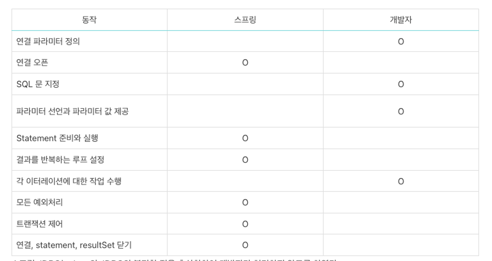
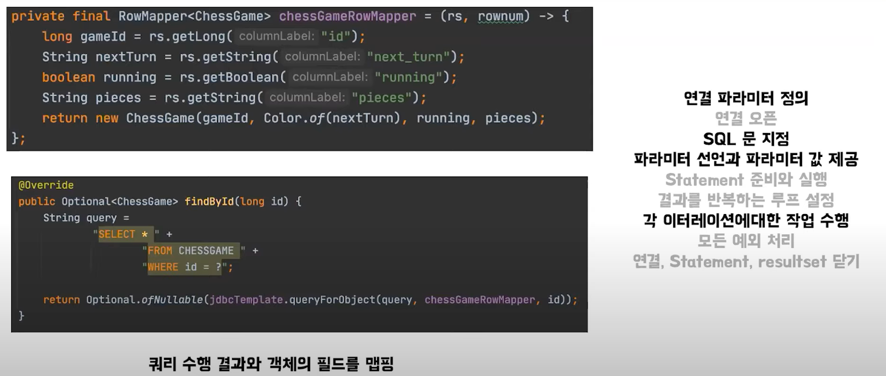
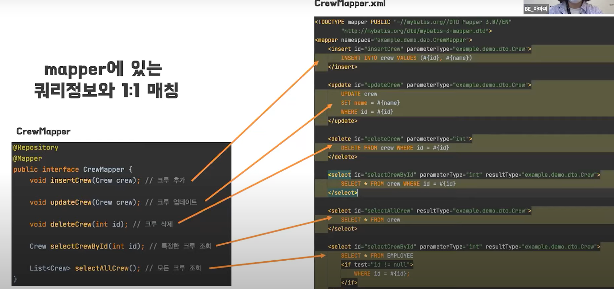

# Sql Mapper(MyBatis)

## 개념정리

### SQL Mapper란?

- SQL Mapper는 개발자가 직접 작성한 SQL문과 객체의 필드를 매핑해 데이터를 객체화 해주는 프레임워크이다.
- 이전에 JDBC는 각 클래스마다 쿼리문을 작성했지만 Mapper 방식을 사용하면 중복 코드를 줄일 수 있다.
- 하지만, 이 또한 개발자가 직접 다뤄야하기때문에 DBMS에 따라서 다른 문법을 신경써야한다. 즉, DBMS에 종속적이다.

### 종류

SQL Mapper에는 Spring JDBC와 MyBatis가 있다. 서로는 자바의 JDBC에 관한 문제점을 서로 다르게 해석해서 기술을 만들었다.

- Spring JDBC
  - 자바의 JDBC의 불편한 점을 추상화해서 개발자가 처리하지 않도록 했다.
    
- 쿼리 수행 결과와 객체의 필드를 맵핑 & Row Mapper 재활용 가능
  - RowMapper: RowMapper 인터페이스의 mapRow()메서드로 ResultSet에서 한 행의 데이터를 읽어와 자바 객체로 변환하는 mapper 기능을 구현, 따라서 사용자가 원하는 형태의 결과값을 반환할 수 있다.
- JDBC에서 반복적으로 해야하는 작업을 대신 해줌

- MyBatis
  - MyBatis 역시 JDBC를 단순화하였고 SQL을 xml 파일에 작성해놓고 코드와 SQL을 분리해 사용하는 방식이다.
  - 소스코드에 SQL을 작성하지 않기 때문에 코드의 복잡성을 줄일 수 있다.
    
  - 문제점
    - 중복을 완전히 제거할 수 없다.
    - 테이블의 필드가 투가되거나 삭제될 경우 이와 관련된 모든 DAO, SQL문, 객체의 필드 등을 수정해야한다.
    - SQL과 JDBC API를 분리했다고 하지만 논리적으로 강한 의존 관계를 가지고 있다.

## 예상질문

- MyBatis의 특징과 문제점에 대해서 말해주세요.

---

### 참고자료

https://mysterlee.tistory.com/49

https://velog.io/@injoon2019/CS-JDBC-SQLMAPPER-ORM
